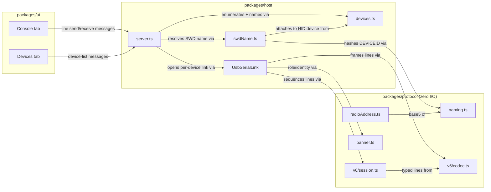

<!-- CLASI: Before changing code or making plans, review the SE process in CLAUDE.md -->

# Sprint 001: Connect, identify, console

## Goals

Stand up the `robot-console` monorepo skeleton and build the foundation
sprint named in `clasi/issues/robot-console-architecture-and-roadmap.md`'s
"Proposed fix": a pure-TS `protocol` package (naming, radio-address
derivation, banner parsing, v6 line codec, v6 session/reliability layer),
the privileged `host` package's identify-and-console slice (USB device
enumeration, SWD-based five-letter naming, a USB serial transport, and
the Express/`ws` server bridging both to the browser), and a minimal `ui`
that shows the device list and gives the student a working raw console.

## Problem

Today there is no `robot-console` code at all — only the approved
architecture issue and the `docs/design/` documents derived from it. A
student has no way to plug in a micro:bit, see which of their two devices
is the relay and which is the robot, or send it a line and see the reply.
Every later sprint (flashing, radio, telemetry, calibration, WiFi) builds
on the same three-package shape and the same identify-then-open-a-link
sequence, so that shape has to exist and be correct first — in particular
the SWD-based naming path, which is the one piece in this sprint that is
not derivable by inspection of the wire protocol and is easy to get wrong
by falling back to the USB serial number (see Cause, issue file, §"Cause").

## Solution

Scaffold an npm-workspaces TypeScript monorepo (`packages/protocol`,
`packages/host`, `packages/ui`) with a shared `vitest` setup and an
`npx`-able entry point, then build, in dependency order:

- `packages/protocol` (zero I/O, fully unit-testable): `naming.ts` +
  `radioAddress.ts` (with the full 3125-name sha256 conformance test —
  the single strongest correctness gate in this sprint), `banner.ts`
  (both live dialects), `v6/codec.ts` (line grammar, case-as-direction),
  `v6/session.ts` (ack/nack sequencing, retransmit-reuses-id).
- `packages/host`: `devices.ts` (DAPLink USB enumeration keyed on
  `serial_number`), `swdName.ts` (SWD attach + `FICR.DEVICEID[1]` read,
  hashed through `naming.ts` — this is what lets a blank micro:bit still
  show its name), `UsbSerialLink` (open → `HELLO` → read banner from the
  reply, paced writes), `server.ts` (Express + one `ws` WebSocket
  carrying device-list updates and line traffic).
- `packages/ui`: a **Devices** tab showing name/role/port/UID per
  device, and a **Console** tab with a line stream and a send box.

Reference implementations to check behavior against, not to port
blindly: `radio-robot-lib/src/host/robot_v6/{codec,transport,
reliability}.py` and `pxt-nezha-diffdrive/tools/link.py`. Golden wire
vectors: `vendor/radio-robot-lib/tests/protocol/golden_vectors.txt`.

## Success Criteria

- A relay and a robot, connected over USB, both show their correct
  five-letter name and correct role (`relay` / `robot`) in the Devices
  tab.
- Typing `HELLO`, `?`, and `STATUS` into the Console tab's send box for a
  connected device returns a sane, readable reply for each.
- A blank, never-flashed micro:bit still shows its correct five-letter
  name in the Devices tab (proves `swdName.ts` reads the chip ID over
  SWD rather than deriving the name from firmware output or the USB
  serial number).
- `radioAddress.ts`'s conformance test asserts the **entire 3125-name
  space** against the published sha256 in
  `vendor/pxt-nezha-diffdrive/docs/radio-address-vectors.json` — a sampled
  table is not sufficient (it would pass a reversed/little-endian
  encoder; see Design Rationale).
- `npm test` runs the full protocol-package unit-test suite from a clean
  checkout with no hardware attached.

## Scope

### In Scope

- npm workspaces monorepo skeleton: root + per-package `package.json`,
  shared `tsconfig`, root `vitest` config, an `npx`-able `bin` entry
  point.
- `packages/protocol`: `naming.ts`, `radioAddress.ts` (+ full-space
  conformance test), `banner.ts` (both dialects), `v6/codec.ts`,
  `v6/session.ts`.
- `packages/host`: `devices.ts`, `swdName.ts`, `UsbSerialLink`,
  `server.ts`.
- `packages/ui`: Devices tab (list with name/role/port/UID), Console tab
  (line stream + send box).
- Hardware smoke test with one real relay and one real robot, and one
  blank micro:bit, per Success Criteria.

### Out of Scope

Explicitly deferred to sprints 2-6 per the issue's roadmap — do not
build any of these now, and do not add placeholder UI for them:

- Firmware flashing (`flash.ts`, `releases.ts`, universal-hex
  extraction, MSD fallback) — sprint 2.
- `RelayRadioLink`, `MbrelayLink`, `MbserialLink`, `WifiUdpLink`, and
  `mdns.ts` discovery — sprints 3 and 6.
- Robot drive/stop/estop control surfaces (`WHEELS_X`/`WHEELS_V`/etc.)
  beyond what the generic Console send box already permits by typing a
  raw line — sprint 3. The Console tab in this sprint is a raw line
  console, not a drive-control UI.
- `v6/telemetry.ts` and the Telemetry/Trace tabs — sprint 4.
- `relay/commands.ts` (relay command-plane verbs) — not needed until a
  relay's data plane is driven in sprint 3; this sprint only needs the
  relay to answer `HELLO`/`?`/`STATUS` on its command plane, which is
  already plain v6-adjacent text the Console tab can send as raw lines.
- Calibration wizards — sprint 5.

## Test Strategy

- `npm test` runs the `packages/protocol` unit suite (`vitest`) with no
  hardware attached — every file in `protocol` is zero-I/O by design.
- **Strongest single gate**: `radioAddress.ts`'s conformance test
  asserts the full 3125-name space against the published sha256 in
  `vendor/pxt-nezha-diffdrive/docs/radio-address-vectors.json`. This is an
  existing three-repo contract, so it is free correctness, and it is the
  only check that catches the documented endianness trap: `zuzuv` is
  n=1; a reversed encoder says `vuzuz` and would still pass a sampled
  table.
- `banner.ts` is tested against both live dialects (colon form with hex
  serial for legacy `RADIORELAY` / decimal serial for `RADIOBRIDGE`, and
  the lowercase space form robots emit today), not just one.
- `v6/codec.ts` and `v6/session.ts` are checked against relevant lines
  from `vendor/radio-robot-lib/tests/protocol/golden_vectors.txt` where they
  apply to HELLO/banner/ack/nack framing (full drive-command coverage of
  those vectors is sprint 3's concern, once `WHEELS_X`/etc. exist on the
  console side).
- Hardware smoke test, once host/ui exist: a real relay, a real robot,
  and one blank micro:bit, verifying the Success Criteria above.

## Architecture

**Sizing: Substantial.** This sprint introduces three new modules with
new cross-module dependencies where none existed before (`ui` depends on
`host`, `host` depends on `protocol`), a new external integration (SWD
chip access via `dapjs`/`node-hid`, USB serial via `serialport`), and is
the foundation every later sprint's architecture builds on — it is the
textbook case for the full 7-step methodology, diagrams included.

### Step 1-3: Problem, Responsibilities, Modules

Eleven distinct responsibilities, grouped into the three packages the
issue and `specification.md` §2-5 already name:

**`packages/protocol`** (zero I/O; purpose: turn wire bytes and device
identity into typed values, and back, with no side effects)
- `naming.ts` — purpose: derive a device's five-letter friendly name
  from its numeric chip ID. Boundary: pure base-5 encode/decode over the
  fixed codebook; knows nothing about USB, SWD, or the wire protocol.
  Serves: SUC-001.
- `radioAddress.ts` — purpose: derive a robot's default `(channel,
  group)` from its five-letter name. Boundary: consumes `naming.ts`'s
  base5 encoding only; knows nothing about actually reaching a radio.
  Serves: none directly in this sprint (radio links are sprint 3), but
  its correctness gate (Success Criteria) is a sprint-1 deliverable
  because it is pure and needs no hardware to verify now.
- `banner.ts` — purpose: parse a device's boot-banner line into role and
  identity fields. Boundary: text-in, struct-out; both live dialects.
  Serves: SUC-001 (role detection).
- `v6/codec.ts` — purpose: frame and parse a single v6 protocol line.
  Boundary: byte/string in, typed line out (or vice versa); no
  sequencing, no I/O. Serves: SUC-002.
- `v6/session.ts` — purpose: track sequence state across a stream of v6
  lines. Boundary: consumes `v6/codec.ts`'s typed lines; produces
  ack/nack-aware sequence decisions; no I/O. Serves: SUC-002.

**`packages/host`** (purpose: the privileged half — everything that
needs real USB/SWD access and bridges it to the browser)
- `devices.ts` — purpose: enumerate and join the DAPLink USB devices
  present on the machine. Boundary: `serialport`/`node-hid` in,
  joined-by-`serial_number` device records out; does not itself name or
  open a data link. Serves: SUC-001.
- `swdName.ts` — purpose: read a device's five-letter name over SWD
  without touching its running firmware. Boundary: takes a joined
  device record from `devices.ts`, attaches over SWD (no halt, no
  reset), reads `FICR.DEVICEID[1]`, and hands the raw ID to
  `naming.ts` — does not itself decide role or open a serial link.
  Serves: SUC-001, and specifically the blank-micro:bit Success
  Criterion.
- `UsbSerialLink` — purpose: turn a DAPLink device's USB serial port into
  a paced, banner-aware stream of v6 lines. Boundary: owns the
  open→`HELLO`→read-banner sequence and write pacing; delegates framing
  to `v6/codec.ts`, sequencing to `v6/session.ts`, and role detection to
  `banner.ts`; does not itself decide what to send. Serves: SUC-002.
- `server.ts` — purpose: expose the host's device list and line traffic
  to the browser over one WebSocket. Boundary: composes `devices.ts` +
  `swdName.ts` (identity) and `UsbSerialLink` (per-device I/O) into
  WebSocket messages; contains no naming, framing, or sequencing logic
  of its own. Serves: SUC-001, SUC-002.

**`packages/ui`** (purpose: present device identity and let the student
talk to a device)
- Devices tab — purpose: render the live device list. Boundary:
  WebSocket messages in, list UI out; no protocol knowledge. Serves:
  SUC-001.
- Console tab — purpose: render a device's line stream and let the
  student send a line. Boundary: WebSocket messages in and out; no
  protocol knowledge — a typed line is just a string to this tab.
  Serves: SUC-002.

Monorepo/tooling scaffolding (workspaces, `tsconfig`, `vitest` config,
`bin` entry point) is infrastructure shared by all three packages, not a
module in its own right, so it is not a node in the diagram below.

### Step 4: Diagrams

Component diagram — required (3+ modules touched, new cross-module
dependencies introduced). An ERD is omitted: this sprint has no
persisted data model (no database, no on-disk device registry — device
state is held in memory in `server.ts` and pushed to the UI). A separate
dependency-direction graph is also omitted as its own diagram: the
component diagram below is already small enough (11 nodes) to show
dependency direction directly on its edges, and that direction is
uniform and acyclic (`ui` → `host` → `protocol`, i.e. presentation →
infrastructure → pure domain), so a second diagram would repeat the
first one's information rather than clarify anything new.

### Step 5: What Changed / Why / Impact / Migration

**What Changed**: Everything — this is the first sprint of a new
repository. Three new packages (`protocol`, `host`, `ui`) as described
in Steps 1-3, plus the monorepo scaffolding that makes them buildable
and testable together.

**Why**: Every later sprint (flashing, radio, telemetry, calibration,
WiFi) adds to `host`'s link layer, `protocol`'s wire types, and `ui`'s
tabs, without changing this sprint's package boundaries or dependency
direction. Getting the identify path right now — specifically, naming
over SWD rather than from the USB serial number or firmware banner
alone — is load-bearing for every later sprint's ability to say "this is
robot `vevov`" with confidence, including on a board no firmware has
touched yet.

**Impact on Existing Components**: None — there are no existing
components; this is the initial architecture.

**Migration Concerns**: None — greenfield repository, no data to
migrate, no prior release to remain compatible with.

### Step 6: Design Rationale

**Decision: name over SWD, not from the USB serial number.**
Context: the five-letter name must be derivable even from a blank,
never-flashed micro:bit, and the USB serial number the host sees belongs
to a different chip (the KL27 interface MCU) than the one whose ID
produces the name (the target nRF52 chip's `FICR.DEVICEID[1]`).
Alternatives considered: parse the name from the firmware's boot banner
(rejected — fails on blank boards, which is a stated Success Criterion,
and `microbit-console`'s existing serial-substring fallback is called
out in the issue as the wrong approach to not repeat). Chosen: attach
over SWD in read-only/no-halt/no-reset mode and read the chip ID
directly. Consequences: `host` takes a dependency on `dapjs`/`node-hid`
even before any flashing happens (sprint 2), and `swdName.ts` must
tolerate SWD attach failure gracefully (device shown as detected-but-
unnamed rather than silently omitted) since attach can fail for
permissions or unsupported-chip reasons independent of the board's
firmware state.

**Decision: `protocol` is a separate, zero-I/O package.**
Context: the wire-format logic (naming, radio address, banner, codec,
session) needs to be fully unit-tested, including the full 3125-name
conformance test, without any hardware attached — a hard requirement
for CI and for fast iteration. Alternatives considered: fold this logic
directly into `host` alongside the I/O that uses it (rejected — would
force every protocol-logic test to at least stub serial/SWD access, and
blurs the boundary the issue explicitly draws between "pure TS, zero
I/O" and "the privileged half"). Chosen: a standalone package with no
dependency on `host` or `ui`, imported by `host`. Consequences: `host`
must adapt raw byte/line streams at its boundary into the string lines
`protocol`'s codec expects; `protocol` itself never touches a socket,
serial port, or SWD probe.

**Decision: one WebSocket for both device-list and line traffic.**
Context: `specification.md` §4.7 specifies `server.ts` as "Express +
`ws`. One WebSocket carries device-list updates, line traffic, and
telemetry frames." Alternatives considered: separate channels (a REST
endpoint for the device list, a distinct WebSocket or SSE stream per
device for lines) — rejected as unnecessary complexity for a
single-page app with no cross-origin concerns, and inconsistent with
the already-specified shape. Chosen: one WebSocket, with a `type` field
on each message distinguishing device-list updates from line traffic
(telemetry frames are added to the same channel in sprint 4, not this
one). Consequences: both UI tabs (Devices, Console) share one client-
side WebSocket connection and dispatch on message type; `server.ts`
must serialize both message kinds onto the same connection without
device-list updates starving line-traffic delivery or vice versa.

**Decision: `banner.ts` parses both dialects rather than picking one.**
Context: both the colon form (`DEVICE:RADIOBRIDGE:relay:getez:...`) and
the space form (`device NEZHA2 robot vevov ...`) are live on the fleet
today — relays emit one, robots emit the other. Alternatives considered:
support only the colon form, matching `microbit-console` (rejected —
the issue states explicitly this would fail to identify a robot, and a
robot showing up unidentified violates this sprint's own Success
Criteria). Chosen: parse both dialects in one module, with role and
serial-number-radix (hex for legacy `RADIORELAY`, decimal for
`RADIOBRIDGE`) handled per-dialect. Consequences: `banner.ts` carries
two grammars and two test fixtures instead of one; a third dialect, if
the fleet ever converges (issue mentions a filed-but-pending banner
convergence request), can be added without changing `banner.ts`'s
external interface.

### Step 7: Open Questions

1. **Sourcing the conformance/golden-vector fixtures — RESOLVED by the
   stakeholder.** The published `radio-address-vectors.json` and
   `golden_vectors.txt` live in sibling repos (`pxt-nezha-diffdrive`,
   `radio-robot-lib`), which planning initially proposed copying into
   `packages/protocol` as fixtures. **The stakeholder rejected copying:
   both repos are added as git submodules instead**, using HTTPS URLs:

   - `vendor/pxt-nezha-diffdrive` — `https://github.com/League-Robotics/pxt-nezha-diffdrive.git`
   - `vendor/radio-robot-lib` — `https://github.com/League-Robotics/radio-robot-lib.git`

   Ticket 001 adds them; tickets 002, 004 and 005 read their fixtures
   at repo-relative paths under `vendor/`. A copy would silently drift
   from upstream, whereas a submodule pins an exact commit and is
   updated deliberately. `vendor/` is reference data only — no package
   imports source code from it and the TypeScript build excludes it.
   CI must clone with `--recurse-submodules` (or run
   `git submodule update --init` before `npm test`), and the fixture
   readers must fail with an actionable "submodule not initialized"
   message rather than a bare file-not-found.
2. **How much of the v6 session layer sprint 1 actually exercises.**
   `v6/session.ts`'s ack/nack/retransmit logic is built and unit-tested
   against synthetic sequences in this sprint, but the hardware smoke
   test only requires `HELLO`/`?`/`STATUS` to return sane replies —
   none of which are among the 11 id-bearing verbs. Whether the smoke
   test should also exercise at least one id-bearing verb (e.g. a
   harmless `GET`) to prove the session layer end-to-end against real
   firmware, or whether that is properly sprint 3's job (once drive
   verbs exist in the UI), is left to the ticket 005/009 implementer to
   decide pragmatically — either answer satisfies this sprint's stated
   Success Criteria.
3. **Whether the Devices tab reserves visual space for future actions.**
   Flashing (sprint 2) and calibration (sprint 5) will eventually add
   buttons to the Devices tab. This sprint's ticket 010 should build
   only what SUC-001 needs (name/role/port/UID) and not add disabled
   placeholder buttons for future sprints — avoids speculative
   generality and matches "Out of Scope" above — but this is noted as
   a deliberate choice, not an oversight, in case the stakeholder wants
   room reserved during UI review.

## Use Cases

Full use cases — substantial tier. SUC-001 corresponds directly to
`docs/design/usecases.md`'s UC-001. SUC-002 is new: it covers the
generic raw-console capability this sprint actually builds (send a line,
see the reply), which the existing UC-003 does not describe on its own —
UC-003 is specifically about driving a robot with `WHEELS_X`/`WHEELS_V`
commands, none of which exist yet. SUC-002 is the foundation UC-003 will
sit on top of in sprint 3.

### SUC-001: Connect and identify a device over USB
Parent: UC-001 (`docs/design/usecases.md`)

- **Actor**: Student
- **Preconditions**: `npx robot-console` is running and the browser UI
  is open. A micro:bit (blank, relay-flashed, or robot-flashed) is
  plugged in via USB.
- **Main Flow**: The host detects the new DAPLink device (`devices.ts`)
  and reads its `serial_number`; attaches over SWD and reads
  `FICR.DEVICEID[1]` (`swdName.ts`) to derive the five-letter name via
  `naming.ts`; opens the serial port, sends `HELLO`, and reads the
  banner reply to determine role via `banner.ts`; the Devices tab
  updates over the WebSocket to show name, role, port, and UID.
- **Postconditions**: The device appears in the Devices tab with a
  correct name and role; the student can identify it by name alone,
  without reading a USB serial number.
- **Acceptance Criteria**:
  - [ ] A connected relay shows its correct five-letter name and role
        `relay`.
  - [ ] A connected robot shows its correct five-letter name and role
        `robot`.
  - [ ] A blank, never-flashed micro:bit shows its correct five-letter
        name (SWD read succeeds with no cooperating firmware).
  - [ ] If SWD attach fails, the device is shown as detected-but-
        unnamed with a surfaced error, not silently omitted.
  - [ ] If no banner reply arrives after `HELLO`, the device is shown
        as unresponsive rather than assigned a role.

### SUC-002: Send raw protocol commands via the Console tab
Parent: None directly (a scoped precursor to UC-003, which is
drive-command-specific and out of this sprint's scope)

- **Actor**: Student
- **Preconditions**: A device is connected and identified per SUC-001.
- **Main Flow**: Student opens the Console tab for the device, types a
  line (e.g. `HELLO`, `?`, `STATUS`) into the send box, and submits it.
  The UI sends it to the host over the WebSocket; the host paces the
  write onto `UsbSerialLink` (~10 ms between frames), the reply line(s)
  are parsed by `v6/codec.ts`/`v6/session.ts`, and the raw line is
  relayed back to the UI and appended to the line stream.
- **Postconditions**: Each of `HELLO`, `?`, and `STATUS` produces a
  visible, sane reply in the Console tab for both a connected relay and
  a connected robot.
- **Acceptance Criteria**:
  - [ ] `HELLO` returns a banner-shaped reply and is reflected in the
        line stream.
  - [ ] `?` returns a reply and is reflected in the line stream.
  - [ ] `STATUS` returns a reply and is reflected in the line stream.
  - [ ] A lowercase inbound line that is not a recognized reply (e.g.
        another device overheard) is dropped silently, not shown as an
        error.
  - [ ] Sending faster than the pacing budget throttles rather than
        floods the link.

## GitHub Issues

(GitHub issues linked to this sprint's tickets. Format: `owner/repo#N`.)

None — this sprint is scoped entirely from
`clasi/issues/robot-console-architecture-and-roadmap.md`.

## Definition of Ready

Before tickets can be created, all of the following must be true:

- [ ] Sprint planning document is complete (sprint.md, including its
      Architecture and Use Cases sections)
- [ ] Architecture review passed (or skipped, for changes with no
      architectural impact)
- [ ] Stakeholder has approved the sprint plan

## Tickets

| # | Title | Depends On |
|---|-------|------------|
| 001 | Monorepo skeleton, TS/vitest config, npx entry point | — |
| 002 | protocol: naming.ts + radioAddress.ts with full-space conformance test | 001 |
| 003 | protocol: banner.ts (colon + space dialects) | 001 |
| 004 | protocol: v6/codec.ts (line grammar, case-as-direction) | 001 |
| 005 | protocol: v6/session.ts (ack/nack sequencing, retransmit) | 004 |
| 006 | host: devices.ts (DAPLink USB enumeration) | 001 |
| 007 | host: swdName.ts (SWD-based five-letter naming) | 002, 006 |
| 008 | host: UsbSerialLink (open/HELLO/banner, paced writes) | 003, 004, 005, 006 |
| 009 | host: server.ts + npx entry wiring | 006, 007, 008 |
| 010 | ui: Devices tab | 009 |
| 011 | ui: Console tab | 009, 010 |

Tickets execute serially in the order listed.

---

## Hardware Verification Gap (recorded at sprint close)

Three of five Success Criteria are verified. Two are **not**, for want of
hardware rather than for any defect:

| Criterion | Status |
| --- | --- |
| Relay and robot show correct five-letter **name** | ✅ verified (`zeguz`) |
| ...and correct **role** | ❌ **unverified** — no board emitted a banner |
| `HELLO`/`?`/`STATUS` return sane replies | ❌ **unverified** — board silent |
| A blank board still shows its name | ✅ verified (see below) |
| Full 3125-name conformance test | ✅ verified against both published digests |
| `npm test` from a clean checkout, no hardware | ✅ 350 tests |

The only board available throughout execution returns **zero bytes** to
`HELLO` and `?` — confirmed through `UsbSerialLink`, through a raw
`serialport` script bypassing all project code, and through a third
independent probe. `role` is parsed from a boot banner, so with no
announcing board it cannot be exercised end to end. `banner.ts` is
unit-tested against canned strings taken from the specs, and
`UsbSerialLink` against an injected fake port, but neither has met real
firmware.

The blank-board criterion is satisfied *in substance* by that same
silent board: it was correctly named `zeguz` from
`FICR.DEVICEID[1] = 0xfbfd96c9` read over SWD, cross-checked against the
relay protocol spec's own worked-example table (n=425, channel 25,
group 19). The criterion exists to prove the name comes from the target
chip rather than from firmware output or the USB serial number, and a
board that says nothing and is still named correctly is exactly that.

Tracked as `clasi/issues/sprint-001-hardware-criteria-unverified-no-announcing-board.md`.
Retest with a `RADIOBRIDGE` relay (colon dialect) and a
pxt-nezha-diffdrive robot (space dialect) before relying on the role
path in sprint 3.

## Follow-up issues raised by this sprint

- `no-build-pipeline-tsx-is-a-runtime-dependency.md` — packages resolve
  `main` to `.ts` source, so `tsx` shipped as a production dependency.
- `device-list-shows-tty-path-not-cu-path.md` — the UI displays a path
  that hangs if a user opens it directly.
- `port-lock-contention-between-identify-and-user-open.md` — a
  user-initiated open can race the registry's own identify probe.
