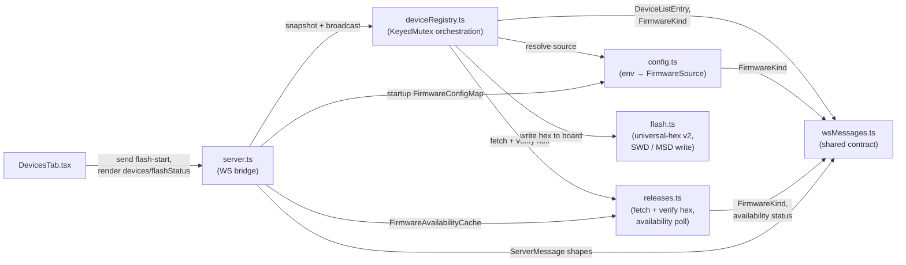

<!-- CLASI: Before changing code or making plans, review the SE process in CLAUDE.md -->

# Sprint 002: Flashing

## Goals

Give a student a way to recover a micro:bit that fails to identify
(`linkError` set, `role: null` — the board is running firmware the
console doesn't recognize, or none at all) by flashing known-good
firmware onto it from the Devices tab, without a command line. This is
`specification.md` §7's "Sprint 2 — Flashing": it fills in the two
reserved-but-unbuilt host modules (§4.5 `flash.ts`, §4.6 `releases.ts`)
and wires them to a WebSocket flash command/progress path and two
buttons in the UI. Firmware flashing writes to real hardware over SWD,
so destructive-operation safety (confirmation, clear progress, a
failure path that never leaves a board bricked or the UI lying about
what happened) is a first-class goal, not an afterthought.

A second, load-bearing goal: source both firmware repo URLs and their
release tags from configuration (`dotconfig`, `prod` layer), not from
constants in code, so an instructor can pin a class to a known-good
build, and so the robot-firmware button can start working the moment
`pxt-nezha-diffdrive` cuts its first release with no code change.

## Problem

`DevicesTab.tsx` today shows a board that never replied to `HELLO` as
"Unresponsive" and stops — no recovery path. The relay firmware
(`microbit-radio-relay`) is downloadable today (`v0.20260831.1`,
`MICROBIT.hex` + `MICROBIT.hex.txt` manifest); the robot firmware
(`pxt-nezha-diffdrive`) publishes **zero** GitHub releases as of this
writing (verified against the API), so there is currently no asset to
flash for it. Both facts must show up honestly in the UI: a working
flash flow for relay firmware, and a visibly disabled robot-firmware
button that explains why, rather than a button that fails at click
time with a 404.

GitHub release assets send no CORS header (`specification.md` §2.1,
verified against the 302 target too), so the hex fetch must happen
host-side (`releases.ts`), never from the browser.

## Solution

- `releases.ts` (host): server-side fetch of a release's `MICROBIT.hex`
  and companion `MICROBIT.hex.txt` manifest, verified against the
  manifest's sha256 before anything is offered to `flash.ts`.
- Configuration via `dotconfig`, `prod` layer, one variable per
  firmware, shape `<repo-url>:<tag>` (tag defaults to `latest`) — the
  stakeholder specified this shape explicitly. `robot-console` has an
  untracked, empty `dotconfig init` scaffold at `config/` already
  (`config/dotconfig.yaml`, `config/{dev,prod,local}/...`); this sprint
  is what first populates and commits it, following the convention in
  `vendor/radio-robot-lib/config/`.
- `flash.ts` (host): DAPjs over `node-hid`, universal-hex v2 extraction
  (`BLOCK_ID_V2 = 0x9903`, ported from
  `microbit-console/client/src/lib/universal-hex.ts`), with MSD volume
  copy (`radio_relay/scripts/flash-local.js` as template) as the
  fallback path when SWD flashing isn't viable. Must not fight
  `swdName.ts`'s attach-only, no-halt/no-reset contract or
  `deviceRegistry.ts`'s per-device `KeyedMutex` serialization — flashing
  is the one operation in this sprint that *does* need to halt/reset/
  reprogram the target, so it has to take the device's mutex slot like
  every other per-device operation, not race SWD naming or serial-link
  open/close against it.
- WebSocket contract additions (`wsMessages.ts`): a client-to-server
  flash-start command and server-to-client flash-progress/flash-result
  messages, following the existing `type`-discriminated shape.
- UI: two buttons on the right of a device row in the Devices tab
  ("Flash relay firmware", "Flash robot firmware"), visible only once a
  connect attempt has failed to produce a banner (`linkError` set, no
  `role`) — never on an unprobed device, never on one that identified
  successfully. The robot-firmware button ships disabled with an
  explanation when its configured repo has no releases.

## Success Criteria

Hardware-independent (provable in this sprint by unit test, per
`sprint-001-hardware-criteria-unverified-no-announcing-board.md` — no
board running cooperating firmware is available yet):
- `releases.ts` fetches a hex + manifest for a given `<repo-url>:<tag>`
  and rejects a download that fails the manifest's sha256, against a
  fixture/mock GitHub response.
- Universal-hex v2 block extraction (`BLOCK_ID_V2 = 0x9903`) is unit
  tested against known-good sample data.
- The two buttons render only for a `DeviceListEntry` with `linkError`
  set and `role: null`; not for an unprobed device (no `linkError`, no
  `role`) and not for an identified one (`role` set).
- The robot-firmware button renders disabled with an explanatory
  message when its configured repo/tag resolves to zero releases
  (using the real, verified `pxt-nezha-diffdrive` state as the test
  fixture).
- Changing the configured tag in `config/prod/public.env` changes which
  release `releases.ts` resolves and fetches, provable by pointing the
  fetch at two different fixture tags — no code change required.
- The WebSocket flash-command/progress message shapes round-trip
  through `parseClientMessage`-style validation the way existing
  messages do.

Requires a physical board (deferred; do not claim these pass from unit
tests alone):
- An actual failed-identify micro:bit, flashed via the relay button,
  ends up running RADIORELAY and then identifies with
  `RADIOBRIDGE`/`RADIORELAY` role on the next connect attempt.
- End-to-end DAPjs flashing behavior against real SWD hardware (versus
  the MSD fallback path), and the MSD fallback itself against a real
  mounted volume.
- Flash-progress reporting timing/granularity against a real, slow
  hardware write.

## Scope

### In Scope

- `packages/host/src/releases.ts` — GitHub release hex + manifest
  fetch, sha256 verification.
- `packages/host/src/flash.ts` — DAPjs/node-hid flashing, universal-hex
  v2 extraction, MSD fallback.
- `config/` — populate and commit the dotconfig scaffold: two
  `prod`-layer variables (relay repo URL:tag, robot repo URL:tag),
  following `vendor/radio-robot-lib/config/`'s layout.
- `packages/host/src/wsMessages.ts` — flash command + flash
  progress/result message types, extending the existing
  `ClientMessage`/`ServerMessage` unions.
- `packages/host/src/deviceRegistry.ts` — wire flash requests through
  the existing per-device `KeyedMutex`, so a flash never races SWD
  naming or a serial-link open/close on the same board.
- `packages/ui/src/components/DevicesTab.tsx` — the two conditional
  flash buttons, disabled-state handling for the no-releases case, and
  visible flash progress.

### Out of Scope

- Calibration firmware flashing — the hex doesn't exist yet
  (`specification.md` §9, open question 1; explicit stakeholder TBD).
- `RelayRadioLink`, `MbrelayLink`, mDNS discovery, and robot control —
  Sprint 3.
- Any change to `pxt-nezha-diffdrive` or `microbit-radio-relay`
  themselves (e.g., cutting the first robot-firmware release) — that's
  upstream work this sprint's configurable tag is designed to pick up
  automatically once it happens.
- Physical-hardware verification of the full flash flow — tracked as a
  known gap alongside the existing hardware-verification issue, not
  silently assumed passing.

## Test Strategy

`vitest` unit tests for `releases.ts` (mocked HTTP fetch: success,
sha256 mismatch, zero-releases repo) and `flash.ts`'s universal-hex v2
extraction (sample data, not real hardware). `wsMessages.ts` additions
get the same parse/narrow unit-test treatment as existing message
types. UI tests for `DevicesTab.tsx`/`DeviceCard` button-visibility and
disabled-state logic against plain `DeviceListEntry` fixtures, matching
the existing test pattern in that file's own doc comment. No test in
this sprint depends on a physical micro:bit; the physical-hardware
checks in Success Criteria are explicitly deferred and must be called
out as such at sprint close, not silently skipped.

## Architecture

**Substantial** — two new host modules (`releases.ts`, `flash.ts`) plus
a new `config.ts`, a new cross-module dependency (`deviceRegistry.ts`
gains an orchestration dependency on all three), and a wire-protocol
extension (`wsMessages.ts` gains new message shapes and two new
`DeviceListEntry`/`DevicesMessage` fields). This clears the substantial
bar on module count and on introducing new cross-module dependencies,
so the full 7-step methodology applies, component diagram included.

### Step 1–2: Problem and Responsibilities

The problem (see Goals/Problem above): a board that fails to identify
has no recovery path, and the two firmware sources must be
configurable rather than hardcoded. Five distinct responsibilities fall
out of that, each changing for its own reason and none absorbing
another's job:

1. **Where firmware sources come from** — reading the two
   `<repo-url>:<tag>` values from environment/config, with an absent
   value handled gracefully.
2. **Fetching and verifying a specific release's hex** — resolving a
   tag to a GitHub release, downloading `MICROBIT.hex` +
   `MICROBIT.hex.txt`, and checking the sha256.
3. **Writing hex bytes to a target board** — universal-hex v2
   extraction, SWD flashing via DAPjs, MSD-copy fallback. Knows nothing
   about GitHub, config, or the device registry.
4. **Serializing a flash against every other per-device operation** —
   the existing `deviceRegistry.ts` responsibility, extended to
   orchestrate 1–3 as one more mutex-guarded per-device operation.
5. **Wire contract and UI** — new message shapes, new per-device/
   per-firmware status fields, and the two conditional buttons.

### Step 3: Modules

- **`config.ts`** (new, `packages/host/src/config.ts`) — purpose: turn
  the two dotconfig-assembled environment variables into typed
  `FirmwareSource` values. Boundary: reads `process.env` (and, at
  startup only, an optional `.env` file) and parses the
  `<repo-url>:<tag>` shape; knows nothing about HTTP, USB, or the
  WebSocket contract. Serves SUC-002, SUC-004.
- **`releases.ts`** (new, `packages/host/src/releases.ts`) — purpose:
  resolve a `FirmwareSource` to a verified hex buffer. Boundary: all
  GitHub HTTP calls live here (release lookup, asset download, sha256
  check) and here alone — per `specification.md` §2.1, this is a hard
  server-side boundary, not a preference. Also owns the periodic
  availability poll that drives the robot-firmware button's disabled
  state. Knows nothing about SWD, USB, or config parsing. Serves
  SUC-002, SUC-004.
- **`flash.ts`** (new, `packages/host/src/flash.ts`) — purpose: write a
  given hex buffer to a given board. Boundary: universal-hex v2
  extraction (pure, ported from `microbit-console/client/src/lib/
  universal-hex.ts`), DAPjs-based SWD programming, and MSD volume-copy
  fallback (pattern from `radio_relay/scripts/flash-local.js`). Takes
  hex bytes and a `DaplinkDevice` in; knows nothing about GitHub or
  config. Serves SUC-001, SUC-003.
- **`deviceRegistry.ts`** (existing, extended) — purpose stays "orchestrate
  which per-device operation runs when, so two never race on the same
  board." Gains `requestFlash(deviceId, firmware)`, which is one more
  operation run through the existing per-device `KeyedMutex` alongside
  open/close/name-resolution — not a new synchronization mechanism (see
  Design Rationale). Composes `config.ts` → `releases.ts` → `flash.ts`
  in that order, exactly as it already composes `devices.ts` →
  `swdName.ts` → `UsbSerialLink`. Serves SUC-001, SUC-003.
- **`wsMessages.ts`** (existing, extended) — purpose stays "the one
  message contract." Gains `FirmwareKind` (`"relay" | "robot"`), a
  client `FlashStartMessage`, server `FlashProgressMessage` /
  `FlashResultMessage`, a `flashStatus` field on `DeviceListEntry`, and
  a `firmwareStatus` field on `DevicesMessage`. Still holds no naming,
  framing, or business logic of its own. Serves all four SUCs.
- **`server.ts`** (existing, extended) — composes the new registry
  method and the new availability poll into `ServerMessage` traffic,
  same role as today (no new logic of its own). Serves all four SUCs.
- **`DevicesTab.tsx`** (existing, extended) — the two conditional
  buttons, disabled-state rendering, and progress display. Serves
  SUC-001, SUC-003, SUC-004.

### Step 4: Diagram

This diagram also serves as the dependency graph — every edge above
*is* an import/composition edge, and the system is small enough that a
second, separate dependency-only diagram would repeat it with no new
information. Direction is consistent with the existing codebase:
`server.ts` → `deviceRegistry.ts` → leaf I/O modules → `wsMessages.ts`
at the bottom with no outward dependencies of its own (unchanged by
this sprint). No cycles: `flash.ts` and `releases.ts` do not depend on
each other or on `config.ts` — `deviceRegistry.ts` is the only module
that knows about all three, exactly mirroring how it is already the
only module that knows about `devices.ts`, `swdName.ts`, and
`UsbSerialLink` together. `server.ts` also depends directly on
`config.ts` (to receive the startup `FirmwareConfigMap`, the same way
it already receives an injectable `DeviceRegistry`) and on
`releases.ts` (to own the `FirmwareAvailabilityCache`) — both edges
were missing from an earlier pass of this diagram and are added here
per this sprint's own architecture self-review.

**Fan-out note**: `deviceRegistry.ts` now has six internal dependencies
(`devices.ts`, `swdName.ts`, `UsbSerialLink`, `config.ts`, `releases.ts`,
`flash.ts`) plus `wsMessages.ts` for types, above the informal 4-5
fan-out guideline. See Design Rationale below for why this is accepted
rather than restructured.

No ERD: this sprint has no persisted data model (no database, no file
format beyond the dotconfig `.env`/`public.env` layers, which are
config, not application data) — the wire-protocol shape changes are
fully captured by the component diagram and the field-level detail
below.

### Step 5: What Changed / Why / Impact / Migration

**What Changed**

- `config.ts` (new): `getFirmwareConfig(env?, dotenvPath?):
  FirmwareConfigMap`, where `FirmwareConfigMap = Record<FirmwareKind,
  FirmwareSource | undefined>` and `FirmwareSource = { repoUrl: string;
  tag: string }`. Two env vars, following the existing
  `ROBOT_CONSOLE_PORT` naming convention already in `cli.ts`:
  `ROBOT_CONSOLE_RELAY_FIRMWARE` and `ROBOT_CONSOLE_ROBOT_FIRMWARE`,
  each `<repo-url>:<tag>` with `tag` defaulting to `latest`. Parsing
  splits on the *last* `:` only when what follows contains no `/` (so
  `https://github.com/…` itself is never misparsed as a tag). An unset
  variable yields `undefined` for that entry — never a thrown error;
  `getFirmwareConfig()` is called once at host startup (`cli.ts`) and
  the result threaded down to `deviceRegistry.ts`/`server.ts`, so a
  developer with no dotconfig install at all still gets a fully running
  host with both flash buttons rendering in their "not configured"
  disabled state.
- A minimal, dependency-free `.env` reader (a few lines: split on `\n`,
  skip blank/`#` lines, split each remaining line on the first `=`) is
  part of `config.ts` itself, not a new npm dependency. It only ever
  sets a `process.env` key that is not already set (an explicit
  environment variable always wins over the assembled file, matching
  the layering dotconfig itself already documents). A missing `.env`
  file is not an error — the reader is a no-op in that case, and
  `getFirmwareConfig()` falls through to whatever `process.env` already
  has (nothing, in the common case), which is itself handled
  gracefully as above.
- `releases.ts` (new): `resolveRelease(source): Promise<ResolvedRelease
  | ReleaseError>` (`ReleaseError.reason`: `"no-releases" |
  "tag-not-found" | "no-asset" | "network"`), using GitHub's
  `/releases/latest` when `tag === "latest"` and `/releases/tags/<tag>`
  otherwise — a 404 on either is exactly the zero-release signal the
  robot-firmware button needs. `fetchAndVerifyHex(resolved):
  Promise<{ hex: Buffer } | { error: string }>` downloads
  `MICROBIT.hex` and `MICROBIT.hex.txt`, and checks the manifest's
  sha256 against the downloaded bytes before returning success — a
  mismatch is a verification error, not a silent pass-through.
  `checkAvailability(source): Promise<boolean>` is `resolveRelease`
  narrowed to a boolean, used by the availability poll below. All three
  functions take an injectable `fetch` (default: global `fetch`) so
  tests run against a fixture/mock, never real GitHub.
- `releases.ts` also exports `FirmwareAvailabilityCache`, a small poller
  (same shape as `devices.ts`'s `DeviceWatcher`: injectable interval,
  `current()`, `onChange()`, `pollOnce()` for deterministic tests)
  that re-runs `checkAvailability` per configured firmware on a
  multi-minute interval and notifies `server.ts` on change — this is
  what lets the robot-firmware button self-heal the moment
  `pxt-nezha-diffdrive` cuts its first release, with no code change and
  no host restart (see Design Rationale).
- `flash.ts` (new): `isUniversalHex(hexText)` / `extractV2Hex(hexText)`
  ported near-verbatim from `microbit-console/client/src/lib/
  universal-hex.ts` (string-based Intel-hex line filtering on
  `BLOCK_ID_V2 = 0x9903`), fully unit-testable against sample text, no
  I/O. `flashOverSwd(device, hex, onProgress): Promise<FlashOutcome>`
  drives DAPjs's target-programming API over the same `node-hid`
  CMSIS-DAP handle `swdName.ts` uses (`device.hid.path`) — unlike
  `swdName.ts`, this is expected to halt and reset the target, which is
  exactly what flashing requires. `flashViaMsd(volumePath, hex):
  Promise<void>` is the fallback path, following
  `radio_relay/scripts/flash-local.js`'s write-to-mounted-volume
  pattern. An orchestrating `flash(device, hex, onProgress):
  Promise<FlashOutcome>` tries SWD first and falls back to MSD only if
  the SWD attempt itself fails to attach/program (not on a successful
  flash that merely reports a slow write) — reported in
  `FlashOutcome.method: "swd" | "msd"` so the UI/logs can show which
  path was actually used.
- `deviceRegistry.ts`: `requestFlash(deviceId, firmware): Promise<void>`
  runs through `this.mutex.run(deviceId, ...)` exactly like
  `requestOpen`/`requestClose`/`sendLine` — no new locking primitive.
  The flash task: (a) tears down any open `UsbSerialLink` first (via
  the existing `teardownLink`, so DAPjs is never fighting an open
  serial port over the same physical board — see Design Rationale for
  why this is sufficient against the SWD-contention concern); (b) looks
  up the configured `FirmwareSource` via `config.ts`; (c) calls
  `releases.ts` to fetch+verify the hex, emitting a `flash-progress`
  event per phase (`"fetching"`, `"verifying"`); (d) calls `flash.ts`
  to write it, emitting `"erasing"`/`"writing"`/`"resetting"` progress;
  (e) on success, re-attempts `openLink` once (the same method the
  attach flow already uses) so the newly-flashed firmware's banner is
  picked up without the student needing to click Connect separately —
  this directly serves SUC-001's postcondition. `DeviceState` gains a
  `flashStatus?: { firmware: FirmwareKind; phase: FlashPhase }` field,
  cleared on completion (success or error) and reflected into
  `DeviceListEntry.flashStatus` by `toEntry`.
- `wsMessages.ts`: adds `FirmwareKind`, `FlashPhase`, a client
  `FlashStartMessage { type: "flash-start"; deviceId: string; firmware:
  FirmwareKind }` (added to `ClientMessage`, validated in
  `parseClientMessage` the same way `open`/`close` already are), server
  `FlashProgressMessage { type: "flash-progress"; deviceId; firmware;
  phase: FlashPhase }` and `FlashResultMessage { type: "flash-result";
  deviceId; firmware; status: "ok" | "error"; message?: string }`
  (added to `ServerMessage`). `DeviceListEntry` gains `flashStatus?: {
  firmware: FirmwareKind; phase: FlashPhase }`. `DevicesMessage` gains
  `firmwareStatus: Record<FirmwareKind, FirmwareAvailability>` where
  `FirmwareAvailability = { configured: false } | { configured: true;
  repoUrl: string; tag: string; available: boolean; reason?: string }`
  — sent as part of every full snapshot, consistent with the existing
  "always a full snapshot, never a delta" philosophy, so a client that
  connects or reconnects mid-flash or after an availability change
  self-heals on the very next `devices` message rather than needing a
  separate discovery step.
- `server.ts`: routes `flash-start` to `registry.requestFlash`;
  subscribes to the registry's new flash-progress/flash-result events
  and broadcasts them; owns one `FirmwareAvailabilityCache` (constructed
  from `config.ts`'s startup config) and merges its `current()` into
  `firmwareStatus` on every `devices` broadcast, re-broadcasting the
  device snapshot when the cache itself changes (composition only, per
  the module's existing no-new-logic contract).
- `DevicesTab.tsx`: two buttons, visible exactly when `role === null &&
  linkError !== undefined` (see SUC-001/SUC-004 acceptance criteria for
  the precise truth table); the robot button additionally disabled with
  its `reason` text when `firmwareStatus.robot.configured === false ||
  firmwareStatus.robot.available === false`; both buttons hidden/replaced
  with progress text while `device.flashStatus` is set, so a flash in
  progress cannot be started twice.
- `config/`: populate the existing untracked `dotconfig init` scaffold
  and commit it — `config/prod/public.env` gets the two firmware
  variables (pointing at the real relay repo, tag `latest`, and the
  real robot repo, tag `latest`); `config/dev/public.env` and
  `config/local/eric/public.env` are left as documented, empty
  overlays (matching `vendor/radio-robot-lib/config/dev/public.env`'s
  own convention of being empty when there is nothing dev-specific to
  override); `config/sops.yaml` and `config/dotconfig.yaml` are
  committed as `dotconfig init` generated them, unmodified. The
  already-uncommitted `.gitignore` addition (`.env.*` / `!.env.example`)
  lands in the same ticket, since it is this same scaffold's own
  addition and has no independent reason to be a separate change.

**Why**

Recovering a failed-identify board with no command line, per the
Goals. The module boundaries (config parsing / fetch+verify / write
bytes / orchestrate) mirror the existing `devices.ts` / `swdName.ts` /
`UsbSerialLink` / `deviceRegistry.ts` split exactly — each new
responsibility gets its own module for the same reason the sprint-1
split already established: each changes for a different reason
(config format, GitHub's API, DAPjs's flashing API, and per-device
sequencing are all independent axes of change) and each is
independently unit-testable without hardware.

**Impact on Existing Components**

- `deviceRegistry.ts` gains one new public method and one new private
  orchestration path; its existing `requestOpen`/`requestClose`/
  `sendLine` methods and the attach/detach flow are unchanged in
  behavior — flashing is additive, not a rewrite of the mutex or the
  attach flow (beyond the one new post-flash re-open call described
  above).
- `wsMessages.ts`'s existing message shapes (`DevicesMessage`,
  `LineMessage`, `OpenDeviceMessage`, `CloseDeviceMessage`,
  `ErrorMessage`) are unchanged; `DeviceListEntry` and `DevicesMessage`
  gain new *optional*/*additional* fields respectively, so existing
  consumers that don't know about them (there are none outside this
  codebase, but the principle holds for the UI's own incremental
  rollout across tickets) still parse correctly.
- `server.ts`'s existing `open`/`close`/`line` handling and its
  device/line/error broadcast wiring are unchanged; the new flash
  handling is added alongside, not interleaved into, the existing
  `switch` statement.
- `DevicesTab.tsx`'s existing Connect/Disconnect button and device-field
  rendering are unchanged; the two new buttons render alongside them in
  the existing `device-actions` block.
- `cli.ts` gains one new call, `getFirmwareConfig()`, whose result is
  passed into `startServer`'s options alongside the existing
  `--port`/`ROBOT_CONSOLE_PORT` resolution — its existing argv/env
  parsing and browser-open behavior are otherwise unchanged.

**Migration Concerns**

None — no persisted data, no schema, no existing deployment to migrate.
The one sequencing concern (committing a previously-untracked `config/`
directory alongside an already-uncommitted `.gitignore` change) is
process, not migration, and is called out explicitly in ticket 002's
acceptance criteria so it isn't dropped as "someone else's change."

### Step 6: Design Rationale

**Decision: route flashing through the existing per-device `KeyedMutex`
rather than a new lock.**
Context: flashing must never race SWD naming, a link open/close, or
another flash on the same physical board (per this sprint's own
"SWD contention" constraint and the still-open
`port-lock-contention-between-identify-and-user-open.md` issue).
Alternatives considered: (a) a global single-flash-at-a-time lock —
rejected, it would block unrelated devices' identify/console traffic
for the duration of one board's flash, which the per-device design
sprint 1 already established specifically avoids; (b) a dedicated
flash-only mutex layered on top of the existing one — rejected, it
would let a flash and an identify/open interleave with two separate
locks each only aware of themselves, reintroducing exactly the kind of
race the existing `KeyedMutex` already prevents for every other
per-device operation. Consequence: flashing is "just another operation"
from the mutex's point of view — a flash request queues behind an
in-flight identify or open on the same device, and vice versa, with no
new synchronization code. This narrows but does not fully resolve the
open port-lock issue: the existing issue's root cause (the OS holding
the descriptor briefly after JS-side close resolves) is orthogonal to
mutex ordering and is out of this sprint's scope to fix — flashing
inherits whatever robustness the existing `teardownLink` has today, no
better and no worse.

**Decision: re-open the link automatically after a successful flash,
rather than leaving that to the student's next manual Connect click.**
Context: the issue's Verification section describes the post-flash
state as "the board then identifies... on the next connect attempt,"
which a manual click would satisfy. Alternatives considered: require
the student to click Connect again post-flash — rejected as needless
friction when `openLink` is already an existing, idempotent-enough
method to call a second time, and the whole point of this sprint is
reducing manual steps for a student with no command-line background.
Consequence: one additional `openLink` call inside the flash's own
mutex-guarded task, after a successful flash; a failed flash does not
attempt to reopen (there is nothing new to identify).

**Decision: derive the robot-firmware disabled state from a live,
periodically-refreshed GitHub check, not a hardcoded flag.**
Context: `pxt-nezha-diffdrive` has zero releases today but is expected
to gain one without any `robot-console` code change. Alternatives
considered: (a) a hardcoded `robotFirmwareEnabled = false` constant —
rejected, it is exactly the thing this sprint's own "self-heals" goal
exists to avoid, and would require a future code change + release just
to flip a flag; (b) check only when the button is clicked — rejected,
because a destructive-adjacent action's disabled/explained state should
be visible before the student commits to clicking it, not discovered by
clicking and then being told no. Consequence: one small periodic
outbound GitHub API call per configured firmware (unauthenticated,
well under GitHub's rate limit at a multi-minute interval), cached and
broadcast as part of the existing full-snapshot `devices` message
rather than a bespoke polling mechanism in the UI.

**Decision: `config.ts` reads `.env` with a few lines of hand-rolled
parsing, not the `dotenv` package or a `dotconfig` subprocess call.**
Context: the host must start with no dotconfig install present (an
explicit sprint constraint). Alternatives considered: (a) add the
`dotenv` npm dependency — rejected as disproportionate for parsing two
`KEY=value` lines, when `packages/host` has otherwise added dependencies
only for real capability (DAPjs, node-hid, serialport, express, ws);
(b) shell out to the `dotconfig` CLI at startup — rejected outright, it
would make an external binary's presence a hard startup dependency,
which the sprint explicitly rules out. Consequence: the parser is
deliberately narrow (unquoted `KEY=value`, `#`-comment and blank-line
skipping) — it is not a general `.env` parser and is not meant to
become one; if a future sprint needs more of dotconfig's own semantics
(multi-line values, quoting), that is new scope, not a bug in this one.

**Decision: `DeviceListEntry` gains a `flashStatus` field rather than
tracking "which device is flashing" only in the transient
`flash-progress` event stream.**
Context: a client that reconnects mid-flash (per the existing
`WsProvider` auto-reconnect behavior) must not show an enabled,
clickable flash button for a device that is mid-operation. Alternatives
considered: track flash-in-progress only client-side, keyed by
`deviceId`, updated from `flash-progress` events — rejected, because a
reconnecting client has missed every event so far and would show a
stale, enabled button until (if ever) another progress event arrives.
Consequence: `flashStatus` is one more field with the same lifecycle
shape `linkOpen`/`linkError` already have — present only while true,
cleared on completion, and always current in the next full snapshot.

**Decision: accept `deviceRegistry.ts`'s higher fan-out (six direct
dependencies) rather than insert an orchestration layer to reduce it.**
Context: the architecture self-review flagged that `deviceRegistry.ts`
gaining `config.ts`/`releases.ts`/`flash.ts` on top of its existing
`devices.ts`/`swdName.ts`/`UsbSerialLink` dependencies puts its fan-out
at six, above the informal 4-5 guideline. Alternatives considered: (a)
introduce an intermediate `flashCoordinator`-style module that itself
depends on `config.ts`/`releases.ts`/`flash.ts` and exposes one
call for `deviceRegistry.ts` to use, bringing its fan-out back to
four — rejected, because that module's only job would be forwarding a
call to three other modules with no logic or reason to change of its
own; it fails the same cohesion test ("one sentence, no 'and'") in the
opposite direction, trading a fan-out number for a layer of pure
indirection; (b) fold `config.ts`/`releases.ts` into `flash.ts` itself
so `deviceRegistry.ts` only imports one module — rejected, it would
merge three independent axes of change (env parsing, GitHub's API,
DAPjs's flashing API) back into one module, undoing the cohesion this
architecture is built around. Consequence: `deviceRegistry.ts`'s fan-out
is accepted as a justified exception, on the same basis its existing
(pre-sprint) module doc already claims for itself — "this module owns
orchestration only" is, definitionally, a composition-root role, and
composition roots legitimately have wider fan-out than a domain module
because they contain no logic to be coupled to in the first place; each
of the six dependencies remains narrow, independently unit-testable,
and unaware of its siblings.

### Step 7: Open Questions

- **Exact `MICROBIT.hex.txt` manifest key casing/format** is not
  independently verified beyond "commit / built / sha256" from
  `specification.md` §4.6 — `releases.ts` is designed to find a
  case-insensitive `sha256` key via a lenient regex (mirroring
  `radio_relay/scripts/flash-local.js`'s own `readDetails()` pattern)
  rather than hardcoding one exact key string, so a small casing/format
  variance does not become a parse failure. Not stakeholder-blocking;
  flagged so the ticket's acceptance criteria test more than one
  plausible manifest shape.
- **MSD volume-to-device matching** (which mounted `/Volumes/MICROBIT*`
  path corresponds to which `DaplinkDevice` when more than one board is
  attached) is architected as a fallback trigger and a copy mechanism,
  not a specific matching heuristic — there is no hardware available
  this sprint to verify matching behavior against multiple attached
  boards, so ticket 004 scopes the copy operation itself and defers the
  matching heuristic's correctness to the deferred hardware-verification
  gap already tracked project-wide.
- **Firmware availability poll interval** is an implementation default
  (a few minutes), not a stakeholder-specified value; reasonable to
  leave as an assumption rather than a blocking question.

## Use Cases

### SUC-001: Flash relay firmware onto a failed-identify board
Parent: UC-002

- **Actor**: Student
- **Preconditions**: A micro:bit is attached, was auto-probed, and
  produced no `HELLO` reply (`role: null`, `linkError` set — see
  UC-001's error flow). `ROBOT_CONSOLE_RELAY_FIRMWARE` resolves to a
  release with a `MICROBIT.hex` asset.
- **Main Flow**:
  1. Student sees a "Flash relay firmware" button on the device's row
     and clicks it.
  2. The host resolves the configured relay `FirmwareSource`, fetches
     and sha256-verifies `MICROBIT.hex`, and reports progress
     (`fetching` → `verifying`).
  3. The host extracts the v2 block if the hex is a universal hex, and
     writes it over SWD (`erasing` → `writing` → `resetting`), or via
     MSD copy if SWD flashing cannot attach/program.
  4. On success, the host re-attempts to open a link to the device.
  5. The board announces its new banner; the Devices tab shows its
     `RADIOBRIDGE`/`RADIORELAY` role.
- **Postconditions**: The device runs relay firmware and its role
  reflects that firmware's banner, with no separate manual reconnect
  step required.
- **Acceptance Criteria**:
  - [ ] The button is visible only for a `DeviceListEntry` with
        `role: null` and `linkError` set — not for an unprobed device
        (no `linkError`, no `role`) and not for an identified one.
  - [ ] `releases.ts` fetches and sha256-verifies a hex against a
        fixture/mock GitHub response, and rejects a manifest mismatch.
  - [ ] Universal-hex v2 extraction (`BLOCK_ID_V2 = 0x9903`) is unit
        tested against known-good sample data.
  - [ ] **Deferred (requires hardware)**: an actual failed-identify
        board ends up running RADIORELAY and identifies with
        `RADIOBRIDGE`/`RADIORELAY` on the next connect attempt.

---

### SUC-002: Flash robot firmware, or see why it's unavailable
Parent: UC-002

- **Actor**: Student
- **Preconditions**: A micro:bit is attached with `role: null` and
  `linkError` set. `ROBOT_CONSOLE_ROBOT_FIRMWARE` is configured but its
  repo (`pxt-nezha-diffdrive`, verified) currently publishes zero
  releases.
- **Main Flow**:
  1. Student sees a "Flash robot firmware" button, rendered disabled,
     with an explanatory message (e.g. "no release published yet").
  2. Student cannot click it; no request reaches the host.
  3. (Once the repo cuts a release, the next availability poll flips
     the button to enabled with no code change or host restart.)
- **Postconditions**: The student understands why the button is
  disabled rather than seeing a failed click or a 404.
- **Acceptance Criteria**:
  - [ ] The robot-firmware button renders disabled with an explanatory
        message when `firmwareStatus.robot.available === false`,
        against the real, verified `pxt-nezha-diffdrive` zero-release
        state as the test fixture.
  - [ ] The disabled state is derived from `releases.ts`'s availability
        check (mocked in tests), not a hardcoded UI flag — flipping the
        mocked check's result flips the rendered state with no code
        change.

---

### SUC-003: A flash in progress cannot be started twice
Parent: UC-002

- **Actor**: Student
- **Preconditions**: A flash is in progress for a device
  (`DeviceListEntry.flashStatus` set).
- **Main Flow**:
  1. Student's client reconnects (or a second browser tab is open)
     mid-flash.
  2. The next `devices` snapshot includes `flashStatus` for that
     device.
  3. Both flash buttons are hidden/disabled and replaced with progress
     text for the duration.
- **Postconditions**: No second flash can be started against the same
  device while one is in flight, regardless of how many clients are
  connected or when they connected.
- **Acceptance Criteria**:
  - [ ] A `DeviceListEntry` fixture with `flashStatus` set renders no
        clickable flash button for that device.
  - [ ] `flash-progress`/`flash-result` WebSocket message shapes
        round-trip through the same parse/narrow discipline as existing
        messages.

---

### SUC-004: Change which firmware build is offered, with no code change
Parent: UC-002

- **Actor**: Instructor
- **Preconditions**: `config/prod/public.env` carries
  `ROBOT_CONSOLE_RELAY_FIRMWARE=<repo-url>:latest`.
- **Main Flow**:
  1. Instructor edits the tag in `config/prod/public.env` (via
     `dotconfig save`/edit + `dotconfig load`) to pin a known-good
     release instead of `latest`.
  2. The host, restarted, resolves and fetches that pinned release
     instead.
- **Postconditions**: The fetched/offered build changes with a
  configuration edit alone.
- **Acceptance Criteria**:
  - [ ] Pointing `getFirmwareConfig()`/`releases.ts` at two different
        fixture tags resolves two different releases, with no code
        change between the two test cases.

## GitHub Issues

(GitHub issues linked to this sprint's tickets. Format: `owner/repo#N`.)

## Definition of Ready

Before tickets can be created, all of the following must be true:

- [ ] Sprint planning document is complete (sprint.md, including its
      Architecture and Use Cases sections)
- [ ] Architecture review passed (or skipped, for changes with no
      architectural impact)
- [ ] Stakeholder has approved the sprint plan

## Tickets

| # | Title | Depends On |
|---|-------|------------|
| 001 | Wire contract: flash messages and firmware/flash-status fields | — |
| 002 | config.ts and dotconfig scaffold: firmware source configuration | 001 |
| 003 | releases.ts: GitHub release resolution, hex fetch/verify, availability poll | 001, 002 |
| 004 | flash.ts: universal-hex v2 extraction, SWD flashing, MSD fallback | 001 |
| 005 | deviceRegistry.ts: requestFlash orchestration through the per-device mutex | 001, 002, 003, 004 |
| 006 | server.ts and cli.ts: wire flash requests, progress broadcast, firmware status | 001, 002, 003, 005 |
| 007 | DevicesTab.tsx: flash buttons, disabled state, and progress display | 001, 006 |

Tickets execute serially in the order listed.
