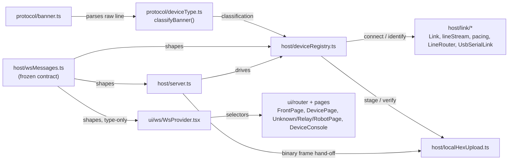
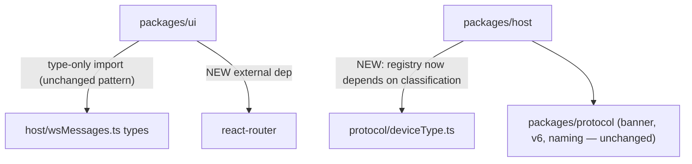

<!-- CLASI: Before changing code or making plans, review the SE process in CLAUDE.md -->

# Sprint 004: Device model, device types, and two-level navigation

## Goals

This is the sprint the stakeholder actually asked for: a front page
listing devices, and per-device pages whose content depends on the
device's type. It is the keystone of the 8-sprint arc recorded in
`robot-console-two-level-ui-and-multi-transport-roadmap.md` (arc
position 4) — sprints 5 through 10 all depend on the model this sprint
introduces. Concretely:

- Introduce a `unknown | relay | robot` device-type union
  (`classifyBanner()`), designed so a fourth type is purely additive.
- Replace the one-flat-page-two-tabs shell with a router: a front page
  at `/` listing devices, and a per-device page at `/d/:endpointId`
  whose content dispatches on the device's type.
- Reshape `wsMessages.ts` — the one wire contract between host and UI —
  once, breaking it deliberately in the first ticket so every later
  ticket in this sprint builds on a frozen shape instead of chasing a
  moving one.
- Introduce the endpoint/session/resource-key model that replaces
  today's device-only mutex discipline, so a relay carrying multiple
  robots (later sprints) can be expressed without a redesign.
- Refactor `WsProvider` to a ref-backed store (`useSyncExternalStore`)
  with per-endpoint selectors, and hoist the Console tab's per-device
  log buffer above the router so navigating between pages doesn't
  destroy it — this is a prerequisite for sprint 8's 20 Hz telemetry,
  not a cleanup done for its own sake.
- Give the unknown-device page two flash affordances: the existing
  relay-from-release flow, and a new local-hex-from-disk picker (covers
  the calibration-firmware gap until that hex exists).
- Fix the post-flash flicker/orphaned-state bugs already found in
  `deviceRegistry.ts` (`flash-result` firing before re-identify
  settles; `runFlash` missing the staleness guard its sibling code
  paths have), and fold in two small pending issues whose fixes are
  naturally part of this same connection-model work:
  `port-lock-contention-between-identify-and-user-open.md` and
  `no-build-pipeline-tsx-is-a-runtime-dependency.md`.

## Problem

The console is one flat page with two tabs and a single notion of
"device" meaning "a micro:bit plugged into USB." That model conflates
three distinct entities — a physical device (a USB serial you can
flash), an endpoint (a listable, routable thing), and a session (one
open link) — into one `DeviceState` with exactly one `link` slot. It
works for USB and breaks at the first relay, where one physical
resource (the relay's serial port) can front several routable robots.
There is also no page-per-device concept at all: everything lives in
the Devices/Console tab pair, so "content differs by device type" has
nothing to dispatch on yet.

Full detail, findings, and rationale live in
`robot-console-two-level-ui-and-multi-transport-roadmap.md`
("Sprint 4 — Device model + navigation (keystone)"); this sprint.md
will restate and size the relevant parts for the model to build during
detail planning rather than duplicate the whole document here.

## Solution

(To be detailed during Detail Mode planning. At a high level: a device
type union in `packages/protocol`; a `Link` split into `connect()`/
`identify()`; a router-based front page + per-device page restructure
in `packages/ui`; a ref-backed `WsProvider`; a reshaped `wsMessages.ts`
frozen in the first ticket; and a binary-frame local-hex upload path.
See the roadmap issue's "Sprint 4" subsection for the full design this
sprint builds to.)

## Success Criteria

Split explicitly into test-provable and hardware-deferred criteria per
the roadmap issue's verification discipline — sprints 1 and 2 both
closed claiming criteria that were never actually exercised, and this
sprint must not repeat that.

**Test-provable (no board required):**
- `classifyBanner()` precedence (no banner → unknown; `commonName`;
  then role allowlist; else unknown with role preserved) is covered by
  unit tests, including the "unrecognized type must be treated as
  unknown" contract for client-side dispatch.
- The resource-key mutex model (one resource → one key → one queue →
  one session) is exercised against a fake link, including the case of
  two logical targets sharing one physical resource key.
- Router dispatch renders the correct page component per device type,
  including the `default` arm for an unrecognized type.
- The local-hex upload handshake (`flash-local-begin` →
  `flash-local-ready` → binary frame → verify) round-trips against a
  fake socket, including the >4MB rejection and the "warn, don't
  block" behavior for a hex that parses but doesn't visibly validate
  against the board family.
- Post-flash navigation: `flash-result` is emitted only after
  re-identify settles (or times out) and carries the new identity; the
  orphaned-state guard in `runFlash` is exercised the same way
  `resolveNameAndOpen`/`openLink` already are.
- `WsProvider`'s ref-backed store and per-endpoint selectors don't
  re-render unrelated consumers on every message (verified via render
  counts in a test, not by inspection).

**Needs hardware — explicitly deferred, not to be claimed as verified
this sprint:** that a real relay or robot banner classifies as `relay`
or `robot` end-to-end. Per
`flash-succeeds-but-board-never-announces.md`, no board currently
announces after flashing, so on the two attached boards (`vevav`,
`zapig`) `type` will resolve to `unknown` through this sprint's whole
lifetime regardless of how correct `classifyBanner()` is. The
end-to-end "front page shows a device's real type" criterion is
**deferred** until that issue is resolved (tracked separately, not
folded into this sprint) — this sprint's hardware-facing verification
is limited to: the unknown-device page renders correctly for an
actually-unknown device, and the local-hex flash path can be exercised
against a real board over SWD/MSD (independent of banner
classification). `vevov`/`gopiv` are reachable via mDNS but are out of
scope for any transport work this sprint (relay/radio/mDNS land in
sprint 7).

`npm test` (475 passing at sprint start) and `npm run build` must both
continue to pass throughout.

## Scope

### In Scope

1. **Device type union** — `packages/protocol/src/deviceType.ts`,
   `classifyBanner()`, precedence: no banner → `unknown`; `commonName`
   (already parsed in `banner.ts` but currently dropped before reaching
   the UI); then a `role` allowlist (`RADIORELAY`/`RADIOBRIDGE` →
   relay, `NEZHA2` → robot); else `unknown` with `role` preserved. A
   fourth type (calibration robot) must be purely additive — clients
   treat any unrecognized `type` as `unknown`, and the UI dispatch
   carries a `default` arm.
2. **The endpoint/session/resource-key model** — separating device
   (USB board), endpoint (listable/routable thing), and session (one
   open link). Invariant: one resource → one key → one queue → one
   session. `resourceKey` is distinct from device key (a relay carrying
   multiple robots is one contended resource, not one per robot).
3. **The `wsMessages.ts` reshape** — a breaking change to the one wire
   contract between `server.ts` and the UI, frozen in the first ticket
   of detail planning so host and UI are never built against a moving
   target mid-sprint.
4. **Navigation** — add a router (`react-router`, `BrowserRouter` +
   `Routes` only, no data router), front page at `/`, device page at
   `/d/:endpointId`, content dispatched by type. No server change
   needed — `server.ts` already does SPA fallback.
5. **The `WsProvider` refactor** — ref-backed store with
   `useSyncExternalStore` and per-endpoint selectors; hoist
   `ConsoleTab`'s `logsByDevice` buffer above the router so navigation
   doesn't destroy it. Prerequisite for later telemetry work, not a
   standalone cleanup.
6. **Unknown-device page** with both flash affordances: relay-from-
   release (existing flow, carried forward) and local-hex-from-disk
   (new — browser file input, binary WebSocket frame, held in memory,
   never a temp file).
7. **Post-flash navigation fixes** — add `"reidentifying"` to
   `FlashPhase`, emit `flash-result` only once re-identify settles
   (carrying the new identity), and close the orphaned-state hole in
   `runFlash` (it lacks the `this.states.get(id) !== state` guard its
   sibling paths already have).
8. **Fold in two pending issues** whose fixes are the same underlying
   connection-model work, not separate patches:
   `port-lock-contention-between-identify-and-user-open.md` and
   `no-build-pipeline-tsx-is-a-runtime-dependency.md` (the latter: the
   last cheap moment to add a real build before the codebase doubles
   in size).

### Out of Scope

- Any new transport (`RelayRadioLink`, `MbrelayLink`, mDNS discovery) —
  sprint 7.
- Persistence and the remembered-robot roster — sprint 5.
- Drive controls and telemetry — sprints 6 and 8.
- The relay page's robot dropdown behavior — the relay page exists as
  a routable destination this sprint, but its dropdown stays empty
  until sprint 5's roster exists.
- Resolving `flash-succeeds-but-board-never-announces.md` — this
  sprint's own success criteria explicitly do not depend on that being
  fixed (see Success Criteria above); it stays a separately tracked
  issue.
- A calibration-firmware slot — the local-hex picker is the intended
  permanent coverage for that gap, not a stand-in for it.

## Test Strategy

Unit-test everything that does not require a physical board: the type
union and classification precedence, the resource-key mutex
(including the shared-resource case), router-to-page dispatch by type
(including the `default`/unknown arm), the local-hex upload handshake
and its size/validation behavior, and post-flash re-identify
sequencing including the orphaned-state guard. Extract a shared
`packages/ui/src/testing/` harness for the fake socket duplicated today
across `DevicesTab`/`ConsoleTab` tests, per the roadmap issue.

Hardware verification is limited (see Success Criteria) to exercising
the unknown-device page and the local-hex flash path against a real
board over SWD/MSD; end-to-end type classification against a live
relay/robot banner is explicitly deferred pending
`flash-succeeds-but-board-never-announces.md`, and must not be checked
off as verified without a real announcing board.

`npm test` (475 passing at sprint start) and `npm run build`
(`tsc --noEmit` across the affected workspaces) must both pass.

## Architecture

**Substantial / structural** — pre-sized by Roadmap Mode and confirmed
here: 3+ modules touched (`packages/protocol`, `packages/host`,
`packages/ui`), a new cross-module dependency (`deviceRegistry.ts` now
depends on `protocol/deviceType.ts`; `packages/ui` gains its first
external dependency beyond `react`/`react-dom`), and a breaking change
to the wire contract (the one shared "data model" this system has, in
the absence of a database). Full 7-step methodology, diagrams
included. This section formalizes
`robot-console-two-level-ui-and-multi-transport-roadmap.md`'s
"Sprint 4 — Device model + navigation (keystone)" subsection; it does
not revisit decisions already taken there.

### Step 1 — Understand the problem

The console today has one flat page, two tabs, and one notion of
"device" = "a micro:bit on USB," backed by `DeviceListEntry` (one `id`,
one `link` slot). The stakeholder wants a front page that lists
devices and a per-device page whose content depends on the device's
*type* (`unknown | relay | robot`). Two things block that today: (1)
nothing computes a type — `commonName` is parsed in `banner.ts` and
dropped before it reaches the UI; and (2) there is nothing to route
to — one flat page has no per-device destination to dispatch into.
`DeviceListEntry` also conflates three domain concepts (device,
endpoint, session) into one shape with one `link` slot, which works
for USB (1:1) but cannot express a relay carrying several robots
(sprint 7). Two more concrete bugs ride along because they are the
same connection-model work: post-flash type flicker
(`flash-result` fires before re-identify settles) and an orphaned-state
write hole in `runFlash`; and two filed issues fold in for the same
reason (port-lock contention between an automatic identify and a
user-initiated open; `tsx` as a production runtime dependency).

### Step 2 — Responsibilities

Grouped by what changes together, independently of the others:

1. **Classifying a banner into a device type** — pure, no I/O, changes
   only when the classification rule changes.
2. **Defining the wire contract** — the message/type shapes both sides
   agree on; changes only when the contract itself changes, and is
   frozen for the rest of the sprint once ticket 001 lands.
3. **Owning transport lifecycle for one physical link** — opening a
   port, sending `HELLO`, reading the reply, pacing writes, framing
   lines; changes when *how a link talks* changes, never when *what a
   type means* changes.
4. **Owning endpoint/session/resource-key state** — which endpoints
   exist, whether each has an open session, and enforcing "one
   resource → one key → one queue → one session"; changes when *the
   model of what's connected* changes.
5. **Staging an uploaded hex in memory** — receiving and verifying a
   binary blob; changes when *upload handling* changes, never when
   flashing logic changes.
6. **Bridging registry state to the WebSocket** — composition only, no
   new logic of its own (per `server.ts`'s existing doc-comment
   discipline).
7. **Holding the one client-side socket + snapshot state** — connect,
   reconnect, expose selectors; changes when *how the UI observes the
   server* changes, never when a particular page's content changes.
8. **Rendering the two-level navigation** — front page, per-device
   dispatch by type, per-type page content; changes when *what a page
   shows* changes.
9. **Producing a runnable package** — build output vs. source-as-main;
   changes only when packaging changes.

### Step 3 — Subsystems and modules

| Module | Purpose (one sentence) | Boundary | Serves |
|---|---|---|---|
| `packages/protocol/src/deviceType.ts` (new) | Classify a parsed banner into a `DeviceType`. | Pure function + types (`classifyBanner`, `DeviceType`, `DeviceClassification`, `normalizeDeviceType`); no I/O, no wire framing, no knowledge of transports. | SUC-001, 002, 003, 006 |
| `packages/host/src/wsMessages.ts` (reshaped) | Define the one WebSocket contract between host and UI. | Types + client-message parse guards only; no transport, no business logic (unchanged discipline from sprint 1/2). | All SUCs |
| `packages/host/src/link/` (new: `Link.ts`, `lineStream.ts`, `pacing.ts`, `LineRouter.ts`; reshaped `UsbSerialLink.ts`) | Implement the `connect()`/`identify()`-split transport abstraction and the transport-agnostic line-handling pieces every future link reuses. | No knowledge of endpoint/session state, banner *semantics* (only banner *parsing*, via `protocol`), or the WebSocket. | SUC-002, 003, 005 (foundation) |
| `packages/host/src/deviceRegistry.ts` (reshaped) | Own the endpoint/session/resource-key lifecycle for attached devices. | Composes `devices.ts` + `swdName.ts` + `link/*` + `flash.ts` + `releases.ts` + `config.ts` + `deviceType.ts` into `EndpointListEntry` snapshots and events; never touches the WebSocket directly. | SUC-001, 002, 003, 004, 005, 007 |
| `packages/host/src/localHexUpload.ts` (new) | Hold one in-flight local-hex upload's bytes in memory and verify them. | Pure in-memory buffer + length/sha256 verification; no SWD/flash knowledge (`flash.ts`'s job) and no WS framing (`server.ts`'s job to split the binary frame). | SUC-003 |
| `packages/host/src/server.ts` (extended) | Bridge `DeviceRegistry` + `localHexUpload` to the WebSocket per `wsMessages.ts`. | Composition only, including the new `isBinary` branch; no new logic of its own. | All SUCs (transport) |
| `packages/ui/src/ws/WsProvider.tsx` (rewritten internals) | Own the one WebSocket connection; expose a ref-backed, selector-based store. | No rendering, no routing, no per-device business logic. | SUC-001, 006, 007 |
| `packages/ui/src/router.tsx` + page components (new: `FrontPage.tsx`, `DevicePage.tsx`, `UnknownDevicePage.tsx`, `RelayPage.tsx`, `RobotPage.tsx`, `DeviceConsole.tsx`) | Render the two-level navigation and per-type page dispatch. | Consumes `WsProvider` selectors only; no direct socket access. | SUC-001, 002, 003, 006, 007 |
| `packages/host`/`packages/protocol` package.json + tsconfig + `bin/robot-console.js` | Produce real `dist/` output; `main`/`types` point there. | Build tooling only; no runtime behavior change. | SUC-008 |

Every module addresses at least one SUC (table above); no module has
more than one reason to change; dependency direction is
Presentation (`ui`) → Domain (`host`'s registry/link) → nothing further
outward except `protocol`, which has no outward dependencies of its
own (unchanged).

### Step 4 — Diagrams

**Component diagram** (required — 3+ modules touched, new cross-module
dependency):

**Dependency graph** (required — module dependencies change):

No cycles: `protocol` has no outward dependencies; `host` depends only
on `protocol`; `ui` depends only on `host`'s *types* (build-time only,
already true since sprint 1) plus the new `react-router` leaf. No ERD
— this sprint introduces no persisted entity (persistence is sprint
5); the wire-contract reshape is the "data model change" that sized
this sprint substantial, not a database schema.

### Step 5 — What changed / Why / Impact / Migration concerns

**What changed:**

- New `DeviceType` union (`unknown | relay | robot`) and
  `classifyBanner()` in `packages/protocol/src/deviceType.ts`.
- `wsMessages.ts` reshaped: `DeviceListEntry` → `EndpointListEntry`
  (adds `endpointId`, `transport`, `resourceKey`, `classification`;
  renames `linkOpen`/`linkError` → `sessionOpen`/`sessionError`);
  `DevicesMessage` → `EndpointsMessage`; `open`/`close` →
  `session-open`/`session-close` (carrying `endpointId`, plus a
  reserved-but-unused `robotName?` for sprint 7); `FirmwareKind`
  augmented with `FirmwareSourceRef` (`release` vs. `local-hex`);
  `FlashStartMessage` carries a `source: FirmwareSourceRef`;
  `FlashPhase` gains `"reidentifying"`; `FlashResultMessage` carries
  `classification`/`name`/`reidentify` on success; new
  `FlashLocalBeginMessage`/`FlashLocalReadyMessage` plus a binary-frame
  convention (`UPLOAD_ID_BYTE_LENGTH` constant) for the local-hex
  upload.
- `deviceRegistry.ts` reshaped around endpoint/session/resource-key
  vocabulary; `UsbSerialLinkLike.open()` (throws) replaced by a `Link`
  interface with `connect()`/`identify()` (identify never throws,
  returns `null` on timeout).
- New `packages/host/src/link/` module family (`Link.ts`,
  `lineStream.ts`, `pacing.ts`, `LineRouter.ts`), extracted from
  `UsbSerialLink.ts` so a future relay/TCP/UDP link reuses this instead
  of reimplementing ack/nack + pacing.
- New `localHexUpload.ts`; `server.ts` gains an `isBinary` branch.
- `WsProvider.tsx` rewritten to a ref-backed store
  (`useSyncExternalStore`), with `hasSnapshot: boolean` client-side
  state and per-endpoint selectors; the console log buffer hoisted
  above the router into this same store.
- `react-router` added to `packages/ui`; `App.tsx`'s tab bar replaced
  by `BrowserRouter`/`Routes`: `/` (front page) and `/d/:endpointId`
  (per-device page, dispatched by `classification.type`, `default` →
  unknown).
- `packages/host`/`packages/protocol` gain real `dist/` build output;
  `tsx` moves to a devDependency.

**Why:** see Step 1 — the type union and the navigation restructure are
one change from two ends (Goals, sprint.md); the endpoint/session/
resource-key model is what makes the relay-carries-many-robots case
(sprint 7) expressible without a second redesign; the `Link` split
turns "relay transport healthy, nothing answers" from an exception into
a first-class, representable state, which is also what the unknown/
relay pages need to render sensibly this sprint.

**Impact on existing components:**

- `DevicesTab.tsx`/`ConsoleTab.tsx` are retired as flat-tab components;
  their rendering logic is redistributed into `FrontPage.tsx` (the
  device list, minus per-row flash controls) and `DeviceConsole.tsx` (a
  per-endpoint console, embedded in each per-device page rather than a
  device-picker dropdown — see Design Rationale). `App.tsx` shrinks to
  the router mount.
- Every test file touching `DeviceListEntry`/`deviceId`/`linkOpen`/
  `open`/`close`/`devices` (host: `wsMessages.test.ts`,
  `deviceRegistry.test.ts`, `server.test.ts`,
  `link/UsbSerialLink.test.ts`; ui: `DevicesTab.test.tsx`,
  `ConsoleTab.test.tsx`) is touched by the ticket 001 rename before any
  new behavior is added — this is the "freeze in ticket 001" cost paid
  up front, mirroring sprint 002.
- `flash.ts`, `releases.ts`, `config.ts`, `devices.ts`, `swdName.ts`
  are **not** touched structurally — `runFlash` grows a reidentify
  tail and a local-hex branch, but the fetch/verify/write pipeline
  underneath is unchanged (ticket 004/005 add to it, do not rewrite
  it).

**Migration concerns:** the `wsMessages.ts` reshape is breaking by
design (host and UI ship together — no deployed-boundary compatibility
concern), so "migration" here means *sequencing*, not backward
compatibility:

- Ticket 001 must land completely (host and UI both compiling and
  green against the new shape) before any later ticket starts, or two
  tickets end up chasing a moving contract simultaneously — the
  documented risk from both this sprint and sprint 002's precedent.
- `packages/protocol/src/relay/commands.ts`, named in the roadmap
  issue's Sprint 4 subsection as future shared ground for
  `RelayRadioLink`/`MbrelayLink`, is **deliberately not created this
  sprint** — see Design Rationale below for why this is a scope
  correction, not an omission.
- No data migration: nothing is persisted yet (sprint 5).

### Step 6 — Design Rationale

| Decision | Context | Alternatives considered | Why this choice | Consequences |
|---|---|---|---|---|
| Freeze the wire contract entirely in ticket 001 | A mid-sprint contract change would invalidate host and UI simultaneously (sprint's own stated risk) | Reshape incrementally, ticket by ticket | Sprint 002 used exactly this shape successfully; a partial reshape means some tickets build against a moving target | Ticket 001 is large (touches every file importing `wsMessages.ts`) but every later ticket is purely additive against a stable shape |
| `Link.connect()`/`identify()` split, no `retarget()` | `UsbSerialLinkLike.open()` throws on a silent board, treating "healthy transport, nothing answers" as an exception — the state a relay update needs to represent normally | Keep `open()` throwing; add a `retarget()` method for future relay robot-switching | A relay's data plane has no in-band escape after `!GO` (§6, UC-004 step 5), so an *absent* `retarget()` is what stops someone adding an unsupportable method later; the split itself is what fixes the port-lock-contention issue (the link is no longer opened/closed per identify attempt) | `deviceRegistry.ts`'s attach flow calls two methods instead of one and must handle `identify()` returning `null` as a normal outcome, not a caught exception |
| `resourceKey` distinct from `endpointId`, even though they're equal for every endpoint this sprint | The relay-carries-multiple-robots case (sprint 7) needs one contended key shared by several endpoints | Key everything on `endpointId` now, introduce `resourceKey` only in sprint 7 | Introducing the field now, unused-but-equal, means sprint 7 extends the model instead of redesigning `KeyedMutex`'s keying and every call site that reads it | One field that looks redundant this sprint (`resourceKey === endpointId` always) — documented as intentional, not dead code |
| `classification` carries `dialect` for diagnostics only, never branched on | Two banner dialects are live simultaneously (`banner.ts`'s own doc) | Use dialect to choose a classification path | Roadmap issue explicitly rules out dialect as a discriminator — it is converging away (§9 Q3c) | `classification.dialect` exists purely for logging/debugging, and must never grow a `switch` on it |
| `WsProvider` is ref-backed with `useSyncExternalStore`, not context state | The current provider recreates its context value every render with no memoization; fatal at sprint 8's 20Hz telemetry | Add `useMemo` around the existing context value | Memoizing the *value* doesn't stop `devices`/`firmwareStatus` themselves from being new arrays/objects on every message — every consumer still re-renders on every message regardless of memoization at the provider boundary | Consumers move from `useWs()` reading whole-context state to `useEndpoint(id)`/`useEndpoints()` selector hooks; more surface area in `WsProvider.tsx` but each hook is small and independently testable |
| `hasSnapshot` is client-side derived state, not a wire field | A deep-linked `/d/:endpointId` must distinguish "no endpoints yet" from "zero endpoints" | Add `hasSnapshot` to `EndpointsMessage` | The server always sends a full snapshot on connect (even `endpoints: []`); the client already knows "have I received one yet" without the server saying so redundantly | One less wire field; `WsProvider` sets `hasSnapshot: true` on the first `type: "endpoints"` message it processes |
| Local-hex upload as one binary WS frame (`uploadId \|\| payload`), never base64 JSON | A universal hex is ~1.8MB ASCII; base64-in-JSON would inflate and double-parse it | Send the hex as a base64 string field on a JSON message | `server.ts:239`'s existing `data.toString()` already needs a binary branch either way once any binary traffic exists on this socket; doing it properly once costs the same as doing it wrong via base64 | `server.ts`'s message handler branches on `isBinary` before `JSON.parse`, not after |
| Local-hex bytes held in memory only, never a temp file | Flashing an arbitrary hex cannot brick a v2 board (always re-flashable over SWD/MSD), but nothing about *storing* it needs disk durability | Write to a temp file, as some other tools do | No crash-recovery requirement exists for an in-flight upload; a temp file adds a cleanup obligation and a path-traversal surface for no benefit | `localHexUpload.ts` is a plain in-memory `Map<uploadId, Buffer>` with a size cap, nothing more |
| Warn, don't block, on a hex that parses but doesn't look v2 | A v1-only (nRF51) hex on a v2 board flashes a non-booting image, but flashing is always reversible | Reject the hex outright when it doesn't look v2-shaped | The check that would be needed to reliably tell "wrong hardware family" from "correctly targets a family this codebase doesn't recognize yet" doesn't exist, and a false rejection blocks a legitimate flash with no override | Copy reads "if the board stops responding, flash it again," not "failed" |
| Raw console embedded per-device (`DeviceConsole.tsx`) rather than a nested `/d/:endpointId/console` route | `sprint.md` calls for hoisting the log buffer "so navigating between pages doesn't destroy it," but drive/telemetry/console *routes* are explicitly sprint 6/8 territory | Add the nested route now, ahead of its own ticket | The raw line console has no drive/telemetry dependency — only an endpoint + session — so it can ship this sprint without pulling forward any out-of-scope work; a nested route can be introduced later with no reshape, since the underlying per-endpoint log store doesn't change | Every per-device page (unknown/relay/robot) gets the same `DeviceConsole` section this sprint; a later sprint may promote it to its own route without touching `WsProvider` |
| `packages/protocol/src/relay/commands.ts` **not** created this sprint | Roadmap issue's Sprint 4 subsection names it as where `RelayRadioLink`/`MbrelayLink` will share a command-plane preamble | Create the (empty) module now since the roadmap doc names it under "Sprint 4" | Sprint 004's own Scope explicitly excludes "any new transport"; a module whose only purpose is to be shared by two transports that don't exist yet, with zero consumers, is exactly the "speculative generality" anti-pattern this process reviews against | Sprint 7's planning must create this module when `RelayRadioLink`/`MbrelayLink` land — flagged in Open Questions below so it isn't lost |
| Router: `react-router`, `BrowserRouter`+`Routes`, no data router | Roadmap issue listed this as an open stakeholder question (react-router vs. wouter) | `wouter` (~2KB, ~90% of the value) | Resolved upstream of this dispatch as a decided design input (see sprint-planner's dispatch instructions); `react-router`'s nested-route support matches the arc's later growth (`/d/:endpointId/console\|telemetry\|trace\|calibrate`) | `packages/ui` gains its first dependency beyond `react`/`react-dom` |

### Step 7 — Open questions

- **`packages/protocol/src/relay/commands.ts`** is deferred to sprint
  7's own planning (see Design Rationale) — sprint 7's planner should
  not treat its absence as an oversight.
- The roadmap issue's open questions #1 (confirm `d4d8e4e`), #2 (radio-
  enabled robot hex source), and #4 (roster scope) are **not**
  resolved by this sprint — they remain open for sprints 5–10's
  planning, as the roadmap issue itself scopes them.
- Whether the raw console gets promoted to its own nested route
  (`/d/:endpointId/console`) in sprint 6 or 8, versus staying embedded
  per-page indefinitely, is left to that sprint's planning — this
  sprint's `DeviceConsole` embedding does not foreclose either option.

## Use Cases

Full treatment, matching the substantial architecture tier. Each SUC
below traces to at least one ticket (see the Tickets table); together
they cover every item in Scope § In Scope.

### SUC-001 — Browse the front page and open a device's page

**Preconditions:** The host is running; zero or more devices are
attached.

**Main flow:**
1. Student opens the console in a browser. The front page (`/`) shows
   the current endpoint list, live-updated exactly as the old Devices
   tab was (attach/detach, naming, role).
2. Student clicks a device. The browser navigates to
   `/d/:endpointId`.
3. The device page renders content dispatched on
   `classification.type`: `unknown` → `UnknownDevicePage`, `relay` →
   `RelayPage`, `robot` → `RobotPage`, any other/unrecognized string →
   `UnknownDevicePage` (the `default` arm — exercises the "a fourth
   type is purely additive" contract even though no real fourth type
   exists yet).

**Alternate flow — deep link before the first snapshot arrives:**
4. Student navigates directly to `/d/:endpointId` (e.g. a bookmark)
   before `WsProvider` has received its first `endpoints` message.
   `hasSnapshot` is `false`; the page renders a "loading" state, not a
   "device not found" state.
5. Once the first snapshot arrives (`hasSnapshot` becomes `true`), the
   page either renders the matched endpoint or, if truly absent, a
   "no such device" state — now correctly distinguished from step 4's
   loading state.

**Postconditions:** The URL is shareable/bookmarkable per device;
front-page and device-page state agree (both read the same
`WsProvider` store).

**Test-provable:** router dispatch per type including the `default`
arm; the `hasSnapshot` false→true transition rendering distinct
states, against a fake socket. **Hardware:** the front page showing
real attached boards (`vevav`, `zapig`) is verifiable; their `type`
resolving to anything other than `unknown` is not (see Success
Criteria).

### SUC-002 — Recover an unknown device by flashing release firmware, from its own page

Carries UC-002 (`docs/design/specification.md`) into the new
navigation shape.

**Preconditions:** A device has failed to identify (`sessionOpen:
false`, `sessionError` set) and is on `UnknownDevicePage`
(`/d/:endpointId`).

**Main flow:**
1. Student sees relay/robot flash buttons on the device's own page
   (moved from the old flat Devices-tab row into the page).
2. Student clicks "Flash relay firmware" (or robot). The page sends
   `flash-start { endpointId, source: { kind: "release", firmware } }`.
3. Progress phases render on this same page as they arrive
   (`fetching` → `verifying` → `erasing` → `writing` → `resetting` →
   `reidentifying`).
4. Once `flash-result` arrives with `status: "ok"`, its `classification`
   reflects the post-flash identity in the *same* message — the front
   page (if the student navigates back) shows the new type immediately,
   with no intermediate stale-type render (see SUC-004's timeout
   variant for when this doesn't settle).

**Postconditions:** Exactly one `flash-result` per `flash-start`;
`flashStatus` is cleared only once `flash-result` is sent, not
earlier.

**Test-provable:** the full sequence against a fake `Link`/fake
socket, including that no intermediate snapshot shows the old type
after `resetting`. **Hardware:** flashing a real board over SWD is
provable; the board reporting `type: "relay"`/`"robot"` afterwards is
not (deferred, see Success Criteria) — the flash and reidentify-timeout
path are exercised instead.

### SUC-003 — Recover an unknown device by flashing a local hex file from disk

New this sprint; covers the calibration-firmware gap until that hex
exists (per the roadmap issue's decision #2).

**Preconditions:** Same as SUC-002; a `.hex` file is available on the
student's machine.

**Main flow:**
1. Student picks a file via a browser file input on
   `UnknownDevicePage`.
2. UI computes `{ fileName, byteLength, sha256 }` client-side and sends
   `flash-local-begin`.
3. Server rejects immediately (before allocating a buffer) if
   `byteLength` exceeds 4MB, with a clear error; otherwise responds
   `flash-local-ready { uploadId }`.
4. UI sends one binary WebSocket frame: `uploadId` (ASCII,
   `UPLOAD_ID_BYTE_LENGTH` bytes) followed by the raw file bytes.
5. Server verifies the received length and sha256 against what
   `flash-local-begin` declared; on mismatch, the upload is rejected
   and nothing is held.
6. Server holds the verified bytes in memory only (never a temp file),
   keyed by `uploadId`.
7. Student clicks "Flash this file." UI sends
   `flash-start { endpointId, source: { kind: "local-hex", uploadId,
   fileName, sha256 } }`. From here, flashing proceeds exactly as
   SUC-002 from step 3.

**Alternate flow — hex doesn't look v2-shaped:**
8. The hex parses as valid Intel hex (or extracts a v2 block from a
   universal hex) but isn't confirmed v2-targeted. The flash proceeds
   (warn, don't block) with copy reading "if the board stops
   responding, flash it again" — never "failed."

**Postconditions:** No file is ever written to disk by this path; an
upload not consumed by a `flash-start` is eventually released (process
lifetime is an acceptable bound this sprint — no idle-eviction timer
is required).

**Test-provable:** the full handshake round-trip against a fake
socket, including the >4MB rejection before any buffer is allocated,
and the sha256/length mismatch rejection. **Hardware:** flashing a
real board via this path over SWD/MSD is verifiable (independent of
banner classification, per Success Criteria).

### SUC-004 — A flash succeeds but the board never re-announces in time

Covers finding 5 from the roadmap issue and the "waiting for the board
to come back" wording requirement. Precondition may be reached via
SUC-002 or SUC-003.

**Preconditions:** `flash()` reports `status: "ok"`; the subsequent
re-identify attempt does not receive a banner within
`reidentifyTimeoutMs` (~8s), even after one retry.

**Main flow:**
1. `runFlash` reports `flash-result { status: "ok", classification: {
   type: "unknown", ... }, reidentify: "timeout" }` rather than
   leaving the client waiting indefinitely or reporting an error.
2. The device page renders this as "waiting for the board to come
   back" — explicitly not "failed" — since the write itself succeeded.

**Postconditions:** `flashStatus` is cleared exactly once, at this
message; the endpoint is not left in a state where a future
`session-open` retry is blocked.

**Test-provable:** against a fake `Link` whose `identify()` always
resolves `null`, with a fake timer for the ~8s window and the one
retry. **Hardware:** N/A this sprint (this is precisely the path real
boards take today per `flash-succeeds-but-board-never-announces.md`;
exercising it *is* the realistic hardware behavior, not a gap).

### SUC-005 — A board that re-enumerates mid-flash does not corrupt registry state

Covers the `runFlash` orphaned-state guard (finding 5's second half).

**Preconditions:** A flash is in flight; the OS reports the device as
removed and immediately re-added (the watcher's own remove+add pattern
for "modified device").

**Main flow:**
1. The old `EndpointState` object is orphaned (a new one is created for
   the re-added device) while `runFlash`'s task is still running
   against the old object.
2. Every write `runFlash` makes checks `this.states.get(id) !== state`
   (the same guard `resolveNameAndOpen`/`openLink` already have) before
   mutating or emitting — a write against an orphaned state object is
   silently dropped rather than corrupting the live one.

**Postconditions:** The live (re-added) endpoint's state is never
overwritten by a stale in-flight flash task; no `flash-result` is
emitted for an id whose state object is no longer live.

**Test-provable:** directly, by orphaning a state mid-`runFlash` in a
test and asserting the live state is untouched — the same technique
`resolveNameAndOpen`/`openLink`'s existing tests already use.
**Hardware:** not required; this is a race condition, not a hardware
behavior.

### SUC-006 — View a relay's or robot's page as a routable destination

**Preconditions:** An endpoint classifies as `relay` or `robot` (test
fixture only this sprint — see Success Criteria's hardware deferral).

**Main flow:**
1. Student navigates to `/d/:endpointId` for a `relay`-classified
   endpoint. `RelayPage` renders: a header, and a robot-name dropdown
   that is present but empty (sprint 5 populates it) — not hidden, not
   an error.
2. Student navigates to `/d/:endpointId` for a `robot`-classified
   endpoint. `RobotPage` renders a minimal shell (drive/telemetry are
   sprints 6/8) plus the embedded `DeviceConsole` (SUC-007).

**Postconditions:** Both pages are real routable destinations today,
not placeholders that 404 — sprint 7's relay work and sprint 6's robot
work extend these pages rather than creating them.

**Test-provable:** router dispatch to each page type against fixture
`EndpointListEntry` data. **Hardware:** deferred entirely — no
attached board currently classifies as `relay`/`robot` (Success
Criteria).

### SUC-007 — Use the raw console from a device's page across navigation

**Preconditions:** A device has an open session and has produced
console traffic.

**Main flow:**
1. Student is on `/d/:endpointId` for device A; `DeviceConsole` shows
   A's log.
2. Student navigates to the front page and then to `/d/:endpointId`
   for device B, then back to A.
3. A's log is exactly as it was — nothing was lost, because the log
   buffer lives in `WsProvider`'s ref-backed store, not in a component
   that unmounts on navigation.

**Postconditions:** Per-endpoint log buffers persist for the life of
the browser tab (`MAX_LINES_PER_DEVICE` cap unchanged), independent of
which page is currently mounted.

**Test-provable:** navigate away and back in a router test, assert the
log content is unchanged; also the render-count assertion from Success
Criteria (unrelated consumers don't re-render on every message).
**Hardware:** not required.

### SUC-008 — A student runs the published package without a stray runtime dependency

Covers `no-build-pipeline-tsx-is-a-runtime-dependency.md`.

**Preconditions:** A clean `npm install` of the published package.

**Main flow:**
1. `npx robot-console` runs from compiled `dist/` output for
   `packages/host` and `packages/protocol` — `main`/`types` point
   there, not at `.ts` source.
2. `tsx` does not appear in any workspace's production
   `dependencies`.

**Postconditions:** `npm test` continues to run against source (via
vitest, unaffected by the build output); `npm run build` still passes.

**Test-provable:** a clean-install smoke check that the bin entry point
resolves and runs without `tsx` present as a production dependency
(inspecting the dependency graph / lockfile, and running the built
output directly with plain `node`). **Hardware:** N/A.

## GitHub Issues

(GitHub issues linked to this sprint's tickets. Format: `owner/repo#N`.)

## Definition of Ready

Before tickets can be created, all of the following must be true:

- [ ] Sprint planning document is complete (sprint.md, including its
      Architecture and Use Cases sections)
- [ ] Architecture review passed (or skipped, for changes with no
      architectural impact)
- [ ] Stakeholder has approved the sprint plan

## Tickets

| # | Title | Depends On |
|---|-------|------------|
| 001 | Wire contract reshape and device-type union | — |
| 002 | Link abstraction: connect/identify split and transport extraction | 001 |
| 003 | Endpoint/session/resource-key model in deviceRegistry.ts | 002 |
| 004 | Post-flash reidentify sequencing and orphaned-state guard | 003 |
| 005 | Local-hex upload path: binary frame handshake and in-memory flash source | 004 |
| 006 | WsProvider ref-backed store, selectors, and hoisted log buffer | 001 |
| 007 | Router and front page | 006 |
| 008 | Per-device pages (unknown/relay/robot) and post-flash navigation | 007, 005 |
| 009 | Real build output: drop tsx as a production runtime dependency | — |

Tickets execute serially in the order listed. 006 depends only on 001
(not on 002–005, which are host-only) but is sequenced after them
since it is listed later; 009 has no technical dependency on any other
ticket and could run at any point, but is sequenced last to avoid
colliding with the package.json/tsconfig churn every other ticket
makes.
