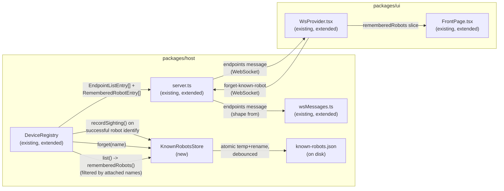

<!-- CLASI: Before changing code or making plans, review the SE process in CLAUDE.md -->

# Sprint 005: Persistence: the remembered-robot roster

## Goals

Introduce the project's **first persistence layer** — a small, on-disk
roster of robots the console has identified over USB — and give it a
boundary of its own before anything downstream (the relay dropdown in
sprint 7, mDNS gating in sprints 7/9) starts consuming it. Today there
is no database, no JSON store, not even `localStorage`: state dies with
the process and a replug resets a device entirely. This sprint makes the
foundational, easy-to-get-wrong decisions — on-disk location, file
format, schema versioning, corruption handling, what counts as "seen,"
how a user forgets a robot — once, deliberately, rather than letting
them be made implicitly by whichever later sprint happens to need a
place to write.

Concretely: a `knownRobots.ts` store in `packages/host`, written only on
a successful USB identify that classifies as `type === "robot"` with
banner evidence; read at boot; exposed over the wire as a `remembered`
presence state; rendered on the front page so a robot that is not
currently plugged in is still visible and nameable; and an explicit
"forget this robot" action, since this store has no automatic expiry.

This sprint depends on **sprint 4** (being planned concurrently) for the
device-type union and endpoint model — the roster stores a `type` and a
name that sprint 4 defines — and does not duplicate that work.

## Problem

There is no persistence anywhere in the project. A robot identified over
USB today is known only for the life of the host process; unplug it and
the console has no memory of it. That blocks two things the roadmap
needs later: a relay dropdown that lists robots by name without a robot
being physically present, and an mDNS gate that only shows advertisements
from robots a classroom has actually seen (rather than trusting any
device that advertises itself, which would be self-fulfilling and would
let a whole classroom of strangers' robots leak into a student's view).

Because this is the *first* store the project has ever needed, the
decisions made here — file location, format, versioning, corruption
recovery, identity key, expiry policy — are foundational. Made well once,
with tests, they are reused by nothing (this sprint deliberately does not
generalize the store for other data) but they set the pattern anyone
adding a second store later will follow or deviate from with reason.

## Solution

Add `packages/host/src/store/knownRobots.ts`: a plain-JSON, versioned,
file-backed store of one record per five-letter robot name (the nRF
`FICR.DEVICEID[1]`-derived target identity used everywhere else in the
system — the dropdown, `radioAddress.ts`, the mbrelay registry, mDNS —
not the USB serial, which comes from a different chip per spec §2.2 and
is only a display hint).

- **Write path**: hook into the successful-USB-identify path (the same
  point sprint 4's device classification lands) and write only when
  `type === "robot"` with banner evidence. Not on mDNS sightings (that
  would make the gate self-fulfilling), not on relay-mediated sightings
  (that would enroll an entire classroom's robots from one relay).
- **Read path**: load at host boot; corrupt, missing, or unknown-version
  files degrade to an empty roster with a warning, never a crash,
  matching `config.ts`'s existing "never fatal" discipline. A file
  written by a *newer* version of the code than is currently running is
  loaded as empty and the store refuses to write, so an older `npx`
  invocation on a shared machine cannot clobber a newer install's data.
- **Location**: `${XDG_STATE_HOME:-~/.local/state}/robot-console/known-robots.json`,
  overridable via `ROBOT_CONSOLE_STATE_DIR`, following the existing
  `ROBOT_CONSOLE_*` env convention in `config.ts`. Not the repo root
  (an `npx robot-console` user has no repo to write into) and not
  `localStorage` (the enrollment gate must be enforced host-side, not by
  a browser that could be pointed at any host).
- **Format**: plain JSON with a `version` field. No SQLite (a native
  dependency on top of `node-hid`/`serialport`, which already make `npx`
  install fragile) and no lowdb (a dependency for what is realistically
  forty lines of read/write/atomic-rename code).
- **Durability**: writes are atomic (temp file + rename) and debounced,
  since replugging a board tends to arrive in bursts. A write failure
  never fails the underlying USB sighting — persistence is a side effect,
  not a precondition. The filesystem access is injected as a seam
  (mirroring `flash.ts`'s `WriteFileFn`) so the whole store is unit
  testable against a temp directory with no real disk-timing dependency.
- **Exposure**: the roster is surfaced over the existing WebSocket
  contract as a `remembered` presence state (alongside whatever presence
  states sprint 4 already defines), so a robot that is not currently
  attached still appears — greyed out — in the front-page device list,
  with its name and `lastSeenAt`.
- **Forgetting**: no automatic expiry — a classroom that meets weekly
  would have its actually-wanted robots aged out by any reasonable expiry
  window. Instead, an explicit "forget this robot" action removes a
  record on request, and `lastSeenAt` is shown so a stale entry is at
  least visible before a person decides to remove it.

**Distinction preserved in the design**: the relay dropdown (sprint 7)
and the mDNS advertisement gate (sprints 7/9) are two different
mechanisms consuming the same roster, not one mechanism. A radio robot
advertises nothing at all — the radio link is silent and fire-and-forget
— so the dropdown is purely roster-driven with no discovery in the loop.
Gating against the roster applies only to network-discovered peers
(mDNS). This sprint's store is deliberately agnostic to which consumer
reads it; neither consumer is built here.

## Success Criteria

- A successful USB identify of a `type === "robot"` device writes (or
  refreshes) a roster record keyed by the robot's five-letter name.
- Restarting the host process preserves the roster — a robot last seen
  before restart still appears, marked `remembered`, on the front page
  even while unplugged.
- Corrupting, truncating, or deleting the roster file, or pointing at a
  file with an unrecognized `version`, never crashes the host — the
  roster degrades to empty with a logged warning.
- A roster file with a `version` newer than the running code's is loaded
  as empty and no write occurs — verified by test, not just by
  inspection.
- A user can remove a robot from the roster via an explicit "forget this
  robot" action, and the removal persists across a restart.
- The entire feature — round-trip, corruption recovery, version-mismatch
  handling, concurrent/bursty writes — is provable against a temp
  directory with **no hardware and no deferred criteria**. That is
  unusual for this project and worth stating plainly in the ticket
  verification sections.

## Scope

### In Scope

- `packages/host/src/store/knownRobots.ts`: the store itself — schema,
  versioning, atomic+debounced writes, injectable fs seam, corruption and
  version-mismatch handling.
- Wiring the store's write path into the successful-USB-identify flow
  (robot type, banner evidence only).
- Loading the store at host boot.
- Exposing roster entries over the wire as a `remembered` presence state,
  consistent with sprint 4's presence model.
- Rendering remembered-but-unplugged robots in the front-page device
  roster (name, `lastSeenAt`, greyed to distinguish from attached
  devices).
- An explicit "forget this robot" action (UI affordance plus the host
  operation that removes the record).

### Out of Scope

- Anything that *consumes* the roster for its intended downstream
  purposes: the relay dropdown (sprint 7) and mDNS advertisement gating
  (sprints 7/9) — there is no mDNS in the project yet.
- Persisting anything other than the known-robots roster: console
  scrollback, telemetry history, UI preferences, link/session history.
  This store will attract requests for all of these; say no now.
- Any new device-type or transport modeling — that belongs to sprint 4,
  which this sprint depends on and does not duplicate.
- Automatic expiry of roster entries (explicitly rejected — see
  Solution).

## Test Strategy

Almost the entire sprint is provable against a temp directory with no
hardware — see the Architecture section's "Verification" note and each
ticket's own acceptance criteria for the provable-without-hardware /
needs-a-board split. In summary:

- **Provable without hardware** (temp-dir + fake `Link`/banner tests):
  store round-trip, schema versioning, corrupt-file recovery, newer-version
  write refusal, debounced/atomic writes, the forget action, the write
  gate's positive case (a fake link identifying as `type: "robot"` enrols)
  and negative case (a fake link identifying as `type: "relay"` — the
  default banner fixture already used throughout `deviceRegistry.test.ts`
  — does not enrol), wire-message parsing/shaping, and the front-page
  rendering of a remembered-but-absent robot.
- **Needs a board**: that a *real* robot identifying over USB actually
  enrols end-to-end. No robot is currently on USB (all three attached
  boards classify as `relay`), so this one criterion is hardware-deferred;
  do not check it off until a robot board is available. The negative case
  (a relay must not enrol) is verified today against real relay hardware's
  own banner shape via the existing fixture, so it carries no hardware
  deferral.

## Architecture

**Substantial** — this sprint introduces the project's first persistence
layer (a new module with a new cross-module dependency: `deviceRegistry.ts`
and `server.ts` each come to depend on it), a new on-disk data format
(`known-robots.json`), and a new wire-level data shape
(`EndpointsMessage.rememberedRobots`, plus a new client→server message).
More than three modules are touched end to end (a new store module,
`deviceRegistry.ts`, `wsMessages.ts`, `server.ts`, `WsProvider.tsx`,
`FrontPage.tsx`). This clears the "substantial" bar on module count alone,
independent of the new-dependency and data-model signals, so the full
7-step methodology applies, diagrams included.

### Step 1: Understand the problem

Today `DeviceRegistry` knows about exactly the devices currently plugged
into USB; unplug one and every trace of it — name, role, last-seen time —
is gone. Two downstream sprints need a robot's name to outlive the plug:
sprint 7's relay dropdown (list robots by name with no robot physically
present) and sprints 7/9's mDNS gate (only show advertisements from robots
a classroom has actually plugged in over USB at least once). Building
either without a shared, well-founded store first would mean each one
invents its own persistence, its own file format, its own corruption
handling — the "implicit design by whichever sprint gets there first"
outcome this sprint exists to prevent. This sprint's job is narrower than
either downstream consumer: write the roster, read it at boot, show it,
let a user forget an entry. Nothing consumes it yet.

### Step 2: Identify responsibilities

Four responsibilities, each with its own reason to change:

1. **Durable storage of one record per known robot name** — schema,
   on-disk location, versioning, corruption/version-mismatch recovery,
   atomic + debounced writes. Changes only when the storage format or
   durability strategy changes.
2. **Deciding when a sighting is durable-worthy** — the write gate
   (successful USB identify, `type === "robot"`, a resolved name).
   Changes only when the enrollment policy changes (e.g. a future sprint
   deciding relay-mediated sightings should also count — explicitly out
   of scope here, see sprint.md's Scope).
3. **Wire exposure of the roster to a connected client** — projecting
   store records into a `remembered` list on the existing WebSocket
   snapshot, and accepting a "forget" request. Changes only when the wire
   contract changes.
4. **Front-page rendering of a remembered-but-absent robot, and the forget
   affordance** — presentation only. Changes only when the UI's
   information design changes.

These are independent axes: (1) never needs to know what triggered a
write; (2) never needs to know how a write is durably persisted; (3)
never needs to know the on-disk format, only the in-memory record shape;
(4) never needs to know anything about the wire protocol beyond the
message shapes it already consumes.

### Step 3: Define subsystems and modules

**`packages/host/src/store/knownRobots.ts`** (new) — `KnownRobotsStore`.
Purpose: durably persist one record per known robot name. Boundary:
inside — schema, versioning, the atomic-temp-rename write, debounce
timing, the injectable fs seam (mirroring `flash.ts`'s `WriteFileFn`),
corruption/newer-version handling; outside — deciding *when* to write
(responsibility 2, which lives in its caller), anything about the wire
protocol, anything about USB/banners/classification. Serves: the
persistence half of this sprint's Solution; no use case names it directly
(it is infrastructure), but it is what SUC-001 and SUC-002 below depend
on.

**`deviceRegistry.ts` additions** (existing module, extended) — owns the
write gate (responsibility 2) and composes the store into its existing
snapshot-broadcast and mutex-serialized operations, exactly as it already
composes `config.ts`/`releases.ts`/`flash.ts`. Purpose: keep the
remembered-robot roster synchronized with live USB device state.
Boundary: inside — the gate predicate, the `rememberedRobots()`
projection (including the "don't duplicate what's currently attached"
filter, since that filter needs `deviceRegistry.ts`'s own live `states`
map, which the store itself must never see), the
`requestForgetKnownRobot` operation; outside — the store's own file
format and durability. Serves: SUC-001 (write path), SUC-002
(read/expose path), SUC-003 (forget).

*Fan-out note (flagged in this sprint's own architecture self-review):*
`DeviceRegistry` already composes `DeviceWatcher`, name resolution, link
creation, firmware config, release resolution/fetch, flash, and upload
consumption — eight injected seams before this sprint. Adding
`knownRobotsStore` as a ninth continues that same established,
one-seam-per-composed-module pattern rather than introducing a new kind
of coupling; it is still worth naming as the point past which
`DeviceRegistry`'s fan-out is carrying real "god component" risk, and a
future sprint materially growing its responsibilities further (rather
than adding one more injected dependency in the same shape) should
consider splitting orchestration from composition rather than adding a
tenth seam by reflex.

**`wsMessages.ts` additions** (existing module, extended) — a new
`RememberedRobotEntry` wire type, a new `EndpointsMessage.rememberedRobots`
field, and a new `ForgetKnownRobotMessage` client→server message plus its
`parseClientMessage` validation. Purpose: agree the wire shape between
host and UI. Boundary: inside — type/shape definitions and validation
only, per this module's existing "no logic of its own" contract; outside
— anything that decides *what* goes into `rememberedRobots` (that is
`deviceRegistry.ts`'s job). Serves: SUC-002, SUC-003.

**`server.ts` additions** (existing module, extended) — thread
`registry.rememberedRobots()` into every `buildEndpointsMessage` call
(already the composition point for `firmwareStatus`), and forward
`forget-known-robot` to `registry.requestForgetKnownRobot`. Purpose: wire
composition only, per this module's existing "no logic of its own"
contract. Boundary: inside — routing an already-validated message to the
registry method that handles it; outside — everything about what a
"remembered" entry contains or when it is removed. Serves: SUC-002,
SUC-003.

**`WsProvider.tsx` additions** (existing module, extended) — a
`rememberedRobots` store slice populated from the `endpoints` snapshot
(same pattern as `firmwareStatus`), and a `useRememberedRobots()` selector.
No new action type is needed — "forget" is sent through the existing
generic `send()` action. Purpose: expose the roster to React consumers.
Boundary: inside — the store slice and its selector; outside — how it is
rendered. Serves: SUC-002, SUC-003.

**`FrontPage.tsx` additions** (existing module, extended) — render
remembered-but-unplugged robots (name, human-readable `lastSeenAt`, a
"Forget" affordance), visually distinct (greyed) from attached endpoint
cards, and — deliberately — not a `react-router` `Link`: a remembered
robot has no page to navigate to this sprint (that arrives only once
sprint 7 gives a name a route via the relay). Purpose: presentation.
Boundary: inside — rendering and the forget button's `onClick`; outside —
everything about what "remembered" means or how the list is filtered
(already done by `deviceRegistry.ts` before the wire ever carries it).
Serves: SUC-002, SUC-003.

### Step 4: Diagrams

Component diagram — required: a new module is introduced with new
cross-module dependencies fanning out from it.

No entity-relationship diagram: `known-robots.json` is a flat,
single-collection record list (name → record), not a relational model —
an ERD would add a box around the same shape the JSON schema in Step 5
already states plainly.

No dependency-direction diagram beyond the component diagram above: the
new dependency is a single edge (`DeviceRegistry` → `KnownRobotsStore`,
one direction, no cycle) and the component diagram already shows it in
context.

### Step 5: Complete the document

**What Changed**

- New `packages/host/src/store/knownRobots.ts`: `KnownRobotsStore`, a
  plain-JSON, versioned, atomically-and-debounced-written store of
  `KnownRobotRecord`s keyed by five-letter robot name. Per-record schema
  (matching the roadmap issue's own field list verbatim): `{ name,
  firstSeenAt, lastSeenAt, lastSeenVia, lastUsbSerial, lastRole, lastType
  }`. `lastSeenVia` and `lastType` are both single-valued this sprint
  (`"usb"` and `"robot"` respectively, since the write gate only ever
  enrolls a USB robot identify) but are carried now, unused-but-constant,
  for the same reason `wsMessages.ts`'s `resourceKey` was carried
  unused-but-equal in sprint 4 — so a later sprint that legitimately
  needs a second value (e.g. sprint 7 debating whether a relay-mediated
  sighting should count) extends this schema instead of adding the field
  under time pressure. The file itself wraps these records in
  `{ version: number, robots: KnownRobotRecord[] }`.
- `deviceRegistry.ts`: constructs a `KnownRobotsStore` by default
  (injectable, mirroring every other seam in this class); calls
  `recordSighting` from both `connectAndIdentify` and
  `reidentifyAfterFlash`'s success paths, guarded by the write gate;
  exposes `rememberedRobots()` (store contents minus currently-attached
  names) and `requestForgetKnownRobot(name)`.
- `wsMessages.ts`: new `RememberedRobotEntry` type; `EndpointsMessage`
  gains a required `rememberedRobots: RememberedRobotEntry[]` field; new
  `ForgetKnownRobotMessage` (`type: "forget-known-robot"`) joins
  `ClientMessage`, with `parseClientMessage` validation.
- `server.ts`: `buildEndpointsMessage` now also calls
  `registry.rememberedRobots()`; the `ws.on("message")` switch grows a
  `"forget-known-robot"` case forwarding to
  `registry.requestForgetKnownRobot`.
- `WsProvider.tsx`: store gains a `rememberedRobots` slice (same
  snapshot-driven pattern as `firmwareStatus`) and a
  `useRememberedRobots()` selector.
- `FrontPage.tsx`: renders a remembered-robots section alongside the
  existing attached-endpoint list; a "Forget" button sends
  `{ type: "forget-known-robot", name }` via the existing `send` action.

**Why**

Sprints 7 and 9 both need a name to survive a robot being unplugged, and
inventing that persistence twice (once for the dropdown, once for the
mDNS gate) would fork the format, the corruption handling, and the
enrollment policy. Doing it once, now, with its own tests, means both
later sprints consume one already-hardened store instead of each
re-deriving "what counts as seen" under their own time pressure.

**Impact on Existing Components**

- `deviceRegistry.ts` gains one more injected seam
  (`knownRobotsStore`), following the exact pattern
  `resolveName`/`createLink`/`getFirmwareConfig`/`flash` already
  establish — no existing behavior of those seams changes.
- `wsMessages.ts`'s `EndpointsMessage` gains a required field. This is a
  breaking wire-shape change in the strict sense (an old client parsing a
  new snapshot ignores the unknown field harmlessly; a client asserting
  exact snapshot shape in a test needs updating) — contained entirely to
  this repository's own client and server, which ship together, so there
  is no independently-versioned consumer to break.
  `EndpointListEntry` itself is untouched — a remembered robot is not
  represented as a synthetic endpoint (see Design Rationale).
- `server.ts`'s `buildEndpointsMessage` closure gains one more call
  (`registry.rememberedRobots()`); its existing `firmwareStatus` call is
  the direct precedent for adding a second "compose from the registry"
  field to the same message.
- No change to `FirmwareAvailabilityCache`, `LocalHexUploadManager`,
  `flash.ts`, `releases.ts`, `config.ts`, or any `link/` module — none of
  them have any reason to change for this sprint's work.

**Migration Concerns**

- **No prior on-disk data exists** — this is the first persistence layer
  in the project, so there is nothing to migrate *from*. The store's
  `version` field exists for the migrations this sprint's design
  anticipates but does not need to perform yet (see Design Rationale).
- **No deployment sequencing concern** — host and UI ship together from
  one build; there is no rolling-upgrade window where an old UI talks to
  a new host or vice versa.
- **Backward compatibility of the wire contract**: an old UI build
  receiving a new-shaped `endpoints` message with an unrecognized
  `rememberedRobots` field renders unaffected (extra JSON fields are
  ignored by construction); a new UI receiving an old-shaped message with
  no `rememberedRobots` field must default to an empty list rather than
  throwing — `WsProvider.tsx`'s existing `firmwareStatus` handling (see
  `applySnapshot`'s guarded-`undefined` comment) is the precedent this
  ticket follows exactly.

### Step 6: Design rationale

**Decision: a separate `rememberedRobots` wire list, not a synthetic
endpoint entry.**
*Context*: a remembered robot needs to reach the UI somehow, and
`EndpointListEntry` already exists as "the thing the front page renders
one card per."
*Alternatives considered*: (a) mint a synthetic `endpointId` (e.g.
`remembered-<name>`) for each remembered robot and add it to the
`endpoints` array alongside real USB entries, extending `transport`/
adding a `presence` field to distinguish it; (b) a wholly separate
`rememberedRobots` list on `EndpointsMessage`, outside the `endpoints`
array.
*Why this choice*: `endpointId`/`resourceKey`/`transport`/`sessionOpen`
are sprint 4's frozen vocabulary for a *routable, session-capable* thing
— every field on `EndpointListEntry` either is meaningful for a live
USB device or is explicitly documented as "present only when transport
is usb" (see `UsbEndpointIdentity`'s own doc comment on avoiding
meaningless nulls for a field that doesn't apply). A remembered robot has
no `resourceKey` to contend for, no session to open, and — until sprint
7 gives a name a route through the relay — nowhere to navigate to at all.
Forcing it into `EndpointListEntry`'s shape would mean inventing
placeholder values for every field that doesn't apply, the exact
anti-pattern sprint 4's own design explicitly warns against. Option (b)
keeps the frozen endpoint model frozen and adds a new, independently
small shape for a different concept.
*Consequences*: sprint 7, when it builds the relay dropdown, decides for
itself how (or whether) a remembered name becomes routable — this sprint
takes no position on that and does not need revisiting when sprint 7
lands. The cost is that `FrontPage.tsx` now renders from two lists
instead of one; acceptable, since they are visually distinct anyway
(attached vs. remembered).

**Decision: the write gate is `classification.type === "robot"`, with no
separate `evidence` check.**
*Context*: the sprint's own goals describe the gate as "`type === "robot"`
with banner evidence."
*Alternatives considered*: implementing this as two conditions
(`type === "robot"` AND `evidence !== "none"`).
*Why this choice*: `classifyBanner` (per `deviceType.ts`'s own precedence
rule) can only ever produce `type: "robot"` via `evidence: "common-name"`
or `evidence: "role"` — both of which require an actual banner to have
been parsed. `evidence: "none"` only ever pairs with `type: "unknown"`
(no banner at all), and `evidence: "unrecognized"` also only ever pairs
with `type: "unknown"` (a banner was present but matched nothing). So
"`type === "robot"`" and "`type === "robot"` with banner evidence" are
the same predicate today; adding a redundant second check would only
create the appearance of a distinction that does not exist, and — worse —
could silently break enrollment if `classifyBanner`'s evidence vocabulary
ever grows in a way this module doesn't anticipate. Implemented as a
single condition, with this equivalence spelled out in the code comment
so a future reader doesn't "fix" it by adding the redundant check back.
*Consequences*: none functionally; this is purely about keeping the gate
minimal and not inventing a distinction the type system doesn't support.

**Decision: hand-rolled JSON with atomic-temp-rename writes, not SQLite or
lowdb.**
*Context*: this is the project's first persistence need.
*Alternatives considered*: SQLite (a real embedded database), lowdb (a
small JSON-file wrapper library).
*Why this choice*: SQLite is a native dependency on top of
`node-hid`/`serialport`, which already make `npx` installs fragile per
`config.ts`'s own precedent of avoiding the `dotenv` dependency for the
same class of reason; a roster of a few dozen records at most has no
query or concurrency need SQLite's engine would actually earn its keep
on. lowdb is a dependency for what is realistically forty lines of
read/write/atomic-rename code, mirroring `config.ts`'s own
"proportionate to the actual parsing need" reasoning for hand-rolling its
`.env` reader instead of adding `dotenv`.
*Consequences*: the store owns its own (small) versioning/migration
logic rather than delegating to a database's; acceptable, since a single
flat JSON file with one `version` field is the simplest possible shape
that still supports the corruption/version-mismatch handling this sprint
requires.

**Decision: keyed by five-letter name, not USB serial.**
*Context*: every record needs a stable key that survives the robot being
unplugged and re-plugged, possibly on a different USB port or even a
different machine.
*Alternatives considered*: keying by USB serial number (the DAPLink
interface chip's identity, already used as `endpointId`'s basis).
*Why this choice*: the five-letter name is the nRF `FICR.DEVICEID[1]`-
derived *target* identity — the same identity the relay dropdown (sprint
7), `radioAddress.ts`, the mbrelay registry, and mDNS all key on. The USB
serial comes from a *different chip* (the KL27 interface chip, per
`swdName.ts`'s own module doc and spec §2.2) and is only valid as a
display hint until hardware is swapped or re-imaged. Keying on it would
make the roster's primary key disagree with every downstream consumer's
own key, forcing a translation layer that doesn't otherwise need to
exist.
*Consequences*: `lastUsbSerial` is carried on each record purely as a
non-authoritative display hint (documented as such in the record's own
type), never used to make an identity decision.

**Decision: newer-file-version → load empty and refuse to write; any
other bad-file case → load empty and allow writes.**
*Context*: two different "the file isn't what I expected" cases need
different recovery, not one blanket "start empty."
*Alternatives considered*: treating every bad-file case (missing,
corrupt, unknown/unparseable version, newer version) identically —
load empty, allow writes.
*Why this choice*: a corrupt or missing file has no data an older process
could be destroying by starting fresh and writing — the fresh write *is*
the recovery. A file with a **valid, comparable, but larger** `version`
number means a newer install already wrote data this code's schema
cannot safely round-trip; writing to it (even "just adding one record")
risks silently downgrading or corrupting fields the newer schema added.
Refusing to write (while still starting the in-memory roster empty rather
than crashing or blocking startup) is the one case where "start empty"
and "never write" must be paired.
*Consequences*: on a shared classroom machine where an older `npx`
invocation runs against a newer install's roster, that older invocation
silently contributes nothing to the file rather than corrupting it — the
newer install's data survives untouched for the next time a
version-matched process runs.

### Step 7: Open questions

- **Should a "forget" also need to survive a race with an in-flight
  identify for the same name?** E.g. a student clicks "forget" the
  instant the same robot is replugged and re-identifying. `forget` and
  `recordSighting` both mutate the store's in-memory map synchronously,
  but neither goes through `DeviceRegistry`'s per-resource-key
  `KeyedMutex` — the store itself is not resource-key-scoped. The
  practical outcome is "whichever call runs last wins," which is almost
  certainly fine (a robot being actively replugged while someone clicks
  forget on it is a vanishingly rare interleaving), but is flagged here
  rather than silently assumed.
- **Should the front page group remembered robots separately from
  attached ones, or interleave them alphabetically?** This sprint's
  ticket defaults to a separate section (simpler, and matches "greyed to
  distinguish from attached devices" in `sprint.md`'s own Scope wording)
  — a presentation choice a stakeholder may want to revisit, not an
  architectural one.

### Verification

See Test Strategy above for the full provable-without-hardware /
needs-a-board split; restated briefly here per this sprint's own
instruction to state it plainly: **everything in this sprint is provable
without hardware except one criterion** — a real robot enrolling over USB
end to end, hardware-deferred because no robot is currently attached (all
three boards on hand classify as `relay`). The negative case (a relay
must not enrol) is verified today, against the real relay banner shape,
with no hardware deferral.

## Use Cases

### SUC-001: A robot's name is remembered after a successful USB identify
Parent: UC-001 (Connect and identify a device over USB)

- **Actor**: The host process (`DeviceRegistry`), acting on a student
  plugging in a robot.
- **Preconditions**: A device is attached over USB, its five-letter name
  has resolved successfully, and its most recently seen banner classifies
  as `type: "robot"`.
- **Main Flow**:
  1. `DeviceRegistry.connectAndIdentify` (or, after a flash,
     `reidentifyAfterFlash`) sets the endpoint's `classification` from
     the parsed banner.
  2. The write gate evaluates `classification.type === "robot"` and a
     resolved (non-`null`) name.
  3. `KnownRobotsStore.recordSighting` upserts a record keyed by name,
     setting/refreshing `lastSeenAt`, `lastUsbSerial`, `lastRole`, and
     `lastSeenVia: "usb"`, and preserving `firstSeenAt` if the record
     already existed.
  4. The write is scheduled (debounced, atomic temp+rename); the
     in-memory roster reflects the sighting immediately regardless of
     when the file write itself completes.
- **Postconditions**: The roster contains an up-to-date record for this
  robot's name; a subsequent host restart still has it.
- **Acceptance Criteria**:
  - [ ] (provable without hardware) A fake `Link` identifying with a
        banner that classifies as `type: "robot"` and a resolved name
        results in `KnownRobotsStore.list()` containing that name.
  - [ ] (provable without hardware) A fake `Link` identifying with the
        default relay-shaped banner fixture does **not** result in any
        roster record — the negative case.
  - [ ] (provable without hardware) A device with no resolved name
        (`name: null`) never enrolls, even if its classification is
        `type: "robot"`.
  - [ ] (needs a board) A real robot identifying over USB actually
        enrols end to end. Hardware-deferred — no robot is currently
        attached.

### SUC-002: A remembered robot is visible after a restart, even unplugged
Parent: UC-001 (Connect and identify a device over USB)

- **Actor**: A student or instructor viewing the front page.
- **Preconditions**: A robot's name was previously recorded (SUC-001);
  the host process has since restarted; the robot may or may not be
  currently plugged in.
- **Main Flow**:
  1. The host constructs its `KnownRobotsStore` at boot, reading
     `known-robots.json` (or degrading to empty per Design Rationale, if
     the file is missing/corrupt/newer-versioned).
  2. A client connects (or is already connected); `server.ts` builds an
     `endpoints` snapshot whose `rememberedRobots` field is
     `registry.rememberedRobots()` — every known-robot record whose name
     is not currently attached.
  3. `FrontPage.tsx` renders each entry from `rememberedRobots` as a
     greyed card: name and a human-readable `lastSeenAt`, with no
     navigation link.
  4. If the same robot is physically attached, it appears only once, in
     the normal attached-endpoint list — `rememberedRobots()`'s filter
     excludes it.
- **Postconditions**: A robot last seen before restart is visible on the
  front page even while unplugged, distinguished visually from an
  attached device.
- **Acceptance Criteria**:
  - [ ] (provable without hardware) Restarting a `DeviceRegistry` backed
        by the same on-disk file (a fresh instance pointed at the same
        temp path) still reports the previously-recorded name via
        `rememberedRobots()`.
  - [ ] (provable without hardware) A name present in both the roster
        and the currently-attached endpoint list appears in
        `snapshot()`'s output but not in `rememberedRobots()`'s output.
  - [ ] (provable without hardware) `FrontPage`'s remembered-robot card
        renders name and `lastSeenAt` and is not a `react-router` `Link`.
  - [ ] (provable without hardware) An `EndpointsMessage` with no
        `rememberedRobots` field at all (simulating an old host) is
        handled by `WsProvider` as an empty list, not a thrown error.

### SUC-003: Forgetting a remembered robot
Parent: UC-001 (Connect and identify a device over USB)

- **Actor**: A student or instructor viewing the front page.
- **Preconditions**: A robot's name is currently in the roster and shown
  as remembered (not attached).
- **Main Flow**:
  1. The user clicks "Forget" on a remembered robot's card.
  2. `WsProvider` sends `{ type: "forget-known-robot", name }`.
  3. `server.ts` forwards it to `registry.requestForgetKnownRobot(name)`.
  4. `DeviceRegistry` removes the record from its `KnownRobotsStore` (the
     in-memory map updates synchronously; the file write is debounced)
     and emits an updated snapshot.
  5. The next `endpoints` broadcast no longer lists that name in
     `rememberedRobots`.
- **Postconditions**: The robot no longer appears anywhere on the front
  page (unless it is re-plugged and re-identified, which re-enrolls it
  per SUC-001); the removal survives a restart.
- **Acceptance Criteria**:
  - [ ] (provable without hardware) Calling `requestForgetKnownRobot` for
        a known name removes it from both `list()` and the next
        `snapshot()`/`rememberedRobots()` pair.
  - [ ] (provable without hardware) Forgetting a name not in the roster
        is a no-op — no error, no crash.
  - [ ] (provable without hardware) The removal is durable: a fresh
        `KnownRobotsStore` instance pointed at the same file (after
        `flush()`) no longer lists the forgotten name.
  - [ ] (provable without hardware) Clicking "Forget" in the UI sends the
        `forget-known-robot` message with the correct `name`.

## GitHub Issues

(GitHub issues linked to this sprint's tickets. Format: `owner/repo#N`.)

## Definition of Ready

Before tickets can be created, all of the following must be true:

- [x] Sprint planning document is complete (sprint.md, including its
      Architecture and Use Cases sections)
- [x] Architecture review passed (or skipped, for changes with no
      architectural impact)
- [ ] Stakeholder has approved the sprint plan

## Tickets

| # | Title | Depends On |
|---|-------|------------|
| 001 | KnownRobotsStore: schema, versioning, atomic debounced writes | — |
| 002 | Wire contract: remembered-robots snapshot field and forget message | 001 |
| 003 | DeviceRegistry: write gate, remembered-robots projection, forget action | 001, 002 |
| 004 | server.ts: broadcast remembered robots and route forget-known-robot | 002, 003 |
| 005 | UI: remembered-robot roster and forget affordance on the front page | 004 |

Tickets execute serially in the order listed.
