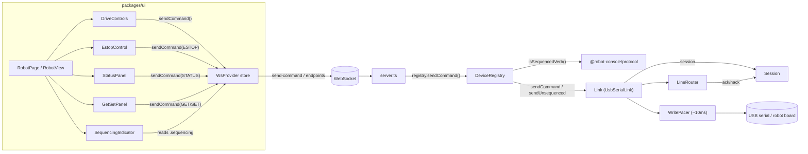

<!-- CLASI: Before changing code or making plans, review the SE process in CLAUDE.md -->

# Sprint 006: Robot page: drive and control over USB

## Goals

Build the robot page's drive-and-control surface against USB — the one
transport where verification is cheap — so sprint 7 can reuse it
**unchanged** once relay/radio transport exists. This is arc position 6
of the 8-sprint roadmap recorded in
`robot-console-two-level-ui-and-multi-transport-roadmap.md` (linked
above), which itself corrects a boundary error in
`docs/design/specification.md` §7: the original plan bundled the
transports (`RelayRadioLink`, `MbrelayLink`, mDNS) together with the
control surface (drive/stop/estop/`STATUS`/`GET`/`SET`) into one
sprint. **That boundary is wrong**, and this sprint exists specifically
to correct it.

Under the two-level UI those two halves land on different pages with
different dependencies: the robot page's control surface needs only
USB and the device-type/endpoint model sprint 4 introduces, while the
transport half needs mDNS, a registry client, and a relay on a bench.
Bundled, the control surface cannot ship until the transports work,
which — given the current state of hardware and the `pxt-nezha-diffdrive`
release pipeline (see the dependency risk below) — could stall
indefinitely. Split, the drive surface is designed and verified once
against USB, and sprint 7 reuses it as-is against relay/radio
transport.

**Stated design constraint, because it is the entire payoff of this
split:** `RobotView` must never know what transport it sits on. The
stakeholder's requirement that a relay-connected robot "shows the same
page as a directly connected robot" is only cheap to satisfy in sprint
7 if the component built here has no USB-specific assumptions baked
into its rendering or interaction logic — only into the `Link` it is
handed. If this sprint accidentally couples the UI to USB specifics
(e.g. assuming synchronous local latency, or reaching past the `Link`
abstraction), sprint 7 inherits a rewrite instead of a reuse.

Concretely, this sprint gives the robot page: drive controls, an
always-reachable e-stop, `STATUS`/`GET`/`SET`, and visible
sequence/ack/nack state — by finally wiring the UI to
`packages/protocol/src/v6/session.ts`, the reliability/sequencing layer
that has been unit-tested since sprint 1 but has never yet driven a
UI.

## Problem

`deviceRegistry.ts` currently uses **none** of what `UsbSerialLink`
already exposes for reliable, sequenced communication — `sendCommand`
(sequenced), `sendUnsequenced`, `checkLiveness`, `onAckNack`, and
`session` itself. It only ever calls `sendLine`. There is a fully
built, fully tested session/sequencing layer
(`packages/protocol/src/v6/session.ts`, covering
`SEQUENCED_VERBS` — the eleven id-bearing verbs including `RUN` —
retransmit, and the `nack N` → `seq = N-1` arithmetic) sitting unused
behind a UI that has no drive controls, no e-stop, and no visibility
into ack/nack/sequence state at all.

Layered on top of that gap are several protocol subtleties the UI must
respect and that a naive implementation would get wrong:

- **`HELLO` is a reset, not a health check.** It resets the robot's
  sequence state to 1, and `Session.sendUnsequenced()` already refuses
  the verb outright for this reason. Liveness must be checked with
  `STATUS` or `PING`, never `HELLO`.
- **Nothing is unsolicited** except the boot banner, subscribed
  telemetry, and `DBG:` lines. An idle link is completely silent, so
  the UI cannot treat absence of traffic as evidence of a dead robot.
- **Writing flat out at 115200 overruns the board.** Frames must be
  paced at roughly 10ms apart, enforced host-side — not left to
  whatever rate the UI happens to send commands.
- Radio (sprint 7) is fire-and-forget with no retransmit and a hard
  frame cap. USB does not yet enforce that cap, but messages should
  stay small now so the control surface does not need reshaping when
  sprint 7 attaches it to radio.

## Solution

Attach `Session` to the robot page via the three wiring points
`UsbSerialLink` already demonstrates — this is integration work, not
new protocol design. The session/reliability layer
(`packages/protocol/src/v6/session.ts`) and the wire codec
(`packages/protocol/src/v6/codec.ts`: `encodeLine`/`decodeLine`,
`MAX_LINE_BYTES = 240`, `classifyLine`) are built and tested; this
sprint is where a UI first consumes them.

- **Drive controls** — a `RobotView` that sends drive commands through
  `UsbSerialLink.sendCommand` (sequenced), so every drive command
  participates in the same ack/nack/retransmit discipline as any other
  sequenced verb, with no bespoke path.
- **E-stop as an always-reachable, first-class affordance** — not a
  menu item or a corner button, but treated as a safety control from
  the start of the design: reachable regardless of what else is on
  screen, and understood by the UI as making a real safety claim (see
  Success Criteria).
- **`STATUS`, `GET`/`SET`** — surfaced through the same sequenced path,
  giving the operator visibility into robot state and configuration
  without introducing a second communication mechanism alongside
  `Session`.
- **Sequence/ack/nack state made visible in the UI** — expose what
  `session.ts` already tracks (current sequence, outstanding
  acks/nacks, retransmit activity) rather than hiding it, so a stuck
  or misbehaving link is diagnosable from the page instead of being
  silent.
- **Write pacing at ~10ms, enforced host-side** — in the host process
  (alongside or reusing `UsbSerialLink`'s existing pacing plumbing),
  not left to the browser or to however fast the UI emits commands.
- **Transport-blindness as a build discipline, not just a stated goal**
  — `RobotView` receives a `Link`-shaped dependency and renders off
  `Session`'s state; it must not import or branch on anything
  USB-specific. This is what makes the sprint-7 reuse "unchanged"
  claim checkable rather than aspirational.

## Success Criteria

- Drive commands, `STATUS`, and `GET`/`SET` all flow through
  `Session`'s sequenced path over USB, with sequence/ack/nack state
  visible in the UI.
- E-stop is reachable from the robot page regardless of other UI
  state.
- Host-side pacing holds writes to ~10ms apart under sustained input
  (e.g. held drive controls), verified by test against a fake link.
- **The full session/reliability contract is test-provable against a
  fake link**: the `nack N → seq = N-1` arithmetic, retransmit reusing
  its original id (byte-identical originals only), the 240-byte cap,
  lowercase-unknown-verb silent drop, pacing enforcement, and `HELLO`
  never being used as a liveness probe on a live session.
- **E-stop is a safety claim. It must not be marked verified against a
  fake link.** A fake link can prove the UI sends the correct
  sequenced e-stop command at the correct time; it cannot prove a
  robot actually stops. That claim is verified only against real
  hardware, and the sprint's verification section must say so
  explicitly rather than let a passing test suite imply a safety
  property it did not test.
- Drive commands moving a real robot, and e-stop actually stopping it,
  are recorded as hardware-deferred criteria, not checked off until
  exercised on a board.

## Scope

### In Scope

- Drive controls on the robot page.
- E-stop as an always-reachable, first-class affordance.
- `STATUS` and `GET`/`SET`, surfaced through the sequenced session
  path.
- Sequence/ack/nack state made visible in the UI.
- Host-side write pacing at ~10ms.
- Wiring `deviceRegistry.ts`/the robot page to the `Session` and
  `UsbSerialLink` capabilities that already exist
  (`sendCommand`, `sendUnsequenced`, `checkLiveness`, `onAckNack`,
  `session`) but are not yet used by anything.

### Out of Scope

- Any new transport: `RelayRadioLink`, `MbrelayLink`, `MbserialLink`,
  mDNS discovery, the registry client — all sprint 7.
- Telemetry decoding and charts — sprint 8.
- Calibration wizards — sprint 10.
- The relay's robot dropdown — sprint 7.

## Dependencies and risk

Depends on **sprint 4** (device model, robot page shell — provides the
type union and page this sprint's controls render into). Independent
of sprints 5 (persistence) and 7 (relay/radio/discovery) — this sprint
does not need the roster and produces nothing sprint 7 needs beyond
the `RobotView` component itself.

**Robot-hex sourcing must be resolved before this sprint is
detail-planned.** `League-Robotics/pxt-nezha-diffdrive` publishes
**zero** GitHub releases, so there is no obtainable robot hex through
the normal release path — the local-hex picker introduced in sprint 4
is the only currently-known route onto a board. Two robots (`vevov`,
`gopiv`) are reachable on the network and answer `FUNCS`, but only over
mDNS/WiFi, not USB, so they do not by themselves satisfy this sprint's
USB premise. This is recorded as an open question in
`docs/design/specification.md` §9 and is the most consequential
unresolved item blocking this sprint, sprint 7, sprint 8, and sprint
10.

**A USB-attached board cannot currently even be classified as a
robot.** Per `clasi/issues/flash-succeeds-but-board-never-announces.md`,
no board currently announces after a flash. That gap must be resolved
before this sprint's success criteria — which depend on identifying
and driving a real robot over USB — can be verified at all, hardware
availability aside.

## Test Strategy

Split test-provable from hardware-deferred, per the convention sprints
1–5 already established, and never check off a criterion that was not
actually exercised.

**Test-provable (fake `Link`, no hardware):**
- Verb classification and dispatch: a sequenced verb (`WHEELS_V`,
  `STOP`, `GET`, `SET`) reaches `Link.sendCommand`; an unsequenced verb
  (`STATUS`, `PING`, `ESTOP`) reaches `Link.sendUnsequenced`; `HELLO`
  sent as a command is rejected as an error and never reaches `Session`
  at all.
- `sequencing` (seq/pendingCount/lastDone/lastDoneReason) updates in
  the endpoint snapshot after a send and after each ack/nack, and
  self-heals correctly for a client that connects mid-sequence.
- The full session/reliability contract already covered by
  `session.test.ts`/`LineRouter.test.ts` (nack arithmetic, retransmit
  reusing its original id, the 240-byte cap, unknown-verb drop) is
  exercised end-to-end through this sprint's new command path, not
  just at the unit level it already had.
- Host-side pacing holds ~10ms under a burst of drive commands (a fake
  scheduler recording call timing), simulating a held drive control.
- E-stop: the UI sends the correct unsequenced `ESTOP` line at the
  correct time (button press) — this proves the UI's behavior, not
  that a robot stops (see below).
- UI rendering: sequencing indicator, drive controls, STATUS/GET/SET
  panels, and the e-stop control against a fake `WsProvider` socket —
  no dependency on a real host or board.
- `RobotPage`'s component tree contains no reference to `usb`,
  `UsbSerialLink`, or `transport` — the transport-blindness discipline
  is itself a checked property, not just a stated intention.

**Needs hardware:**
- The bench conversion itself (ticket 001): a robot hex actually
  flashes and the board reidentifies as `classification.type ===
  "robot"`.
- Drive commands actually moving the converted robot.
- **E-stop actually stopping the robot** — a safety claim a fake link
  cannot prove; recorded as hardware-deferred, not checked off by the
  fake-link test above.
- `STATUS`/`GET`/`SET` returning real, sensible values from firmware
  (as opposed to the UI merely sending the right line, which the
  fake-link tests already cover).

Commands: `npm test` (607 passing at time of writing), `npm run build`.

## Architecture

**Substantial** — this sprint adds a new UI→robot command channel that
touches four-plus modules across two packages (`wsMessages.ts`,
`link/Link.ts`, `deviceRegistry.ts`, `server.ts` on the host;
`WsProvider.tsx` and a new `RobotPage`/`RobotView` component tree on
the UI), introduces a new cross-module dependency (the UI's command
actions depend on `DeviceRegistry`'s new command-routing method, which
depends on `Session`), and extends the `Link` interface's public
contract — every future transport (sprint 7's `RelayRadioLink`/
`MbrelayLink`) must satisfy the extended shape. No data-model change
(no persistence touched); the substantial tier is earned by the
module count and the new cross-module/interface dependency, not by
volume of code.

### Architecture Overview

**Responsibilities this sprint introduces or changes:**

1. **Wire contract for structured commands** (`wsMessages.ts`) — today
   the only client→host verb-sending path is `LineMessage` (`type:
   "line"`), a raw, unstructured string with no sequencing at all
   (`DeviceRegistry.sendLine` calls `link.sendLine`, bypassing
   `Session` entirely). This sprint adds a second, structured
   client→host message that names a verb and fields and lets the host
   decide how to dispatch it.
2. **Verb classification and dispatch** (`deviceRegistry.ts`) — given a
   verb, decide whether it is one of the 11 sequenced verbs
   (`@robot-console/protocol`'s `isSequencedVerb`) and route to
   `Link.sendCommand` or `Link.sendUnsequenced` accordingly, with
   `HELLO` rejected outright (never forwarded to `Session` — see
   Design Rationale).
3. **Sequencing-state visibility** (`link/Link.ts`, `deviceRegistry.ts`,
   `wsMessages.ts`) — read `Session`'s `seq`/`pendingCount`/`lastDone`/
   `lastDoneReason` and mirror them into every endpoint snapshot so a
   stuck or misbehaving link is diagnosable from the page.
4. **Robot page presentation** (`packages/ui/src/pages/RobotPage.tsx`
   and new child components) — drive controls, an always-reachable
   e-stop, `STATUS`/`GET`/`SET` panels, and a sequencing indicator,
   replacing sprint 4's placeholder shell. Every one of these renders
   off `WsProvider` state and issues `WsProvider` actions only — no
   reference to `UsbSerialLink`, `usb`, or `transport` anywhere in this
   tree (the sprint's stated transport-blindness constraint, made into
   a checked property per the Test Strategy above).
5. **Bench conversion** (hardware, ticket 001) — not a code module, but
   a load-bearing precondition: without a robot-classified endpoint on
   the bench, criteria 2–4 above have nothing real to drive against
   until the very end of the sprint.

**Modules, purpose, and boundary:**

| Module | Purpose (one sentence, no "and") | Boundary | Serves |
|---|---|---|---|
| `wsMessages.ts` | Defines the one client→host structured-command message and the sequencing-state projection on the endpoint snapshot | No dispatch logic — pure types plus the existing `parseClientMessage` validator, unchanged discipline from sprint 4 | SUC-001–004 |
| `link/Link.ts` | Declares the transport-agnostic `Link` surface, now including a `session` accessor | No transport-specific behavior — an interface, implemented identically in shape by every transport | SUC-001, 003, 004 |
| `deviceRegistry.ts` | Orchestrates which `Link` method a command reaches and mirrors `Session` state into snapshots | No verb-arity or protocol knowledge of its own — delegates classification to `@robot-console/protocol`, exactly as it already delegates naming/banner-parsing/framing | SUC-001, 002, 003, 004 |
| `server.ts` | Forwards the new client message to `DeviceRegistry` | No logic beyond routing on `type` — unchanged "composition only" contract | SUC-001–004 |
| `WsProvider.tsx` | Exposes a `sendCommand` action and the `sequencing` slice of an endpoint | No verb classification — the host is the single source of truth for sequenced-vs-unsequenced | SUC-001–004 |
| `RobotPage`/`RobotView` + children (`DriveControls`, `EstopControl`, `StatusPanel`, `GetSetPanel`, `SequencingIndicator`) | Renders the robot control surface off `WsProvider` state | No transport awareness; no direct socket access outside `WsProvider`'s hooks/actions | SUC-001–004 |

**Component/module diagram** — required: this sprint introduces a new
cross-module dependency (UI command actions → `DeviceRegistry`'s
command routing → `Session`) and touches 4+ modules.

Dependency direction is unchanged from sprint 4: UI (presentation) →
`WsProvider`/`server.ts` (transport) → `DeviceRegistry` (orchestration)
→ `Link` (infrastructure) → `Session`/codec (pure domain logic, no
I/O). No cycle is introduced — `Session` still has zero outward
dependencies, and `RobotPage` still depends only on `WsProvider`, never
the reverse.

**What Changed:**
- `wsMessages.ts`: new `SendCommandMessage` in `ClientMessage`; new
  `sequencing` field on `EndpointListEntry`.
- `link/Link.ts`: new `session: Session` accessor required on every
  `Link` implementation (already satisfied by `UsbSerialLink`; test
  doubles need updating — see Migration Concerns).
- `deviceRegistry.ts`: new `sendCommand(endpointId, verb, fields)`
  method; ack/nack subscription per open session feeding the
  `sequencing` projection; `toEntry()` extended.
- `server.ts`: one new `switch` case forwarding `send-command`.
- `WsProvider.tsx`: new `sendCommand` action (and, if useful, a thin
  `useSequencing(endpointId)` selector wrapping `useEndpoint`).
- `RobotPage.tsx`: replaced from sprint 4's placeholder shell with the
  real control surface; `DeviceConsole` stays embedded, unchanged.

**Why:** the session/reliability layer (`v6/session.ts`) has been
built and unit-tested since sprint 1 but has never driven a UI —
`deviceRegistry.ts` only ever calls `sendLine`, bypassing sequencing
entirely. This sprint is the integration work that finally attaches a
UI to it, per `sprint.md`'s own Solution section.

**Impact on Existing Components:** additive everywhere except
`link/Link.ts`'s interface, which changes shape (see Migration
Concerns). `DeviceConsole`/the raw console path (`sendLine`) is
untouched — it remains the unsequenced, no-discipline raw-text path
it always was, now living alongside the new sequenced path rather than
being replaced by it (a raw line is still useful for ad hoc
exploration). `EndpointsMessage`'s full-snapshot, self-healing property
is preserved: `sequencing` is carried in the same snapshot, not a
side-channel a reconnecting client could miss.

### Design Rationale

**Decision: one generic `send-command` message, not one message type
per verb.**
- *Context:* `RobotPage` needs to send several distinct verbs
  (`WHEELS_V`, `STOP`, `ESTOP`, `STATUS`, `GET`, `SET`), with more
  possible later (`PING`).
- *Alternatives considered:* (a) one message carrying `verb` + `fields`
  as data, with the host deciding sequenced-vs-unsequenced dispatch;
  (b) a dedicated message type per verb (`DriveMessage`,
  `EstopMessage`, ...).
- *Why (a):* mirrors `v6/codec.ts`'s own "no per-verb table" discipline
  — the wire-framing layer holds no verb knowledge, and this sprint's
  message layer shouldn't either. Verb classification
  (`isSequencedVerb`) already lives in exactly one place
  (`@robot-console/protocol`); duplicating it into a per-verb message
  union in `wsMessages.ts` would create a second place that could
  drift from it. Adding a firmware verb later (e.g. once `MOVE_V` gains
  a real implementation) costs nothing in the wire contract under (a).
- *Consequences:* the UI can send any verb string, including an
  illegal or unimplemented one — `encodeLine`'s `CodecError` and
  `Session`'s `SessionError` (and the firmware's own `err <code>`
  reply) are the only gates, not a TypeScript union. Accepted: this is
  no less safe than today's `DeviceConsole` raw-line path, which has
  zero verb safety at all, and strictly more disciplined (every send
  still goes through `Session`'s sequencing).

**Decision: sequencing state is a snapshot field, not an event
stream.**
- *Context:* need to expose `seq`/`pendingCount`/`lastDone`/
  `lastDoneReason` in the UI.
- *Alternatives considered:* (a) mirror into the existing full-snapshot
  `EndpointsMessage`, updated via `emitDevices()` on every ack/nack;
  (b) a new per-event message (an ack/nack delta stream) alongside the
  snapshot.
- *Why (a):* preserves `EndpointsMessage`'s documented invariant —
  "always a full snapshot, never a delta, so a client that missed an
  update self-heals on the next one" (`wsMessages.ts`'s own module doc
  comment). A reconnecting client (or one that just mounted
  `RobotPage`) sees current `seq`/`pendingCount` immediately, with no
  separate discovery step. An event stream would reintroduce exactly
  the "a client that missed an update never resyncs" failure this
  project has already designed `EndpointsMessage` to avoid.
- *Consequences:* no fine-grained log of every individual ack/nack
  transition (a rapid ack-then-nack pair could coalesce between two
  snapshots into one visible change) — acceptable for "diagnosable from
  the page," not an audit trail. If a future sprint wants a visible
  ack/nack log, the existing per-endpoint console log
  (`logsByEndpoint`) is the natural place, not a new mechanism.

**Decision: `Link` gains a `session: Session` accessor on the
interface, not just on `UsbSerialLink`.**
- *Context:* `DeviceRegistry` needs a transport-agnostic way to read
  live sequencing state for the snapshot.
- *Alternatives considered:* (a) add `session` to the `Link` interface
  itself; (b) keep it `UsbSerialLink`-only and have `DeviceRegistry`
  special-case it (e.g. an `instanceof` check).
- *Why (a):* (b) is exactly the USB-specific branching this sprint's
  own stated constraint forbids in the UI, and the same discipline
  applies host-side: `DeviceRegistry` must not need to know which
  concrete `Link` it holds. Every transport already owns exactly one
  `Session` per the roadmap issue's "one resource → one key → one
  queue → one session" invariant, so promoting the accessor to the
  interface costs nothing today and removes a redesign sprint 7 would
  otherwise have to do when `RelayRadioLink`/`MbrelayLink` arrive.
- *Consequences:* every `Link` implementation must expose a `Session`
  (already true architecturally). Existing `FakeLink` test doubles
  (`deviceRegistry.test.ts`, and any in `UsbSerialLink.test.ts`) need a
  real `Session` instance added to satisfy the interface — mechanical,
  scoped into ticket 003, not a new defect.

**Decision: e-stop is its own ticket, not folded into the general
command-panel ticket.**
- *Context:* `sprint.md` frames e-stop as a first-class safety
  affordance from the start of the design, not an incidental control.
- *Why:* isolates its acceptance criteria (always-reachable layout,
  unsequenced dispatch, the explicit "not hardware-verified" callout)
  so it can be reviewed as a safety-critical path on its own, rather
  than as one bullet among drive/STATUS/GET-SET bullets.
- *Consequences:* one more ticket than the strict minimum; judged
  worth it given the safety framing.

**Decision: drive controls target `WHEELS_V` only this sprint.**
- *Context:* per `vendor/radio-robot-lib/docs/design/motion-api.md`,
  `DiffDriveAdapter` — the only concrete `Adapter` this project's
  firmware ships — has no planner and answers `WHEELS_X`/`MOVE_X`/
  `MOVE_V`/`GO_TO_R`/`GO_TO_W` with an unknown-command error; only
  `WHEELS_V left right duration` (velocity, with `duration` as a
  lease, not a persistent command) is actually implemented, alongside
  `STOP`/`STOP now` and `ESTOP`.
- *Why:* building drive UI for verbs the firmware cannot execute would
  ship controls that always error — not a real capability, and not
  something a fake-link test would catch (a fake link happily "accepts"
  any verb).
- *Consequences:* because `duration` is a lease, a held drive control
  must re-issue `WHEELS_V` periodically while held (bounded by
  `duration`) and send `STOP` on release, rather than sending one
  command and assuming the robot keeps moving — a client-side timer
  discipline ticket 005 must implement explicitly, distinct from (and
  layered on top of) the host's own ~10ms write pacing.

### Migration Concerns

No data migration (no persistence layer touched this sprint).
Deployment is a single local process (host + UI ship together), so the
old-client/new-host or new-client/old-host skew this section usually
covers is largely theoretical here — but the contract is additive
either way: an old UI talking to a new host simply never sends
`send-command` and never reads `sequencing`; a new UI talking to an old
host would receive snapshots with `sequencing` absent, which
`applySnapshot`'s existing "guard against an absent field" pattern
(already used for `firmwareStatus`/`rememberedRobots`) extends to
without modification.

The one non-additive change is `link/Link.ts`'s `session: Session`
addition to the interface — a compile-time-only break (TypeScript),
not a runtime/wire concern. `UsbSerialLink` already satisfies it (it
has exposed `.session` since sprint 4); the only real work is updating
test doubles (ticket 003).

**Open Questions:**
1. `GET`/`SET` field names/semantics are not enumerated anywhere in
   this firmware library by design (`protocol.md`: "No config field
   table lives in this library"). This sprint's `GetSetPanel` is
   therefore necessarily a free-text name/value form, not a dropdown
   of known fields. Confirm with the stakeholder whether specific
   fields (e.g. calibration constants) should get named presets now,
   or stay deferred to sprint 10's calibration wizards.
2. Whether a manual `PING` (liveness) button belongs on `RobotPage`
   this sprint. Not requested by `sprint.md`, but the sequencing
   indicator showing "no traffic for N seconds" might want one.
   Recommend deferring unless the stakeholder asks for it.
3. Which of the three bench boards ticket 001 converts, and what its
   five-letter name ends up being, needs recording in that ticket once
   executed, so tickets 003/005/006's hardware-deferred verification
   steps reference the same known board rather than "whichever one is
   plugged in."

## Use Cases

Substantial tier — full use cases, all under the existing **UC-003 —
Drive a robot over USB** (`docs/design/usecases.md`), which this
sprint is what actually implements; no new parent use case is needed.
The bench-conversion step (ticket 001) implements the already-existing
**UC-002 — Install firmware on a blank micro:bit**, applied to one
specific bench board, and needs no new SUC of its own.

### SUC-001: Drive a robot with sequenced commands over USB
Parent: UC-003

- **Actor**: Student
- **Preconditions**: The endpoint is classified `robot` (ticket 001's
  converted bench board) with an open session.
- **Main Flow**:
  1. Student presses a drive control (e.g. a directional button) on
     `RobotPage`.
  2. The UI sends `WHEELS_V <left> <right> <duration>` via
     `WsActions.sendCommand`, re-issued periodically while held (per
     the lease-duration discipline in Design Rationale).
  3. The host's `DeviceRegistry` recognizes `WHEELS_V` as sequenced,
     assigns it an id via `Session.send`, and paces the write ~10ms
     after the previous one.
  4. The robot's `ack`/`nack` reply updates `Session` state; the
     updated `seq`/`pendingCount` reach the UI on the next endpoint
     snapshot.
  5. Student releases the control; the UI sends `STOP`.
- **Postconditions**: The robot moves as commanded (hardware-deferred);
  the UI's sequencing state accurately reflects what the robot has
  acknowledged.
- **Acceptance Criteria**:
  - [ ] `WHEELS_V`/`STOP` sent from `RobotPage` reach `Link.sendCommand`
        (sequenced), verified against a fake link.
  - [ ] A held drive control resends `WHEELS_V` before its `duration`
        lease expires, and sends `STOP` on release.
  - [ ] Writes stay paced ~10ms apart under sustained held input (fake
        scheduler).
  - [ ] **Hardware-deferred, not verified by the above:** a real,
        converted robot actually moves as commanded.

### SUC-002: Trigger e-stop as an always-reachable safety control
Parent: UC-003

- **Actor**: Student
- **Preconditions**: `RobotPage` is open for a `robot`-classified
  endpoint (session open or not — the control is reachable regardless,
  per Success Criteria).
- **Main Flow**:
  1. Student activates the e-stop control from anywhere on
     `RobotPage`, regardless of what other panel or dialog is open.
  2. The UI sends unsequenced `ESTOP` via `WsActions.sendCommand`
     (never through the sequenced path — `ESTOP` is outside the
     sequence entirely per protocol.md).
  3. The robot replies bare `estop` (no id).
- **Postconditions**: The UI has sent the stop command immediately,
  with no dependency on pending sequenced traffic.
- **Acceptance Criteria**:
  - [ ] The e-stop control is reachable without navigating away from
        or closing any other panel/state on `RobotPage`.
  - [ ] Activating it sends unsequenced `ESTOP` (fake-link test proves
        the UI sends the right command at the right time).
  - [ ] **This is a safety claim. It is NOT verified against a fake
        link.** A real robot actually stopping is recorded as
        hardware-deferred and is not checked off by the fake-link test
        above.

### SUC-003: View live sequencing state on the robot page
Parent: UC-003

- **Actor**: Student
- **Preconditions**: `RobotPage` open for a `robot`-classified
  endpoint.
- **Main Flow**:
  1. Student sends one or more sequenced commands (drive, `GET`/`SET`).
  2. `RobotPage`'s sequencing indicator shows current `seq`,
     `pendingCount`, `lastDone`, and `lastDoneReason`, sourced from the
     endpoint snapshot's `sequencing` field.
  3. If a `nack` occurs, the indicator reflects the corrected `seq`
     (`N - 1`, never `N`) and any retransmit activity.
- **Postconditions**: A stuck or misbehaving link is diagnosable from
  the page without opening the raw console.
- **Acceptance Criteria**:
  - [ ] `sequencing` updates in the snapshot after a send and after
        each ack/nack (fake link).
  - [ ] A reconnecting client's next snapshot already carries current
        `sequencing` — no separate event needed to resync.
  - [ ] The nack arithmetic displayed matches `Session`'s own
        (`seq = N - 1`), not a UI-side re-derivation.

### SUC-004: Query and set robot state via STATUS and GET/SET
Parent: UC-003

- **Actor**: Student
- **Preconditions**: `RobotPage` open for a `robot`-classified
  endpoint with an open session.
- **Main Flow**:
  1. Student requests `STATUS` from `StatusPanel`; the UI sends
     unsequenced `STATUS` (per protocol.md, `STATUS` does not carry an
     id) and the reply is visible on the page.
  2. Student enters a field name in `GetSetPanel` and requests `GET`;
     the UI sends sequenced `GET <name>` (or bare `GET` for every
     field) via `Link.sendCommand`.
  3. Student enters a name and value and requests `SET`; the UI sends
     sequenced `SET <name> <value>`.
- **Postconditions**: The operator can inspect and adjust robot state
  without leaving `RobotPage` or using the raw console.
- **Acceptance Criteria**:
  - [ ] `STATUS` reaches `Link.sendUnsequenced`, never
        `Link.sendCommand` (fake-link test pins this classification).
  - [ ] `GET`/`SET` reach `Link.sendCommand` (sequenced), with an id
        assigned by `Session`.
  - [ ] An unknown `GET`/`SET` field name's `err` reply is shown to the
        operator, not silently dropped.
  - [ ] **Hardware-deferred:** `STATUS`/`GET`/`SET` returning real,
        sensible firmware values (as opposed to the UI sending the
        correct line, which the fake-link tests above already cover).

## GitHub Issues

(GitHub issues linked to this sprint's tickets. Format: `owner/repo#N`.)

## Definition of Ready

Before tickets can be created, all of the following must be true:

- [ ] Sprint planning document is complete (sprint.md, including its
      Architecture and Use Cases sections)
- [ ] Architecture review passed (or skipped, for changes with no
      architectural impact)
- [ ] Stakeholder has approved the sprint plan

## Tickets

| # | Title | Depends On |
|---|-------|------------|
| 001 | Convert a bench relay to a robot via local-hex flash | — |
| 002 | Freeze the send-command wire contract | — |
| 003 | Host: route commands through Session and surface sequencing state | 002 |
| 004 | UI: WsProvider command action and sequencing selector | 002 |
| 005 | RobotPage: drive controls, STATUS, and GET/SET panels | 003, 004 |
| 006 | RobotPage: always-reachable e-stop control | 003, 004 |

Tickets execute serially in the order listed. Ticket 001 is listed
first (per the roadmap's own sequencing instruction) so a real robot
exists on the bench before any later ticket's hardware-deferred
verification steps are exercised, even though tickets 002–004 have no
code dependency on it.
