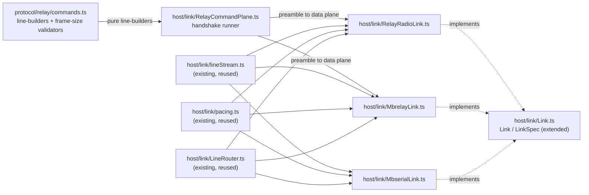

<!-- CLASI: Before changing code or making plans, review the SE process in CLAUDE.md -->

# Sprint 007: Relay page, radio transport, network discovery

## Goals

**This is a large sprint — arc position 7 of the 8-sprint roadmap** in
`robot-console-two-level-ui-and-multi-transport-roadmap.md` (linked
above). Its goal: make a relay — local over USB, or remote over the
network — a way to reach a robot, such that **that robot renders the
same `RobotView` page as a directly-connected robot** (the page sprint
6 builds, reused unchanged). The relay page has exactly two states:
connected to a robot, or not. It carries a dropdown of known robot
names (fed by sprint 5's roster) and, by default, tries the first
robot it finds, preferring one that answers, and falls over to the
next if it doesn't.

Concretely this sprint delivers three transports sharing one
command-plane preamble, mDNS browse infrastructure for two service
types, a read-only registry client, and the relay page itself with its
connected/not-connected states and failover behavior.

Depends on sprint 4 (resource-key model, `Link` abstraction, endpoint
model), sprint 5 (the roster that feeds the dropdown), and sprint 6
(the `RobotView` page this sprint reaches into — must stay
transport-blind for the reuse to hold).

## Problem

A relay sits between the console and a robot with **no in-band escape
route**: once the command-plane preamble (`!ECHO OFF`, `!MODE RAW250`,
`!CG <ch> <grp>`, `!P 7`, `!GO`) hands off to the data plane, a break
cannot be sent over TCP at all, and even locally the only way back to
the command plane is a reset. That is why the `Link` abstraction
(sprint 4) deliberately has **no `retarget()`** — switching the
dropdown's robot must be close-session → new `LinkSpec` → open-session,
never an in-place retarget.

Three findings from live-network verification this session change the
design from what the original spec assumed:

1. **The mbrelay registry lookup is a write, not a read.**
   `httpapi.py:146` returns `registry.resolve(name)`, and `resolve()`
   derives the address locally on a miss, writes it into `_learned`,
   calls `save()`, and returns HTTP 200 with `source: derived`. So "the
   HTTP call succeeded" does not mean "the registry knew" — treating
   success as authority would present a locally-derivable guess as
   fact, exactly the failure UC-004 exists to prevent. And because a
   lookup *enrolls* the name, prefetching for the dropdown would inject
   an entry per student per robot into shared classroom state.
   `registry.py` has a non-mutating `get()` the HTTP route doesn't use;
   this sprint's client stays read-only regardless (no `POST`/`DELETE`
   — the API has no auth).

2. **Registry discovery is itself an mDNS lookup, not a port
   convention.** Verified live: `_mbrelay._tcp` advertises instance
   `torture` at `torture.local.:8760` with TXT
   `txtvers=1 version=0.20260831.1 node=torture registry=8761` — the
   registry port travels in the TXT record. `_mbserial._tcp` advertises
   bare five-letter instance names (`vevov`, `gopiv`) directly.

3. **Failover is a heuristic against a silent link, not a clean
   yes/no.** Radio is fire-and-forget with no retransmit, and nothing
   on an idle link is unsolicited — so one unanswered probe does not
   prove a robot is absent. Compounding this, four independent failure
   modes present **identically as silence**: wrong channel/group; the
   robot build having `BOOT_RADIO_LINK = false` (the default — a stock
   build does not answer the radio at all); a misconfigured relay; or
   the robot simply being off. Diagnosability has to be budgeted for
   deliberately or the bench session is unbounded.

## Solution

**Transports and shared preamble.** `RelayRadioLink` (local USB relay),
`MbrelayLink` (TCP to `_mbrelay._tcp`, **must set `TCP_NODELAY`** — the
command-plane handshake is latency-sensitive line-at-a-time traffic),
and `MbserialLink` (TCP to `_mbserial._tcp`). All three share the
command-plane preamble and a small state machine, extracted as pure,
I/O-free line-builders in `packages/protocol/src/relay/commands.ts` per
sprint 4's plan — unit-testable with zero I/O, and not reimplemented
per-transport. `!CG` rejection must leave the relay in the command
plane and `!GO` must never hang un-timed-out if it doesn't confirm.
Radio frames are capped (≤16 bytes MAKECODE, ≤247 bytes RAW250) —
oversized frames are refused, never silently fragmented. The `<`
line-prefix stripping `LineReassembler` already does unconditionally
applies here too.

**Discovery.** mDNS browse for `_mbrelay._tcp` and `_mbserial._tcp`.
Registry discovery rides the same browse: the registry's host and port
come out of the `_mbrelay._tcp` TXT record (`registry=<port>`), not a
fixed convention, so "registry unreachable" includes "no relay
advertising on the LAN at all."

**Registry client** (`packages/host/src/mbrelayRegistry.ts`,
`resolveRobotAddress(name, opts) → ResolvedAddress`, never throws).
**Three outcomes, not two**: `config`/`registry` (authoritative);
`derived` (registry replied but only echoed back our own derivation —
surfaced as prominently as a fallback, because the failure mode it
represents is identical to one); `local-derived` (registry unreachable
entirely). Resolution is **lazy, at connect time, for one name only** —
never prefetched for the dropdown. Read-only against the registry
(`get()`, no `POST`/`DELETE`). Short client-side timeout (~1.5s;
mbrelay's own client uses 3s, too long to block a click) and a short
TTL cache so a re-click doesn't re-trigger a registry write.

**Fallback disclosure, tuned against alarm fatigue.** For a local USB
relay there is usually no mbrelay daemon at all, so `local-derived` is
the *normal* classroom path, not an exceptional one — the indicator
will be lit most of the time. A persistent inline chip (e.g. `Address:
ch 37 / grp 3 · derived (no registry)`) is styled **neutrally** when no
registry was ever configured, and as a **warning** only when a registry
was configured and either failed or answered `derived`. The chip must
never be silent (spec §6, UC-004), but silence and alarm fatigue are
both failure modes here — the design has to avoid both.

**Failover.** "Try the first robot, prefer one that answers, try the
next if not" is implemented as a liveness probe using `STATUS` or
`PING` — **never `HELLO`, which resets the sequence** — with explicit
retries and a timeout, because one unanswered probe doesn't prove
absence on a fire-and-forget link. "Gave up on X, trying Y" is surfaced
visibly, not swallowed. Given the four silence-alike failure modes
above, the page keeps the fallback-in-use flag, the current `(channel,
group)`, and the failover trail on screen at all times — this is a
diagnosability requirement, not a nice-to-have.

**Relay page.** Two states only: connected to a robot, or not. A
dropdown of known robot names (sprint 5's roster). When connected, it
renders sprint 6's `RobotView` unchanged. When not connected, there is
little to do beyond setting a manual channel/group.

**Resource keying.** A relay's `resourceKey` **is** the relay's
`usb-<serial>` (sprint 4's model) — driving through the relay and
flashing the relay are mutually exclusive through the existing
`KeyedMutex`, with no new mechanism needed.

## Success Criteria

- All three transports (`RelayRadioLink`, `MbrelayLink`, `MbserialLink`)
  share one command-plane implementation with zero duplicated preamble
  or nack-arithmetic logic.
- The registry client's three outcomes (`config`/`registry`, `derived`,
  `local-derived`) are test-provable against an injected fetch
  function, including that a lookup is never issued speculatively for
  the dropdown.
- The relay page never silently hides a fallback: the address-source
  chip is visible in both its neutral (no registry) and warning
  (registry configured but not authoritative) states.
- Failover visibly reports "gave up on X, trying Y" and never uses
  `HELLO` as a liveness probe.
- Frame-size refusal (>16 bytes MAKECODE, >247 bytes RAW250) and `!CG`
  rejection / `!GO` timeout handling are test-provable against a fake
  link.
- **Hardware-deferred, not checked off until exercised on a bench**:
  that a real relay actually bridges radio traffic to a real robot;
  that failover against a live, partially-silent classroom of robots
  behaves as designed; that `TCP_NODELAY` measurably fixes any latency
  problem it's meant to address. `BOOT_RADIO_LINK` must be confirmed
  true on whatever hex is used for bench verification **before** the
  bench session, not discovered during it.

## Scope

**Narrowed at detail-planning time — see "Split decision" below.** This
sprint (007) now delivers only concern (a) from the roadmap plan's
three-way breakdown: the three link transports and their shared
command-plane preamble. Concerns (b) (mDNS discovery + registry
client) and (c) (the relay page UI itself, dropdown, failover,
disclosure chip) move to the newly inserted **sprint 008 — "Relay
discovery, registry, and connection"**. The Goals/Problem/Solution
sections above still describe the full arc-position-7 problem (binding
design constraints for both 007 and 008); this Scope section states
what 007 itself actually delivers.

### In Scope

- `packages/protocol/src/relay/commands.ts` — the relay command-plane
  preamble as pure, zero-I/O line-builders (`!ECHO OFF`, `!MODE
  RAW250`, `!CG <ch> <grp>`, `!P 7`, `!GO`, liveness probe via
  `PING`/`STATUS`, never `HELLO`) plus the MAKECODE (≤16 byte) / RAW250
  (≤247 byte) frame-size validators.
- A shared, transport-agnostic command-plane runner
  (`packages/host/src/link/RelayCommandPlane.ts`) that drives the
  preamble over any paced-write/line-subscribe pair, with `!CG`
  rejection and an un-timed-out `!GO` both handled explicitly.
- `RelayRadioLink` — local USB relay transport, composing the
  command-plane runner plus the existing `lineStream`/`pacing`/
  `LineRouter` pieces exactly as `UsbSerialLink` does.
- `MbrelayLink` — TCP relay transport reusing the same command-plane
  runner over a TCP socket instead of a local serial port; **sets
  `TCP_NODELAY`**.
- `MbserialLink` — TCP transport to a single robot's serial port
  exposed via `_mbserial._tcp` (mbdeploy `serve`); **no command
  plane** — structurally parallel to `UsbSerialLink` over TCP instead
  of a local port (see Architecture, Design Rationale).
- `LinkSpec`/`EndpointTransport` extension (`Link.ts`, `wsMessages.ts`)
  to admit the three new transport variants as pure data shapes.
  Populating a spec's `resourceKey`/host/port/name/channel/group
  values from a discovered service or a chosen robot name is sprint
  008's job — this sprint only defines the shapes.

### Out of Scope

- mDNS browse for `_mbrelay._tcp`/`_mbserial._tcp`, the registry
  client, the relay page's connected/not-connected UI, the dropdown,
  liveness-probe failover, and the address-source disclosure chip —
  **moved to sprint 008** (see Split decision below).
- `WifiUdpLink` and `_robotlink._*` discovery — sprint 10.
- Telemetry — sprint 9.
- Calibration wizards — sprint 11.
- Any change to `RobotView`/`RobotPage` itself — reused unchanged;
  this sprint doesn't even reach `deviceRegistry.ts` or the UI, so
  there is nothing here that could touch it.

## Dependencies and risk

Depends on sprint 4 (the `Link`/`LinkSpec` abstraction and endpoint
model this sprint extends). Does **not** depend on sprint 5 or sprint
6 — this sprint never touches `deviceRegistry.ts`, the roster, or any
UI, so the roster/`RobotPage` dependencies the original roadmap plan
named belong to sprint 008, which composes this sprint's transports
into the live endpoint model.

## Split decision (detail-planning time)

The roadmap plan's own "Dependencies and risk" section anticipated
this: it named three separable concerns — (a) transports + command
plane, (b) mDNS + registry client, (c) the relay page UI — flagged (a)
as "the natural first slice regardless of split," and said if the
combined ticket count proved unwieldy, split along the (b)/(c) seam
rather than by transport.

Working through the ticket decomposition at detail-planning time
produced 4 tickets for (a) and 7 for (b)+(c) — 11 total, matching or
exceeding sprint 004's 9-ticket keystone sprint, which was explicitly
justified as uniquely large (the sprint the stakeholder directly asked
for, the model every later sprint depends on). Nothing here carries
that same "must land as one atomic unit" justification: (a) is
independently test-provable with zero I/O and has no dependency on
(b)/(c) at all (it doesn't touch `deviceRegistry.ts` or the roster);
(b)+(c) depend on (a) but are themselves one coherent arc — "make a
named robot reachable and drivable through a relay" — that doesn't
naturally split further (the roadmap plan itself only offered the
(a)/(b)+(c) or (a)/(b)/(c) options, and a standalone 2-ticket sprint
for (b) alone would carry disproportionate process overhead for its
size relative to folding it into (c), which it feeds directly).

**Decision: split along the (a) / (b)+(c) seam.** Sprint 007 keeps
concern (a) only (4 tickets, below). A new sprint, inserted
immediately after 007 via `insert_sprint`, takes concerns (b) and (c)
(7 tickets) — see `clasi/sprints/008-relay-discovery-registry-and-connection/sprint.md`.
Inserting shifted the rest of the arc: telemetry-and-trace 008→009,
WiFi-robots 009→010, calibration-wizards 010→011.

## Test Strategy

Every success criterion in this sprint is provable in CI against fakes
— **there is no hardware-deferred criterion in sprint 007 at all**.
This is a direct consequence of the split: connecting these transports
into the live `DeviceRegistry`/UI, where a human could actually attempt
a bench run, is sprint 008's job, not this one's. `commands.ts` is
pure and zero-I/O (fake scheduler for timeout-bounded steps, no fake
transport needed at all). `RelayRadioLink` is tested against the same
kind of synthetic `SerialPortLike` fake `UsbSerialLink.test.ts` already
uses (see `link/UsbSerialLink.ts`'s own testing note). `MbrelayLink`/
`MbserialLink` are tested against a synthetic TCP socket fake with the
same shape discipline (an injectable `createSocket`-style seam,
mirroring `UsbSerialLink`'s injectable `createPort`). Frame-size
refusal, `!CG` rejection, and `!GO`-never-hangs are all tested directly
against `commands.ts`'s pure functions plus the command-plane runner
under a fake scheduler — no real relay or robot needed for any of it.
`npm test` and `npm run build` must both pass throughout.

## Architecture

**Substantial** — narrowed by the split above to concern (a), this
sprint still introduces a new package-level module family (5+ new
files across `packages/protocol` and `packages/host/src/link`), a new
cross-module dependency (`RelayRadioLink`/`MbrelayLink` depend on the
new `RelayCommandPlane` runner, which depends on `protocol/relay/
commands.ts`), and extends the `Link`/`LinkSpec` interfaces every
future transport (and sprint 008's endpoint synthesis) must satisfy.
No data-model change (no persistence touched) and no UI at all — the
substantial tier is earned by module count and the new cross-module/
interface dependency, exactly as sprint 006 was, not by code volume.

### Step 1 — Understand the problem

Every transport in this system reduces to "a paced, banner-aware
stream of newline-delimited protocol-v6 lines" (specification.md §4.3)
— that is what makes `RobotPage` transport-blind and reusable
unchanged (sprint 006's own checked property). `UsbSerialLink` is the
only implementation that exists today. Two of the three new transports
this sprint adds (`RelayRadioLink`, `MbrelayLink`) sit *behind* an
extra layer `UsbSerialLink` never had to deal with: a relay's
command-plane preamble (`!ECHO OFF`, `!MODE RAW250`, `!CG <ch> <grp>`,
`!P 7`, `!GO`) that must succeed before the data plane — the ordinary
v6 line stream — begins. The third (`MbserialLink`) has no such layer:
`_mbserial._tcp` (mbdeploy `serve`) exposes one specific robot's serial
port directly over TCP, so it is structurally `UsbSerialLink` with a
TCP socket in place of a local port, nothing more. Conflating these
two shapes — as if every "relay-ish" transport needed the command
plane — would be a design mistake this sprint exists to avoid making.

### Step 2 — Responsibilities

1. **Building command-plane wire lines and validating frame size** —
   pure, no I/O; changes only when the relay's own command grammar or
   the MAKECODE/RAW250 size limits change.
2. **Driving the command-plane handshake to the data plane over an
   arbitrary paced-write/line-subscribe pair** — orchestration only
   (no knowledge of *which* transport it's running over); changes only
   when the handshake's sequencing/timeout behavior changes.
3. **Owning one physical relay transport's lifecycle** (local USB or
   remote TCP) — composing the command-plane runner (responsibility 2)
   plus the existing transport-agnostic pieces (`lineStream.ts`,
   `pacing.ts`, `LineRouter.ts`); changes when *how this specific
   transport talks* changes.
4. **Owning one direct-to-robot TCP transport's lifecycle** — no
   command plane, otherwise identical in shape to `UsbSerialLink`;
   changes independently of the relay-command-plane transports (it has
   none of that logic to share).
5. **Declaring the transport-agnostic `Link`/`LinkSpec` surface** —
   changes only when the shape every transport must satisfy changes,
   never when one transport's internals change.

These are independent axes: (1) never needs to know about pacing,
sockets, or serial ports; (2) never needs to know whether it's driving
a local serial port or a TCP socket; (3) and (4) never need to know
about each other; (5) never needs to know how any concrete transport
implements the shape it declares.

### Step 3 — Subsystems and modules

| Module | Purpose (one sentence) | Boundary | Serves |
|---|---|---|---|
| `packages/protocol/src/relay/commands.ts` (new) | Build relay command-plane wire lines and validate radio frame size. | Pure functions/types only — no I/O, no sockets, no timers; the module named (and deliberately left uncreated) in sprint 004's own Design Rationale. | SUC-001, 002, 003 |
| `packages/host/src/link/RelayCommandPlane.ts` (new) | Drive the command-plane handshake (preamble → data plane) over an injected paced-write/line-subscribe pair. | No knowledge of *which* transport supplies the write/subscribe pair — a plain orchestrator over `commands.ts`'s pure line-builders, composed by both relay transports rather than duplicated. | SUC-001, 003 |
| `packages/host/src/link/RelayRadioLink.ts` (new) | Implement `Link` for a local USB relay. | Composes `RelayCommandPlane` + `lineStream`/`pacing`/`LineRouter`, exactly as `UsbSerialLink` composes the latter three; no command-grammar knowledge of its own. | SUC-001, 002, 003, 006 |
| `packages/host/src/link/MbrelayLink.ts` (new) | Implement `Link` for a TCP-connected remote relay. | Same composition as `RelayRadioLink`, socket instead of serial port, `TCP_NODELAY` set at connect. | SUC-004, 006 |
| `packages/host/src/link/MbserialLink.ts` (new) | Implement `Link` for a TCP-connected robot exposed directly via mbdeploy `serve`. | Composes `lineStream`/`pacing`/`LineRouter` only — no `RelayCommandPlane`, no command-plane grammar at all (see Design Rationale). | SUC-005 |
| `packages/host/src/link/Link.ts` (extended) | Declare the `LinkSpec` variants for the three new transports. | Pure data shapes only, mirroring `UsbLinkSpec`'s existing discipline — no policy about how a spec's fields get populated (sprint 008's job). | SUC-001, 004, 005 |
| `packages/host/src/wsMessages.ts` (extended) | Extend `EndpointTransport` to admit the three new values. | Type-only change, per this module's existing "no logic of its own" contract — already anticipated in the module's own doc comment ("remote transports... arrive in sprint 7"). | SUC-001, 004, 005 |

Every module addresses at least one SUC; no module has more than one
reason to change; dependency direction is unchanged from sprint 004/006
(`ui` → `host` → `protocol`, `protocol` with no outward dependencies) —
this sprint adds depth within `host`/`protocol`, not a new direction.

### Step 4 — Diagrams

**Component diagram** (required — 5+ new modules, new cross-module
dependency):

No entity-relationship diagram — no persisted data in this sprint. No
separate dependency-direction diagram beyond the component diagram
above: every new edge is within `packages/host`/`packages/protocol`,
the existing `host → protocol` direction is unchanged, and there is no
cycle (`commands.ts` has no outward dependencies; `RelayCommandPlane`
depends only on it; the three transports depend on `RelayCommandPlane`
and the existing transport-agnostic pieces, never on each other).

### Step 5 — What changed / Why / Impact / Migration concerns

**What changed:**

- New `packages/protocol/src/relay/commands.ts`: pure line-builders for
  `!ECHO OFF`, `!MODE RAW250`, `!CG <ch> <grp>`, `!P 7`, `!GO`, `?`,
  and the liveness pair (`PING`/`STATUS`, with `HELLO` excluded by
  construction — there is no builder for it in this module); frame-size
  validators for MAKECODE (≤16 bytes) and RAW250 (≤247 bytes) that
  return a refusal rather than truncating or fragmenting.
- New `packages/host/src/link/RelayCommandPlane.ts`: given an injected
  paced-write function and a line-subscribe function, runs the preamble
  in order, treats a `!CG` rejection as a handshake failure (never
  silently proceeding to `!GO`), and bounds the `!GO` confirmation wait
  with an explicit timeout — it cannot hang un-timed-out by
  construction, per the sprint-wide constraint.
- New `RelayRadioLink.ts`, `MbrelayLink.ts`, `MbserialLink.ts`, each
  implementing `Link` per `link/Link.ts`'s existing `connect()`/
  `identify()` contract — `connect()` for the two relay transports also
  runs the command-plane handshake (a handshake failure is a
  `connect()` rejection, a genuine transport-level failure in this
  contract's terms — see Design Rationale); `identify()` behaves
  identically to `UsbSerialLink`'s for all three, since by the time
  `identify()` runs, every transport is just a v6 line stream.
- `link/Link.ts` extended: `LinkSpec` gains `RelayLinkSpec`,
  `MbrelayLinkSpec`, `MbserialLinkSpec` variants (pure data, mirroring
  `UsbLinkSpec`'s shape exactly — `transport`, `resourceKey`, plus
  whatever host/port/channel/group fields that transport needs);
  `LinkFactory` dispatches on `spec.transport`.
- `wsMessages.ts`: `EndpointTransport` extended from `"usb"` to
  `"usb" | "relay-radio" | "mbrelay" | "mbserial"` — type-only, no
  behavior change (nothing in `packages/host`/`packages/ui` constructs
  one of the new values yet; that is sprint 008's job).

**Why:** see Step 1 — extracting the command-plane preamble into pure,
zero-I/O line-builders (sprint 004's own Design Rationale named this
module and deliberately deferred it) is what lets `RelayRadioLink` and
`MbrelayLink` share one handshake implementation instead of each
re-deriving the `!CG`/`!GO` sequencing and its failure handling
independently — exactly the risk `LineRouter.ts` already generalized
away for ack/nack handling in sprint 004.

**Impact on Existing Components:** additive only. `UsbSerialLink.ts`,
`lineStream.ts`, `pacing.ts`, and `LineRouter.ts` are unchanged —
reused by the three new transports exactly as documented, not
modified. `deviceRegistry.ts`, `server.ts`, and every UI component are
untouched by this sprint; nothing here constructs a `RelayLinkSpec`/
`MbrelayLinkSpec`/`MbserialLinkSpec` or drives one of the new
transports end-to-end — that composition is sprint 008's entire
subject.

**Migration Concerns:** None. No persisted data, no wire-message
behavior change reachable from the UI this sprint (the `EndpointTransport`
union extension is inert until sprint 008 produces a value other than
`"usb"`), and no deployment-sequencing concern (host and UI ship
together, as always).

### Step 6 — Design Rationale

| Decision | Context | Alternatives considered | Why this choice | Consequences |
|---|---|---|---|---|
| `MbserialLink` has no command plane | `_mbserial._tcp` exposes one robot's serial port directly (mbdeploy `serve`), unlike `_mbrelay._tcp`'s pooled radio relay | Route `MbserialLink` through `RelayCommandPlane` too, for "consistency" across all three new transports | Nothing about mbdeploy `serve` speaks the relay's `!CG`/`!GO` grammar — the robot on the other end answers `HELLO` directly, exactly like a local `UsbSerialLink` would. Running it through the command-plane runner would send commands a plain robot doesn't understand and could break bare `identify()` | `MbserialLink`'s implementation is intentionally much smaller than `RelayRadioLink`/`MbrelayLink`'s — this asymmetry is a correct reflection of the underlying protocol difference, not an inconsistency to "fix" |
| A shared `RelayCommandPlane` runner, not preamble logic duplicated in `RelayRadioLink` and `MbrelayLink` | Two transports need the identical `!ECHO OFF → !MODE RAW250 → !CG → !P → !GO` sequence, one over serial, one over TCP | Inline the handshake in each transport class | Mirrors `LineRouter.ts`'s own precedent (sprint 004: "four transports must not each reimplement the nack arithmetic") — the same reasoning applies to the command-plane handshake's own risk surface (`!CG` rejection, `!GO` timeout) | One more small module, but `RelayRadioLink`/`MbrelayLink` differ only in what they inject (serial write/subscribe vs. TCP write/subscribe), never in handshake logic itself |
| A relay's command-plane handshake failure surfaces as a `connect()` rejection, not a `null` `identify()` | `Link.connect()`/`identify()` already distinguish "transport failed outright" (throws) from "transport healthy, nothing answering" (`identify()` resolves `null`, never throws) | Treat a `!CG` rejection as an `identify()`-time `null`, matching "nothing answered" semantics | A `!CG` rejection means the relay itself refused to move to the data plane — there is no data plane to run `identify()`'s `HELLO`/banner exchange over yet. That is categorically the "transport-level failure" `connect()` already owns, not the "connected but silent" state `identify()` owns | Callers (sprint 008) see a `connect()` rejection carrying a message about *why* the handshake failed, and can retry `connect()` from scratch — there is no partially-open relay state to reason about |
| Frame-size limits enforced as pure validators in `commands.ts`, called before every write, not left to a wire-level truncation | The radio is fire-and-forget with no retransmit; a silently truncated or fragmented frame would be indistinguishable from data corruption | Truncate an oversized payload; split it across multiple frames | Neither truncation nor fragmentation is supported by the radio protocol itself (specification.md §6) — refusing the write outright is the only correct behavior, and doing it in `commands.ts` means every transport gets it for free rather than each needing its own check | A caller that constructs an oversized command sees a synchronous refusal (a thrown/returned error) before any write is attempted, not a silent malformed frame on the wire |
| `Link`/`LinkSpec` extended now (this sprint) rather than deferred again to sprint 008 | Sprint 004 deliberately deferred `relay/commands.ts` itself as "speculative generality" (no consumer existed yet) | Defer `LinkSpec`'s extension to sprint 008 too, alongside the endpoint-synthesis wiring that actually populates it | Unlike sprint 004's deferral, this sprint *is* the consumer — `RelayRadioLink`/`MbrelayLink`/`MbserialLink` cannot exist without a `LinkSpec` variant to be constructed from, so extending the interface here is not speculative, it is this sprint's own deliverable | Sprint 008 extends `LinkSpec`'s *population* (discovered host/port, resolved channel/group) but does not need to touch its *shape* — one less thing that sprint has to redesign |

### Step 7 — Open Questions

- Whether `MbserialLink` should also set `TCP_NODELAY`. The roadmap
  plan and this sprint's constraints only require it for `MbrelayLink`
  (the command-plane handshake is latency-sensitive line-at-a-time
  traffic); `MbserialLink` has no handshake phase, so the case for it
  is weaker. Left unset by default this sprint; sprint 008's bench
  ticket can revisit if remote-mbserial latency turns out to matter in
  practice.
- The exact `resourceKey` values `RelayLinkSpec`/`MbrelayLinkSpec`/
  `MbserialLinkSpec` end up populated with (the relay's own
  `usb-<serial>` for `RelayLinkSpec`; some TCP-endpoint-derived key for
  the two remote variants) are sprint 008's decision to make when it
  wires discovery and endpoint synthesis — this sprint's `LinkSpec`
  variants only require the field to exist, per `UsbLinkSpec`'s
  existing pattern, and take no position on what populates it.

## Use Cases

Substantial tier, full treatment. Every SUC below is provable entirely
against fakes (see Test Strategy) — this sprint carries no
hardware-deferred criterion.

### SUC-001: A local USB relay transport reaches the data plane through the command-plane preamble
Parent: UC-004 (Drive a robot over the radio relay)

- **Actor**: `RelayRadioLink`, on behalf of the host.
- **Preconditions**: A local USB relay is connected; a `RelayLinkSpec`
  with a channel/group has been constructed.
- **Main Flow**:
  1. `connect()` opens the local serial port (mirrors `UsbSerialLink`).
  2. `RelayCommandPlane` runs `!ECHO OFF` → `!MODE RAW250` → `!CG <ch>
     <grp>` → `!P 7` → `!GO`, over the paced write/line-subscribe pair
     `RelayRadioLink` supplies.
  3. Once `!GO` confirms, the transport is in the data plane —
     ordinary v6 lines flow exactly as over USB.
  4. `identify()` sends `HELLO` and reads the banner reply, same
     contract as every other `Link`.
- **Postconditions**: A `RelayRadioLink` in the data plane is
  indistinguishable, from the line-stream contract's point of view,
  from a directly-attached `UsbSerialLink`.
- **Acceptance Criteria**:
  - [ ] The full preamble sequence is sent, in order, against a fake
        serial port, and `!GO` confirmation transitions the link to a
        state where ordinary line traffic (including a fake `HELLO`
        reply) is routed normally.
  - [ ] `identify()` behaves identically to `UsbSerialLink.identify()`
        once the data plane is reached (same fake-based test technique).

### SUC-002: Oversized frames are refused, never fragmented
Parent: UC-004 (error flow: frame-size limit)

- **Actor**: Any caller constructing a command through
  `relay/commands.ts`.
- **Preconditions**: A payload exceeds the mode's frame cap (16 bytes
  MAKECODE, 247 bytes RAW250).
- **Main Flow**:
  1. The caller attempts to build a command line exceeding the active
     mode's cap.
  2. The frame-size validator refuses it synchronously, before any
     write is attempted.
- **Postconditions**: No oversized frame ever reaches a transport's
  write path.
- **Acceptance Criteria**:
  - [ ] A payload one byte over each mode's cap is refused; a payload
        exactly at the cap succeeds (boundary-tested both modes).
  - [ ] The refusal is a returned/thrown value the caller can act on,
        not a silent drop.

### SUC-003: A `!CG` rejection or an unconfirmed `!GO` never hangs the relay
Parent: UC-004 (error flow: command-plane failure)

- **Actor**: `RelayCommandPlane`.
- **Preconditions**: The relay replies to `!CG <ch> <grp>` with a
  rejection, or never replies to `!GO` at all.
- **Main Flow (rejection)**:
  1. `!CG` is sent; the relay's reply is recognized as a rejection.
  2. `RelayCommandPlane` reports handshake failure without sending
     `!GO` — the relay is left in the command plane, not a partial
     data-plane state.
- **Main Flow (unconfirmed `!GO`)**:
  1. `!GO` is sent; no confirmation arrives within the runner's
     explicit timeout.
  2. `RelayCommandPlane` reports a timeout failure rather than waiting
     indefinitely.
- **Postconditions**: In both cases, `connect()` on the owning
  transport rejects with a diagnosable message (see Design Rationale);
  the caller can retry `connect()` from scratch.
- **Acceptance Criteria**:
  - [ ] A fake relay that rejects `!CG` produces a `connect()` rejection
        with no `!GO` ever sent (assert on the fake's received-lines
        list).
  - [ ] A fake relay that never replies to `!GO` produces a `connect()`
        rejection once the runner's timeout (fake scheduler, no real
        wall-clock delay) elapses, not an unresolved promise.

### SUC-004: A remote mbrelay transport reaches the data plane over TCP
Parent: UC-004 (Drive a robot over the radio relay), UC-008 (Discover a remote relay over mDNS — transport half only; discovery itself is sprint 008)

- **Actor**: `MbrelayLink`.
- **Preconditions**: A `MbrelayLinkSpec` (host, port, channel, group)
  has been constructed (by a caller — sprint 008, or a test fixture
  this sprint).
- **Main Flow**:
  1. `connect()` opens a TCP socket to the given host/port and sets
     `TCP_NODELAY`.
  2. The same `RelayCommandPlane` handshake from SUC-001 runs over
     this socket instead of a serial port.
  3. Once in the data plane, `identify()` and ordinary line traffic
     behave identically to `RelayRadioLink`.
- **Postconditions**: `MbrelayLink` and `RelayRadioLink` are
  interchangeable from every caller's point of view once connected —
  only their `connect()`-time transport differs.
- **Acceptance Criteria**:
  - [ ] `TCP_NODELAY` is set on the fake socket immediately after
        connect, before any write.
  - [ ] The same command-plane and frame-size tests from SUC-001/002/003
        pass against `MbrelayLink` with a fake TCP socket, proving the
        shared `RelayCommandPlane` runner behaves identically across
        both transports.

### SUC-005: A remote mbserial transport exchanges lines directly with one robot, no command plane
Parent: UC-003 (Drive a robot over USB — same wire behavior, remote transport)

- **Actor**: `MbserialLink`.
- **Preconditions**: A `MbserialLinkSpec` (host, port) has been
  constructed, pointing at an `_mbserial._tcp`-advertised board.
- **Main Flow**:
  1. `connect()` opens a TCP socket to the given host/port — no
     preamble, no `RelayCommandPlane` involvement at all.
  2. `identify()` sends `HELLO` and reads the banner directly from the
     robot on the other end, exactly as `UsbSerialLink.identify()`
     does over a local port.
- **Postconditions**: `MbserialLink` behaves exactly like
  `UsbSerialLink` from the line-stream contract's point of view, with
  a TCP socket as its only structural difference.
- **Acceptance Criteria**:
  - [ ] A fake TCP socket standing in for a robot's serial-over-TCP
        stream round-trips `identify()`/`sendCommand()`/`sendUnsequenced()`
        with the same test technique `UsbSerialLink.test.ts` already
        uses, substituting the socket fake for the serial-port fake.
  - [ ] No line matching the relay command-plane grammar (`!CG`,
        `!MODE`, `!GO`, ...) is ever sent by this transport (a negative
        assertion against the fake's received-lines list).

### SUC-006: Liveness probing never uses `HELLO`
Parent: UC-004 (Drive a robot over the radio relay)

- **Actor**: `RelayRadioLink`/`MbrelayLink`, via `checkLiveness()`.
- **Preconditions**: A relay session is live (data plane reached).
- **Main Flow**:
  1. A caller invokes `checkLiveness()` on the link.
  2. The link sends `PING` (or the runner's equivalent unsequenced
     probe), never `HELLO` — `HELLO` would reset the session sequence
     mid-use, per `v6/session.ts`'s own established contract.
- **Postconditions**: A liveness check never disturbs an in-progress
  session's sequence state.
- **Acceptance Criteria**:
  - [ ] `checkLiveness()` on `RelayRadioLink`/`MbrelayLink` sends
        exactly the same `PING` line `UsbSerialLink.checkLiveness()`
        already sends (shared `Session.checkLiveness()` — no
        transport-specific liveness logic exists to test separately).
  - [ ] `relay/commands.ts` exposes no line-builder for `HELLO` as an
        ongoing liveness probe — only as part of the one-time
        `identify()` flow, mirroring `Session.sendUnsequenced`'s
        existing refusal.

## GitHub Issues

(GitHub issues linked to this sprint's tickets. Format: `owner/repo#N`.)

## Definition of Ready

Before tickets can be created, all of the following must be true:

- [ ] Sprint planning document is complete (sprint.md, including its
      Architecture and Use Cases sections)
- [ ] Architecture review passed (or skipped, for changes with no
      architectural impact)
- [ ] Stakeholder has approved the sprint plan

## Tickets

| # | Title | Depends On |
|---|-------|------------|
| 001 | Relay command-plane line-builders and frame-size validators (protocol/relay/commands.ts) | — |
| 002 | LinkSpec extension and RelayRadioLink (local USB relay transport) | 001 |
| 003 | MbrelayLink (remote TCP relay transport, TCP_NODELAY) | 002 |
| 004 | MbserialLink (direct-to-robot TCP transport, no command plane) | 002 |

Tickets execute serially in the order listed. 004 has no technical
dependency on 003 (neither depends on the other — see ticket 004's own
Implementation Plan) but is sequenced after it since it is listed
later.
