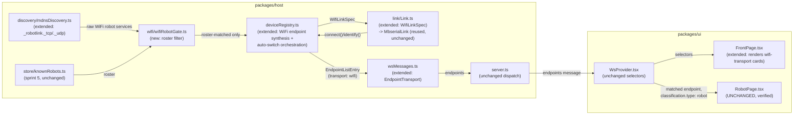

<!-- CLASI: Before changing code or making plans, review the SE process in CLAUDE.md -->

# Sprint 010: WiFi robots

## Goals

**Arc position 9 of the 10-sprint roadmap** in
`robot-console-two-level-ui-and-multi-transport-roadmap.md` (linked
above). Give a robot that already carries WiFi credentials — set by
some means outside this console — a way to be discovered on the LAN
and switched to automatically from radio, per UC-010. This sprint sits
here rather than after calibration because its blocker is a
**precondition** (provisioning happens outside the console, by design)
rather than a missing artifact, unlike calibration which is gated on a
hex that does not exist. It also reuses sprint 7's mDNS browse
infrastructure while that work is fresh.

Depends on sprint 5 (the remembered-robot roster that gates displayed
advertisements) and sprint 7 (mDNS browse infrastructure, the
`Link`/`LinkSpec` model a new transport plugs into).

## Problem

`docs/design/specification.md` §4.4 and UC-010 previously described a
WiFi discovery path that matches nothing a robot actually advertises.
Two robots, `vevov` and `gopiv`, were observed live on the network
while planning this arc, and their real advertisements corrected the
spec (sprint 3, ticket 004) in ways this sprint must build to rather
than rediscover:

- Both robots advertise under **both** `_robotlink._tcp` **and**
  `_robotlink._udp` simultaneously — not `._udp` alone.
- Resolving either service type yields host `<name>.local.`, port
  **7654**, and TXT `name=<name> role=robot link=v6 port=7654`.
- **The TXT record carries `link=v6`, not `link=v6-udp`.** A browse
  filtering on the old, wrong value matches nothing and looks
  indistinguishable from a network fault — this is the specific bug
  the spec correction exists to prevent from being reintroduced.
- The robot runs a **TCP server on the same port 7654**, so a TCP link
  is a legitimate alternative to `WifiUdpLink`, not a hypothetical.

Separately, the stakeholder was explicit that a classroom is full of
robots advertising over WiFi, radio, and mbdeploy all at once, and
**only robots this machine has previously seen over USB should ever
be displayed** as WiFi candidates. Sprint 5's roster exists precisely
to answer that question, and it was deliberately written so that only
a USB identify populates it — never an mDNS sighting — so that an
advertisement cannot enroll a robot and then pass its own filter. This
sprint is the first consumer of that guarantee for network discovery;
getting the gate wrong here (e.g. by displaying anything that
resolves) would silently defeat the roster's whole purpose.

`_mbserial._tcp` also advertises `vevov`/`gopiv` under bare five-letter
instance names — that is mbdeploy discovery, sprint 7's concern, not
this one. Conflating the two service families would put unrelated
peers in the same list.

## Solution

**Discovery.** `mdns.ts` browses **both** `_robotlink._tcp` and
`_robotlink._udp` (§4.4, corrected). A matching service record is
parsed for `name`, `role`, `link`, and `port` from its TXT fields;
records are matched to sprint 5's roster by `name` before being shown
anywhere — an advertisement for a name not in the roster is discarded
at the parsing/filtering boundary, not merely hidden in the UI, so
there is no code path that can leak an unrecognized robot into a
dropdown or a session. This is the **only** place in the whole arc
where discovery is gated: the relay dropdown (sprint 7) is
purely roster-driven with no discovery to filter, because a radio
robot advertises nothing at all. The two mechanisms must stay visibly
distinct in this sprint's design — conflating them puts the filter in
the wrong layer.

**Transport choice — UDP vs TCP, decided explicitly, not assumed.**
The specification names `WifiUdpLink` (UDP to :7654, bound locally to
:7655) as the transport in `packages/host/src/link/`, but the robot
serving the identical v6 line grammar over TCP on the same port makes
TCP a real alternative rather than a fallback of last resort. This
sprint's detail-planning must pick one as the implemented path and
record *why* rather than defaulting to UDP because the spec mentions
it first — the two have different failure characteristics (UDP: no
delivery guarantee, matches the radio robot's fire-and-forget model
the rest of the codebase is built around; TCP: ordered/reliable but a
new connection-management surface). Whichever is chosen, it reuses
sprint 4's `Link`/`LinkSpec` abstraction and resource-key model
unchanged — `WifiUdpLink`'s (or its TCP sibling's) `resourceKey` keys
on the **local bind port** (`udp-local-7655` or equivalent), not the
remote host, since only one socket can bind it locally.

**Auto-switch (UC-010).** When an advertised, roster-matched name
matches a robot currently connected over radio, the host opens the
WiFi link and switches the active session to it; the Devices/Console
surfaces reflect the robot as connected over WiFi rather than radio.
If no matching advertisement ever appears, the robot continues on
radio indefinitely — WiFi is opportunistic, never required, and the
absence of an advertisement must never be treated as an error.

**Provisioning stays out, by design, not by oversight.** §9 open
question 2 is unchanged: `kWifiSsid`/`kWifiPassword` are `constexpr`
empty strings rewritten in a deploy-time scratch copy by
`tools/make_deploy.py`, with no `SET` field and no `uBit.storage`
record backing them at runtime. There is no wire verb this sprint
could call to provision a robot, and patching a compiled hex is
fragile and explicitly not worth attempting. An unprovisioned robot
therefore never advertises `_robotlink._*` at all — this sprint simply
does not apply to it, and the console has no path to fix that. This is
a precondition gap, not a missing feature, which is exactly why this
sprint can be built now rather than waiting.

**Security note to carry into detail-planning, not to design around
now.** `WifiUdpLink` (or its TCP sibling) binds a LAN-reachable port in
a host process whose entire security posture today is
"localhost-only" — `server.ts` binds `127.0.0.1` deliberately for the
UI-facing WebSocket. The WiFi link's socket, by contrast, must be
reachable from the robot on the LAN, so it should bind a specific
interface where the platform allows it, and treat every inbound
datagram/segment as untrusted input. The v6 codec's existing discipline
of dropping foreign and malformed lines is the right existing defense
here — record that as the answer rather than inventing a second
validation layer.

## Success Criteria

- Browsing `_robotlink._tcp` and `_robotlink._udp` and parsing their
  TXT records (`name`, `role`, `link=v6`, `port=7654`) is correct
  against fixtures built from the live `vevov`/`gopiv` observations,
  for both service types.
- An advertised robot never seen over USB (absent from sprint 5's
  roster) never appears anywhere in the UI or is ever eligible for
  auto-switch — proven by a test asserting the negative, not just the
  positive case.
- An advertised, roster-matched name that matches a robot currently on
  radio triggers an automatic switch to WiFi, and the UI reflects the
  new transport.
- No advertisement present is a graceful no-op: the robot stays on
  radio, with no error surfaced.
- The chosen transport (UDP or TCP) is stated with its rationale in
  this sprint's Architecture section at detail time, not left implicit.
- **Hardware/network-deferred, not checked off until exercised live**:
  that a real provisioned robot on the LAN is actually reachable and
  controllable over the chosen WiFi transport. `vevov` and `gopiv` are
  available on the network right now, which is unusually favorable —
  but since this console cannot provision a robot itself, that
  availability is not guaranteed to persist through detail-planning or
  execution, and the sprint must not be blocked if it doesn't.

## Scope

### In Scope

- mDNS browse for `_robotlink._tcp` and `_robotlink._udp`.
- Service-record parsing for both service types (`name`, `role`,
  `link=v6`, `port=7654`).
- Gating displayed advertisements against sprint 5's remembered-robot
  roster (by `name`) before any advertisement is shown or acted on.
- A WiFi link to a discovered, roster-matched robot (UDP or TCP —
  decided explicitly at detail time; see Solution).
- Auto-switching a named robot from radio to WiFi when it appears
  (UC-010), with the Devices/Console tabs reflecting the new
  transport.
- Binding the WiFi link's local socket defensively (specific interface
  where possible) given it is LAN-reachable, unlike the rest of the
  host's localhost-only surface.

### Out of Scope

- **Provisioning.** §9 open question 2 is unchanged and
  stakeholder-gated — no `SET`/`uBit.storage` path exists in firmware,
  and patching a compiled hex is explicitly not worth doing. An
  unprovisioned robot is simply out of this sprint's reach.
- Relay and radio transports — sprint 7.
- Telemetry decoding over any transport — sprint 8.
- Calibration wizards — sprint 10.
- `_mbserial._tcp` discovery — that is mbdeploy, sprint 7's concern.

## Test Strategy

**Test-provable, and expected to be genuinely complete on its own**:
service-record parsing for both `_robotlink._tcp` and
`_robotlink._udp` against fixtures modeled on the live `vevov`/`gopiv`
TXT records; roster gating, including the negative case — an
advertised robot never seen over USB stays hidden and ineligible for
auto-switch, proven against an injected roster fixture; auto-switch
matching an advertised name to a currently-connected radio robot;
graceful no-op behavior when nothing advertises at all.

**Needs hardware/network, not test-provable**: an actual provisioned
robot answering on the chosen WiFi transport end-to-end. `vevov` and
`gopiv` are available now, which is unusually favorable for this arc,
but their continued presence is not guaranteed and the sprint must not
be planned as if it were.

## Architecture

**Substantial** — this sprint touches 5+ modules
(`discovery/mdnsDiscovery.ts`, a new `wifi/wifiRobotGate.ts`,
`deviceRegistry.ts`, `link/Link.ts`, `wsMessages.ts`, `FrontPage.tsx`)
and introduces a genuinely new cross-module dependency: a roster-gated
mDNS discovery feeding a **host-initiated, proactive** session switch
— nothing existing triggers a session open/close except a user action
or a physical USB attach/detach. No data-model change (nothing new is
persisted; sprint 5's roster is read, never written, by this sprint).
The substantial tier is earned by module count plus the new
"host decides to open/close a session with no client message in the
loop" behavior, matching sprint 008's own bar.

### Step 1 — Understand the problem

Sprint 007/008 gave the host mDNS discovery and a registry-backed
connection coordinator for *relay*-mediated robots, always reached
through an explicit, ambiguous, user-driven pick (a dropdown, with
failover across candidates because a name might resolve to more than
one address or answer on more than one relay). WiFi discovery is a
different shape entirely: `_robotlink._tcp`/`._udp`'s TXT record names
exactly one robot with exactly one address — no registry, no
ambiguity, no failover. What this sprint adds is not "one more
transport reached the same way sprint 008's transports are," but two
new things sprint 008 never needed: a **classroom-privacy gate**
(only a USB-seen robot may ever be shown or acted on) applied *before*
anything reaches the wire, and a **host-initiated** switch (UC-010's
actor is "the host, automatic" — the student observes, does not
click).

### Step 2 — Responsibilities

1. **Discovering WiFi-advertising robots on the LAN** — mDNS browse of
   `_robotlink._tcp`/`._udp`, TXT parsing (`name`, `role`, `link`,
   `port`). Changes only when the service types or their advertised
   shape change. No policy — mirrors `mdnsDiscovery.ts`'s existing
   `_mbrelay._tcp`/`_mbserial._tcp` boundary exactly.
2. **Gating a discovered WiFi robot against the roster** — a
   robot-by-robot decision, independent of *how* the result is later
   used (endpoint synthesis, auto-switch, or a future console
   diagnostic). Changes only when the gating policy itself changes.
3. **Turning a gated WiFi robot into a routable, connectable
   endpoint, and connecting it on request** — bookkeeping, mirroring
   `deviceRegistry.ts`'s existing attach-flow discipline (list
   immediately, connect asynchronously). Changes only when the
   endpoint/session model changes.
4. **Deciding when a currently radio-connected, roster-matched robot
   should be switched to WiFi, and executing that switch** —
   orchestration policy, the one genuinely new responsibility this
   sprint introduces. Changes only when the auto-switch policy itself
   changes, never when discovery or gating logic changes.
5. **Presenting a WiFi-reachable robot on the front page** — changes
   only when what the page shows changes.

These mirror sprint 008's own separation discipline: (1) never knows
what a caller does with a discovered service; (2) never knows whether
its result feeds an endpoint or an auto-switch decision; (3) never
re-derives gating policy, only consumes its result; (4) never
re-implements discovery or gating, only consumes both; (5) knows
nothing beyond `WsProvider`'s existing selectors, mirroring
`RobotPage`'s own transport-blindness.

### Step 3 — Subsystems and modules

| Module | Purpose (one sentence) | Boundary | Serves |
|---|---|---|---|
| `packages/host/src/discovery/mdnsDiscovery.ts` (extended) | Browse `_robotlink._tcp`/`_robotlink._udp` and expose parsed, typed WiFi-robot service records alongside the existing relay/mbserial lists. | No policy — pure browse + TXT parsing, same injectable-backend seam already established; a service on either type is deduplicated by name into one record (see Design Rationale). | SUC-001 |
| `packages/host/src/wifi/wifiRobotGate.ts` (new) | Filter a discovered WiFi-robot list down to only those whose name is in the roster. | Pure function, no I/O — takes `WifiRobotService[]` + `KnownRobotRecord[]`, returns the matched subset. No caller-side knowledge of what happens to the result. | SUC-002 |
| `deviceRegistry.ts` (extended) | Turn a gated WiFi robot into an `EndpointListEntry`, connect it on request, and decide/execute the radio-to-WiFi auto-switch. | Injects `mdnsDiscovery`'s WiFi list and `wifiRobotGate` as composed seams (mirroring `relayConnectionCoordinator`/`knownRobotsStore`); never forwards the ungated WiFi list anywhere wire-visible — see Design Rationale. | SUC-002, 003, 004 |
| `link/Link.ts` (extended) | Add a `WifiLinkSpec` (`transport: "wifi"`, `host`, `port`) to `LinkSpec`'s union, reusing `MbserialLink`'s implementation unchanged. | Pure data addition — no new `Link` implementation class. | SUC-003 |
| `wsMessages.ts` (extended) | `EndpointTransport` gains `"wifi"`. No new discovery-snapshot field — see Design Rationale for why the ungated WiFi list is deliberately never wire-exposed. | Types only, per this module's existing "no logic" contract. | SUC-003, 004, 005 |
| `FrontPage.tsx` (extended) | Render a WiFi-transport `EndpointListEntry` the same way any other endpoint card renders, distinguished only by its transport label. | Consumes `WsProvider` selectors only, same discipline `EndpointCard` already follows. | SUC-005 |
| `RobotPage.tsx` (verified, not modified) | Render drive/console/telemetry controls identically regardless of transport. | Unchanged — this sprint's own Success Criteria makes "renders unchanged for `transport: "wifi"`" a checked property via `RobotPage.transportBlind.test.ts`, not just a claim. | SUC-003, 005 |

Every module addresses at least one SUC. Dependency direction
unchanged (`ui` → `host` → `protocol`, no outward dependency from
`protocol`). No cycle: `mdnsDiscovery.ts` and `wifiRobotGate.ts` are
leaves `deviceRegistry.ts` depends on; nothing depends back on
`deviceRegistry.ts` from within this new module family.

### Step 4 — Diagrams

**Component diagram** (required — a new cross-module dependency
fans out from discovery through gating into two independent
consumers, endpoint synthesis and auto-switch):

No entity-relationship diagram: nothing this sprint persists (sprint
5's roster schema is read-only here, untouched). No separate
dependency-direction diagram — the component diagram above already
shows every new edge, including the one property worth calling out
explicitly: **the raw, ungated `MDNS` output has no edge to `WM` or
any UI-facing type.** Only `GATE`'s output ever reaches
`deviceRegistry.ts`'s wire-facing projection — see Design Rationale,
"No wire-visible ungated WiFi list."

### Step 5 — What changed / Why / Impact / Migration concerns

**What changed:**

- `discovery/mdnsDiscovery.ts`: browses `_robotlink._tcp` and
  `_robotlink._udp` in addition to the existing two service types,
  parses TXT (`name`, `role`, `link`, `port`) per the live-verified
  shape (§4.4, corrected), and exposes a new `WifiRobotService[]` on
  its snapshot. A robot advertising under both service types
  simultaneously (the verified norm — gopiv/vevov both do) is
  deduplicated by name into one record, since both resolve to the
  identical host/port/TXT triple and represent one connectable robot,
  not two.
- New `wifi/wifiRobotGate.ts`: `gateWifiRobots(discovered, roster) =>
  WifiRobotService[]`, a pure function returning only entries whose
  `name` is in the roster. No I/O, trivially unit-testable including
  the required negative case.
- `deviceRegistry.ts`: composes the gate's output into two behaviors:
  - **Endpoint synthesis** — a gated WiFi robot is listed immediately
    as an `EndpointListEntry` (`endpointId: wifi-<name>`,
    `resourceKey: wifi-<name>` — independent, mirroring
    `mbserialResourceKey`'s own rationale: a WiFi TCP socket shares no
    physical resource with anything else), `transport: "wifi"`,
    `sessionOpen: false`, exactly mirroring the USB attach flow's
    "list first, connect on request" shape. An ordinary
    `session-open { endpointId: "wifi-<name>" }` (no new wire message)
    connects it.
  - **Auto-switch** — on every discovery change, if a gated WiFi
    robot's name matches a currently-open `relay-radio`/`mbrelay`
    endpoint's robot name, the host opens the WiFi link; on success it
    closes the old radio-mediated endpoint entirely (never an in-place
    retarget — see Design Rationale). A failed WiFi connect attempt
    leaves the radio session untouched — auto-switch is opportunistic,
    never a regression risk to an already-working radio session.
- `link/Link.ts`: new `WifiLinkSpec { transport: "wifi"; host: string;
  port: number }` added to the `LinkSpec` union;
  `deviceRegistry.ts`'s `defaultLinkFactory` gains `case "wifi":
  return new MbserialLink(spec.host, spec.port)` — see Design
  Rationale, "TCP over UDP, reusing `MbserialLink`."
- `wsMessages.ts`: `EndpointTransport` gains `"wifi"`. No new
  discovery-snapshot field.
- `FrontPage.tsx`: no new component needed — `EndpointCard` already
  renders any `EndpointListEntry`; a `transport: "wifi"` entry needs
  only a label addition (e.g. "WiFi" instead of "USB"/"via relay"),
  since the card/link/navigation mechanism is already
  transport-generic (per that file's own module doc comment).

**Why:** see Step 1 — this sprint gives WiFi discovery its own,
narrower gate (unlike sprint 008's ungated relay/mbserial discovery)
and its own new orchestration behavior (host-initiated switching, which
nothing before this sprint needed).

**Impact on Existing Components:** additive everywhere.
`RobotPage.tsx` and every component it mounts are **not modified** —
checked by extending `RobotPage.transportBlind.test.ts`'s existing
render-describe block with a `transport: "wifi"` fixture, the same
technique sprint 008 used for `relay-radio`. `mdnsDiscovery.ts`'s
existing `_mbrelay._tcp`/`_mbserial._tcp` browsing, `RelayPage.tsx`,
and `RelayConnectionCoordinator.ts` are untouched — WiFi robots are
never reached through a relay page, per this sprint's own Scope.

**Migration Concerns:** None. No persisted data changes (the roster
schema and its contents are read-only from this sprint's
perspective). `EndpointTransport` gaining `"wifi"` is additive to an
already-open union; a client too old to know the value falls back to
whatever default rendering it already has for an unrecognized
transport string (mirrors `classifyBanner`'s own "unrecognized →
`unknown`, never a crash" discipline). One operational note, not a
migration: an ad's `down` event does **not** tear down an already-open
WiFi session — see Design Rationale, "An ad disappearing is not a
disconnect."

### Design Rationale

| Decision | Context | Alternatives considered | Why this choice | Consequences |
|---|---|---|---|---|
| **TCP over UDP, reusing `MbserialLink` unchanged, no new `Link` class** | The specification names `WifiUdpLink` first, but the robot verified live serves the identical v6 grammar over TCP on the same port 7654 | Build `WifiUdpLink` as specified: UDP to :7654, bound locally to :7655 | `MbserialLink` is *already* exactly this transport's shape — direct TCP to a robot's own serial-equivalent port, no command plane, no preamble, `connect()`/`identify()` split, `HELLO`-is-a-reset discipline all present and already tested. Zero new transport code is needed, only a new `LinkSpec` variant and one `defaultLinkFactory` case. UDP would require inventing packet-boundary handling with no precedent anywhere in this codebase, for no benefit on a local, low-latency LAN link where TCP's ordering guarantee is strictly better for the sequenced-verb model (`GET`/`SET`/`RUN`/... already assume in-order delivery) | The sprint's own security note (§ Problem/Solution) assumed `WifiUdpLink`'s local-bind-port-7655 model; that does not apply to an outbound-only TCP client connection — there is no new host-side listening socket at all, only the existing v6 line-decoding discipline (already relied on for the identical reason by `MbserialLink`) guarding an outbound connection to an untrusted robot. `docs/design/specification.md` §4.3/§9 should be corrected from `WifiUdpLink` to the TCP reuse described here (ticket documentation task) |
| No wire-visible ungated WiFi list (unlike sprint 008's `discoveredServices.relays`/`.robots`) | Sprint text: "an advertisement for a name not in the roster is discarded at the parsing/filtering boundary, not merely hidden in the UI" | Add `wifiRobots` to `DiscoveredServicesSnapshot`, mirroring `relays`/`robots`, and filter in the UI | Relay/mbserial discovery has no classroom-privacy concern (any relay/robot on the LAN is fair game to show). A WiFi robot is different: the stakeholder's explicit instruction is that an unrecognized robot must never reach any client, not merely be hidden by one well-behaved client. Keeping the raw `mdnsDiscovery.ts` output entirely off the wire — gated results only, projected as ordinary `EndpointListEntry` rows — makes "leak an unrecognized robot" a compile-time-checkable absence (no field carries it) rather than a UI-discipline promise | A future console/diagnostics need for "what's advertising but not gated in" would need its own explicitly-named, explicitly-reviewed wire field — not a byproduct of reusing this one |
| Auto-switch closes the old radio endpoint and opens a new, independently-identified WiFi endpoint — never an in-place retarget of the existing endpoint | UC-010 says "switches the active session"; the existing radio endpoint's id is `<relayEndpointId>-via-<name>`, structurally tied to the relay it came through | Reuse the existing endpoint id in place, swapping the underlying `Link`/`resourceKey` from the relay's shared key to `wifi-<name>` under the same id | No precedent anywhere in this codebase does an in-place transport swap on a live endpoint id — sprint 004's `Link` interface deliberately has no `retarget()`, and sprint 008 rejected in-place retargeting even for switching to a *different* robot on the same relay. An in-place id-preserving swap would need new resourceKey-migration logic with no existing pattern to extend, purely to avoid a page navigation the UI already has to handle correctly anyway (sprint 004: "if the open device is unplugged, render an inline disconnected state; do not auto-redirect") | The student's current `RobotPage` (if open on the old endpoint) shows the existing disconnected state exactly as an unplug would, while the new WiFi card appears on the front page like any newly-appeared endpoint — no new UI mechanism invented for this sprint specifically |
| An ad disappearing (`down` event) does not tear down an already-open WiFi session | mDNS is a liveness *advertisement*, not the connection itself; the connection's own health is what `MbserialLink`'s existing link-error handling already tracks | Close the WiFi session automatically when its advertisement disappears | Mirrors this codebase's existing "connected, unresponsive is a normal state, not an error" discipline (`deviceRegistry.ts`'s own attach-flow doc comment) — a transient mDNS drop (multicast hiccup, brief Wi-Fi noise) must not kill a working TCP session just because one advertisement cycle was missed. The actual socket's own `close`/`error` events are what already tear a session down for every other transport | A robot that goes fully offline stays listed with `sessionOpen: true` until its TCP socket actually errors/closes, exactly like a USB board that stops answering `HELLO` stays listed as "connected, unresponsive" rather than disappearing |
| `WIFICRED` provisioning affordance **deferred out of this sprint**, not built | Stakeholder asked for it only "if it fits cleanly" as a form on a USB-connected robot's page | Add a "Set WiFi" form to `RobotPage` (or a component it mounts), gated to render only when the robot is USB-connected | `RobotPage.transportBlind.test.ts` enforces, by source scan, that nothing `RobotPage` mounts may reference `endpoint.transport` or the literal string `"usb"` — a form that must render *only* for a USB-connected robot requires exactly the check the test forbids. There is no way to add this affordance inside `RobotPage`'s existing component family without either breaking that enforced invariant or showing the form unconditionally regardless of transport (which is actively wrong — sending `WIFICRED` through a relay or an already-WiFi session makes no sense). It does not fit cleanly, per the stakeholder's own stated condition | Filed as a follow-up issue (see report to team-lead) rather than a ticket in this sprint; `SEQUENCED_VERBS` gains no `WIFICRED` entry this sprint, since adding an allowlisted verb with no caller would itself be speculative generality |

### Open Questions

- Whether a WiFi robot that is *never* seen over USB but is somehow
  pre-provisioned (e.g., a future non-console provisioning tool) should
  ever be reachable. Out of scope per this sprint's roster-gating
  requirement — flagged only so a future sprint revisiting the gate
  does not treat it as an oversight.
- Where the deferred `WIFICRED` provisioning affordance should
  eventually live, given it cannot live inside `RobotPage`'s
  transport-blind component family — a dedicated USB-only page/section,
  or a front-page action on the device card itself, rather than a
  robot-page panel. For the follow-up issue to resolve, not this
  sprint.
- Whether `docs/design/specification.md` §4.3's `WifiUdpLink` entry
  should be renamed/rewritten in place or left as a superseded
  historical note alongside the TCP decision — a documentation-ticket
  judgment call, not an architectural one.

## Use Cases

Substantial tier, full treatment. Every SUC states which acceptance
criteria are fake-provable and which are hardware-deferred, mirroring
sprint 008's own convention — the bench ticket (SUC-006) carries every
hardware-only claim so no other ticket's criteria depend on real
hardware to close.

### SUC-001: Discover robots advertising over WiFi
Parent: UC-010 (Switch a robot from radio to WiFi)

- **Actor**: robot-console host (`discovery/mdnsDiscovery.ts`),
  automatic.
- **Preconditions**: The host is running; zero or more
  `_robotlink._tcp`/`_robotlink._udp` services are advertised on the
  LAN.
- **Main Flow**:
  1. The host browses both service types continuously, alongside the
     existing `_mbrelay._tcp`/`_mbserial._tcp` browsing.
  2. Each discovered service is parsed into a typed
     `WifiRobotService` record (`name`, `role`, `link`, `port`,
     `host`), deduplicated by name across the two service types.
- **Postconditions**: The host holds a live, updating list of
  advertised WiFi robots — never yet exposed to any client (see
  SUC-002).
- **Acceptance Criteria**:
  - [ ] (fake-provable) An injected mDNS-backend fake producing a
        `_robotlink._tcp` record with TXT `name=gopiv role=robot
        link=v6 port=7654` yields a parsed `WifiRobotService` with
        those exact fields — fixture modeled on the live gopiv
        observation.
  - [ ] (fake-provable) The identical fixture, advertised on
        `_robotlink._udp` instead, parses identically — proving the
        module does not silently prefer or require one service type.
  - [ ] (fake-provable) A robot advertising on both service types
        simultaneously (the verified norm) yields exactly one
        `WifiRobotService` record, not two.
  - [ ] (fake-provable) A TXT record carrying `link=v6-udp` (the
        earlier, wrong spec value) is treated as ordinary TXT data —
        no code path special-cases or rejects it, since `link=v6` is
        simply what is observed, not a value the parser branches on.
  - [ ] (hardware-deferred) A real robot's live WiFi advertisement is
        discovered end to end — deferred to SUC-006's bench ticket.

### SUC-002: Gate discovered WiFi robots against the roster
Parent: UC-010 (Switch a robot from radio to WiFi)

- **Actor**: `wifi/wifiRobotGate.ts`, on behalf of `deviceRegistry.ts`.
- **Preconditions**: SUC-001's discovery list and sprint 5's roster
  are both available.
- **Main Flow**:
  1. `gateWifiRobots(discovered, roster)` returns only entries whose
     `name` matches a roster record.
  2. `deviceRegistry.ts` never reads SUC-001's raw list directly for
     anything client-visible — only this function's output.
- **Postconditions**: No advertisement for a name outside the roster
  ever reaches `wsMessages.ts`, `WsProvider.tsx`, or any rendered
  page.
- **Acceptance Criteria**:
  - [ ] (fake-provable) A discovered robot whose name is in the roster
        passes the gate.
  - [ ] (fake-provable) **Negative case**: a discovered robot whose
        name is *not* in the roster is excluded from the gate's
        output, asserted directly against the gate function (not
        merely "not shown in a UI test").
  - [ ] (fake-provable) `deviceRegistry.snapshot()` never contains an
        `EndpointListEntry` for a WiFi-transport name absent from an
        injected roster fixture, even when that name is present in an
        injected raw discovery fixture — the end-to-end negative,
        asserted at the registry level, not just the gate function's
        own unit test.

### SUC-003: Connect to a WiFi-reachable robot from the front page
Parent: UC-010 (Switch a robot from radio to WiFi), UC-001 (Connect
and identify a device — the WiFi endpoint follows the same identify
contract), UC-003 (Drive a robot — reused unchanged via `RobotPage`)

- **Actor**: Student, via the front page.
- **Preconditions**: A roster-matched robot is advertising over WiFi
  (SUC-001 + SUC-002); it is not currently connected.
- **Main Flow**:
  1. The robot's card appears on the front page (`transport: "wifi"`,
     `sessionOpen: false`), the same way a plugged-in USB device
     appears.
  2. The student clicks the card; the UI sends ordinary
     `session-open { endpointId: "wifi-<name>" }`.
  3. The host connects via `MbserialLink` (reused, per the `WifiLinkSpec`
     built from the gated discovery record's host/port) and identifies
     the robot exactly as any other transport does.
  4. Navigating to `/d/wifi-<name>` renders `RobotPage` — the exact
     same component every other transport reaches, with no
     WiFi-specific branch anywhere in it or its children.
- **Postconditions**: The student drives the WiFi-connected robot
  exactly as a USB- or relay-connected one, per sprint 006/008's
  existing SUCs.
- **Acceptance Criteria**:
  - [ ] (fake-provable) Against a fake `LinkFactory`/mDNS stack,
        `session-open` for a gated WiFi robot produces a new
        `EndpointListEntry` with `transport: "wifi"`,
        `resourceKey: "wifi-<name>"`.
  - [ ] (fake-provable) `RobotPage.transportBlind.test.ts`'s
        render-describe block passes when exercised against a
        `transport: "wifi"` endpoint fixture, mirroring the existing
        `relay-radio` fixture.
  - [ ] (fake-provable) The same source-scan assertions (no
        `UsbSerialLink` reference, no quoted `"usb"` literal, no
        `endpoint.transport`/`device.transport` reference) continue to
        pass for every file in the existing scan list — proving this
        sprint added no new violation.
  - [ ] (hardware-deferred) A real WiFi-connected robot actually
        drives — deferred to SUC-006.

### SUC-004: Automatically switch a radio-connected robot to WiFi
Parent: UC-010 (Switch a robot from radio to WiFi)

- **Actor**: robot-console host, automatic (student observes).
- **Preconditions**: A robot is currently connected over
  `relay-radio`/`mbrelay`; its name later appears in a gated WiFi
  discovery.
- **Main Flow**:
  1. On the discovery change that produces the match, the host opens
     a WiFi link to the robot (SUC-003's connect path, host-triggered
     rather than click-triggered).
  2. On success, the host closes the old radio-mediated endpoint
     entirely (never an in-place retarget — see Design Rationale) and
     the new `wifi-<name>` endpoint appears in the next snapshot.
  3. On failure, the radio session is left untouched and no retry
     storm occurs — the next discovery change (or a future connect
     attempt) is the next opportunity to try again.
- **Postconditions**: The robot is now reachable over WiFi; the old
  radio endpoint is gone, not merely disconnected.
- **Acceptance Criteria**:
  - [ ] (fake-provable) Against a fake `LinkFactory`, a discovery
        change matching a currently-open `relay-radio` endpoint's name
        results in the radio endpoint disappearing from `snapshot()`
        and a `wifi-<name>` endpoint appearing, `sessionOpen: true`.
  - [ ] (fake-provable) A discovery match for a name that is **not**
        currently connected over radio does not open or close
        anything — auto-switch only fires against an existing radio
        session (a not-yet-connected roster-matched robot is reached
        only via SUC-003's click flow, never auto-opened).
  - [ ] (fake-provable) A failed WiFi connect attempt (fake `LinkFactory`
        rejects) leaves the radio endpoint open and unmodified.
  - [ ] (fake-provable) No advertisement ever appearing is a graceful
        no-op: the radio endpoint is untouched indefinitely, with no
        error surfaced anywhere.
  - [ ] (hardware-deferred) Live auto-switch against a real
        radio-connected robot that starts advertising WiFi — deferred
        to SUC-006, best-effort (needs both a relay and a
        WiFi-provisioned robot present at the same bench session).

### SUC-005: View a WiFi-reachable robot on the front page
Parent: UC-010 (Switch a robot from radio to WiFi)

- **Actor**: Student, viewing the front page.
- **Preconditions**: A roster-matched robot is advertising over WiFi.
- **Main Flow**:
  1. The robot's card renders with a WiFi-specific label (distinct
     from a USB or via-relay card), using the same `EndpointCard`
     component every other endpoint uses.
  2. Once connected, the Devices list and the Console tab both reflect
     `transport: "wifi"` — no separate WiFi-specific page or fork
     exists.
- **Postconditions**: The front page never renders a card for a
  non-roster-matched advertisement (restates SUC-002's postcondition
  from the UI's vantage point).
- **Acceptance Criteria**:
  - [ ] (fake-provable) `FrontPage` renders a card for a
        `transport: "wifi"` fixture entry with a WiFi-distinguishing
        label.
  - [ ] (fake-provable) `FrontPage` renders no card, and no console
        error, for a raw discovery fixture whose name is absent from
        the injected roster (UI-level restatement of SUC-002's
        negative case).

### SUC-006: Bench-verify WiFi discovery and connection against gopiv (hardware-deferred)
Parent: UC-010 (Switch a robot from radio to WiFi)

This SUC exists to isolate every hardware-only claim named across
SUC-001–005 into one clearly-labeled ticket, per this sprint's Test
Strategy — no other SUC's fake-provable criteria depend on this one
closing.

- **Actor**: Instructor/engineer at a physical bench.
- **Preconditions**: `gopiv` (192.168.1.218 at planning time) is
  online and advertising; `gopiv` is enrolled in this bench's roster
  (a prior USB identify — confirm before the session, since the gate
  in SUC-002 requires it and its absence would silently look like a
  discovery failure instead).
- **Main Flow**:
  1. Confirm `gopiv` is enrolled in the roster.
  2. Confirm the host discovers `gopiv` under both `_robotlink._tcp`
     and `_robotlink._udp`, with the expected TXT fields.
  3. Click `gopiv`'s WiFi card on the front page; confirm it connects,
     identifies (`device NEZHA2 robot gopiv 2175407711`), and drives
     via `RobotPage`.
  4. If a radio relay and a WiFi-provisioned robot are both available
     at the same session, exercise auto-switch live; if not, record
     that this specific criterion was not exercised this session
     (honestly reported, not assumed) — availability of a second
     transport at the same bench moment is not guaranteed, per this
     sprint's own Success Criteria framing.
- **Postconditions**: The hardware-deferred criteria named in
  SUC-001/003/004 above are checked off here, explicitly, never
  assumed from fake-provable tests passing alone.
- **Acceptance Criteria**:
  - [ ] `gopiv` confirmed enrolled in the roster before the session.
  - [ ] Real WiFi discovery confirmed for both service types with the
        expected TXT shape.
  - [ ] Real WiFi connect, identify, and drive confirmed via
        `RobotPage`.
  - [ ] Auto-switch's live-hardware criterion recorded as exercised
        (with outcome) or explicitly not exercised (with why) —
        either is an acceptable, honestly reported outcome.

## GitHub Issues

(GitHub issues linked to this sprint's tickets. Format: `owner/repo#N`.)

## Definition of Ready

Before tickets can be created, all of the following must be true:

- [ ] Sprint planning document is complete (sprint.md, including its
      Architecture and Use Cases sections)
- [ ] Architecture review passed (or skipped, for changes with no
      architectural impact)
- [ ] Stakeholder has approved the sprint plan

## Tickets

| # | Title | Depends On |
|---|-------|------------|
| 001 | WiFi robot mDNS discovery (`_robotlink._tcp`/`._udp`) | — |
| 002 | WiFi transport plumbing: roster gate, `WifiLinkSpec`, `EndpointTransport` | 001 |
| 003 | DeviceRegistry: WiFi endpoint synthesis and connect-on-click | 002 |
| 004 | Auto-switch a radio-connected robot to WiFi | 003 |
| 005 | Front page: WiFi-reachable robot cards and transport-blindness verification | 003 |
| 006 | Bench verification: WiFi discovery and connection against gopiv (hardware-deferred) | 003, 004, 005 |

Tickets execute serially in the order listed. 004 and 005 both depend
only on 003 and have no dependency on each other — they could run in
parallel — but are sequenced in listing order, matching sprint 008's
own precedent for independent same-tier tickets.
