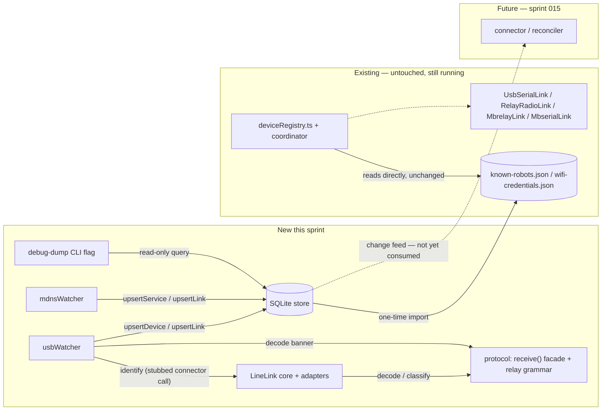
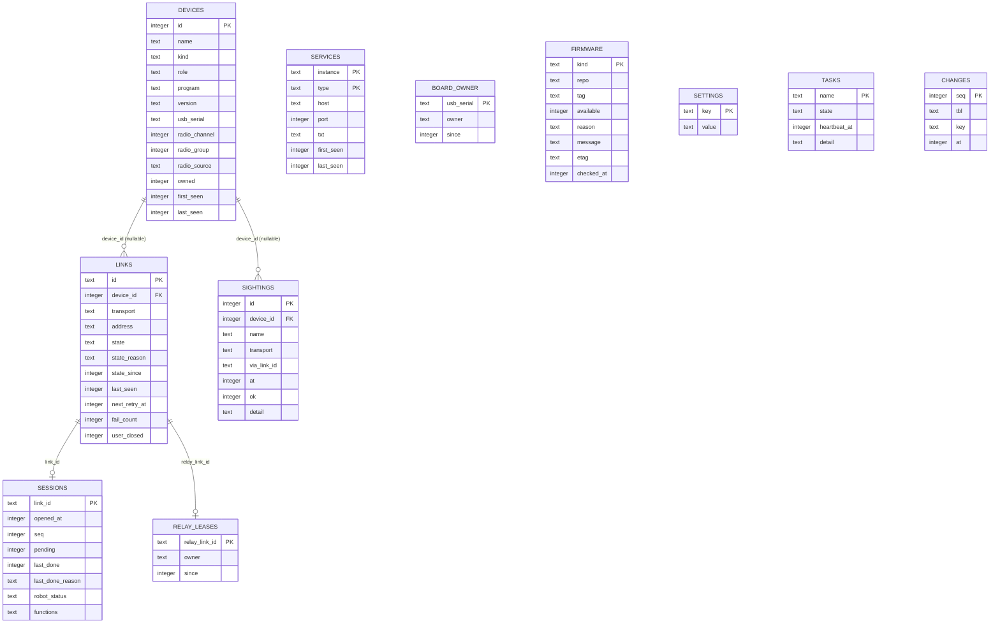
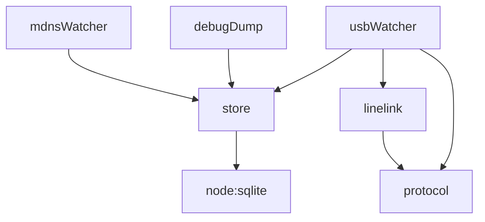

<!-- CLASI: Before changing code or making plans, review the SE process in CLAUDE.md -->

# Sprint 014: Host core A1: build hygiene, SQLite store, LineLink, protocol hygiene, USB and mDNS watchers

## Goals

Build the first half of the new host core: a Node/engines floor the
rearchitecture can build on, a single SQLite store that every later
issue writes into, one `LineLink` transport core, protocol-layer
hygiene fixes that the connector and sweeper will depend on, and the
first two watchers (USB, mDNS) writing rows into that store. This is
"Sprint A1" of the two-sprint split of Sprint A described in
`docs/design/rearchitecture-plan.md`.

## Problem

All device and link state today lives in-memory inside
`deviceRegistry.ts` (3,873 lines, seventeen state holders, four
identity keys), backed only by two ad hoc JSON files. Before any of
that class's responsibilities can be replaced (rearch-05, sprint 015),
the replacement needs somewhere to write to: a real store, a real
transport core, and watchers that populate it. Today's build also
can't safely host that work — the Node engines floor is wrong for
`node:sqlite`, the lockfile drifts on every install, and two host
tests are macOS-only, which would make CI red the moment SQLite-backed
tests land.

## Solution

Land the six issues in dependency order:

1. **rearch-17** — build hygiene first: raise `engines.node` to
   `>=22.13` everywhere (unblocks `node:sqlite`), fix the lockfile
   drift, make the two platform-coupled tests pass on Linux, and add
   the submodule/typecheck guards so CI is trustworthy before the
   rewrite starts.
2. **rearch-01** — the SQLite store: schema exactly as
   `architecture.md` §4 (`devices`, `links`, `services`, `sightings`,
   `sessions`, `board_owner`, `relay_leases`, `firmware`, `settings`,
   `tasks`, `changes`), typed operations only, one-time importers for
   `known-robots.json`/`wifi-credentials.json`, and an in-process
   change feed. Everything else in the arc depends on this.
3. **rearch-04** — one `LineLink` core (~250 lines) with adapters for
   serial, TCP, and the relay preamble, replacing the four
   near-duplicate link classes and fixing their shared defects (no
   `onClose`, no connect timeout, swallowed write failures, no abort
   signal through the relay command plane).
4. **rearch-15** — protocol package hygiene: a pure `receive()` facade
   encoding the decode→classify→drop→reply ordering, the relay `#`
   reply grammar moved out of the host and into protocol, several
   small session/codec bugs fixed, and vendor-fixture-independent
   tests so CI doesn't silently skip 94 of 162 protocol tests.
5. **rearch-02** — the USB watcher: treats a split serial/HID
   enumeration as one update instead of remove+add, writes
   `devices`/`links(usb)` rows, and moves the boot-window HELLO retry
   into the (still-to-come) connector rather than a single 3 s
   timeout.
6. **rearch-03** — the mDNS watcher: browses all five service types,
   re-queries periodically so a missed boot announcement is recovered
   within one interval, ages every link type (not just WiFi), and
   follows SRV/TXT address changes.

rearch-01 and rearch-04 and rearch-15 have no hard dependency on each
other and can proceed in parallel once rearch-17 lands; rearch-02 and
rearch-03 both need the store from rearch-01.

The old `deviceRegistry.ts`/coordinator path keeps running unchanged
through this sprint — nothing here cuts the UI over. That cutover is
sprint 015 (A2).

## Success Criteria

- The host has a working SQLite store with rows in it and one
  `LineLink` core; the old four link classes' behaviour is covered by
  the new core's tests.
- The USB and mDNS watchers write device/link/service rows that are
  visible in a debug dump (a direct store query, since there is no UI
  change yet).
- The old `deviceRegistry.ts` and its coordinator are still running
  unchanged; the UI is unchanged and shows no regression.
- `npm test` is green on both Linux and macOS from a clean clone.
- Sprint 015 does not start until this sprint's watcher rows are
  confirmed visible in a debug dump (see Risk below).

## Scope

### In Scope

- Node/engines floor, lockfile hygiene, Linux-safe tests, submodule
  and typecheck guards (rearch-17).
- SQLite schema, typed store operations, change feed, JSON importers
  (rearch-01).
- `LineLink` core plus serial/TCP/relay-preamble adapters, replacing
  `UsbSerialLink`, `RelayRadioLink`, `MbrelayLink`, `MbserialLink`
  (rearch-04).
- Protocol `receive()` facade, relay reply grammar, session/codec bug
  fixes, fixture-independent protocol tests (rearch-15).
- USB watcher writing device/link rows with one identify per attach
  (rearch-02).
- mDNS watcher writing service/link rows, re-query, aging, address
  tracking (rearch-03).

### Out of Scope

- The connector, reconciler, and harvester that consume these rows,
  and retiring `deviceRegistry.ts`/`knownRobots.ts`/`wifiRobotGate.ts`
  (rearch-05) — sprint 015.
- The new `snapshot` wire contract and thin server (rearch-06) —
  sprint 015.
- Radio address overrides in the DB (rearch-08) and the UI rendering
  the snapshot (rearch-07) — sprint 015.
- Relay leases, the sweeper, network transports, and any relay
  firmware change (rearch-09..12) — sprint 016.
- Firmware availability watcher, flash/SWD hardening, UI component
  dedupe, and specification corrections (rearch-13, 14, 16, 18) —
  sprint 017.
- Any UI change. This sprint is testable entirely without touching
  `packages/ui`.

## Test Strategy

Each issue carries its own acceptance tests (see the issue files for
the full per-issue test list): store schema/migration/typed-op/change-
feed/importer tests; a shared fake `ByteStream` harness driving the
`LineLink` core and per-adapter tests; protocol tests runnable without
`vendor/` submodules; watcher tests against fake enumerator/mDNS
backends asserting rows, not events. `npm test` must be green on both
Linux and macOS from a clean clone (rearch-17's acceptance criterion),
which is also this sprint's own regression gate since it is the first
sprint to exercise the new Linux-safe test paths.

## Dependencies and Rationale

This is Sprint A1 of the `docs/design/rearchitecture-plan.md` arc's
Sprint A, split per the plan's suggestion ("A1 = 17, 01, 04, 15, 02,
03 — host has rows and a link core, old registry still running; A2 =
05, 06, 08, 07 — cut over"). The plan's dependency graph places 17 as
a prerequisite for 01 (needs the engines bump for `node:sqlite`), and
01/04/15 feeding 02/03 in parallel. This sprint is the keystone of the
whole arc — sprints 015, 016, and 017 all depend on it, directly or
transitively.

**Risk carried forward from the plan**: "Sprint A size — the A1/A2
split keeps each half independently testable; do not start A2 (sprint
015) until A1's watcher rows are visible in a debug dump." Confirm
that before detail-planning sprint 015.

## Architecture

**Sizing: Substantial** — this sprint introduces a new persistent data
model (11 SQLite tables, none of which exist today), a new transport
core (`LineLink`), two new watcher modules, and new cross-module
dependencies (watchers → store, watchers → linelink, linelink →
protocol) that do not exist in the current codebase. Full 7-step
methodology, with a component diagram and an ERD.

### Step 1 — Problem

Covered by Goals/Problem above: all device/link state is in-memory
inside one 3,873-line class backed by two JSON files, and today's build
floor (`engines.node >= 18`, drifting lockfile, macOS-only tests)
cannot safely host `node:sqlite`-backed code. This sprint lands the
foundation (store, transport core, protocol hygiene, build hygiene) and
the first two watchers that write into it, without touching the UI or
the code path the UI currently depends on.

### Step 2 — Responsibilities

1. Give the rest of the arc a trustworthy Node/CI floor (rearch-17).
2. Persist device/link/service/session/ownership state (rearch-01).
3. Provide one line-oriented transport core usable by any watcher or
   future connector (rearch-04).
4. Encode the wire decode/classify/reply rules with zero I/O, and move
   host-side grammar that belongs there back into `protocol`
   (rearch-15).
5. Observe USB enumeration and keep device/link rows current, with a
   single identify per attach (rearch-02).
6. Observe mDNS advertisements and keep service/link rows current,
   re-querying and aging every service type (rearch-03).
7. Make the rows from (5) and (6) inspectable without a UI, so the
   sprint's exit criterion ("rows visible in a debug dump") is
   actually checkable.

(1) changes independently of the rest (it is pure tooling/CI, no
runtime behavior). (2), (3), (4) change independently of each other —
no shared files, no ordering requirement beyond (1). (5) and (6) each
depend on (2), (3), (4) but not on each other. (7) is a thin read-only
consumer of (2).

### Step 3 — Modules

| Module | Purpose (one sentence) | Boundary | Serves |
|---|---|---|---|
| **build tooling** (root `package.json`/`.nvmrc`/`.npmrc`, CI script, `npm run typecheck`, submodule guard test, vendored `dapjs`) | Give the rest of this sprint's code a Node ≥ 22.13, reproducible-lockfile, Linux-green CI floor to build on. | Inside: engines/lockfile/CI/typecheck/vendoring config and the three logged catches. Outside: any runtime behavior — this module ships no code path a request ever executes. | Infrastructure only — no use case of its own (see the sprint-020 precedent for this exception); it unblocks every SUC below by making `node:sqlite` and Linux CI possible. |
| **store** (`packages/host/src/store/`: `db.ts`, `index.ts`) | Persist every device, link, service, session, and ownership fact in one SQLite database, exposed only through typed operations. | Inside: schema/migrations, `upsertDevice`/`upsertLink`/`ageLinks`/etc., the JSON importers, the change-feed emitter. Outside: any raw SQL from another module (enforced by the acceptance grep), and any decision about *what* to connect (that's the reconciler, sprint 015). | SUC-001 through SUC-006 (everything ultimately reads or writes here). |
| **linelink** (`packages/host/src/link/LineLink.ts` + `serialStream`/`tcpStream` adapters + `RelayCommandPlane`) | Provide one line-oriented transport core — connect, identify, close, `onClose` — with adapters per transport. | Inside: the state machine, pacer, reassembler, router, adapters, relay preamble. Outside: deciding *when* to connect (watcher/reconciler), decoding wire grammar (protocol package — linelink only calls into it). | SUC-001 (USB identify); the future connector (sprint 015) is its other consumer, not built yet. |
| **protocol hygiene** (`packages/protocol/src/`: `session.ts`, `codec.ts`, `banner.ts`, `relay/commands.ts`) | Encode the wire decode → classify → drop → reply rules as pure functions with zero I/O. | Inside: the `receive()` facade, relay reply grammar, session bug fixes, fixture-independent tests. Outside: sockets, files, any host-specific module (enforced by the acceptance grep for host/sprint references). | SUC-001 (banner/ack-nack decoding) and SUC-003/004 (relay `#` reply parsing) indirectly, via linelink and the watchers. |
| **usbWatcher** (`packages/host/src/watchers/usbWatcher.ts`) | Keep `devices`/`links(usb)` rows current for whatever is enumerated on USB right now. | Inside: `diffDaplinkDevices` update-handling, `board_owner` acquire/release, the boot-window identify retry (via linelink, connector stubbed). Outside: auto-connect policy (reconciler, sprint 015), UI. | SUC-001, SUC-002, SUC-005, SUC-006. |
| **mdnsWatcher** (`packages/host/src/watchers/mdnsWatcher.ts`) | Keep `services`/`links(wifi\|mbserial\|mbrelay)` rows current for whatever mDNS currently advertises. | Inside: browsing all 5 service types, periodic re-query, address-change detection, per-type aging. Outside: connecting sessions, UI. | SUC-003, SUC-004, SUC-006. |
| **debug dump** (new, small: a CLI flag on the host's existing entry point) | Let an engineer inspect store rows without the UI or a running reconciler. | Inside: opening a short-lived read-only `DatabaseSync` connection and printing `devices`/`links`/`services`/`sessions`/`tasks` as JSON. Outside: any write path; any long-lived server. | SUC-006, and transitively verifies SUC-001 through SUC-005 on the bench. |

Cohesion check: each module above passes the one-sentence, no-"and"
test. The old `deviceRegistry.ts`/coordinator/four link
classes/`knownRobots.ts`/`wifiCredentials.ts` are **not** modules of
this sprint — they are untouched existing components that keep running
in parallel (see Impact, below).

### Step 4 — Diagrams

**Component diagram** (new modules solid, existing untouched components
and the not-yet-built connector shown for context):

Ten nodes, all edges labeled. Included because this sprint introduces
four new cross-module dependencies that did not exist before (watchers
→ store, watchers → linelink, linelink → protocol, dump → store).

**Entity-relationship diagram** (schema per `architecture.md` §4,
reproduced here since this is the sprint that creates it):

`SERVICES` intentionally has no foreign keys — it holds raw mDNS
observations, not identity.

**Dependency graph** (new dependencies only; confirms no cycle):

`protocol` and `store` have no outward runtime dependency of their own
(protocol is zero-I/O; store depends only on `node:sqlite`), consistent
with the dependency-direction principle — they are the stable base the
watchers build on.

### Step 5 — What Changed / Why / Impact / Migration

**What Changed**: see the module table (Step 3) — one entry per module,
each new. Root config gains an engines floor, `.nvmrc`, `engine-strict`,
a `typecheck` script, and a submodule guard test (rearch-17).

**Why**: see Problem, above — none of rearch-01/02/03/04/15 can land
safely without rearch-17's floor, and 02/03 need somewhere to write
(rearch-01) and something to identify with (rearch-04/15).

**Impact on Existing Components**: None functionally. `deviceRegistry.ts`,
its coordinator, the four existing link classes, and
`knownRobots.ts`/`wifiCredentials.ts` are not modified and keep running
exactly as today — the UI's behavior is unchanged because nothing yet
reads from the new store or the new watchers. The one repo-wide effect
is process, not runtime: every contributor now needs Node ≥ 22.13
locally (enforced by `engine-strict`), and CI now initializes
submodules and runs a typecheck step it didn't run before.

**Migration Concerns**:
- The store's JSON importers (`known-robots.json` → `devices`,
  `wifi-credentials.json` → `settings`) are one-time and idempotent;
  they read the same files `deviceRegistry.ts` continues to read
  directly, so both systems can consume the same JSON without
  conflicting (the new store never writes back to the JSON files, and
  the old registry never reads the new database).
- `console.sqlite` is created in the existing state directory
  (`resolveKnownRobotsFilePath`'s parent) — no new configuration surface
  for students/instructors.
- The engines bump to `>=22.13` is a breaking change for any contributor
  on an older Node; `.nvmrc` plus the README note is the mitigation.
- No data migrates *away* from anything this sprint — the JSON files
  stay in place and stay authoritative for the old registry until
  sprint 015 retires it.

### Step 6 — Design Rationale

**Decision: debug affordance is a CLI flag, not a read-only HTTP
endpoint.**
- Context: the sprint's exit criterion requires watcher rows to be
  "visible in a debug dump" without any UI change.
- Alternatives: (a) a tiny read-only HTTP/WS endpoint on the existing
  host server; (b) a standalone CLI flag/script that opens the DB
  directly.
- Why (b): the host server isn't the thing being exercised this sprint
  (no server code changes otherwise), and a CLI avoids running the full
  server just to read three tables. WAL mode allows a second read-only
  connection safely alongside a running host.
- Consequences: this is explicitly a throwaway debugging tool —
  rearch-06 (sprint 015) replaces it with the real `snapshot`
  projection and server endpoint; the CLI is not meant to survive past
  sprint 015.

**Decision: `LineLink` ships as a new, parallel module rather than
wrapping the four existing link classes.**
- Context: rearch-04 must coexist with `UsbSerialLink`/`RelayRadioLink`/
  `MbrelayLink`/`MbserialLink` until sprint 015's connector switches
  over and they're deleted (per the issue's own "Depends on" note).
- Alternatives: (a) have `LineLink` wrap the old classes as an adapter
  layer; (b) build `LineLink` as an independent module the old classes
  are unaware of, verified against its own fake `ByteStream` harness.
- Why (b): the old classes are deleted in sprint 015 regardless (per
  the issue and `architecture.md` §2), so an adapter layer over code
  that's about to disappear is throwaway work that also inherits the
  old classes' defects (no `onClose`, no connect timeout) into the
  thing meant to fix them. A clean parallel module lets the new core's
  own tests establish correctness independent of the old code's bugs.
- Consequences: `packages/host/src/link/` temporarily contains both the
  four old classes and the new core + adapters; nothing this sprint
  imports the new core into the old registry's path, so there is no
  behavior change for students until sprint 015.

**Decision: watchers stub the connector call directly instead of
waiting for the reconciler (sprint 015).**
- Context: rearch-02's acceptance criteria require the full
  identify/retry/backoff behavior to be tested now (bench hardware
  included), but the reconciler that will normally schedule connects
  doesn't exist until sprint 015.
- Alternatives: (a) watchers only write `discovered` rows this sprint,
  leaving identify untested until sprint 015; (b) watchers call
  `LineLink` directly (a stand-in for "the reconciler decided to
  connect") so identify/retry is exercised end-to-end now.
- Why (b): per the issue text itself ("this issue may stub the
  reconciler call with a direct connector invocation until then") and
  because the bench acceptance criterion (both Vevov and Vittut
  identified) is only meaningful if identify actually runs this sprint.
- Consequences: the stub call site in each watcher is a known, called-
  out seam that sprint 015's reconciler replaces; it is not a permanent
  design, and the ticket implementing it should mark the call site
  clearly (e.g. a `// TODO(rearch-05): replace with reconciler-scheduled
  connect` comment) so it isn't mistaken for the final design.

**Decision: vendor `dapjs`'s ~5 used classes now, in this sprint's
build-hygiene ticket.**
- Context: rearch-17 lists vendoring as the recommended resolution for
  an unmaintained, UMD-only dependency whose typings disagree with
  runtime, but the issue's own Acceptance section doesn't gate on it.
- Alternatives: (a) document the existing `.off` workaround and defer
  vendoring to a later sprint; (b) vendor `HID`/`CortexM`/`DAPLink` now.
- Why (b): the issue explicitly recommends it and the classes in
  question are small (~5); deferring adds a second future ticket for
  work that's already scoped and understood. Flagged as negotiable
  below if it turns out to risk this sprint's timeline.
- Consequences: `packages/host/vendor/dapjs/` gains ~5 small files with
  the `.off` fix applied; `flash.ts` imports from there instead of the
  npm package.

### Step 7 — Open Questions

- **TTL values per mDNS/link type**: rearch-03 asks for "one constants
  block" but no issue specifies numbers. Ticket 006 will pick
  bench-informed defaults (e.g. ~180 s for wifi/mbserial/mbrelay,
  matching today's WiFi sweep) and flag them as tunable, not as a
  final answer — confirm with the stakeholder after the bench pass.
- **dapjs vendoring scope**: proceeding with vendoring now (Design
  Rationale above); if it proves larger than expected during
  implementation, the fallback is to document the `.off` workaround
  only and defer vendoring to sprint 016/017 — flag to the stakeholder
  if that trade needs to be made.
- **Debug-dump surface**: a CLI flag was chosen over a tiny HTTP
  endpoint (Design Rationale above); if the stakeholder would rather
  have the HTTP form now (e.g. to unblock a bench script), that's a
  small change to ticket 009's approach, not to the sprint's shape.

## Use Cases

This sprint has no UI-facing behavior change — the old
`deviceRegistry.ts` path is what students still see. The use cases
below describe what the *host* now does automatically underneath that,
each traceable to a parent use case in `docs/design/usecases.md`, and
each verified this sprint via the debug dump (SUC-006) rather than the
UI.

### SUC-001: USB attach yields one device+link row with a single identify
Parent: UC-011

- **Actor**: robot-console host (automatic)
- **Preconditions**: rearch-01 (store) and rearch-04 (LineLink) have
  landed; a micro:bit (blank, relay, or robot firmware) is plugged into
  USB.
- **Main Flow**:
  1. The enumerator reports the board's serial persona, then its HID
     persona one poll later.
  2. `diffDaplinkDevices` treats the second poll as `updated`, not
     `removed` + `added`.
  3. `usbWatcher` takes `board_owner = naming`, reads the SWD name,
     upserts a `devices` row and a `links(usb, discovered)` row,
     releases the owner.
  4. `usbWatcher` calls `LineLink` (stubbed connector invocation, see
     Design Rationale) to identify: HELLO is retried at 0/750/1500/2500 ms
     within a 4 s total budget, covering the macOS boot window.
  5. On a robot banner, `devices.owned` is set to 1.
- **Postconditions**: exactly one `devices` row and one `links` row
  exist for the board; exactly one HELLO sequence occurred; both are
  visible via the debug dump.
- **Acceptance Criteria**:
  - [ ] A fake enumerator reporting serial then HID one poll apart
        yields one `devices` row, one `links` row, and a probe counter
        of exactly one HELLO sequence.
  - [ ] A fake port whose open rejects twice then succeeds ends
        identified without user action, with `fail_count = 2`.
  - [ ] A fake port answering HELLO only after 1.2 s still ends
        identified (the old single-shot 3 s timeout path is gone).
  - [ ] SWD naming failure with a working banner still sets
        `devices.owned = 1`, keyed by the banner's own serial field.
  - [ ] On the bench, both **Vevov** and **Vittut** appear as
        device+link rows in the debug dump after identification.

### SUC-002: USB detach ages the link without losing the device
Parent: UC-014

- **Actor**: robot-console host (automatic)
- **Preconditions**: a board has a `devices`/`links(usb)` row per
  SUC-001.
- **Main Flow**:
  1. The board is unplugged.
  2. `usbWatcher` sees `removed` within one enumeration poll.
  3. The link's state is set to `stale`; any `board_owner` row for it
     is released.
  4. The `devices` row is untouched (it is remembered, per UC-013).
- **Postconditions**: the link row is `stale`; the device row persists.
- **Acceptance Criteria**:
  - [ ] `removed` → link `stale` within one poll.
  - [ ] `board_owner` row for that USB serial is gone.
  - [ ] The `devices` row still exists and is unchanged.

### SUC-003: mDNS advertisement and re-query populate service/link rows
Parent: UC-012

- **Actor**: robot-console host (automatic)
- **Preconditions**: rearch-01 has landed; a robot or relay advertises
  over one of the five mDNS service types.
- **Main Flow**:
  1. `mdnsWatcher` browses `_mbrelay._tcp`, `_mbserial._tcp`,
     `_mbflash._tcp`, `_robotlink._tcp`, `_robotlink._udp`.
  2. Every observation upserts a `services` row and, per type, a
     `links` row (`wifi`, `mbserial`, or `mbrelay`).
  3. `browser.update()` runs on an interval so a missed boot
     announcement is recovered within one interval.
  4. A `wifi`/`mbserial` link attaches to a `devices` row by name only
     when exactly one owned device has that name; otherwise it stays
     unassigned.
- **Postconditions**: rows exist for every currently-advertising
  service/link, visible via the debug dump.
- **Acceptance Criteria**:
  - [ ] A fake backend emits `up` for one robot immediately, and a
        second robot only on the periodic re-query after the fake
        clock advances — both end with `links(wifi)` rows.
  - [ ] A `wifi` advertisement for a name that is not `owned` produces
        a `services` row and an unassigned link (hidden from any future
        projection, visible in the raw dump as unassigned).

### SUC-004: mDNS address changes and aging keep rows honest
Parent: UC-012, UC-017

- **Actor**: robot-console host (automatic)
- **Preconditions**: a `links` row exists per SUC-003.
- **Main Flow**:
  1. A service re-announces with a new host/port and no `down`/`up`
     event.
  2. `mdnsWatcher` detects the address change, updates the row, and (if
     the row shows an open session) marks it `unresponsive`.
  3. Every service/link type ages out via `ageLinks(transport, ttl)`
     and `services` rows past their TTL are deleted.
- **Postconditions**: addresses stay current; nothing stale lingers
  forever.
- **Acceptance Criteria**:
  - [ ] A fake backend changes a robot's SRV host with no `down`/`up` →
        the row's address changes.
  - [ ] A fake clock advanced past each TTL with no traffic → `links`
        for wifi, mbserial, and mbrelay all go `stale`; their `services`
        rows are gone.
  - [ ] A `stop()`/`start()` round-trip leaves no in-memory maps that
        survive the restart — everything derives from the DB.

### SUC-005: Previously-owned robots are remembered from the one-time import
Parent: UC-013

- **Actor**: robot-console host (automatic, at first start after this
  sprint lands)
- **Preconditions**: `known-robots.json`/`wifi-credentials.json` exist
  from prior use.
- **Main Flow**:
  1. On first start, the store's importer reads `known-robots.json`
     into `devices` (`owned = 1`, `kind = 'robot'`) and
     `wifi-credentials.json` into `settings`.
  2. The import is idempotent; running it again makes no further
     change.
  3. Watchers subsequently attach live rows to these devices as they
     observe them (SUC-001/003).
- **Postconditions**: every previously-known robot has a `devices` row
  before any watcher has run.
- **Acceptance Criteria**:
  - [ ] A fresh host start with an existing `known-robots.json` yields
        `SELECT count(*) FROM devices WHERE owned = 1` equal to the
        file's entry count.
  - [ ] Running the importer a second time does not duplicate rows.

### SUC-006: Store state is inspectable without the UI
Parent: none directly — this is the operational use case that makes
UC-011/012/013's underlying state checkable this sprint, since no UI
change ships.

- **Actor**: engineer verifying the sprint (not a student-facing flow)
- **Preconditions**: the host has run with the new store/watchers for
  at least one attach/advertisement cycle.
- **Main Flow**:
  1. The engineer runs the debug-dump CLI against `console.sqlite`.
  2. The tool opens a short-lived read-only connection and prints
     `devices`/`links`/`services`/`sessions`/`tasks` as JSON.
- **Postconditions**: every row written by SUC-001 through SUC-005 is
  visible in the dump output.
- **Acceptance Criteria**:
  - [ ] Dump output includes rows created during a bench pass with
        **Vevov** and **Vittut** attached.
  - [ ] The dump works whether or not the host process is currently
        running (WAL mode allows a concurrent read-only connection).

## GitHub Issues

(GitHub issues linked to this sprint's tickets. Format: `owner/repo#N`.)

## Definition of Ready

Before tickets can be created, all of the following must be true:

- [ ] Sprint planning document is complete (sprint.md, including its
      Architecture and Use Cases sections)
- [ ] Architecture review passed (or skipped, for changes with no
      architectural impact)
- [ ] Stakeholder has approved the sprint plan

## Tickets

| # | Title | Depends On |
|---|-------|------------|
| 001 | Build hygiene: Node floor, lockfile, Linux-safe tests, submodule/typecheck guards | — |
| 002 | SQLite store: schema, migrations, and db.ts | 001 |
| 003 | Store typed operations, change feed, and JSON importers | 002 |
| 004 | Protocol hygiene: receive() facade, relay reply grammar, session/codec fixes | 001 |
| 005 | LineLink core: state machine, pacer, reassembler, router, identify | 004 |
| 006 | LineLink adapters: serial, TCP, relay preamble; retire old link classes' test coverage | 005 |
| 007 | USB watcher: device/link rows, one identify per attach, retry | 003, 006 |
| 008 | mDNS watcher: service/link rows, re-query, aging, address tracking | 003 |
| 009 | Debug-dump CLI: read-only store inspection without the UI | 007, 008 |
| 010 | Bench and cross-platform verification: rows on Vevov/Vittut, npm test green on Linux and macOS | 009 |

Tickets execute serially in the order listed. 002/003 (store), 004
(protocol), and the 005/006 pair (LineLink) have no hard dependency on
each other beyond 001 — they're grouped this way in the table because
protocol (004) is best landed before LineLink (005/006) consumes its
new helpers, per rearch-15's own dependency note.
