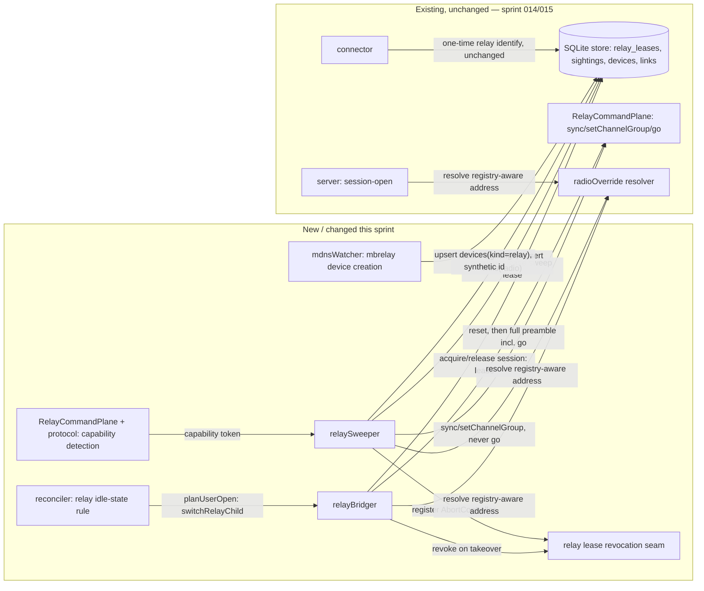
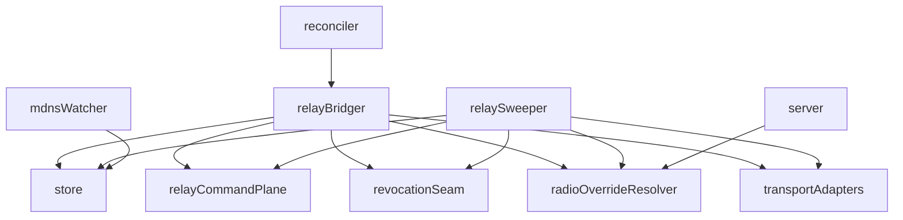

<!-- CLASI: Before changing code or making plans, review the SE process in CLAUDE.md -->

# Sprint 016: Relay ownership, radio sweep, and network transports

## Goals

Give a relay a real idle state with proper ownership handoff, fix the
Linux failover bug that default failover has today, build the
background radio sweep the stakeholder asked for, and make the
mbrelay/mbserial network transports actually work end to end. This is
Sprint B of `docs/design/rearchitecture-plan.md`.

## Problem

Today a relay can never be idle: every DAPLink attach auto-opens a
console session on it, `KeyedMutex` serialises operations but is not
an ownership mechanism, and there is no way for a background task to
know a student is using the relay. Default failover between candidate
robots is structurally broken on Linux (the reset only runs once,
before the first candidate, so every candidate after the first sends
its sync into a relay stuck in the data plane — it only ever worked on
macOS because opening the port happens to reset the board). Separately,
the mbrelay and mbserial transports exist in code but are effectively
dead: `MbrelayLink`'s failover candidate builder never emits an mbrelay
candidate, and mbserial robots are only reachable as a tail candidate
of a local relay's default failover, never directly. None of this
matters for background sweeping until relay ownership has a real idle
state to sweep from.

## Solution

Land the four issues in dependency order:

1. **rearch-09** — `relay_leases` gives a relay an explicit owner
   (`sweep` or `session:<childLinkId>`); the auto-opened console goes
   away; `relayBridger.bridge()` resets **per candidate** (DAPLink over
   HID, else a serial break — reliable on Linux, unlike DTR — else a
   port reopen on macOS), fixing the failover bug at its root; address
   resolution uses rearch-08's override→registry→derived order with no
   write-on-read registry lookups during default failover.
2. **rearch-10** — the relay sweeper: for each idle USB relay, acquire
   the sweep lease and probe remembered robots over the radio using the
   command plane's `!CG`/`> ID` (no `!GO`, no reset, ~0.5 s per probe),
   recording `sightings` and upserting `connectable` radio links. Rate
   limited to one retune per relay per 30 s until rearch-12 lands (see
   below), then 2 s.
3. **rearch-11** — mbrelay and mbserial become real transports: mDNS's
   already-upserted `links(mbserial)`/`links(mbrelay)` rows get device
   linking (mbserial, by name, same one-owned-device rule as WiFi) and
   connector/bridger support (mbrelay, reusing `relayBridger` with a
   `tcpStream` adapter and disconnect+reconnect as its reset step,
   since a break cannot be sent over TCP).
4. **rearch-12** — a cross-repository firmware change to
   `microbit-radio-relay`: a non-persisting tune (or one-shot probe) so
   the sweeper does not wear the relay's flash. This is filed upstream
   and can start early or land any time; rearch-10 rate-limits itself
   until it ships, then drops to the fast interval once the relay's `?`
   reply advertises the capability.

rearch-10 depends on rearch-09 for the lease mechanism; rearch-11
depends on rearch-09 for the shared bridger. rearch-12 has no
robot-console-side dependency and is not blocking — it can proceed in
parallel with the rest of the sprint.

## Success Criteria

- UC-015 and UC-016 pass on real hardware.
- A student can connect through a relay while a background sweep is
  running and take it over within one probe (≤ 1.5 s handback).
- The Linux failover bug is fixed and covered by a test that fails
  without the per-candidate reset step.
- mbserial and mbrelay discoveries are directly connectable, not only
  reachable as a failover tail candidate.

## Scope

### In Scope

- Relay leases, idle state, no auto-opened console, per-candidate
  reset in default failover (rearch-09).
- Background radio sweep over idle relays, sightings, rate limiting
  (rearch-10).
- mbserial and mbrelay as real, directly connectable transports
  (rearch-11).
- Filing and tracking the relay firmware's non-persisting tune
  (rearch-12); the firmware PR itself lands in the
  `microbit-radio-relay` repo, not this one.

- Carried from sprint 015 ticket 011 (bench items needing a drivable
  robot): (1) a robot connects and drives over USB, WiFi, and radio via
  a relay, each verified; (2) a radio override set in the UI is honored
  by a live relay bridge. Stakeholder must place a robot (e.g. tigez)
  on the bench and stop `npm run dev` before the bench ticket runs.

### Out of Scope

- Firmware availability watcher, flash/SWD hardening, UI component
  dedupe, specification corrections — sprint 017.
- Sweeping through an mbrelay pool (explicitly out of scope per
  rearch-11 — a shared classroom pool must not be commandeered by one
  host; the sweeper only uses `links(usb)` relays).
- Any change to robot firmware.

## Test Strategy

Fake-relay-with-plane-state tests for the per-candidate reset fix (one
fixture that fails without the reset step, guarding the Linux bug
specifically); fake relay answering `!CG`/`> ID` for sweeper sightings,
abort/handback timing, and rate limiting; fake mDNS backend plus fake
TCP stream for mbserial/mbrelay connectability and aging. Beyond
automated tests, this sprint needs the same bench-hardware pass as
sprint 015 — a real relay, a real robot on USB and WiFi, on both
macOS and Linux — since the failover and sweep behaviour is exactly
what the existing automated tests failed to catch before.

## Dependencies and Rationale

This is Sprint B of `docs/design/rearchitecture-plan.md`, depending on
sprint 015 (specifically rearch-05's connector/reconciler and
rearch-08's radio-override resolution order, which the sweeper and
bridger both read from). The plan's dependency graph shows
`05 → 09 → 10 ◀─ 12 (optional)` and `09 → 11`. rearch-12 is called out
in the plan explicitly as "cross-repo; start early, land whenever;
rearch-10 rate-limits until it does" — it is tracked in this sprint
but is not a gate for the other three issues.

## Architecture

**Sizing: Substantial** — this sprint introduces a relay ownership state
machine (`relay_leases` already exists as a table from sprint 014, but
nothing today actually owns it as a lease — this sprint is what makes it
one), a new background task (`watchers/relaySweeper.ts`), a new bridging
module (`connect/relayBridger.ts`) that both the reconciler and the
sweeper depend on, and gives a remote mbrelay pool its own `devices` row
for the first time. That is 3+ modules touched (reconciler, a new
relayBridger, a new relaySweeper, mdnsWatcher) plus multiple new
cross-module dependencies that do not exist today (reconciler→
relayBridger, relaySweeper→relayBridger's lease-revocation seam,
mdnsWatcher→a device-creation path it never exercises today) —
substantial by the sizing rubric's own signals, independent of word
count. No ERD: no schema change is needed anywhere in this sprint — see
Step 4.

### Architecture Overview

#### Step 1 — Problem

Read directly against the running code (not just the issue text), the
picture is more specific than "a relay can never be idle":

- **The bug is real and reproducible from the reconciler itself, not
  just the retired `deviceRegistry.ts`.** `connect/reconciler.ts`'s
  `plan()` treats a relay's own `usb`-transport link exactly like a
  robot's: its `AUTO_CONNECT_TRANSPORTS` per-device pass has no
  `device.kind` check at all. The moment a relay enumerates, `plan()`
  auto-connects it, `connector.ts`'s ordinary `attempt()` sends it a
  plain `HELLO` (the relay answers it while in its command plane,
  yielding a banner with `role: RADIOBRIDGE`), and the link is marked
  `connected` with an open `sessions` row — exactly the "console session"
  rearch-09 says must go away, and exactly what the sprint 015 ticket
  011 bench dump shows happening today (`vevav`/`vitut` both `connected,
  session` with no student ever touching them).
- **A relay bridge already exists, just not a resettable, multi-candidate
  one.** `connector.ts`'s `attempt()` already special-cases `radio`/
  `mbrelay` transport links: it resolves the physical relay the child
  rides on (`resolveRelayPhysical`, already transport-symmetric between
  a local `usb` relay and a remote `mbrelay` pool), acquires
  `relay_leases` with owner `session:<childLinkId>` (already the exact
  convention architecture.md §7.2 specifies), and drives
  `RelayCommandPlane.ts`'s full preamble through `!GO` as the link's
  `preamble` hook. What is missing is narrower than "build a bridge from
  scratch": there is no reset step before the preamble (so a relay left
  in the data plane by a prior failed candidate is never recovered — the
  Linux bug, still present), and there is no candidate list at all — only
  a single named child link. `RelayCommandPlane.ts` already exports
  `sync`/`setChannelGroup`/`go` individually, built in sprint 014 for
  exactly this sweeper/no-`!GO` use — that groundwork already exists.
- **mbserial is largely already real.** `watchers/mdnsWatcher.ts`'s
  `handleMbserial` already links an `_mbserial._tcp` instance to the one
  `owned` device with that name (identical rule to `handleWifi`), and
  `connect/reconciler.ts`'s `AUTO_CONNECT_TRANSPORTS` already includes
  `"mbserial"`, and `connector.ts`'s `buildStreamPlan` already opens it as
  a plain `tcpStream` with no preamble. The 015 bench dump shows `gopiv`/
  `tigez` mbserial links appearing exactly as this predicts. rearch-11's
  own issue text (written 2026-09-11, describing the *pre-rearch-05*
  world) is stale on this specific point — sprint 015's generic
  connector/reconciler already made mbserial connectable as a side
  effect of being transport-agnostic, not something this sprint needs to
  build. This sprint's real mbserial work is verification (confirm it end
  to end on the bench) plus one real gap: `radioOverride.ts`'s own doc
  comment says its `override → registry → derived` resolver "is not yet
  wired into any production call site" — `server.ts`'s `session-open`
  handler calls it but never supplies a `registry` location, so every
  resolution today silently skips the registry tier.
- **mbrelay is genuinely dead, and for a narrower reason than "no
  candidate is ever built."** `watchers/mdnsWatcher.ts`'s
  `handleMbrelay` only attaches a `links(mbrelay)` row to an *already
  existing* `devices(kind='relay')` row with the same name
  (`uniqueRelayDeviceIdByName`) — it never creates one. The 015 bench
  ticket confirmed this directly: `torture` (an mbrelay pool advertising
  live) never appeared in any snapshot all session, because this host
  has never identified `torture` over USB and so no matching device row
  exists for the mDNS observation to attach to. Once a pool has a device
  row, `connector.ts`'s existing transport-symmetric relay handling
  already knows how to bridge through it (`mbrelay` is already a first-
  class case throughout `resolveExclusivity`/`resolveRelayPhysical`/
  `buildStreamPlan`) — the missing piece is specifically device creation,
  not bridging machinery.
- **The reset step itself has no implementation anywhere.** No code in
  this repository sends a serial break, drives a DAPLink-over-HID reset,
  or reopens a port as a reset primitive — `link/adapters/serialStream.ts`
  exposes only `open`/`write`/`on`/`close`. `watchers/usbWatcher.ts`
  already records a relay's `hidPath` in its link address
  (`usbLinkAddress`) when the board enumerates with a HID interface, so
  the *information* needed to choose a reset method is already flowing
  into the store — nothing yet acts on it.

#### Step 2 — Responsibilities

1. Make a relay's own identification a one-time event, not a standing
   session: `plan()`'s automatic per-device pass must stop treating a
   `kind='relay'` device's `usb` link like a robot's once its kind is
   known; the connect that identifies a freshly-enumerated, not-yet-
   classified board still has to happen (kind is unknowable before that
   first HELLO), but the session it opens must return to idle
   immediately rather than stay `connected`.
2. Give `relay_leases` a real per-candidate reset before every
   candidate's preamble (the Linux fix), and a real candidate list
   (radio-sighted robots first, then remembered robots by `last_seen`)
   for the no-name-picked "default failover" path — today's connector
   only ever bridges one already-named child.
3. Choose a reset method by the relay's own physical capability: DAPLink-
   over-HID when the relay's `usb` link carries a `hidPath`, else a
   serial break, for a local relay; disconnect+reconnect for a TCP
   `mbrelay` pool (a break cannot be sent over TCP — specification.md
   §6).
4. Let a student's `session-open` interrupt a sweep in flight: revoke the
   sweep's lease via its own `AbortController`, wait for it to hand back
   (≤ 1.5 s), then proceed — this is a live, in-process handshake
   (`relay_leases` alone cannot express "signal a running task to stop,"
   only "who currently holds it"), so it needs a small shared seam
   between the sweeper and the bridger that neither directly imports the
   other to reach.
5. Build the sweeper itself: for each idle, `usb`-transport, `kind=
   'relay'` link, acquire the sweep lease, probe remembered robots over
   the radio command plane (never `!GO`, never `HELLO`), record
   `sightings`, upsert `links(radio, connectable)`, rate-limit `!CG`
   until the firmware advertises a non-persisting tune.
6. Give a remote mbrelay pool its own `devices(kind='relay')` row (a
   synthetic, name-derived id — this repository already has exactly this
   pattern for a device with no chip id, `store/importers/knownRobots.ts`'s
   placeholder convention) so `mdnsWatcher.ts`'s existing name-match
   linking rule has something to attach to, and so the existing,
   already-transport-symmetric bridging machinery in `connector.ts`/
   `relayBridger.ts` picks it up with no further transport-specific code.
7. Thread the mbrelay pool's own advertised `registryPort` into every
   radio-address resolution that can now reach one — `session-open`,
   the sweeper, and the bridger — closing the "resolver never wired to a
   registry location" gap found in Step 1.
8. Detect the relay firmware's advertised non-persisting-tune capability
   (once rearch-12 ships it, upstream) from the `?`/status reply, and
   switch the sweeper's own rate limit accordingly. The robot-console
   side of this is small and can land whether or not the firmware PR has
   merged yet — it only ever activates on a live capability token.
9. Verify, end to end and on real hardware, what the code reading above
   already suggests is mostly built: mbserial connect/drive, a live
   radio bridge honoring a radio override, and the two carried-over
   sprint 015 bench items that needed a drivable robot neither `tigez`
   nor `torture` could supply during that sprint's own bench pass.

(1)–(4) form one subsystem, `connect/relayBridger.ts` plus a small
reconciler change, that changes together for one reason — relay
ownership — but (5) is independently testable against a fake relay with
no student path involved, and is its own module for the same reason
sprint 015's `harvester` was split from `connector`: a sweeper has its
own lifecycle (start/stop/heartbeat) that has nothing to do with a
bridge's request/response shape. (6)–(7) are `mdnsWatcher.ts`/resolver
changes, gated on nothing this sprint newly builds (the device-creation
rule is additive to an existing function; the registry-threading is
additive to an existing resolver call site). (8) is small and isolated
to the protocol package plus one field the sweeper reads. (9) runs last,
same as sprint 015's own bench ticket, because it needs everything else
actually built to verify against.

#### Step 3 — Modules

| Module | Purpose (one sentence) | Boundary | Serves |
|---|---|---|---|
| **relay idle-state rule** (`packages/host/src/connect/reconciler.ts`, extended) | Stop treating an identified relay's own USB link as an ordinary auto-connect candidate. | Inside: `plan()`'s per-device pass gaining a `device.kind !== 'relay'` guard alongside its existing owned/backoff/closed-by-user checks; the executor returning a freshly-identified relay's link to idle (no open session) rather than leaving it `connected`. Outside: the one-time identify connect itself (still ordinary `connector.ts`), what holds the port afterward (`relayBridger`/`relaySweeper`/a console lease). | SUC-001 |
| **relayBridger** (`packages/host/src/connect/relayBridger.ts`, new) | Bridge one radio or mbrelay child link to its target robot, resetting the relay before every candidate it tries. | Inside: acquiring `relay_leases` (`session:<childLinkId>`), revoking a `sweep` lease it finds already held (via the shared revocation seam below) and waiting for handback, opening the relay's own raw transport directly (`link/adapters/{serialStream,tcpStream}.ts` — the same adapters `connector.ts` itself uses, not a call through `connector.connectAndIdentify`, since the relay's identity is already known from its one-time identify and does not need reconfirming), the reset-method choice (HID / serial break / TCP reconnect) from the physical relay link's own address, the candidate loop (sighted-robots-first, then `last_seen`) with a reset between every candidate — not just once before the loop — and releasing the lease in `finally`. Outside: the wire grammar itself (`RelayCommandPlane.ts`/protocol), deciding *whether* to bridge at all (the reconciler's `planUserOpen`), the sweep's own probe loop. | SUC-002, SUC-004, SUC-005 |
| **relay lease revocation** (small seam inside `connect/relayBridger.ts`'s and `watchers/relaySweeper.ts`'s shared dependency, e.g. `connect/relayLeaseRevocation.ts`) | Let a bridge signal a running sweep to stop, without either module importing the other. | Inside: an in-process `Map<relayLinkId, AbortController>` the sweeper registers into for the duration of each probe pass and the bridger reads to trigger and await a handback. Outside: the lease row itself (`store`), the sweep's probe logic, the bridge's candidate logic. | SUC-004 |
| **relaySweeper** (`packages/host/src/watchers/relaySweeper.ts`, new) | Probe remembered robots over radio from each idle USB relay and record what answers. | Inside: candidate ordering (oldest `sightings.at` first, backoff on repeated failure), acquiring the sweep lease and registering its `AbortController` with the revocation seam, opening the relay's raw transport the same direct way `relayBridger` does (no `connector.connectAndIdentify` call, no `sessions` row), the `!CG`/`> ID` probe loop (`sync`/`setChannelGroup` from `RelayCommandPlane.ts`, never `go`/`HELLO`), `sightings` and `links(radio)` writes, the rate-limit interval (gated on the firmware capability flag), a `tasks` heartbeat. Outside: bridging a student's chosen robot (`relayBridger`), the wire grammar (protocol), UI rendering. | SUC-003, SUC-007 |
| **mbrelay pool device modeling** (`packages/host/src/watchers/mdnsWatcher.ts`, extended) | Give a remote mbrelay pool a device row of its own instead of only linking to an already-known local relay. | Inside: `handleMbrelay`'s device-creation rule for an `_mbrelay._tcp` instance with no existing `kind='relay'` name match (a synthetic, name-derived id, the same convention `store/importers/knownRobots.ts` already uses for a chip-id-less device); aging the synthetic device out with its link, same as any other. Outside: bridging through the resulting device (already-generic `connector.ts`/`relayBridger.ts`), registry resolution (`mbrelayRegistry.ts`). | SUC-005 |
| **radio-address registry wiring** (cross-cutting: `server.ts`'s `session-open` handler, `relayBridger.ts`, `relaySweeper.ts`, all calling the existing `radioOverride.ts` resolver) | Give every radio-address resolution the actual registry location once an mbrelay pool has advertised one, instead of always degrading past it. | Inside: reading the resolved mbrelay pool's own `registryPort` (from its `links.address`) and passing it as `resolveDeviceRadio`'s `registry` option at each of these three call sites. Outside: the resolver's own order and caching (`radioOverride.ts`/`mbrelayRegistry.ts`, unchanged — this sprint only supplies the argument that was always accepted but never passed). | SUC-006 |
| **relay firmware capability detection** (`packages/protocol/src/relay/commands.ts` + `link/RelayCommandPlane.ts`, extended) | Recognize the relay firmware's advertised non-persisting-tune capability and let the sweeper use it once present. | Inside: parsing a `caps: CGT`/`caps: TX` token from the relay's `?`/status reply; `buildTransientChannelGroupLine` (already present) becoming the sweeper's `!CG` call when the capability is seen. Outside: the firmware itself (cross-repo, rearch-12), the sweeper's own rate-limit bookkeeping (just reads the detected flag). | SUC-007 |

**Not a module change this sprint** (confirmed by reading the code, not
assumed from the issue text): `connector.ts`'s generic transport
handling for `usb`/`wifi`/`mbserial`, `mdnsWatcher.ts`'s `handleMbserial`
device-linking rule, and `reconciler.ts`'s `AUTO_CONNECT_TRANSPORTS`
list already do everything rearch-11 asks for mbserial. This sprint's
mbserial ticket is verification, not construction — see Step 7's first
open question for the one thing to double-check before treating it as
done.

Cohesion check: each module above passes the one-sentence, no-"and"
test. Coupling: `relayBridger` and `relaySweeper` both depend on `store`,
the revocation seam, and the raw transport adapters, never on each other
directly; `mdnsWatcher`'s device-creation addition depends only on
`store` (unchanged dependency direction — a watcher still only observes
and writes, per architecture.md §3 rule 1); the registry-wiring row adds
no new module, only a call-site argument. No cycle.

A closer read of architecture.md §3 rule 1 ("a watcher never opens a
session, never calls the connector") against `relaySweeper`'s design
above is worth stating explicitly rather than leaving implicit: the
sweeper *does* open a raw transport connection to the relay for the
duration of a probe pass. This is deliberately not a rule violation —
see Step 6's fourth design-rationale entry for why, and for the same
reasoning applied to `relayBridger`.

#### Step 4 — Diagrams

**Component diagram** (new/changed this sprint solid; unchanged
sprint-014/015 components shown for context):

Included because this sprint introduces multiple new cross-module
dependencies that did not exist before (reconciler→relayBridger,
relaySweeper→the revocation seam, mdnsWatcher→a device-creation path it
never exercises today) and a new module pair (`relayBridger`/
`relaySweeper`) that together own the relay ownership state machine
architecture.md §7 describes.

**Dependency graph** (new/changed dependencies only; confirms no cycle
and that direction stays consistent with §3's coupling rule — watchers
still only observe and write, `relayBridger`/`relaySweeper` never depend
on each other):

`store`, `relayCommandPlane`, `radioOverrideResolver`, and
`transportAdapters` (`link/adapters/serialStream.ts`/`tcpStream.ts`) have
no new outward dependency this sprint — they remain the stable base,
consistent with the dependency-direction principle. `revocationSeam` is a
leaf depended on by both `relayBridger` and `relaySweeper`, never the
reverse.

**No ERD.** Every table this sprint reads or writes —
`relay_leases` (owner/since), `sightings` (device_id, name, transport,
via_link_id, at, ok, detail), `links.fail_count`, and `devices` (id,
name, kind, role) — already exists, unchanged in shape, from sprint
014's `rearch-01` migration. The mbrelay pool's synthetic device id
reuses the same "no true chip id, so derive one from the name" pattern
`store/importers/knownRobots.ts` already established for exactly this
situation; no new column is needed for it, for a sweep's backoff
(derivable from consecutive `sightings` rows for a name), or for the
firmware capability flag (kept in `relaySweeper`'s own in-memory state
per relay, re-detected on each lease acquisition rather than persisted —
consistent with architecture.md's general preference for the smallest
schema that works).

#### Step 5 — What Changed / Why / Impact / Migration

**What Changed**: see the module table (Step 3) — a reconciler rule
change, two new modules (`relayBridger`, `relaySweeper`) plus their
shared revocation seam, an `mdnsWatcher` device-creation addition, three
call sites gaining a registry argument, and a small protocol/command-
plane capability-detection addition.

**Why**: see Problem (Step 1) — the relay-idle bug is reproducible in
today's reconciler, not a leftover from a deleted module; the failover
bug is a missing reset-per-candidate in code that otherwise already
bridges; mbrelay's deadness is specifically a missing device row, not
missing bridging machinery; and the stakeholder's own headline ask (the
sweep) is new functionality with no precedent in this codebase to build
on beyond the `sync`/`setChannelGroup` steps sprint 014 already exported
for exactly this purpose.

**Impact on Existing Components**: `connect/reconciler.ts`'s `plan()`
gains one guard condition; no existing test of a non-relay device's
auto-connect changes behavior. `connect/connector.ts` is not changed —
its existing radio/mbrelay `attempt()` path keeps identifying a relay's
own link and a *pre-existing, single-candidate* child bridge exactly as
today; `relayBridger.ts` is additive, invoked by the reconciler's
`switchRelayChild` job and by a new default-failover entry point,
neither of which exists as a call site today. `watchers/mdnsWatcher.ts`'s
`handleMbrelay` keeps its existing name-match linking rule as a fast
path (an already-known local relay's name still resolves the same way);
device creation is the new fallback when no match exists. `server.ts`'s
`session-open` handler gains one argument to an existing call
(`resolveDeviceRadio`'s `registry` option) — no wire-contract change.
`radioOverride.ts`, `mbrelayRegistry.ts`, and the `Snapshot`/`Notice`
wire types are unchanged in shape; `SnapshotRelay` already carries
`lease: "sweep" | "session" | null` and `bridging`, so no wire-contract
change is needed to show "idle · sweeping" — that is purely a UI
rendering decision over an existing field, folded into ticket 004's
scope.

**Migration Concerns**:
- No schema migration — see Step 4's "No ERD" note.
- **Existing relay sessions at upgrade time**: a relay that was
  `connected` with an open console session under today's (buggy)
  behavior needs no special handling — the reconciler's new guard simply
  stops re-opening it after its next natural close; there is no
  in-flight state to migrate.
- **Rate-limit default is a deliberate regression in throughput, not
  behavior**: until rearch-12's firmware lands, a full sweep pass over a
  classroom of ~20 robots takes ~10 minutes (one retune per relay per
  30 s) — this is the sprint's own accepted tradeoff (issue text), not a
  bug to fix here.
- **Follow-up not absorbed into this sprint**: the relay firmware PR
  itself (rearch-12's actual capability) is out of this repository
  entirely; this sprint ships only the host-side detection and interval
  switch, and tracks the upstream issue
  (`League-Robotics/microbit-radio-relay#1`) without closing it — see
  ticket 007's disposition.

#### Step 6 — Design Rationale

**Decision: `relayBridger.ts` is a new sibling module to `connector.ts`,
not a rewrite of `connector.ts`'s existing radio/mbrelay handling.**
- Context: `connector.ts`'s `attempt()` already contains working
  radio/mbrelay logic (address resolution, exclusivity, the preamble) for
  a single, already-named child link — sprint 015 built it generically,
  not knowing sprint 016 would need a reset step and a candidate loop.
- Alternatives: (a) extend `connector.ts`'s existing `attempt()` in place
  with reset-then-preamble and a candidate array; (b) a new
  `relayBridger.ts` that owns lease acquisition, reset, and the candidate
  loop, calling into the *existing* `RelayCommandPlane` preamble (and,
  for a single-candidate named bridge, effectively wrapping the same
  logic `attempt()` already has) rather than making `connector.ts` itself
  branch on "is this a default-failover candidate loop or a single named
  connect."
- Why (b): `connector.ts`'s own module doc comment already frames itself
  as "the one connect→attach→identify path for every transport" — folding
  a multi-candidate loop with its own reset/abort/revocation semantics
  into that single function would make it the one place that also knows
  about sweep takeover, which is a distinct responsibility (this sprint's
  own rearch-09 issue names `connect/relayBridger.ts` as a new file, not
  a `connector.ts` change, for the same reason). `connector.ts` keeps
  doing exactly what it does today — one link, one identify, cancellable
  — and `relayBridger.ts` is what the reconciler calls for a relay child
  specifically.
- Consequences: some radio/mbrelay logic that today lives in
  `connector.ts`'s `attempt()` (address parsing, exclusivity kind
  resolution) is genuinely reusable by `relayBridger.ts` rather than
  duplicated — the ticket implementing this should share those helpers,
  not copy them, which is a ticket-level refactoring call flagged here so
  it is not lost.

**Decision: the sweep-takeover handshake is a small in-process seam
(`relayLeaseRevocation`), not a `relay_leases` schema change.**
- Context: `store.acquireRelayLease` already refuses to acquire when a
  different owner holds the lease (verified by reading its SQL:
  `ON CONFLICT ... WHERE relay_leases.owner = excluded.owner`) — it does
  not "steal." A student's `session-open` needs the *sweeper* to notice
  and stop, not the database to silently reassign ownership out from
  under a running probe loop.
- Alternatives: (a) add a `revoke_requested` column to `relay_leases` the
  sweeper polls; (b) an in-process `Map<relayLinkId, AbortController>`
  the sweeper registers into while it holds a lease, and the bridger
  triggers directly.
- Why (b): the sweeper and the bridger already run in the same Node
  process (architecture.md §2: "long-lived async tasks in one process,
  no worker_threads") — polling a DB column for a signal that only ever
  needs to reach code in the same process adds latency (a poll interval)
  and a schema column for something an `AbortController` already does
  instantly and for free. It also keeps the revocation entirely in
  memory, so a lease abandoned by a process crash is not left in a
  confusing "revoke requested" state for the next process to puzzle
  over.
- Consequences: the revocation seam has no persistence and is rebuilt
  fresh on every host restart — a sweep that was running at the moment
  of a crash simply is not runnG at restart, no different from any other
  in-process task's restart behavior.

**Decision: an mbrelay pool's device row uses a synthetic, name-derived
id, not a chip-id placeholder that never gets "merged" later.**
- Context: `known-robots.json`'s placeholder rows (sprint 014) exist
  specifically to be *merged* into a real chip-id row once the physical
  board identifies over USB (sprint 015's `mergeUsbPlaceholderIfAny`). An
  mbrelay pool has no chip to ever plug into this host over USB — there
  is no future merge event for it.
- Alternatives: (a) reuse the exact placeholder/merge machinery, leaving
  a permanent unmerged placeholder; (b) a synthetic id with no merge path
  at all, understood as permanent for a device this host will only ever
  reach over the network.
- Why (b): building merge-eligibility into a device that will never
  identify over USB is speculative generality — this sprint's own
  architecture-quality principle. A remote-only pool's identity is
  already fully determined by its mDNS instance name; there is nothing
  for a later USB identify to reconcile it against.
- Consequences: if two different mbrelay pools ever advertised the same
  name (a name collision this document's own risk section already
  flags as a fleet-wide risk generally), they would collide the same way
  two robots of the same name would — an accepted, pre-existing
  limitation, not one this sprint introduces.

**Decision: `relayBridger`/`relaySweeper` open the relay's raw transport
directly, never through `connector.connectAndIdentify` — and this does
not violate architecture.md §3's "a watcher never opens a session" rule.**
- Context: once a relay identifies once (SUC-001) it has no standing open
  port — the reconciler's new guard returns it to idle. Both a sweep
  probe and a bridge genuinely need to talk to the relay's port, which
  means *something* has to open it again, repeatedly (every
  `SWEEP_MIN_INTERVAL_MS` for a sweep, once per bridge attempt).
- Alternatives: (a) route every lease acquisition through
  `connector.connectAndIdentify`, re-running a full v6 HELLO/banner
  handshake and writing a fresh `sessions` row on every single sweep
  probe; (b) `relayBridger`/`relaySweeper` open the relay's raw
  `ByteStream` directly via the same adapter functions `connector.ts`
  itself calls (`serialStream`/`tcpStream`), drive `RelayCommandPlane`
  over it, and never touch `sessions` or re-run identify at all.
- Why (b): the relay's identity (`devices.kind`/`role`/`name`) does not
  change between probes — re-identifying it every 30 s would be pure
  churn, writing and then immediately tearing down a `sessions` row for
  no informational gain. Architecture.md §3 rule 1 ("a watcher never
  opens a session, never calls the connector") exists to keep
  *connection policy* — deciding what should be connected — in one
  place (the reconciler); it is not a blanket ban on any component ever
  touching a byte stream. A sweep probe's raw port open makes no policy
  decision of its own (the reconciler already decided this relay is idle
  and available for a lease; the sweeper is only using what the lease
  mechanism already granted it) and creates no `sessions` row, so the
  projection never shows a probe as an open, `connected` session — the
  one behavior rule 1 is actually protecting against.
- Consequences: `relayBridger.ts` and `relaySweeper.ts` both depend
  directly on `link/adapters/{serialStream,tcpStream}.ts` in addition to
  `store` and `RelayCommandPlane.ts` (reflected in Step 4's dependency
  graph). A relay's `devices` row is refreshed only by a genuine
  re-identify (e.g., the link drops and a fresh board enumerates), never
  by an ordinary sweep pass or bridge attempt.

#### Step 7 — Open Questions

1. **Confirm mbserial's already-apparent support with a real bench
   test before treating rearch-11's mbserial half as done.** Step 1's
   reading of the code strongly suggests `connector`/`reconciler`/
   `mdnsWatcher` already make an mbserial robot connectable end to end,
   but sprint 015's own bench ticket never actually opened a session over
   an mbserial link (only observed the discovered link row) — the first
   sprint 016 ticket that touches mbserial should verify this on real
   hardware before assuming no code change is needed, and report plainly
   if the reading above turns out to be wrong once tried against `gopiv`/
   `tigez`.
2. **What state a freshly-identified, now-idle relay's link sits in.**
   Step 2's responsibility 1 says the identify session must not stay
   `connected`, but architecture.md §5's state machine has no state
   named "identified but idle" — whether this is `connectable` with a
   reason, a new state, or something else is a ticket-level call for
   whichever ticket implements the reconciler guard, not resolved further
   here. The one hard constraint from architecture.md §7.2: an idle
   relay must still be recognizable as "a relay, not unknown" without
   ever running it back through a data-plane HELLO to reclassify it
   (rearch-09's own issue text: "the relay link returns to idle; it is
   never re-identified over a data-plane port").
3. **Whether the relay firmware capability token (rearch-12) needs any
   persistence at all**, or whether re-detecting it fresh on every lease
   acquisition (this document's own Step 4 "No ERD" position) is
   sufficient once a real relay in the classroom actually advertises it.
   Flagged for the ticket implementing capability detection to confirm
   against real firmware once rearch-12 merges upstream — not blocking,
   since the sweeper's rate limit defaults safely slow either way.
4. **The registry's TTL/cache lifetime once threaded into three call
   sites instead of zero.** `mbrelayRegistry.ts`'s own short-TTL cache was
   written and tested against a single caller in mind; three near-
   simultaneous callers (a user's `session-open`, the sweeper, a bridge)
   hitting it around the same relay is a new load pattern worth a look
   before assuming the existing cache tuning is still adequate — a
   ticket-level check, not an architectural change.

### Design Rationale

See Step 6 above.

### Migration Concerns

See Step 5's Migration Concerns above.

## Use Cases

Substantial sprint; SUCs below cover relay ownership, the sweep, and the
network transports. Parent UCs are primarily UC-015/UC-016 (this
sprint's own exit criterion), plus UC-004/UC-008/UC-010/UC-019 where this
sprint changes who satisfies them.

### SUC-001: A relay is idle until something needs it
Parent: UC-015, UC-011

- **Actor**: robot-console host (automatic)
- **Preconditions**: A RADIORELAY-flashed micro:bit enumerates over USB
  for the first time this run.
- **Main Flow**:
  1. The reconciler's ordinary auto-connect pass identifies the board
     once (kind is unknowable before this first HELLO).
  2. The connect classifies it `kind: 'relay'`, `role: RADIOBRIDGE`.
  3. The session this identify opened returns to idle immediately — no
     `relay_leases` row, no lingering `sessions` row — rather than
     staying `connected` as a console.
  4. The reconciler's automatic pass never schedules a fresh connect for
     this link again on its own; only an explicit lease (sweep, console,
     or a bridge) opens it from here on.
- **Postconditions**: The relay's card shows it present and identified,
  with no session open and no lease held, until the sweeper or a student
  takes it.
- **Acceptance Criteria**:
  - [ ] A fake relay identified once, with no further action, ends with
        no open `sessions` row and no `relay_leases` row.
  - [ ] `plan()`'s table-driven tests include a `kind='relay'` device
        with a `connectable` usb link and assert no job is produced.
  - [ ] The relay is never re-identified over a data-plane port after
        going idle (no `HELLO` sent to it outside the one initial
        identify).

### SUC-002: Default failover resets the relay between candidates
Parent: UC-016, UC-004

- **Actor**: Student
- **Preconditions**: A relay is idle; the student presses Connect on the
  relay with no specific robot picked.
- **Main Flow**:
  1. `relayBridger` builds the candidate list: robots with a recent radio
     `sighting` first, then remembered robots by `last_seen`.
  2. For each candidate in order: reset the relay (HID / serial break /
     reconnect, chosen by the relay's own physical capability), wait for
     boot, `?` sync, run the full preamble (`!CG`→`!P`→`!GO`), then
     HELLO/identify the robot.
  3. A candidate that fails (no sync, no preamble confirmation, no
     banner) is abandoned and the relay is reset again before the next
     candidate — never left in the data plane for the next attempt.
  4. The first candidate that identifies successfully becomes the
     relay's child; the loop stops.
- **Postconditions**: A failed candidate never leaves the relay unable to
  try the next one — the specific Linux bug this sprint fixes.
- **Acceptance Criteria**:
  - [ ] Fake relay with plane state: candidate 1 answers `!GO` but never
        answers afterward (simulating a stuck data plane); candidate 2
        still succeeds, and the fake observed a reset between them.
  - [ ] The identical fixture without the reset step between candidates
        fails — the test that specifically guards the Linux bug.
  - [ ] No registry GET is issued during default failover (address
        resolution uses override → last radio sighting → derived only).
  - [ ] A serial-only relay (no `hidPath`) uses the break path in tests;
        one with a `hidPath` uses HID reset.

### SUC-003: The sweeper probes remembered robots from an idle relay
Parent: UC-015

- **Actor**: robot-console host (automatic)
- **Preconditions**: A USB relay is idle (no lease held).
- **Main Flow**:
  1. The sweeper acquires the `sweep` lease and registers its
     `AbortController` with the revocation seam.
  2. For each owned robot with no connected usb/wifi/mbserial link,
     oldest sighting first: `!CG ch grp` → wait ≤ 500 ms for confirmation
     → `> ID` → wait ≤ 500 ms for a matching `< id …` reply.
  3. Record `sightings(radio, ok|fail)`; on success upsert
     `links(radio, connectable)`; on failure bump the link's
     `fail_count` and back off names that fail repeatedly.
  4. After the candidate list is exhausted, release the lease, sleep a
     quiet period, and re-acquire.
- **Postconditions**: The relay's card shows "idle · sweeping <name>";
  robot cards show a `Radio via <relay>` row with "last checked <time>".
- **Acceptance Criteria**:
  - [ ] Fake relay answering `!CG`/`> ID` for a subset of names: after
        one pass, `sightings` has one row per candidate; answering names
        get a `connectable` radio link; non-answering names show
        `fail_count = 1`.
  - [ ] The sweep never sends `!GO` or `HELLO` to the fake relay.
  - [ ] With the default rate limit, no two `!CG` writes to the same
        relay land closer together than `SWEEP_MIN_INTERVAL_MS`.
  - [ ] A relay found parked in the data plane on lease acquisition (a
        prior crash) gets one reset before sweeping resumes.

### SUC-004: A student's connect takes over a sweep within one probe
Parent: UC-016

- **Actor**: Student
- **Preconditions**: A relay is idle and the sweeper currently holds its
  `sweep` lease, mid-pass.
- **Main Flow**:
  1. Student picks a robot on the relay card and presses Connect.
  2. `relayBridger` finds the sweep lease held, triggers the sweeper's
     registered `AbortController`, and waits for the lease to release.
  3. The sweeper finishes its current wait (≤ 500 ms), releases the
     lease, and makes no further writes to the relay.
  4. `relayBridger` acquires the session lease and proceeds exactly as
     SUC-002/UC-004 — using the sighted channel/group first if the sweep
     had already seen this robot.
  5. On Disconnect the relay returns to idle; after a quiet period the
     sweeper resumes.
- **Postconditions**: Total handback time from the student's press to the
  relay being free for the bridge is ≤ 1.5 s.
- **Acceptance Criteria**:
  - [ ] Fake relay + fake sweep: a takeover request during an in-flight
        probe releases the sweep lease within 600 ms of the abort and
        makes no further sweep writes to the relay afterward.
  - [ ] End-to-end fake-relay timing: press-to-bridge-proceeding is
        ≤ 1.5 s.
  - [ ] After Disconnect and a quiet period, the sweeper re-acquires the
        lease and resumes.

### SUC-005: A remote relay pool is a device the student can bridge through
Parent: UC-008, UC-004

- **Actor**: Student
- **Preconditions**: A remote mbrelay pool (e.g. `torture`) advertises
  `_mbrelay._tcp` and this host has never identified it over USB.
- **Main Flow**:
  1. `mdnsWatcher` finds no existing `kind='relay'` device by that name
     and creates one with a synthetic, name-derived id.
  2. The pool appears on the Devices/front page exactly as a local relay
     would, labeled as a network relay.
  3. Student presses Connect and picks a robot; `relayBridger` bridges
     through it using a TCP `tcpStream` to the pool, with
     disconnect+reconnect as its reset step (no break over TCP).
  4. Removing the mDNS advertisement ages the device's link out, same as
     any other.
- **Postconditions**: A remote relay pool is exactly as usable as a local
  one, per UC-008's own postcondition.
- **Acceptance Criteria**:
  - [ ] Fake mDNS backend advertising `_mbrelay._tcp` with no matching
        local relay device produces a new `devices(kind='relay')` row and
        a `links(mbrelay)` row.
  - [ ] A bridge through the fake pool runs the preamble over a fake TCP
        stream with `TCP_NODELAY` set and reconnects (not break) as its
        reset step.
  - [ ] Removing the advertisement ages the link out within its TTL.

### SUC-006: mbserial and mbrelay resolve radio addresses through the shared resolver
Parent: UC-019, UC-004

- **Actor**: Instructor / robot-console host (automatic)
- **Preconditions**: An mbrelay pool with a known `registryPort` is
  discovered; a robot has (or lacks) a stored radio override.
- **Main Flow**:
  1. `session-open`, the sweeper, and `relayBridger` each resolve a
     robot's radio address via `radioOverride.ts`'s existing
     `override → registry → derived` resolver.
  2. Each call site now supplies the discovered pool's `registryPort` as
     the resolver's `registry` argument, where previously none did.
  3. The resolved address's source (`override`/`registry`/`derived`) is
     visible in the snapshot exactly as it is today for any other device.
- **Postconditions**: A registry hit is no longer silently skipped at
  every call site that could have used one.
- **Acceptance Criteria**:
  - [ ] With a fake registry reachable, a `session-open {relayLinkId,
        name}` bridge for a robot with no override resolves through the
        registry, not straight to derived.
  - [ ] A stored override still wins outright regardless of registry
        reachability, at all three call sites.
  - [ ] The sweeper never issues a registry GET during a probe (rearch-10's
        own constraint) — only `session-open` and a user-initiated bridge
        do.

### SUC-007: The sweeper adopts the relay firmware's non-persisting tune when advertised
Parent: UC-015 (error flow)

- **Actor**: robot-console host (automatic)
- **Preconditions**: A relay's `?`/status reply may or may not carry a
  capability token (e.g. `caps: CGT`) depending on its firmware version.
- **Main Flow**:
  1. On lease acquisition, the sweeper reads the relay's status reply for
     a capability token.
  2. Without the token, the sweeper rate-limits `!CG` to one retune per
     relay per `SWEEP_MIN_INTERVAL_MS` (default 30 s) and uses the
     persisting `!CG` line.
  3. With the token, the sweeper drops to the fast interval (2 s) and
     uses `buildTransientChannelGroupLine` (`!CGT`) instead.
- **Postconditions**: A sweep never wears a relay's flash faster than its
  firmware can tolerate, and speeds up automatically once the firmware
  supports it — with no host-side configuration needed.
- **Acceptance Criteria**:
  - [ ] Against a fake relay advertising the capability token, the
        sweeper's retune interval drops to 2 s and uses `!CGT`.
  - [ ] Against a fake relay with no token, the sweeper stays at the 30 s
        default and uses persisting `!CG`.
  - [ ] The relay card surfaces which rate the sweep is currently running
        at (fast/slow) so the reason for a slow classroom-wide pass is
        never silently invisible.

## GitHub Issues

(GitHub issues linked to this sprint's tickets. Format: `owner/repo#N`.)

## Definition of Ready

Before tickets can be created, all of the following must be true:

- [ ] Sprint planning document is complete (sprint.md, including its
      Architecture and Use Cases sections)
- [ ] Architecture review passed (or skipped, for changes with no
      architectural impact)
- [ ] Stakeholder has approved the sprint plan

## Tickets

| # | Title | Depends On | Issue | Completes Issue |
|---|-------|------------|-------|------------------|
| 001 | Relay lease ownership and idle state: reconciler stops auto-connecting a relay's own link | — | rearch-09 | no |
| 002 | Relay failover: relayBridger with per-candidate reset, candidate ordering, registry-free default failover | 001 | rearch-09 | yes |
| 003 | Relay sweeper: probe remembered robots over radio, sightings, rate limiting | 002 | rearch-10 | no |
| 004 | Sweep takeover within one probe, plus relay/robot projection and UI | 003 | rearch-10 | yes |
| 005 | mbrelay pool device modeling and bridging over TCP | 002 | rearch-11 | no |
| 006 | mbserial verification and registry-aware radio address resolution | 005 | rearch-11 | yes |
| 007 | Relay firmware capability detection: non-persisting tune, fast sweep interval | 003 | rearch-12 | no — tracks `League-Robotics/microbit-radio-relay#1`; stays open until the upstream firmware PR merges |
| 008 | Bench verification: relay failover, sweep takeover, network transports on real hardware | 004, 006, 007 | — (sprint exit gate) | — |

Tickets execute serially in the order listed.
