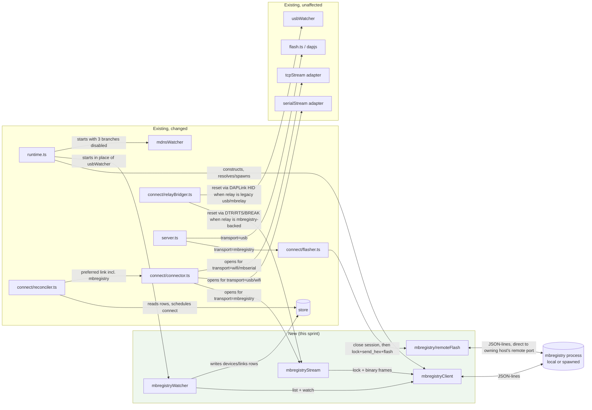

<!-- CLASI: Before changing code or making plans, review the SE process in CLAUDE.md -->

# Sprint 018: Connect to mbregistry: client, watcher and stream transport

## Goals

Make robot-console an mbregistry client: a `mbregistryClient`, a
`mbregistryWatcher` that replaces `usbWatcher` and the `_mbserial`/
`_mbrelay`/`_mbflash` branches of `mdnsWatcher`, and a `mbregistryStream`
adapter for serial sessions. Boards are discovered, locked and streamed
through mbregistry instead of direct USB/HID or the old relay/mDNS paths.
Source issue: `clasi/issues/use-mbregistry-for-boards-locks-and-flashing.md`.
Ticket 005 (flashing) also implements part of
`clasi/issues/retire-direct-usb-flash-and-names-via-mbregistry.md`
(moved forward from Sprint 019 — see Solution); that issue's remaining
scope (names, deletions, `board_owner` shrink) stays with Sprint 019.
Design: `mbtools` `docs/design/robot-console-integration.md`, wire protocol
in `docs/design/registry-api.md`.

## Problem

robot-console and mbregistry both enumerate USB boards, lock them and
manage serial links independently. When both run on one machine they
compete for the same ports, and robot-console's own lock (`board_owner` /
`relay_leases`, single-host SQLite) never expires and isn't shared across
hosts. mbregistry now owns discovery, identity, locking, streaming and
naming across the fleet; robot-console should stop duplicating that.

## Solution

Add `mbregistryClient` (JSON-lines over Unix socket / named pipe / TCP,
with registry resolution and spawn-on-demand per the fallback order in the
design doc §4: `$ROBOT_CONSOLE_MBREGISTRY`, then the standard client
socket candidates, then a previously-spawned console-owned socket, then
spawn `mbregistry run --instance <host>-console ... --no-peering
--ready-json --exit-with-parent`, else fail with a clear version error).
Add `mbregistryWatcher`, writing `devices`/`links` rows with
`transport = "mbregistry"`. Add `mbregistryStream`, which locks (with a
`label`) then streams binary frames (`DATA`/`BREAK`/`SET_DTR`/`SET_RTS`/
`CLOSE`); `sendBreak` maps to `BREAK`, reset uses DTR/RTS. Add
`mbregistry` to the link preference order in place of `usb`/`mbserial`/
`mbrelay`, auto-connecting a local, owned board, and keep the "owned"
device rule now that `list` returns the whole fleet. Make the console's
own port (4795) configurable.

This sprint can proceed now, ahead of mbtools sprint 008 closing: stream
via the local instance's own remote port on `127.0.0.1` until the
local-socket `stream` op (008-004) lands, and lock `label`/`since`
display degrades gracefully (no label/age shown) when the registry in use
predates 008-002.

**Flashing moved into this sprint (stakeholder decision, 2026-09-24)**:
originally Sprint 019 scope, flashing via `send_hex`/`flash` on the
owning instance's remote TCP port now lands here (ticket 005), so that
disabling `usbWatcher` (ticket 006) never leaves a board unflashable in
the gap between this sprint and Sprint 019. Names migration
(`names_get`/`names_set`) and deleting the old direct-USB paths remain
out of scope here — see Sprint 019.

## Success Criteria

- With a system mbregistry running, robot-console lists and opens local
  and remote boards through it; a second client trying to open a board
  already in use sees "in use by <label>" (or a plain "in use" if the
  registry doesn't yet report a label).
- With no mbregistry running, robot-console starts one and it exits when
  robot-console exits.
- With mbregistry missing or older than the declared minimum version,
  startup fails with a clear message naming the required version.
- Two robot-console instances can run on one machine on different ports.
- Flashing a local and a remote board works through mbregistry
  (`send_hex`/`flash` on the owning instance's remote port), including a
  board this console currently has an open session on.

## Scope

### In Scope

- `mbregistryClient`: transport, resolution order, spawn-on-demand,
  minimum-version check.
- `mbregistryWatcher` replacing `usbWatcher` and the mDNS
  `_mbserial`/`_mbrelay`/`_mbflash` branches (additively — deletion of the
  old code is Sprint 019).
- `mbregistryStream` adapter: lock, stream, `BREAK`/DTR/RTS reset,
  stale-lock display and the `unlock --force` hint.
- Flashing via `send_hex`/`flash` on the owning instance's remote TCP
  port, for a local or remote `mbregistry`-transport board, cooperating
  with this console's own session lock (moved forward from Sprint 019 —
  stakeholder decision, 2026-09-24; see Solution).
- Link preference order update; "owned" device rule preserved.
- Configurable console port (4795).
- `mbregistry.shareBoards` setting (peering on/off for the spawned
  instance).

### Out of Scope

- Radio names via `names_get`/`names_set` (Sprint 019).
- Deleting `usbWatcher`, `swdName`, the serialport/node-hid/dapjs paths,
  and `mbrelayRegistry.ts` (Sprint 019 — this sprint adds the new paths
  alongside the old ones without removing them).
- `board_owner`/`relay_leases` shrink-to-arbitration (Sprint 019).
- Hardware acceptance with two contending clients (covered by Sprint
  019's acceptance, which exercises the full replacement).

## Dependencies

- mbtools sprint 007 (closed): `--instance`, `--ready-json`,
  `--exit-with-parent`, `--no-peering`, per-board claims, configurable
  ports — all prerequisites are in place.
- mbtools sprint 008 (executing): `watch` (008-001, done) is available
  now. Lock `label`/`since` (008-002, in progress) — degrade gracefully
  when absent. Local-socket `stream` (008-004, open) — use the local
  instance's remote port on `127.0.0.1` until it lands.
- Open item: pin the minimum mbregistry version once mbtools sprint 008
  closes.

## Test Strategy

(Describe the overall testing approach for this sprint: what types of tests,
what areas need coverage, any integration or system-level testing needed.)

## Architecture

**Substantial** — this sprint adds a new external-integration subsystem
(the mbregistry client/watcher/stream trio), introduces a new
cross-module dependency (the connector and `relayBridger` now depend on
an mbregistry-backed transport instead of owning USB directly), and
changes the link-preference and exclusivity data flow across 4+ existing
modules (`watchers/`, `connect/connector.ts`, `connect/relayBridger.ts`,
`connect/reconciler.ts`, `store/`). Per the effort-decision rubric this
takes the full 7-step methodology, diagrams included.

### Step 1 — Problem

Today `usbWatcher` and three branches of `mdnsWatcher`
(`_mbserial`/`_mbrelay`/`_mbflash`) independently enumerate the same
boards mbregistry now owns, and `board_owner`/`relay_leases` are a
single-host, never-expiring lock with no cross-host visibility. When
mbregistry and robot-console run on the same machine they fight over the
same serial ports. mbregistry now does discovery, identity, locking,
serial I/O and fleet-wide device listing; robot-console must become a
client of it rather than a second implementation of the same four jobs.
The full evidence and division-of-responsibility tables are in mbtools
`docs/design/robot-console-integration.md` §1-§2 — not reproduced here.

### Step 2 — Responsibilities introduced or changed

1. **Resolve/spawn a local mbregistry instance** and speak its
   newline-JSON protocol over whichever transport it exposes (Unix
   socket / named pipe / TCP) — a brand new responsibility, with no
   existing module to extend.
2. **Discover boards through mbregistry** (`list` + `watch`) and publish
   them as `devices`/`links` rows — replaces `usbWatcher`'s enumeration
   responsibility and three of `mdnsWatcher`'s five browsed-type
   responsibilities (`_mbserial`, `_mbrelay`, `_mbflash`); WiFi
   (`_robotlink.*`) is untouched.
3. **Open a locked, framed byte stream to a board through mbregistry**
   (lock → stream → `DATA`/`BREAK`/`SET_DTR`/`SET_RTS`/`CLOSE`) — a new
   `ByteStream` implementation the connector can drive exactly like
   `serialStream`/`tcpStream` today.
4. **Reset a relay board before a bridge candidate** — currently
   `relayBridger.ts` does this over DAPLink HID directly
   (`vendor/dapjs`). Once a relay board is discovered and locked through
   mbregistry, robot-console no longer has permission to open its HID
   interface directly (mbregistry's per-board claim is exclusive), so
   this responsibility must move onto the same DTR/RTS/BREAK primitives
   item 3 exposes.
5. **Decide which transport a device connects over** — the reconciler's
   existing "preferred link order" responsibility, extended with one new
   member and two removed.
6. **Flash a board through mbregistry** (moved forward from Sprint 019 —
   Solution's stakeholder-decision note): `send_hex`/`flash` on the
   owning instance's remote TCP port, in place of `flash.ts`'s dapjs/HID
   path, for any `mbregistry`-transport link — currently
   `connect/flasher.ts`'s exclusive job for `usb`-transport links via
   `board_owner`. This is additive to that module (a second orchestration
   method, not a replacement), not a new component of its own — the new
   surface is the wire-protocol leaf underneath it (Step 3).

Grouping: (1) and (2) change independently of (3)/(4) — a client can
exist and list devices with no stream ever opened. (3) and (4) share one
wire sub-protocol and change together. (5) is a one-line policy change
inside an existing module, not a new component. (6) shares nothing with
(1)-(5) except mbregistry's own TCP transport — it can be built and
tested the moment (1)'s resolution/spawn and (4)'s connector wiring
exist, independent of whether (2)/(3)/(5) have landed yet (hence its
`depends-on: [001, 004]` rather than a dependency on every other
ticket).

### Step 3 — Modules

- **`mbregistryClient`** (new, `packages/host/src/mbregistry/client.ts`).
  Purpose: speak the mbregistry newline-JSON protocol over one connected
  transport and hand back typed request/response calls plus a `watch`
  event stream. Boundary: owns socket/pipe/TCP framing, request
  correlation is unnecessary (protocol is strictly request-then-response
  per connection except after `watch`), and resolution/spawn (below).
  Does not know about `devices`/`links` rows — that is the watcher's job.
  Serves SUC-001, SUC-002, SUC-005.
- **`mbregistryResolver`** (new, same package, small enough to be a
  function group inside `client.ts` rather than its own file — folded
  into `mbregistryClient`'s construction path). Purpose: find or spawn
  the local registry per design-doc §4's fallback order. Boundary: pure
  process/filesystem probing plus one `child_process.spawn`; never
  touches `devices`/`links`. Serves SUC-001, SUC-005.
- **`mbregistryWatcher`** (new, `packages/host/src/watchers/mbregistryWatcher.ts`,
  sibling to `usbWatcher.ts`/`mdnsWatcher.ts`). Purpose: keep
  `devices`/`links(transport='mbregistry')` rows current from
  mbregistry's `list`/`watch`. Boundary: writes rows only, exactly like
  every other watcher (architecture.md §3 rule 1) — never opens a lock
  or a stream. Serves SUC-002, SUC-003.
- **`mbregistryStream`** (new, `packages/host/src/link/adapters/mbregistryStream.ts`,
  sibling to `serialStream.ts`/`tcpStream.ts`). Purpose: implement
  `ByteStream` by locking a board then relaying binary frames over one
  mbregistry connection. Boundary: owns the lock lifetime (whole session)
  and frame codec use; never decides *which* board to open — that is the
  connector's job, unchanged. Serves SUC-004, SUC-006, SUC-007.
- **`connect/connector.ts`** (existing, changed). Adds `"mbregistry"` to
  `parseLinkAddress`/`resolveExclusivity`/`buildStreamPlan`'s transport
  switches, and a new no-op `Exclusivity.kind` for it (mbregistry's own
  lock replaces `board_owner`/`relay_leases` for this transport — see
  Migration Concerns). Serves SUC-004.
- **`connect/relayBridger.ts`** (existing, changed). `chooseResetMethod`
  gains an mbregistry branch: when the relay's physical link is
  `transport: "mbregistry"`, reset via the same stream's `SET_DTR`/
  `SET_RTS`/`BREAK` frames instead of opening DAPLink over HID. The
  existing DAPLink-HID and serial-break branches are untouched (still
  used for a relay still reached over legacy `usb`/`mbrelay`, e.g. before
  mbregistry is available or during a version-check failure). Serves
  SUC-007.
- **`connect/reconciler.ts`** (existing, changed). `AUTO_CONNECT_TRANSPORTS`
  gains `"mbregistry"`; the module doc comment's five-transport
  preference order becomes `mbregistry > wifi > radio`, replacing
  `usb > wifi > mbserial > radio > mbrelay`  as the effective policy once
  `usbWatcher`/the three mDNS branches are disabled (Migration Concerns).
  Serves SUC-002, SUC-004.
- **`runtime.ts`** (existing, changed). Composition root: constructs
  `mbregistryClient`, starts `mbregistryWatcher` in place of
  `startUsbWatcher`, and starts `mdnsWatcher` with the `_mbserial`/
  `_mbrelay`/`_mbflash` browses disabled via a new option (additive flag,
  not deletion — Migration Concerns). Serves SUC-002.
- **`config.ts`** (existing, changed). Adds `mbregistry.shareBoards`
  (peering on/off for a spawned instance) and the mbregistry minimum
  version constant. The console's own port is already configurable
  (`--port`/`ROBOT_CONSOLE_PORT`, `server.ts` `DEFAULT_PORT`) — no change
  needed there beyond confirming it in the acceptance ticket.
- **`mbregistry/remoteFlash.ts`** (new, `packages/host/src/mbregistry/
  remoteFlash.ts`, sibling to `client.ts`). Purpose: drive one
  mbregistry connection's `lock`(`flash`)/`send_hex`/`flash` exchange to
  completion and resolve a `FlashOutcome`. Boundary: owns the wire
  protocol and its own TCP connection only — never decides *which*
  board/target to flash (the connector's/`flasher.ts`'s job, unchanged)
  and never touches `board_owner`/`store` directly. Serves SUC-008.
- **`connect/flasher.ts`** (existing, changed). Gains a second
  orchestration method, `flashMbregistry`, alongside the existing
  `flash` — same "close the session first" seam
  (`FlasherSessionCloser.requestClose`) this module already owns, but
  skipping `acquireBoardOwner`/`releaseBoardOwner` for this transport
  (mbregistry's own `flash`-kind lock is the sole exclusivity, matching
  `resolveExclusivity`'s `Exclusivity.kind: "none"` for `mbregistry`
  established in ticket 004). Serves SUC-008.
- **`server.ts`** (existing, changed). `runFlashTask`'s transport gate
  (currently "usb, or a descriptive failure") gains an `"mbregistry"`
  branch calling `flasher.flashMbregistry` instead of
  `flasher.flash`/`enumerateDaplinkDevicesFn`; the `flash-progress`/
  `flash-result` broadcasts themselves are untouched. Serves SUC-008.
- **`projection.ts`** (existing, changed). `capabilities.flash` becomes
  true for `usb` **or** `mbregistry` transport, resolving Open Question
  #2 below. Serves SUC-008.

### Step 4 — Diagrams

Component diagram — required: this sprint introduces 4 new modules and
rewires 6 existing ones with new cross-module edges (connector →
mbregistryStream, relayBridger → mbregistryStream, runtime →
mbregistryClient/mbregistryWatcher, flasher → remoteFlash).

Dependency graph note: the new edge `connect/connector.ts →
mbregistryStream` and `connect/relayBridger.ts → mbregistryStream` both
point from business logic (connector/relayBridger) toward an adapter
(mbregistryStream), consistent with architecture.md's existing
`serialStream`/`tcpStream` direction — no new violation of "dependencies
flow from unstable toward stable." No ERD: no SQL schema change (see
Migration Concerns) — `transport` and `address` are already free-form
per architecture.md §4, and this sprint only adds one new accepted value
to each of the existing `Transport` union and address-shape switch.

### Step 5 — What Changed / Why / Impact / Migration Concerns

**What Changed**: four new modules (`mbregistryClient`,
`mbregistryWatcher`, `mbregistryStream`, `mbregistry/remoteFlash`); six
existing modules gain an `"mbregistry"` case in an existing
switch/union or a new orchestration branch
(`connector.ts`/`relayBridger.ts`/`reconciler.ts`/`runtime.ts`/
`connect/flasher.ts`/`server.ts`); `projection.ts`'s `capabilities.flash`
gate widens from `usb`-only to `usb`-or-`mbregistry`; one new settings
key (`mbregistry.shareBoards`) and one new declared constant (minimum
mbregistry version).

**Why**: see Step 1 — stop robot-console and mbregistry from
independently owning the same USB boards.

**Impact on Existing Components**: `usbWatcher` and the three mDNS
branches are disabled at the runtime-assembly call site (a constructor
option / early return), not deleted — Sprint 019 deletes them. No
existing test for those paths needs to change; `runtime.test.ts` gains
cases asserting they are not started when mbregistry is available.
`store/index.ts`'s `Transport` union and `board_owner`/`relay_leases`
tables are read but not touched: `mbregistry`-transport links use
`Exclusivity.kind: "none"` (mbregistry's own lock is the sole
exclusivity for that transport), the exact pattern `wifi`/`mbserial`
already use today. `connector.ts`'s `resolveRelayPhysical(store,
relayLinkId, expectedTransport)` currently only accepts `"usb"` or
`"mbrelay"` as the relay's own physical transport — once a relay board
is discovered via `mbregistryWatcher` instead of the disabled `mbrelay`
mDNS branch, a `radio`/`mbrelay`-address link's `relayLinkId` can point
at an `mbregistry`-transport row instead. `resolveRelayPhysical` gains a
third `expectedTransport: "mbregistry"` branch resolving to
`mbregistryStream`, alongside the existing two — called out explicitly
here since it is easy to miss (the function's own two-branch shape looks
complete without it).

**Migration Concerns**: none for data (no schema change, no migration).
Deployment sequencing: mbtools must be installed and reachable (or
spawnable) before robot-console can discover any board through the new
path; until then, or if the effective mbregistry is below the declared
minimum version, startup reports a clear error rather than silently
falling back to the disabled USB path (design doc §7: "no direct-USB
fallback"). **Resolved** (was an interim limitation before the
2026-09-24 stakeholder decision — see Open Question #2 below):
flashing a board discovered only through mbregistry (no independent
direct-USB visibility, e.g. a remote peer's board) now works within
this sprint via `send_hex`/`flash` (ticket 005), so there is no
018→019 gap where such a board is undiscoverable-but-unflashable.
`connect/flasher.ts`'s existing `usb`/`board_owner` path and the new
`mbregistry`-transport path coexist — a link's own `transport` selects
which one `server.ts#runFlashTask` calls, mirroring how `usb`/
`mbregistry` already coexist for connect (Step 3's `connector.ts`
entry). Radio names still resolve via the legacy `mbrelayRegistry.ts`
HTTP path this sprint, unaffected by any of the above.

### Design Rationale

**Decision: `mbregistryStream` is a new `ByteStream` adapter, not a
`LineLink` transport of its own.**
- *Context*: `LineLink` already accepts any `ByteStream`; the existing
  `serialStream`/`tcpStream` adapters are the precedent.
- *Alternatives considered*: (a) special-case mbregistry-backed links
  inside `LineLink` itself; (b) give mbregistry its own parallel
  connect/identify path outside the connector entirely.
- *Why this choice*: (a) would couple `LineLink` (protocol-agnostic
  framing) to one specific transport's lock semantics; (b) would
  duplicate `connectAndIdentify`'s boot-window identify, placeholder
  merge and failure-recording logic that the design doc's own §2 table
  says stays in robot-console unchanged. A `ByteStream` adapter is the
  smallest change that reuses every one of those.
- *Consequences*: the adapter must translate mbregistry's `locked`
  response into a `ByteStream.open()` rejection with a message the
  existing `recordFailure`/`state_reason`/`linkStateText` pipeline
  already renders — no new UI plumbing needed for "in use by <label>" or
  the stale-lock `unlock --force` hint (Step 5 "Impact"); see SUC-004/
  SUC-006's acceptance criteria.

**Decision: disable, don't delete, `usbWatcher` and the three mDNS
branches this sprint.**
- *Context*: Sprint 019 is explicitly scoped to delete this code;
  Sprint 018's own Out-of-Scope list says so.
- *Alternatives considered*: delete now and let 019 be pure
  flash/names work.
- *Why this choice*: keeping the old code present but unreached lets a
  stakeholder roll back to direct-USB behavior (revert one runtime-assembly
  flag) if mbregistry proves unavailable on some fleet host, without a
  code revert across two sprints. It also means 018's own tests for the
  disabled paths need no deletion, reducing this sprint's diff.
- *Consequences*: two discovery implementations coexist in the tree
  until 019; `runtime.ts`'s composition root is the one place carrying
  that extra conditional, clearly commented as sprint-scoped.

**Decision: `relayBridger`'s DTR/RTS/BREAK reset branch reuses
`mbregistryStream` rather than opening a second, reset-only mbregistry
connection.**
- *Context*: `relayBridger.ts` already holds a lock+stream for the
  candidate it is bridging; `mbregistryStream` exposes `sendBreak`/DTR/
  RTS as methods on the same open stream (design doc §3.2 / §6, item 2).
- *Alternatives considered*: a separate short-lived mbregistry connection
  just to send the reset frames before the real stream opens.
- *Why this choice*: the registry-api doc's stream sub-protocol requires
  a `serial`/`relay`-kind lock already held by *that same connection*
  before any frame is accepted — a second connection would need its own
  lock, racing the first for the same board. Reusing one connection's
  lock for both reset and data avoids that race entirely.
- *Consequences*: `mbregistryStream`'s public shape must expose
  `sendBreak()`/`setDtr()`/`setRts()` alongside the plain `ByteStream`
  methods (an interface extension, not a separate class) — ticketed
  explicitly below so it isn't discovered mid-implementation.

**Decision: a flash closes this console's own session first, rather
than trying to flash over an already-open `mbregistryStream`
connection.**
- *Context*: mbregistry's `LockManager` is explicit that a lock is
  exclusive per device uid **regardless of kind** — a board this
  console has open (a `serial`-kind lock held by the session's own
  `mbregistryStream` connection) cannot also be `lock`ed `flash`-kind by
  a second connection while the first stays open (registry-api.md
  `locks.py`: "regardless of kind or holder origin").
- *Alternatives considered*: (a) send the flash over the *same*
  connection that holds the `serial`-kind lock, re-using its lock; (b)
  have the registry itself upgrade a `serial`-kind lock to `flash`-kind
  in place.
- *Why this choice*: (a) is not how the wire protocol works — `flash`
  requires a `flash`-kind lock, and a connection can hold only one lock
  per uid; (b) is not an operation the registry-api.md protocol exposes
  at all. Closing the session first (exactly the existing
  `connect/flasher.ts` "close first, then acquire" pattern the dapjs
  path already uses for `board_owner`) is the smallest change that
  reuses an already-proven seam instead of inventing a new one.
- *Consequences*: flashing a board the student currently has open
  briefly closes their session (same UX as the existing dapjs flash
  path today — flashing has always required closing first); no new
  `board_owner`-style acquire-retry loop is needed for this transport,
  since mbregistry's own `lock` failure (`locked`) already gives the
  classified "in use" outcome ticket 005 needs.

### Migration Concerns

None beyond what Step 5 already states (no schema change; see there for
the full deployment-sequencing and interim-flashing notes).

### Open Questions (flagged for the stakeholder)

1. **Minimum mbregistry version is pinned to a single named constant**
   (e.g. `MIN_MBREGISTRY_VERSION` in `mbregistryClient`), but its actual
   value cannot be finalized until mbtools sprint 008 closes (`watch`,
   lock `label`/`since`, local-socket `stream` all land there). Ticket
   001 below declares the constant with today's best-known floor and a
   code comment marking it pending; closing that gap is explicitly out
   of this sprint's control.
2. **Interim flashing limitation — RESOLVED (2026-09-24)**: the
   stakeholder decided to move flashing via `send_hex`/`flash` into this
   sprint (ticket 005) rather than leave a board discovered only through
   mbregistry unflashable during the 018→019 gap. See Solution, Step 2
   item 6, Step 3's `remoteFlash`/`flasher.ts`/`server.ts`/`projection.ts`
   entries, Step 5's "Resolved" note, and the Design Rationale entry
   above.
3. **`relayBridger`'s DAPLink-HID reset branch's future**: this sprint
   adds the mbregistry-backed reset branch alongside the existing
   DAPLink-HID one (Design Rationale above); Sprint 019 is expected to
   delete the DAPLink-HID branch entirely once `usbWatcher` itself is
   gone and no relay can ever again be `usb`-transport. Flagging now so
   019's planning doesn't have to rediscover this dependency.

## Use Cases

New use cases — robot-console has no existing use case for "another
process on this machine also manages boards," so none of these have a
pre-existing UC-XXX parent; they instead extend the existing device
connect/flash flows in `usecases.md`.

### SUC-001: Console finds or starts a local mbregistry
Extends: existing "Console starts up" flow (`usecases.md`).

- **Actor**: robot-console host process, at startup and whenever the
  mbregistry connection drops.
- **Preconditions**: mbtools is installed on this machine (a declared
  prerequisite; not bundled).
- **Main Flow**:
  1. Check `$ROBOT_CONSOLE_MBREGISTRY`; if set, connect there and never
     spawn.
  2. Otherwise try the standard client socket/pipe candidates
     (`paths.client_socket_candidates()`'s own order: this user's
     instance, then the system instance), sending `list` as a liveness
     check.
  3. Otherwise try a previously-spawned console-owned socket.
  4. Otherwise spawn `mbregistry run --instance <host>-console ...
     --no-peering --ready-json --exit-with-parent`, wait for the
     `{"ready":true,...}` line, and connect to the ports it reports.
  5. If `mbregistry` cannot be found on `$MBREGISTRY_BIN`/`PATH`, or its
     version is below the declared minimum, fail startup with a message
     naming the required version.
- **Postconditions**: robot-console holds one live connection to a local
  mbregistry instance, spawned or pre-existing.
- **Acceptance Criteria**:
  - [ ] With a system mbregistry already running, robot-console connects
        to it and does not spawn a second instance.
  - [ ] With no mbregistry running, robot-console spawns one, and that
        process exits when robot-console exits (`--exit-with-parent`).
  - [ ] With `mbregistry` missing or older than the declared minimum
        version, startup fails with a message naming the required
        version — no direct-USB fallback is attempted.
  - [ ] Two robot-console instances can each resolve/spawn their own
        mbregistry instance on one machine without colliding (relies on
        mbregistry's own per-instance naming and cross-instance board
        claim — mbtools sprint 007, already closed).

### SUC-002: Boards discovered through mbregistry appear on the front page
Extends: existing "Front page lists connectable devices" flow.

- **Actor**: `mbregistryWatcher`.
- **Preconditions**: SUC-001 has resolved a live mbregistry connection.
- **Main Flow**:
  1. Call `list`; upsert a `devices` row and a
     `links(transport='mbregistry')` row for each entry.
  2. Call `watch`; on each `attach`/`detach`/`identity`/`lock_state`
     event, update the corresponding rows.
  3. The reconciler's link-preference pass picks up any newly
     `connectable` mbregistry link exactly as it does today for `usb`.
- **Postconditions**: the front page shows local and remote boards the
  same way it shows USB boards today, with `usbWatcher` and the
  `_mbserial`/`_mbrelay`/`_mbflash` mDNS branches no longer contributing
  any rows (disabled, per the Architecture section's Migration
  Concerns).
- **Acceptance Criteria**:
  - [ ] With a system mbregistry running, robot-console lists local and
        remote boards through it.
  - [ ] The "owned" rule still holds: a board is shown as this student's
        own only if it was ever local to this console's own mbregistry
        instance, even though `list` now returns the whole fleet.
  - [ ] A board's disconnect (`detach`) removes/ages it the same way an
        unplugged USB board does today.

### SUC-003: A device known from `known-robots.json` merges with its
mbregistry identity
Extends: existing placeholder-merge behavior (`store/placeholderMerge.ts`).

- **Actor**: `mbregistryWatcher`.
- **Preconditions**: a placeholder `devices` row exists from a prior
  import or an earlier non-mbregistry identify.
- **Main Flow**: same `mergeNamePlaceholderIfAny` merge `usbWatcher`/
  `connector.ts` already use, invoked by `mbregistryWatcher` once a name
  is known from mbregistry's own `identity` event or `list` response.
- **Postconditions**: no duplicate device row for the same physical
  board.
- **Acceptance Criteria**:
  - [ ] A board previously known by name (imported or identified over a
        different transport) shows as one row, not two, once mbregistry
        identifies it.

### SUC-004: A student opens a board through mbregistry
Parent: existing "Student connects to a robot" flow.

- **Actor**: student, via the UI's Connect action.
- **Preconditions**: a `connectable` `mbregistry`-transport link exists
  for the device.
- **Main Flow**:
  1. The reconciler schedules a connect; the connector opens
     `mbregistryStream` for the link.
  2. `mbregistryStream` sends `lock` with a `label` (e.g. this console's
     instance name), then `stream`, then proceeds exactly like
     `serialStream`/`tcpStream` from `LineLink`'s point of view.
  3. On success, the existing boot-window `HELLO` identify runs
     unmodified.
- **Postconditions**: the link is `connected`; a session is open.
- **Acceptance Criteria**:
  - [ ] A local board opens through mbregistry's local-instance remote
        port (127.0.0.1) — see Architecture's note on the local-socket
        `stream` op not yet being available.
  - [ ] A remote board opens through mbregistry by connecting directly
        to the owning host's `endpoint`.
  - [ ] `sendBreak()` and the connector's existing reset paths work via
        `BREAK`/`SET_DTR`/`SET_RTS` frames.

### SUC-005: A second client cannot open the same board
Parent: existing "Board already in use" error flow.

- **Actor**: a second robot-console (or any mbregistry client) opening
  the same board.
- **Preconditions**: another client already holds a `lock` on the board.
- **Main Flow**: mbregistry's `lock` returns `{"ok":false,"code":"locked","holder":{...}}`;
  `mbregistryStream.open()` rejects with a message built from
  `holder.label`.
- **Postconditions**: the link is `failed` with a `state_reason` the
  existing `linkStateText` renders, unchanged from how any other connect
  failure displays today.
- **Acceptance Criteria**:
  - [ ] With `holder.label` present, the shown reason is "in use by
        `<label>`".
  - [ ] With no `label` on the registry in use (predates mbtools 008-002),
        the shown reason is a plain "in use" — no crash, no `undefined`
        in the UI.

### SUC-006: A stale lock is shown with the operator's unlock command
Parent: existing "Board already in use" error flow (extension).

- **Actor**: student (sees the message), operator (acts on it).
- **Preconditions**: `holder.since` is present and old enough to look
  stale (a fixed display threshold, not a robot-console-enforced
  timeout — mbregistry itself decides when a lock is actually dead).
- **Main Flow**: the `state_reason` also includes the exact
  `mbregistry unlock --force <name>` command to run on the owning host.
- **Postconditions**: no take-over button is offered; unlocking is an
  operator action taken outside robot-console.
- **Acceptance Criteria**:
  - [ ] The displayed hint names the correct host and board.
  - [ ] With no `since` field (predates mbtools 008-002), age is simply
        omitted from the message — no crash.
  - [ ] There is no UI control that calls `unlock --force` directly.

### SUC-007: A relay board resets through mbregistry before a bridge candidate
Parent: existing "Sweep/bridge resets relay between candidates" flow
(sprint 016).

- **Actor**: `relayBridger.ts`.
- **Preconditions**: the relay's physical link is `transport:
  "mbregistry"` (discovered via `mbregistryWatcher`, not `usbWatcher`).
- **Main Flow**: `chooseResetMethod` selects the mbregistry branch,
  sending `SET_DTR`/`SET_RTS`/`BREAK` frames over the same locked
  `mbregistryStream` connection instead of opening DAPLink over HID.
- **Postconditions**: the relay resets exactly as reliably as the
  existing DAPLink-HID/serial-break paths did for a `usb`/`mbrelay`
  relay.
- **Acceptance Criteria**:
  - [ ] A relay discovered only through mbregistry still resets between
        candidates (no silent skip of the reset step).
  - [ ] The existing DAPLink-HID and serial-break branches are
        unchanged for a relay still reached over legacy `usb`/`mbrelay`.

### SUC-008: A student flashes a board through mbregistry
Parent: existing "Student flashes a board" flow (`flash.ts`/
`connect/flasher.ts`, sprint 017); moved forward from Sprint 019 —
stakeholder decision, 2026-09-24.

- **Actor**: student, via the UI's Flash action.
- **Preconditions**: a `mbregistry`-transport link exists for the
  device (local or remote); firmware hex bytes are already
  fetched/verified exactly as they are for a `usb`-transport flash.
- **Main Flow**:
  1. `projection.ts` reports `capabilities.flash: true` for the link
     (Open Question #2, resolved).
  2. `server.ts#runFlashTask` calls `connect/flasher.ts`'s
     `flashMbregistry`, which closes any open session on the link first
     (releasing its `serial`-kind lock — Design Rationale above), then
     delegates to `mbregistry/remoteFlash.ts`.
  3. `remoteFlash.ts` connects to the owning instance's remote TCP port
     (local instance's own port for a local board, the device's
     `endpoint` for a remote one), sends `lock` (`kind: "flash"`), then
     `send_hex`, then `flash`, forwarding streamed log lines as
     `FlashPhase` progress and the terminal `result` as a
     `FlashOutcome` — the same `flash-progress`/`flash-result` messages
     the UI already renders for a `usb`-transport flash.
  4. On success, the freshly-rebooted board reappears through
     `mbregistryWatcher`'s `attach`/`identity` `watch` events (SUC-002)
     and the reconciler auto-connects it again — no bespoke reidentify
     step, mirroring the existing dapjs path's own "no special
     reidentify" behavior.
- **Postconditions**: the board is flashed; its lock is released
  (mbregistry releases a `flash`-kind lock unconditionally once the
  attempt concludes); the UI shows the same success/failure feedback a
  `usb`-transport flash shows today.
- **Acceptance Criteria**:
  - [ ] A local `mbregistry`-transport board flashes successfully.
  - [ ] A remote `mbregistry`-transport board flashes successfully by
        connecting directly to the owning host, not through the local
        instance.
  - [ ] A board this console currently has open flashes successfully —
        its session closes first, the flash proceeds, no half-open
        session is left behind.
  - [ ] A board locked (any kind) by a different client shows a
        classified "in use by `<label>`" (or plain "in use") failure,
        the same message shape SUC-005 already defines.
  - [ ] `usb`-transport flashing is completely unaffected.

## GitHub Issues

(GitHub issues linked to this sprint's tickets. Format: `owner/repo#N`.)

## Definition of Ready

Before tickets can be created, all of the following must be true:

- [ ] Sprint planning document is complete (sprint.md, including its
      Architecture and Use Cases sections)
- [ ] Architecture review passed (or skipped, for changes with no
      architectural impact)
- [ ] Stakeholder has approved the sprint plan

## Tickets

| # | Title | Depends On |
|---|-------|------------|
| 001 | mbregistryClient: transport, resolution, spawn-on-demand, version check | — |
| 002 | mbregistryWatcher: devices/links rows from list + watch | 001 |
| 003 | mbregistryStream adapter: lock, stream, BREAK/DTR/RTS frames | 001 |
| 004 | Connector integration: mbregistry transport, exclusivity, relay physical resolution | 001, 003 |
| 005 | Flash via mbregistry: send_hex + flash | 001, 004 |
| 006 | Reconciler link preference + runtime assembly: mbregistry in, usbWatcher/mDNS branches disabled | 002, 004, 005 |
| 007 | relayBridger: DTR/RTS/BREAK reset via mbregistryStream | 003, 004 |
| 008 | Lock label/since display, stale-lock unlock hint, mbregistry.shareBoards setting | 001, 003 |
| 009 | Bench/hardware verification: spawn case, system-instance case, two contending clients, flash local + remote | 001, 002, 003, 004, 005, 006, 007, 008 |

Tickets execute serially in the order listed. Ticket 005 (flashing)
is deliberately sequenced before ticket 006 (which disables
`usbWatcher`) — see ticket 006's own frontmatter/Description and the
Architecture section's Step 2 item 6 for why the dependency runs that
direction.
