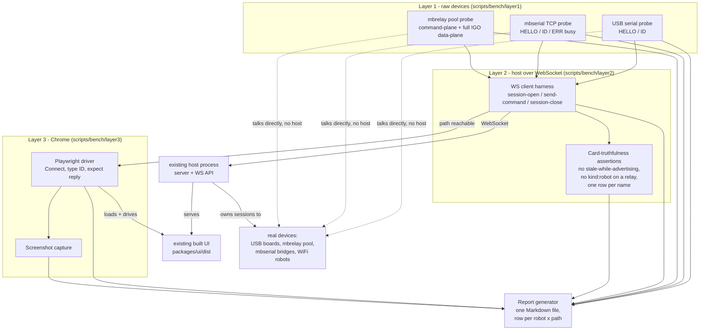
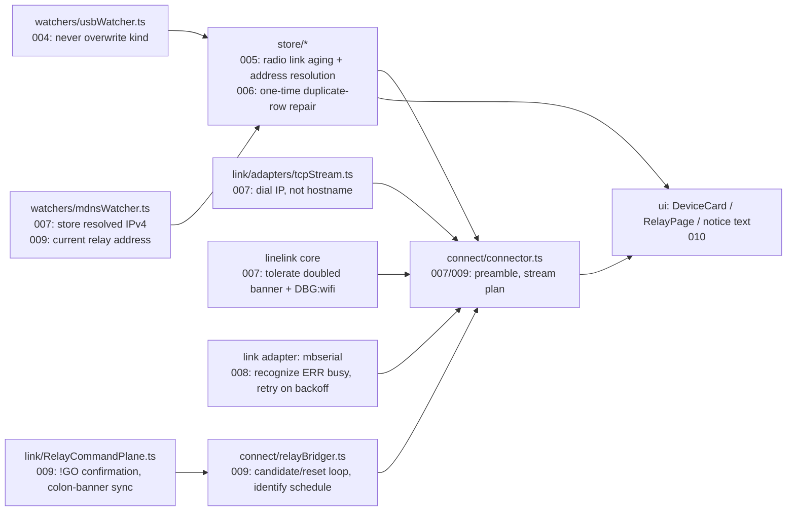

<!-- CLASI: Before changing code or making plans, review the SE process in CLAUDE.md -->

# Sprint 018: Connections that work on the real bench: layered test harness and defect burn-down

## Goals

Sprints 014-017 rebuilt the host around a SQLite store, watchers, one
connector/reconciler, and a snapshot projection, and closed with ~1,600
passing unit tests plus several "bench passes." On 2026-09-12/13 the
stakeholder found the real UI unusable: nothing connects reliably, and
cards show wrong or stale state. This sprint has one measurable goal —
**connections work, proven on the real bench, not in fakes** — reached in
two parts:

1. Build a committed, repeatable three-layer test harness (raw devices →
   host WebSocket → Chrome) that reports pass/fail per robot × path, so
   every defect fix below is checked against reality instead of another
   round of unit tests that "closed green" while the bench stayed broken.
2. Burn down the seven concrete defects the stakeholder and team-lead
   found on the live bench on 2026-09-13, each one verified against the
   harness the first ticket produces.

Motion is explicitly out of scope — the bench robots have no motors
tonight. The goal is **Linked**, not driving.

## Problem

Unit tests with fakes cannot catch what only exists on real hardware and
a real macOS network stack: a relay pool that reassigns which physical
relay answers each TCP connection, an mDNS `.local` hostname whose
`getaddrinfo` path silently prefers a dead IPv6 route, a farm bridge that
accepts a second TCP client and then goes silent instead of erroring, a
board that was a relay yesterday and gets renamed "robot" by a naming
watcher that never checks what it already knew. Every one of these was
invisible to the ~1,600 tests that were green at each sprint close. Seven
concrete defects, all evidenced against the stakeholder's real state
directory and the real bench on 2026-09-13:

1. No committed layered harness exists — every prior "bench pass" was an
   ad hoc script or a human clicking around, not repeatable and not run
   again when the next ticket lands.
2. `mbrelay` bridging through the real `torture` pool fails
   ("produced no banner" / "transport closed") even though the identical
   `!ECHO OFF … !GO` → `HELLO`/`ID` handshake succeeds by hand over raw
   TCP to the same pool.
3. USB SWD naming unconditionally writes `kind: "robot"` on every
   successful chip-ID read, silently downgrading a known relay (`vevav`)
   to a robot and leaving its USB link stuck retrying a connect that can
   never succeed.
4. Radio links and duplicate device rows never age out: 14-hour-old
   failed radio links naming a USB path the relay no longer uses persist
   on cards, and a database created before sprints 016-017's merge fixes
   still carries two rows for one physical robot.
5. Farm `mbserial` bridges are single-client: a second client gets
   `ERR busy` and the host misreports this as "no banner," with no
   retry.
6. A WiFi robot's `.local` hostname resolves fine for a ping but hangs
   `net.connect` for ~5 s — long enough to trip the host's 5 s connect
   timeout — because macOS's dual-stack resolution path stalls on an
   absent/dead route before falling back to the IPv4 address that
   answers in milliseconds. The same root cause plausibly explains
   intermittent farm-bridge (`mbserial`) failures, where `loki.local`
   resolves its IPv6 link-local address first and errors with no IPv4
   fallback.
7. Relay and mbserial cards show raw internal ids, name the wrong robot,
   claim "Not seen since ..." for a link that is advertising right now,
   and show a green "Linked" pill for a link that accepts TCP but has
   never answered a command.

## Solution

Tickets 001-003 build the harness first, because it is the acceptance
test for every ticket after it (per the harness issue's own framing —
"a path that passes Layer 1 but fails Layer 2 or 3 is a host/UI defect;
a path that fails Layer 1 is environment"). Tickets 004-006 fix data
correctness in the store and watchers (kind-overwrite, radio-link aging,
duplicate-row repair) so the snapshot the UI renders is truthful.
Tickets 007-009 fix the three transports (WiFi/mbserial connect-by-IP,
mbserial busy/retry, mbrelay bridging against the real pool) each from
an isolated reproduction against real hardware before touching
production code. Ticket 010 makes the UI say only what is true. Ticket
011 is the sprint's exit gate: the harness green, or explicitly
environment-blocked with evidence, for every path the bench can reach.

## Success Criteria

- The harness (`scripts/bench/`) runs standalone, refuses to run
  non-exclusively (detects `npm run dev` or another harness run holding
  a port via `lsof` and stops), and produces one Markdown report with a
  row per robot × path showing Layer 1/2/3 pass-fail and, on failure,
  the reason and screenshot links.
- Every ticket in this sprint names the exact harness command it was
  checked against and cites the report rows that prove it, per the
  acceptance discipline below — no ticket is "done" on unit tests alone.
- The seven defects in Problem above are each fixed and demonstrated on
  the report: relay kind is never overwritten by SWD naming; stale radio
  links and duplicate rows are gone from a real, previously-affected
  database; a farm `mbserial` bridge under contention reports "another
  app is connected" and retries; a WiFi robot connects in about the same
  time as the raw IPv4 probe (tens of ms, not 5 s); a bridge through
  `torture` to a robot it can actually reach reaches `Linked` and
  answers `ID`; every card names the right robot in plain words and
  shows "Linked" only when a session has actually answered.
- Full-bench ticket 011 shows the harness green (or Layer-1-documented-
  unreachable) for: USB `tovez`; WiFi `gopiv` and `vevov`; farm
  `mbserial` for `gopiv` (via `loki`) and `tigez` (via `magni`); radio
  via `torture` to `vevov` and `gopiv` (the two names `torture` actually
  reaches — see Scope); and radio via a host-attached relay.

## Scope

### In Scope

- A new, committed `scripts/bench/` harness: Layer 1 (raw device
  probes: USB serial, mbserial TCP, mbrelay command/data plane), Layer 2
  (host-over-WebSocket session-open/send-command/session-close against
  every Layer-1-reachable path, plus card-truthfulness assertions),
  Layer 3 (headless Playwright against the built UI), and a Markdown
  report generator.
- Store/watcher fixes: SWD naming never overwrites an existing device's
  `kind`; radio links age like mDNS links and resolve the relay's
  current address at connect time; a one-time repair merges placeholder
  device rows into real rows on store open.
- Transport fixes: WiFi and mbserial connections dial the resolved IPv4
  address instead of the raw `.local` hostname; the WiFi identify path
  tolerates a doubled banner and interleaved `DBG:wifi` lines; mbserial
  recognizes `ERR busy` distinctly from "no banner" and retries failed
  links on backoff; the `torture` mbrelay bridge is fixed from an
  isolated reproduction against the real pool.
- UI truthfulness: relay/mbserial card text names the actual robot
  attempted, in plain words matched to the transport that failed;
  "Linked" is shown only for a link that is `connected` with a session
  that has answered within the poll window; an advertising link never
  shows "Not seen since."
- Bench evidence for all of the above, captured by the harness this
  sprint builds.

### Out of Scope

- Motion / drive verbs of any kind (no motors on the bench robots
  tonight).
- Firmware flashing.
- `tovez`'s and `tigez`'s reachability over radio via `torture`: the
  team-lead's updated bench facts show `torture` reaches `vevov`
  (ch37/grp43) and `gopiv` (ch47/grp60) but not `tovez` (ch55/grp108) or
  `tigez` (ch55/grp114). Ticket 009 fixes the *bridging mechanism*
  against the names `torture` can reach; `tovez`/`tigez` staying
  unreachable via `torture` specifically is recorded by the harness as a
  Layer-1 environment result, not chased as a host defect, unless new
  bench evidence says otherwise.
- Any change to `microbit-radio-relay` or robot firmware.
- New calibration, telemetry, or trace work.

## Test Strategy

- **Unit/integration tests remain necessary but not sufficient** (per
  this sprint's non-negotiable acceptance discipline): every ticket that
  touches store/watcher/connector/link code gets scoped `vitest`
  coverage as usual.
- **The harness is the acceptance test.** A ticket is done only when the
  harness report shows the relevant robot × path passing Layer 2
  (WebSocket: session-open, `send-command ID`, matching `line` reply,
  session-close) **and** Layer 3 (Chrome: Connect → `ID` reply visible
  in the console), or when Layer 1 shows the path is unreachable at the
  device level (environment, recorded with evidence, e.g. `torture` vs.
  `tovez`/`tigez` above).
- Every ticket below names the exact harness command and the report row
  it relies on.
- One full `npm test` run happens once, inside `close_sprint`'s pre-close
  gate, per `.claude/rules/source-code.md` — not repeated per ticket.

## Architecture

**Sizing: substantial.** This sprint introduces a new subsystem (the
three-layer bench harness under `scripts/bench/`, a real cross-module
dependency from test infrastructure onto the host's WebSocket API and
the built UI — nothing that existed before this sprint composed those
three things together) and changes 7+ existing modules across three
packages (`watchers/usbWatcher.ts`, `watchers/mdnsWatcher.ts`, the
store's device/link tables and a new repair pass, `connect/connector.ts`,
`connect/relayBridger.ts`, `link/RelayCommandPlane.ts`,
`link/adapters/tcpStream.ts`, and several UI card components). That is
well past the compact tier's "one module, no new cross-module
dependency" bar on both counts, so this sprint gets the full
methodology, diagrams included.

### Architecture Overview

**New subsystem: the layered bench harness.**

**Defect-fix changes, by existing module:**

No entity-relationship diagram: no new tables and no changed columns.
`links`, `devices`, and `sightings` keep their sprint-014/015 shape;
this sprint changes *when* rows are written or cleared (aging, one-time
repair, address resolution at connect time), not the schema.

### Design Rationale

**Decision: the harness is a new top-level module (`scripts/bench/`),
not folded into `packages/host` or `packages/ui`.**
*Context*: the harness must run against a real host process and a real
built UI from outside both, and must refuse to run when either is
already in use by a developer (`npm run dev`) or another harness
instance.
*Alternatives considered*: (a) a host-internal "self-test mode"; (b) a
set of ad hoc scripts per sprint, as before.
*Why this choice*: (a) would let the harness see privileged internal
state instead of the same WebSocket/DOM surface a student's browser
sees, defeating the point of an outside-in check; (b) is exactly what
produced ~1,600 green tests and an unusable bench — nothing committed,
nothing re-run. A single committed module with three layers and one
report format is the only option that makes "every connection change
must pass this" enforceable.
*Consequences*: the harness becomes a real dependency other tickets
must not break; `scripts/bench/` needs its own lightweight test/lint
coverage so it doesn't silently rot, and its exclusivity check
(`lsof`) becomes a new piece of cross-cutting infrastructure other
future bench work will reuse.

**Decision: fix WiFi/mbserial hostname resolution by storing the
resolved IPv4 address on the link (from the mDNS A record) rather than
special-casing `net.connect` per transport.**
*Context*: both WiFi robots and farm mbserial/mbrelay bridges are
reached by a `.local` hostname discovered over mDNS; both show the same
failure shape (macOS's resolver stalling on an absent AAAA route or
returning a dead IPv6 link-local address before an IPv4 fallback).
*Alternatives considered*: (a) pass `{ family: 4 }` / `autoSelectFamily`
to `net.connect` at dial time and re-resolve every connect; (b) capture
the A record once in `mdnsWatcher` and store `{host, ip, port}` in the
link address, falling back to a bounded `dns.lookup(..., {family: 4})`
only when no IP is stored.
*Why this choice*: (b) - the mDNS watcher already receives the A record
as part of the normal browse/re-query it does today, so storing it is
free; a stored IP also survives a resolver hiccup at connect time,
where (a) would still pay a resolution round-trip (and its variance)
on every single connect.
*Consequences*: `links.address` for `wifi`/`mbserial` links gains an
`ip` field alongside `host`/`port` (JSON, no schema change); a link
whose service is re-announced with a changed IP must update this field
the same way an SRV/port change already does today.

**Decision: reproduce the `torture` mbrelay bridge failure in an
isolated script against the real pool before changing
`relayBridger.ts`/`RelayCommandPlane.ts`.**
*Context*: the manual raw-TCP handshake against `torture` succeeds every
time; the host's bridge fails with two different symptoms ("no banner
within the identify budget", "transport closed") against the same pool.
*Alternatives considered*: read the two modules and patch the most
plausible mismatch (e.g. banner-detection timing) directly.
*Why this choice*: `torture` is a pool where each TCP connection lands
on a different physical relay, and the pool's first line back is the
colon-dialect relay banner, "possibly delivered only after the first
command is sent" per the issue's own evidence - exactly the kind of
timing-sensitive, hardware-dependent detail that produces a plausible
but wrong fix if guessed at from source alone. An isolated reproduction
against the real pool turns "no banner within budget" into a concrete,
inspectable byte sequence before any production code changes.
*Consequences*: ticket 009 takes longer up front (bench time against
real hardware, not just an edit) but the fix ships with its own
reproduction as regression evidence, and the sizing note above already
scopes the ticket's target to the two names `torture` can actually
reach.

**Decision: centralize link-status text (failure reason, "Linked"
criteria, robot-name resolution) in one shared formatting helper rather
than fixing each UI component's text independently.**
*Context*: the self-review below flagged that ticket 010 touches
several UI components (`DeviceCard`, `RelayPage`, notice rendering) for
what is really one bug class - untrustworthy status text - and fixing
each component's strings independently risks shotgun surgery the next
time status wording needs to change.
*Alternatives considered*: patch each component's JSX/text inline where
the wrong string is produced today.
*Why this choice*: one shared helper (e.g. a `linkStatusText`/
`describeLinkFailure` module) that every card/page calls keeps "what
counts as Linked" and "what a failure reason says" defined once,
matching this codebase's existing pattern of shared UI helpers
(sprint 017 tickets 007-008 already consolidated several such
cross-page components for the same reason).
*Consequences*: ticket 010's plan must add this helper rather than
editing each component's text in place; a future wording change touches
one file, not three.

### Migration Concerns

- **One-time repair on store open** (ticket 006): merges placeholder
  device rows (`id === nameToValue(name)`, `kind: "robot"`) into a real
  row of the same name, re-pointing links and carrying `owned` forward.
  Runs once per store open, is idempotent (a store with no placeholders
  left does nothing), and must be proven against the stakeholder's real,
  already-affected `console.sqlite`, not only a synthetic fixture - this
  bug's cost is entirely in databases created before sprints 016-017's
  merge-on-identify fix landed, which is exactly the stakeholder's live
  file.
- **Link address shape change** (ticket 007): `links.address` for
  `wifi`/`mbserial` gains an optional `ip` field. Existing rows without
  it fall back to the bounded `dns.lookup(..., {family: 4})` path the
  same ticket adds, so no backfill migration is required - the field is
  populated on the next watcher observation.
- No breaking wire-contract change: `Snapshot` shape is unchanged by
  this sprint; only the truthfulness of the text and state within it
  changes (ticket 010).

### Open Questions

- Whether `tovez`/`tigez`'s non-reachability via `torture` is a robot-
  side radio issue (out of range, wrong channel/group derivation) or a
  `torture`-side limitation is not resolved by this sprint; ticket 009
  records it as a Layer-1 environment result with evidence rather than
  investigating the robot/relay hardware itself.
- Whether the IPv6-link-local failure mode on farm bridges (`loki.local`)
  needs a longer-term fix in how the fleet's mDNS advertises AAAA
  records is out of scope; this sprint's fix is host-side (dial the
  known-good IPv4 address) and does not touch relay/bridge firmware.

## Use Cases

### SUC-001: Prove a connection path with the layered bench harness
Parent: UC-011, UC-012, UC-015, UC-016, UC-018

- **Actor**: robot-console developer / stakeholder (via a committed
  script, not ad hoc)
- **Preconditions**: no other process (`npm run dev`, another harness
  run) holds the ports/bridges under test.
- **Main Flow**:
  1. Run `scripts/bench/run.sh` (or equivalent) against the current
     bench.
  2. Layer 1 talks to every discovered device directly; its results
     gate which paths Layers 2 and 3 attempt.
  3. Layer 2 opens a session over the host's real WebSocket API for
     each Layer-1-reachable path, sends `ID`, and checks the reply.
  4. Layer 3 drives the real built UI in headless Chrome for the same
     paths: Connect, type `ID`, expect the reply; screenshots every
     page.
  5. The harness writes one Markdown report, one row per robot × path,
     with a pass/fail per layer and, on failure, the reason.
- **Postconditions**: anyone can re-run the same command after any
  future change and get an honest, reproducible answer about what
  connects.
- **Acceptance Criteria**:
  - [ ] The harness refuses to run when `lsof` shows a port/bridge held
        by another process, and says why.
  - [ ] The report has one row per robot × path actually attempted this
        run, with Layer 1/2/3 pass-fail and failure reasons.
  - [ ] A path that fails only Layer 1 is labeled environment; a path
        that passes Layer 1 but fails Layer 2 or 3 is labeled a host/UI
        defect.

### SUC-002: A relay is never renamed "robot" by USB naming
Parent: UC-011

- **Actor**: robot-console host (automatic)
- **Preconditions**: a board already known as a relay (`kind: "relay"`)
  is plugged into USB.
- **Main Flow**:
  1. The USB watcher reads the board's chip ID over SWD, as it always
     does.
  2. It writes the device row without asserting `kind`, or keeps the
     existing `kind`, rather than unconditionally writing `"robot"`.
  3. Only a banner/ID reply on an opened session can set or change
     `kind`.
- **Postconditions**: the board's card still shows it as a relay; its
  USB link is not stuck auto-connecting as a robot.
- **Acceptance Criteria**:
  - [ ] A known relay's `kind` survives a fresh USB SWD read unchanged.
  - [ ] The harness's Layer 2 card-truthfulness assertion ("no relay has
        `kind: robot`") passes for a relay that was previously
        misclassified.

### SUC-003: Stale radio links and duplicate rows are cleaned up
Parent: UC-013, UC-014

- **Actor**: robot-console host (automatic)
- **Preconditions**: a store contains radio links whose relay has moved
  addresses, or duplicate device rows from before sprints 016-017's
  merge fix.
- **Main Flow**:
  1. On store open, a one-time repair merges any placeholder row into
     its matching real row, carrying `owned` and re-pointing links.
  2. A radio link resolves its relay's *current* transport address at
     connect time, not a cached one.
  3. A radio link with no successful sighting within its TTL, or whose
     relay link is gone/stale, is marked `stale` and hidden from cards,
     the same as an mDNS link.
- **Postconditions**: no card shows a 14-hour-old error naming a USB
  path the relay no longer uses; no robot has two rows.
- **Acceptance Criteria**:
  - [ ] Run against the stakeholder's real, previously-affected
        `console.sqlite`: the known duplicate (`gopiv` placeholder +
        real row) merges into one row with `owned` carried over.
  - [ ] A radio link older than its TTL with no fresh sighting is
        `stale` and absent from the card.

### SUC-004: A WiFi robot connects as fast as the raw IPv4 probe
Parent: UC-012

- **Actor**: robot-console host (automatic)
- **Preconditions**: a WiFi robot (`gopiv`, `vevov`) is owned and
  advertising `_robotlink._tcp`/`._udp`.
- **Main Flow**:
  1. The mDNS watcher stores the resolved IPv4 address alongside the
     `.local` hostname when it observes the service.
  2. The connector dials the stored IP (falling back to a bounded
     `dns.lookup(..., {family: 4})` only if no IP is stored yet), never
     the raw hostname.
  3. The identify path tolerates the robot's doubled banner and
     interleaved `DBG:wifi` lines.
- **Postconditions**: `session-open` for a WiFi link reaches `connected`
  in about the time the raw probe takes (tens of ms), not the 5 s
  connect-timeout ceiling.
- **Acceptance Criteria**:
  - [ ] `wifi-gopiv` and `wifi-vevov` connect and answer `ID` in the
        harness within roughly 1 s, not timing out at 5 s.
  - [ ] The harness's Layer 2/3 report shows both passing.

### SUC-005: A farm mbserial bridge reports contention and retries
Parent: UC-008

- **Actor**: robot-console host (automatic)
- **Preconditions**: a farm mbserial bridge (`loki`, `magni`, `hodr`) is
  reachable; it may already have another TCP client attached.
- **Main Flow**:
  1. The connector dials the bridge's resolved IPv4 address (per
     SUC-004's fix, since the same hostname-resolution defect affects
     farm bridges).
  2. If the bridge replies `ERR busy`, the link is marked failed with a
     reason naming contention ("another app is connected to this
     bridge"), not "no banner."
  3. A failed mbserial link on an owned robot retries on backoff until
     it connects.
- **Postconditions**: two host processes never silently fight over one
  bridge; the loser's card says so and keeps retrying.
- **Acceptance Criteria**:
  - [ ] `ERR busy` is reported distinctly from "no banner" in the link's
        `state_reason`.
  - [ ] A failed mbserial link retries and reaches `connected` once the
        bridge is free, without a manual reconnect.
  - [ ] The harness shows `mbserial-gopiv` (via `loki`) and
        `mbserial-tigez` (via `magni`) connecting within about 1 s at
        Layers 2 and 3.

### SUC-006: A student bridges through the torture mbrelay pool
Parent: UC-004, UC-016

- **Actor**: Student
- **Preconditions**: `torture` is reachable and can reach the target
  robot over radio (`vevov` or `gopiv`, per this sprint's bench facts).
- **Main Flow**:
  1. `session-open {relayLinkId: "mbrelay-torture", name}` runs the
     command-plane preamble and `!GO`, matching the manual handshake
     verified by hand against the real pool.
  2. The bridge reaches `connected`/`Linked` and answers `ID`.
- **Postconditions**: bridging through `torture` to a reachable name
  works every time, not intermittently.
- **Acceptance Criteria**:
  - [ ] An isolated reproduction script demonstrates the working
        handshake against the real pool before the production fix lands.
  - [ ] The harness shows `torture` → `vevov` and `torture` → `gopiv`
        passing Layers 2 and 3.
  - [ ] `torture` → `tovez`/`tigez` is recorded as Layer-1-unreachable
        with evidence, not chased as a defect.

### SUC-007: Cards show truthful, plain-language connection state
Parent: UC-011, UC-014, UC-017

- **Actor**: Student
- **Preconditions**: any relay or mbserial link is present on a card.
- **Main Flow**:
  1. A bridge-status line names the robot actually attempted, in plain
     words, and shows Switch/Disconnect only while a bridge session
     exists.
  2. An advertising link never reads "Not seen since ..."
  3. Failure advice matches the transport (USB/mbserial/relay radio each
     get their own plain-language reason).
  4. "Linked" is shown only when a link is `connected` with a session
     that has answered within the poll window.
- **Postconditions**: the stakeholder can tell, from the card alone,
  what is actually happening.
- **Acceptance Criteria**:
  - [ ] The harness's Layer 3 screenshots show the right robot name and
        no raw internal ids on every card checked.
  - [ ] No card shows "Linked" for a link that accepts TCP but has never
        answered a command.

## GitHub Issues

(None yet - all seven issues driving this sprint are local CLASI issues
in `clasi/issues/`.)

## Definition of Ready

Before tickets can be created, all of the following must be true:

- [x] Sprint planning document is complete (sprint.md, including its
      Architecture and Use Cases sections)
- [x] Architecture review passed (or skipped, for changes with no
      architectural impact)
- [ ] Stakeholder has approved the sprint plan

## Tickets

| # | Title | Depends On |
|---|-------|------------|
| 001 | Bench harness Layer 1: raw-device probes (USB serial, mbserial TCP, mbrelay pool) | - |
| 002 | Bench harness Layer 2: host-over-WebSocket session checks and card-truthfulness assertions | 001 |
| 003 | Bench harness Layer 3: headless Chrome pass and the per-robot x path report | 002 |
| 004 | SWD naming never overwrites a known relay's kind | 003 |
| 005 | Radio link aging and current-address resolution at connect time | 003 |
| 006 | One-time duplicate device-row repair on store open | 005 |
| 007 | WiFi and mbserial connect by resolved IPv4 address, not the raw .local hostname | 003 |
| 008 | mbserial busy detection and retry on backoff | 007 |
| 009 | mbrelay bridge fix against the real torture pool, from an isolated reproduction | 003 |
| 010 | UI truthfulness: shared link-status text, correct Linked criteria, relay/mbserial card state | 004, 006, 008, 009 |
| 011 | Full-bench gate: harness green across every reachable path | 004, 005, 006, 007, 008, 009, 010 |

Tickets execute serially in the order listed.
