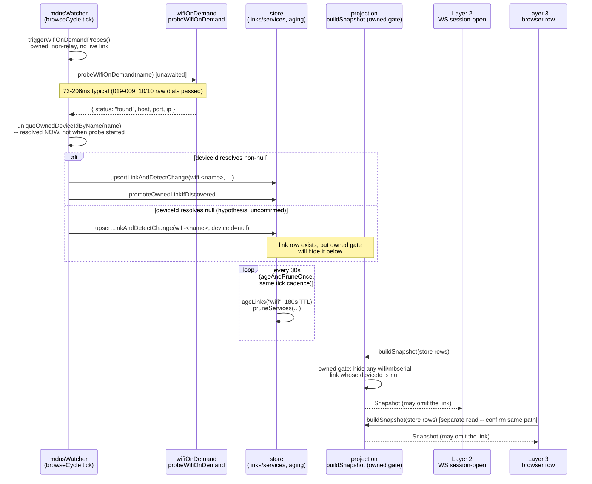

<!-- CLASI: Before changing code or making plans, review the SE process in CLAUDE.md -->

# Sprint 020: WiFi Discovery Reliability

## Goals

Root-cause and fix the WiFi robot discovery reliability gap, then verify
it holds under repeated, sequential harness runs. Sprint 019 (tickets
002, 009) proved the *probe* is fine — a direct TCP dial to
`<name>.local:7654` and HELLO handshake succeeds reliably (206 ms link
creation, 73 ms direct probe) — but 019-009's own ten-run gate against
`tigez` measured **2 pass / 8 fail**, with Layer 2 (the host's own
WS-level session-open / live snapshot) failing in most of the failures.
The gap is between "the robot is reachable" and "a `wifi` link row
exists in the live snapshot" — not an announcement-interval timing
artifact, and not fixable by another retry. This sprint diagnoses that
gap before patching it, per 019-009's own scope note that root-causing
an intermittent async discovery race is structural work, not a
one-line fix.

This sprint is a deliberate prerequisite to the next one (shared
console host daemon + LAN discovery): that feature's own
self-advertisement and discovery story would otherwise be built and
tested on top of a mechanism currently succeeding 2 times in 10.

## Problem

`watchers/mdnsWatcher.ts` and `discovery/wifiOnDemand.ts` (019-002)
implement bounded on-demand resolution (`dns.lookup` + TCP 7654 HELLO)
for robots with no current `wifi` link, but 019-009's ten-run gate shows
the resulting link does not reliably persist into the live snapshot that
Layer 2 (WS session-open) and Layer 3 (browser-visible link row) read
from. Whether the on-demand fallback fires reliably, or fires but loses
a race with the reconciler/snapshot-write path, is unknown and is this
sprint's first job to determine.

## Solution

Diagnose first, then fix:

1. Instrument or trace the path from "on-demand probe succeeds" to
   "link row exists in the live snapshot" across
   `discovery/wifiOnDemand.ts`, `watchers/mdnsWatcher.ts`, and the
   reconciler/snapshot-write policy that consumes their output, to find
   where the 8-of-10 failures actually occur (fallback not firing;
   firing but the result being dropped or overwritten; a race with
   host-restart timing; something else).
2. Fix the identified defect at its actual location — not a broader
   rewrite, and not another retry loop layered on top of the existing
   fallback.
3. Re-run the same class of verification 019-009 ran (repeated,
   sequential `scripts/bench/run.sh` runs against a WiFi-reachable
   robot) until the pass rate is reliable, not a single anecdotal
   success.

## Success Criteria

- The diagnosis names the specific point in the discovery pipeline
  where reachability and snapshot state diverge, backed by evidence
  (logs/traces), not conjecture.
- A WiFi-reachable owned robot reliably gets a `wifi` link in the live
  snapshot within a bounded time of host start, across repeated
  sequential harness runs (target: matching or exceeding 019-009's
  ten-run gate, at a pass rate high enough to trust — not 2/10).
- The fixture is chosen by property ("a robot with a live WiFi path"),
  never a hardcoded name — two sprint-019 tickets went stale exactly
  that way, and the roster changes constantly (three moves in one
  evening during sprint 019; `tigez` itself moved to the farm mid-run
  the day this roadmap was written).

## Scope

### In Scope

- Diagnosis of the reachability-vs-snapshot gap in
  `watchers/mdnsWatcher.ts`, `discovery/wifiOnDemand.ts`, and whatever
  reconciler/snapshot-write logic sits between them.
- A targeted fix for the actual defect found.
- Verification via repeated sequential harness runs against a
  property-selected WiFi-reachable fixture (re-confirm the current
  roster and addresses before running — do not assume `tigez`,
  `gopiv`, or `vevov` are still reachable or in the same place).
- Re-examining whether the existing `relayLeaseRevocation` lease-
  takeover seam (016-004) is a reusable pattern for the on-demand link
  path, per the design direction preserved from sprint 018 ticket 012's
  retired analysis (git commit `cc0e868`) — evaluate, don't assume it
  transfers unchanged.

### Out of Scope

- The shared console host daemon, CLI, and LAN-discovery work
  (`shared-console-host-daemon-cli-and-discovery.md`) — planned as the
  next sprint, deliberately sequenced after this one so it builds on a
  fixed foundation.
- The `request_flash` MCP client-timeout issue
  (`mcp-flash-outlives-client-timeout.md`) — unrelated subsystem,
  bundled with the daemon sprint instead.
- Relay contention's *own* fix beyond evaluating the lease-takeover
  pattern's applicability here (016-004 already exists; this sprint
  does not redo that work, only considers reusing its seam).
- USB-attached and host-attached relay paths — no USB serial devices
  are attached to the bench as of this writing, so those paths remain
  unverifiable regardless of what this sprint does.

## Test Strategy

(Describe the overall testing approach for this sprint: what types of tests,
what areas need coverage, any integration or system-level testing needed.)

## Architecture

**Sizing: Substantial.** This is not a new subsystem, but diagnosing and
fixing an intermittent cross-module race plausibly touches 3+ existing
modules (`watchers/mdnsWatcher.ts`, `discovery/wifiOnDemand.ts`,
`store/index.ts`'s aging/pruning and `upsertLink`, `projection.ts`'s
snapshot-build/owned-gate, and possibly `connect/reconciler.ts` or the
session-open path) and may add a new cross-module dependency (e.g. a
session-open request driving an on-demand probe directly, rather than
only the watcher's own timer). The full 7-step methodology applies,
including a diagram, because the value here is showing *where in an
existing pipeline* five different modules' state changes could diverge
from each other — exactly the kind of thing prose alone hides.

### Step 1 — Understand the problem

019-002 added `discovery/wifiOnDemand.ts`'s bounded on-demand probe
(`dns.lookup` + TCP 7654 `HELLO`) and wired it into
`watchers/mdnsWatcher.ts`'s `triggerWifiOnDemandProbes`, called once at
watcher start and once per 30 s `browseCycle` tick. 019-009's own
ten-run gate against `tigez` measured **2 pass / 8 fail**, with **Layer
2 (WS session-open / live snapshot) failing in 5 of the 8 failures**
(the other 3 passed Layer 2 but failed Layer 3), not just a Layer-3-only
timing artifact. Layer 1's raw direct-dial probe passed
**10/10** — the robot's WiFi radio was reachable the entire time. So the
defect is not "the robot is unreachable" and not "the probe is slow or
wrong" — it is somewhere between "the probe resolves `found`" and "a
`wifi` link row is visible in what Layer 2/3 read." This sprint's first
job is to locate that point with evidence; its second is to fix it.

### Step 2 — Responsibilities in play

- **Probing** (`discovery/wifiOnDemand.ts`): resolve `<name>.local`,
  confirm `HELLO`. Proven reliable (73–206 ms, 10/10 raw dials in
  019-009). Not itself under suspicion, but its *caller's* handling of
  its result is.
- **Triggering and upserting** (`watchers/mdnsWatcher.ts`'s
  `triggerWifiOnDemandProbes`, `upsertLinkAndDetectChange`,
  `promoteOwnedLinkIfDiscovered`): decides which owned names lack a live
  link, fires probes unawaited, and on `found` upserts the link row and
  promotes it to `connectable`. The in-flight `Set` and the `stopped`
  flag both gate this path and are candidate sources of a dropped or
  delayed upsert.
- **Aging and pruning** (`store/index.ts`, driven from the same
  watcher's `ageAndPruneOnce`, every 30 s): ages `links(wifi)` past
  `DEFAULT_WIFI_TTL_MS` (180 s) to `stale`, and prunes matching
  `services` rows. A link created by a late-resolving probe could in
  principle be aged or pruned by a nearby tick if its `last_seen`
  bookkeeping doesn't match what the passive `handleWifi` path
  guarantees for an mDNS-observed link — unconfirmed, to be checked by
  instrumentation, not assumed.
- **Snapshot projection** (`projection.ts`'s `buildSnapshot`): the
  **owned gate** — "hides any wifi/mbserial link whose device is not
  owned" — drops a link entirely from the wire snapshot whenever its
  `deviceId` is `null`. `upsertLinkAndDetectChange`'s on-demand-probe
  call path resolves `deviceId` via `uniqueOwnedDeviceIdByName(name)` at
  the moment the probe's `.then()` fires, not at the moment the probe
  was started. If that lookup can return `null` for a name that *was*
  uniquely owned when the probe started (e.g. a transient multi-match,
  or a store read racing something else touching `devices`), the link
  row would exist in the `links` table yet never appear in the snapshot
  Layer 2/3 read — which matches "no link found in the snapshot" and "no
  live-snapshot link" more precisely than "the link was never created at
  all." This is a hypothesis grounded in reading `projection.ts`'s own
  owned-gate doc comment, not a conclusion — the diagnosis ticket must
  confirm or rule it out with a trace, not assume it.
- **Read paths** (Layer 2's WS `session-open`, Layer 3's browser-visible
  row): both are assumed to read the same `buildSnapshot` output, but
  this sprint has not yet confirmed they read it the *same way* (e.g.
  the same broadcast vs. a per-request rebuild) — worth checking,
  because a mismatch between the two would itself explain why L2 and L3
  don't always fail together in 019-009's table (run 1: L2 pass, L3
  fail; run 4: L2 fail, L3 pass).

### Step 3 — Modules (purpose, one sentence each)

- `discovery/wifiOnDemand.ts` — confirms one robot name is reachable
  over WiFi right now. Boundary: pure probe, no store access, no
  scheduling. Serves SUC-002.
- `watchers/mdnsWatcher.ts` — keeps `services`/`links(wifi|mbserial|
  mbrelay)` rows current from both passive mDNS observation and the
  active on-demand fallback, and ages/prunes them on one shared timer.
  Boundary: owns all writes to those rows; does not itself decide what
  a session-open or browser read does with them. Serves SUC-001, SUC-002.
- `store/index.ts` (aging/pruning slice) — the TTL-driven state machine
  that ages a link to `stale` and eventually prunes its `services` row.
  Boundary: pure state transitions over `links`/`services`, no
  discovery/networking knowledge. Serves SUC-001.
- `projection.ts` — the pure `(rows) -> Snapshot` read that Layer 2/3
  ultimately depend on, including the owned-gate visibility rule.
  Boundary: read-only, no side effects, no I/O beyond the store.
  Serves SUC-001, SUC-002.
- `connect/reconciler.ts` / session-open path (`sessionOps.ts`,
  `wsMessages.ts`) — candidate location for a **fix**, not a diagnosis
  target: if the diagnosis finds that the passive tick-driven probe is
  fundamentally too loosely coupled to "someone is asking for this link
  right now," a request-driven trigger here (mirroring
  `relayLeaseRevocation.ts`'s in-process, no-schema takeover-seam
  pattern named in this sprint's Scope) is the candidate fix location.
  Boundary: this sprint evaluates whether that pattern transfers; it
  does not commit to using it in advance of diagnosis findings.

### Step 4 — Diagram

A sequence diagram earns its place here: the defect is specifically
about *timing* between five modules that each look correct in
isolation, which prose can't show as clearly as an ordered flow can. No
ERD (no data-model change proposed at planning time) and no dependency
graph (no module gains a new *directional* dependency yet — that is
exactly the open question ticket 001 resolves before ticket 002 can
decide whether one is added).

### Step 5 — What Changed / Why / Impact / Migration

**What Changed** (planned, subject to ticket 001's findings): 1)
instrumentation/tracing added along the probe→upsert→age/prune→snapshot
path (ticket 001); 2) a targeted fix at whatever point ticket 001
locates (ticket 002); 3) an evaluation of whether
`relayLeaseRevocation.ts`'s in-process takeover-seam pattern applies to
request-driven WiFi link creation (folded into ticket 002's own
analysis, not a separate module); 4) statistical re-verification via
the existing three-layer harness (ticket 003).

**Why**: 019-009 proved the existing fallback is unreliable (2/10) and
explicitly deferred root-causing it as structural work. Building the
next sprint's LAN-discovery feature on top of a mechanism that succeeds
2 times in 10 would make that sprint's own verification meaningless.

**Impact on Existing Components**: `discovery/wifiOnDemand.ts` is
expected to be unchanged (already proven reliable) unless diagnosis
finds otherwise. `watchers/mdnsWatcher.ts` and/or `store/index.ts`
and/or `projection.ts` gain either instrumentation (ticket 001,
removable or log-gated) or a targeted behavior change (ticket 002). If
the fix lands in the session-open path instead, `connect/reconciler.ts`
or `sessionOps.ts` gains a new call into the on-demand probe — a new,
but narrow, dependency in the existing inward direction (presentation/
session layer calling into a lower-level discovery primitive, not the
reverse).

**Migration Concerns**: None expected — no schema change is currently
planned. If ticket 002's findings require one (e.g. a field to
disambiguate "probe in flight" from "genuinely absent" more durably than
the in-memory `Set` does today), that is a **revision-in-place** to this
Architecture section per the `architecture-authoring` skill's convention,
not a silent scope change, and the sizing/diagram above would be
re-checked at that point.

### Architecture Overview

See Steps 1–5 above; the sequence diagram is the primary artifact. There
is no new component being composed into the system — this sprint changes
behavior inside an existing pipeline (probe → upsert → age/prune →
project → read), so there is no separate component/module diagram beyond
Step 3's module list.

### Design Rationale

**Decision: diagnose before patching, with a dedicated instrumentation
ticket that produces evidence before any fix ticket starts.**
- **Context**: 019-002 patched this exact symptom once already and
  closed on one anecdotal success (206 ms against `tovez`); 019-009's
  own ten-run gate then showed that fix holds only 2/10. A second
  patch-first attempt risks the same outcome for the same reason — the
  actual failure point was never located.
- **Alternatives considered**: (a) add a longer timeout or another retry
  layer on the existing fallback — rejected, the dispatch context and
  019-009's own evidence (failure rate got *worse* over the run, not
  better, arguing against "a race that resolves eventually") both argue
  this would not address the actual defect; (b) rewrite the discovery
  pipeline broadly — rejected as disproportionate before the actual
  defect is known, and against this sprint's own Scope ("a targeted fix
  for the actual defect found," not a broader rewrite); (c) diagnose
  first with instrumentation, then fix precisely — chosen.
- **Consequences**: ticket 002 (the fix) cannot be fully scoped until
  ticket 001 (diagnosis) reports its findings; ticket 002's own plan is
  written to be revised by ticket 001's evidence rather than
  pre-committing to one of the hypotheses in Step 2 above.

**Decision: evaluate, don't assume, `relayLeaseRevocation.ts` as a reuse
pattern for WiFi link creation.**
- **Context**: the retired 018-012 analysis (git `cc0e868`) suggested
  the same in-process, no-schema takeover-seam shape relay bridging
  already uses could apply to "an owned robot has no WiFi link."
  `relayLeaseRevocation.ts`'s own doc comment explains *why* it avoided
  a schema column: the signal only ever needs to reach code already
  running in this same Node process. The same reasoning could apply to
  "a session-open request wants a WiFi link that doesn't exist yet."
- **Alternatives considered**: (a) assume it transfers unchanged and
  build a schema-free trigger seam in ticket 002's plan up front —
  rejected, per this sprint's own Scope wording ("evaluate, don't
  assume it transfers unchanged") and because the diagnosis might show
  the gap isn't about *triggering* a probe at all (e.g. it could be
  purely in aging/pruning or the owned-gate, where a takeover seam adds
  nothing); (b) ignore the pattern entirely — rejected, it is
  specifically called out in Scope as something to re-examine; (c)
  fold the evaluation into ticket 002's implementation plan, applied
  only if diagnosis supports it — chosen.
- **Consequences**: ticket 002 documents the evaluation's outcome
  (adopted, adapted, or rejected with reasoning) regardless of which way
  it goes, so the next sprint doesn't have to re-derive whether this was
  considered.

### Migration Concerns

None planned. See Step 5 above for the revision-in-place trigger if
diagnosis surfaces a schema need.

## Use Cases

### SUC-001: The reachability-to-snapshot gap is located with evidence
Parent: UC-012

- **Actor**: robot-console developer (diagnosis), running the existing
  three-layer bench harness and/or targeted instrumentation against a
  live bench.
- **Preconditions**: at least one owned robot has a live WiFi path,
  resolved by property at run time (never a hardcoded name — see
  Success Criteria). 019-009's ten-run evidence
  (`<scratchpad>/019-009/tigez-wifi-10run-summary.log` and per-run
  reports) is available as the starting dataset, not to be re-derived
  from scratch.
- **Main Flow**:
  1. Instrument or trace the path from `probeWifiOnDemand` resolving
     `found` through `upsertLinkAndDetectChange`,
     `promoteOwnedLinkIfDiscovered`, `ageAndPruneOnce`, and
     `projection.buildSnapshot`'s owned gate, plus whatever Layer 2's
     WS `session-open` and Layer 3's browser read each actually consume.
  2. Run enough repeated, sequential harness cycles (or a targeted
     reproduction outside the full harness, if that isolates the race
     faster) to catch the divergence in the act, not just its aftermath.
  3. Name the specific point where "the robot is reachable" and "a
     `wifi` link row is visible in the live snapshot" diverge —
     confirming, refining, or ruling out the hypotheses in this
     sprint's Architecture Step 2 (deviceId resolving null at upsert
     time; an aging/pruning race; the in-flight `Set` swallowing a
     retry; Layer 2 and Layer 3 reading the snapshot differently; or
     something not listed there).
  4. Record the finding with the evidence that supports it (a trace, a
     log excerpt, a reproduction script) — conjecture alone does not
     satisfy this use case.
- **Postconditions**: the sprint has a named, evidenced root cause (or a
  short list of confirmed contributing causes) to hand to SUC-002's
  fix — not a hypothesis restated as a conclusion.
- **Acceptance Criteria**:
  - [ ] The diagnosis names a specific module/function/state transition
        as the divergence point, with at least one piece of concrete
        evidence (log line, trace, or reproduction) supporting it.
  - [ ] Each hypothesis in Architecture Step 2 that evidence rules out
        is recorded as ruled out, with the evidence that ruled it out
        — not silently dropped.
  - [ ] If evidence implicates more than one contributing cause (e.g.
        both an owned-gate visibility issue and a separate aging race),
        all implicated points are named, not just the first one found.

### SUC-002: An owned, WiFi-reachable robot's link reliably survives into the live snapshot
Parent: UC-012

- **Actor**: robot-console host (automatic); indirectly, the student or
  developer who expects to see and open a WiFi-connected robot.
- **Preconditions**: SUC-001's diagnosis has named the actual defect.
  An owned robot has a live WiFi path, resolved by property at run time
  (`tigez` was that fixture as of 2026-09-18; the fixture may have moved
  by execution time — re-confirm, never assume).
- **Main Flow**:
  1. The host's existing on-demand probe (`discovery/wifiOnDemand.ts`,
     unchanged unless diagnosis implicates it) confirms the robot is
     reachable.
  2. The fix identified by SUC-001 ensures the resulting `wifi` link row
     is created, correctly attributed to its owned device, and neither
     aged nor hidden from the projection before a session-open or
     browser read can see it.
  3. A caller — Layer 2's WS `session-open` or Layer 3's browser page —
     reads the live snapshot and finds the link.
- **Postconditions**: the `wifi` link is visible in the live snapshot
  within a bounded time of host start (or of the robot becoming
  reachable), on a high and repeatable proportion of attempts — not
  contingent on winning a race that was never supposed to be there.
- **Acceptance Criteria**:
  - [ ] Ten or more consecutive, sequential `scripts/bench/run.sh` runs
        against a property-selected, WiFi-reachable owned robot pass
        Layer 2 and Layer 3's WiFi checks at a pass rate high enough to
        trust as reliable — stated and justified in the closing ticket,
        matching or exceeding 019-009's own ten-run gate (2/10 is the
        floor this replaces, not a target).
  - [ ] The fix is scoped to the actual defect SUC-001 names — a ticket
        that only adds a longer timeout or another retry layer without
        addressing the named defect does not satisfy this criterion.
  - [ ] The `relayLeaseRevocation.ts` reuse question (this sprint's
        Scope) is explicitly answered in the closing ticket — adopted,
        adapted, or rejected, with reasoning — regardless of which fix
        is chosen.

### SUC-003: Reliability is confirmed statistically, not anecdotally
Parent: UC-012

- **Actor**: robot-console developer, closing this sprint.
- **Preconditions**: SUC-002's fix has landed.
- **Main Flow**:
  1. Re-confirm the current WiFi-reachable robot roster at run time (the
     bench moves constantly — `tigez` alone moved `naught.local` →
     `magni.local:36491` mid-sprint-019 and the original report's
     `gopiv`/`vevov` addresses were both unreachable by 019-009's own
     run).
  2. Run ten or more consecutive, sequential full harness runs against
     the property-selected fixture(s), recording every run's L1/L2/L3
     result in a table, the same shape 019-009 used.
  3. State the resulting pass rate and compare it explicitly against
     019-009's 2/10 baseline.
- **Postconditions**: the sprint's closing evidence is a repeated-run
  table with a stated pass rate, not a single run's screenshot — a
  single pass proved nothing in 019-002 and must not be relied on again
  here.
- **Acceptance Criteria**:
  - [ ] A ten-or-more-run table exists in the closing ticket's evidence,
        in the same per-run L1/L2/L3/reason shape as
        `tigez-wifi-10run-summary.log`.
  - [ ] The stated pass rate and its threshold for "reliable enough" are
        both explicit — not left as "looks better now."
  - [ ] Any run invalidated by genuine bench-sharing (a foreign process
        transiently holding a resource, as 019-009 saw twice) is
        recorded as such and excluded from the count, exactly as
        019-009 did, rather than silently omitted or silently counted
        as a pass/fail.

## GitHub Issues

(GitHub issues linked to this sprint's tickets. Format: `owner/repo#N`.)

## Definition of Ready

Before tickets can be created, all of the following must be true:

- [ ] Sprint planning document is complete (sprint.md, including its
      Architecture and Use Cases sections)
- [ ] Architecture review passed (or skipped, for changes with no
      architectural impact)
- [ ] Stakeholder has approved the sprint plan

## Tickets

| # | Title | Depends On |
|---|-------|------------|
| 001 | Diagnose the WiFi reachability-to-snapshot divergence | — |
| 002 | Fix the located WiFi link visibility defect | 001 |
| 003 | Statistically verify WiFi discovery reliability across repeated harness runs | 002 |

Tickets execute serially in the order listed.
