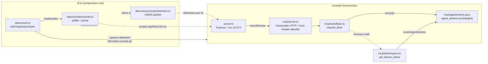

<!-- CLASI: Before changing code or making plans, review the SE process in CLAUDE.md -->

# Sprint 021: Shared Console Host: Daemon CLI, LAN Discovery, and Flash Timeout Recovery

## Goals

Ship one shared console host on the bench LAN: a daemon CLI to
start/stop/status it plus a browser-open verb, self-advertisement so
agents and people find the live host wherever it runs, and LAN binding
so machines beyond the stakeholder's own Mac can reach it. Also fix a
small, unrelated rough edge in the same MCP surface: `request_flash`
outliving a default MCP client timeout.

**Depends on Sprint 020 (WiFi Discovery Reliability) merging first.**
Both this sprint's self-advertisement and the existing `_robotlink._tcp`
discovery it reuses sit on the same mDNS machinery
(`watchers/mdnsWatcher.ts`, `discovery/wifiOnDemand.ts`) that 020 fixes.
Building and testing "agents find the live host" on top of a discovery
layer currently succeeding 2 times in 10 (019-009's gate) would mean
diagnosing two overlapping failure modes at once and re-doing this
sprint's discovery verification after 020 lands anyway. Do not start
this sprint's discovery/advertisement work before 020 is merged to
`main`.

## Problem

Today, per code verified 2026-09-18: the MCP server is mounted
in-process inside the console host, so with no host running there is no
MCP endpoint at all and no lifecycle verb to start one. The host is
bound to `127.0.0.1` only and advertises itself nowhere, so a host on a
non-default port is undiscoverable and unreachable from other bench
machines. Worse, `server.ts`'s `EADDRINUSE` handler tells a second
caller to start *another* host on a different port — backwards for a
shared singleton, and the exact mechanism that let an "isolated" second
host grab the real robot `vevov` over WiFi within a minute during sprint
019 ticket 006, despite its own port and state dir.

Separately: `request_flash` deliberately awaits the flash task's
terminal promise so the MCP response carries the real outcome (avoiding
a polling design where a snapshot overlay disappears the instant a
flash settles). But a real flash can outlast a client's default 60 s MCP
timeout — confirmed live in 019-008, where `tigez` flashed successfully
but the calling client never received the result. A timeout then looks
identical to a failure, risking a needless retry of a flash that already
succeeded.

## Solution

**Daemon and discovery** (after Sprint 020 lands):
- A CLI (`robot-console start` / `stop` / `status` / a browser-open
  verb) that manages the host as a daemon. `start` is idempotent: if a
  host is already running, report it and succeed rather than starting a
  second one.
- Self-advertisement (e.g. `_robotconsole._tcp`) with the host's actual
  port, reusing the existing mDNS idiom the codebase already applies to
  `_mbserial._tcp` / `_mbflash._tcp` / `_mbrelay._tcp` / `_robotlink._tcp`
  rather than inventing a new mechanism.
- LAN binding beyond `127.0.0.1` — the bench spans subnets (the Mac on
  192.168.1.x, `naught` on 192.168.4.x), so which interface(s) to bind is
  itself work to figure out, not an assumed given.
- Invert the already-running semantic: `EADDRINUSE` (or a discovery hit
  showing a live host) means *attach to it*, never "pick another port."

**Flash timeout recovery**: make the flash outcome recoverable when a
client's own timeout fires before the flash settles, using the durable
`agent_actions` record (019-006) that already stores `result` and
`result_reason` for every executed flash — a lookup keyed by a returned
handle reads an existing audit row, it does not reintroduce the
approval-gate machinery sprint 019 removed. Whether to also keep
returning the outcome inline when the flash settles within the client's
window (belt-and-suspenders) versus recovery-only is a Detail Mode
design decision, not decided here.

## Success Criteria

- A host not currently running can be started by a CLI command; a
  second `start` against an already-running host reports that and exits
  successfully without starting a second process.
- `stop` and `status` work against a daemonized host; the browser-open
  verb reaches the running host's actual (possibly non-default) port.
- The host advertises itself over mDNS with its real port, and can be
  bound to reach at least one non-localhost interface on the bench.
- A second host start attempt against a running host never independently
  claims hardware (the `vevov`-grab failure mode from 019-006 does not
  recur).
- A flash whose MCP call times out before settling has its outcome
  recoverable afterwards by the caller, without re-flashing.

## Scope

### In Scope

- Daemon CLI: start/stop/status verbs, a browser-open verb, pidfile
  and/or discovery-based liveness detection, idempotent `start`.
- mDNS self-advertisement of the console host, reusing existing
  `mdnsWatcher.ts` idiom.
- LAN binding strategy given the bench's multiple subnets (investigate;
  do not assume a single obvious interface).
- Inverting `EADDRINUSE` / already-running handling from "start
  elsewhere" to "attach here."
- `request_flash` timeout recovery via the existing `agent_actions`
  durable record.
- The open questions listed in `shared-console-host-daemon-cli-and-discovery.md`
  (daemonization mechanism, stale-pidfile handling, log destination, MCP
  client reconnect behavior on host restart, bind-interface choice,
  local-vs-shareable URL for the open verb) are resolved during Detail
  Mode planning for this sprint, not pre-decided here.

### Out of Scope

- Any gate, approval prompt, or "safe mode" for drive/flash on the LAN.
  This is accepted, recorded risk from the stakeholder's own explicit
  choice (sprint 019 removed the approval subsystem at his direction);
  re-opening it is out of scope for this sprint.
- An always-on launchd service as the *primary* start-up model — the
  stakeholder chose CLI-driven start/stop over both "ask before
  starting" and "always-on service." launchd may still be considered as
  a crash-recovery implementation detail underneath the CLI, not as a
  replacement for it.
- The WiFi discovery reliability fix itself (Sprint 020) — this sprint
  consumes that fix as a merged prerequisite and does not re-attempt it.
- USB-attached and host-attached relay verification — no USB serial
  devices are attached to the bench as of this writing.
- Making `agent_actions` a pending/lifecycle table — it stays
  append-only, describing only things that already happened; a timeout
  recovery read is not a pending state.

## Test Strategy

Every module this sprint touches already has an established unit-test
convention (`server.test.ts`'s fake `WebSocketServerLike`/`WebSocketLike`,
`cli.test.ts`'s injectable `CliDeps`, `mdnsDiscovery.test.ts`'s fake
`MdnsBackend`) — new code follows the same injectable-seam pattern rather
than touching a real port, a real multicast socket, or a real child
process in a unit test:

- **EADDRINUSE inversion** (ticket 001): unit tests against a fake
  `listen()`/HTTP client fake asserting the default-port/explicit-port
  branch and the host-info probe's three outcomes (identifies as
  robot-console → attach; responds but not identifiable → hard fail;
  no response → hard fail).
- **LAN bind + advertisement + Host-header allowlist** (ticket 002): a
  fake `Bonjour`-shaped backend (mirroring `MdnsBackend`) asserts
  `publish()` is called with the right service type/port/TXT and
  `unpublish()`/`destroy()` on shutdown; a `hostHeaderValidation` unit
  test asserts the allowlist is built from the resolved bind addresses
  plus `localhost`/`127.0.0.1`. No test binds `0.0.0.0` for real or
  opens a real multicast socket.
- **Daemon CLI** (ticket 003): unit tests inject a fake `spawn`,
  filesystem, and HTTP-probe function (mirroring `cli.test.ts`'s
  existing `CliDeps` seam) to exercise `start`/`stop`/`status`/`open`'s
  own decision logic (stale pidfile, dead PID, idempotent start,
  probe-confirms-identity) without ever spawning a real child process.
  One integration test spawns a real `bin/robot-console.js start`
  against a scratch `ROBOT_CONSOLE_STATE_DIR` (mirroring
  `scripts/bench/layer2`'s own real-child-process pattern) and asserts
  a second `start` against the same scratch dir attaches rather than
  double-spawning, then `stop` tears it down cleanly — this is the one
  place a real process is actually started, and it is bounded and
  self-cleaning like the existing bench harness.
- **Flash timeout recovery** (ticket 004): a unit test drives
  `request_flash`'s handler with a fake `startFlash` whose promise never
  settles within the test, then aborts the caller's own request context
  and asserts (a) the handler's promise chain still runs to completion
  once `startFlash` resolves, (b) `agent_actions` still gets exactly one
  row, and (c) `get_device_status` afterward surfaces that row's
  `result`/`resultReason` in `recentAgentActions`. A live bench
  verification (once hardware is available again) mirrors 019-008's own
  evidence trail: start a flash, force the calling client to disconnect
  before it settles, then confirm via `get_device_status` that the
  outcome is recoverable — the criterion sprint 018/019's own
  hardware-verification tickets used, written to resolve its target by
  property (whichever device is currently flashable) per this sprint's
  own "named fixtures go stale" lesson, not by a hardcoded robot name.

Per `.claude/rules/source-code.md`, each ticket's own test run is scoped
to the modules it touches; the full suite runs once, inside
`close_sprint`.

## Architecture

**Substantial** — this sprint introduces a new daemon-lifecycle
subsystem (pidfile/daemon-info bookkeeping, detached process
management, a new CLI verb surface) and a new self-advertisement
subsystem (mDNS publish, the inverse of the existing browse-only
watchers), changes a cross-module dependency (the composition root,
`cli.ts`, gains two new collaborators it did not have before), and
changes bind/security policy shared by both the WS/HTTP server and the
MCP transport (`127.0.0.1`-only → LAN, and the MCP SDK's Host-header
allowlist). That is 3+ modules touched, a new cross-module dependency,
and a real security-relevant policy change — comfortably past the
"one module, no new dependency" compact threshold. `request_flash`
timeout recovery is a much smaller, orthogonal fourth ticket bundled
into the same sprint per the issue tracker's own "small and unrelated
... worth fixing in the same sprint" framing; it gets the same
module-level treatment below but does not by itself need a diagram.

### Architecture Overview

#### What is true today (recap, verified 2026-09-18 — see the linked issue for the full evidence)

`cli.ts` is the single composition root: it builds `runtime` (store +
watchers + reconciler), starts `server.ts`'s Express/`ws` server bound
to `DEFAULT_HOST = "127.0.0.1"`, mounts the MCP Streamable HTTP endpoint
on that same Express app via `mountRoutes`, installs `SIGINT`/`SIGTERM`
handlers, and opens a browser. `server.ts`'s `listen()` rejects on
`EADDRINUSE` with a message telling the caller to pick a different port.
Nothing writes a pidfile, a portfile, or an mDNS advertisement for the
host itself — `watchers/mdnsWatcher.ts` and `discovery/mdnsDiscovery.ts`
only *browse* the five existing robot/relay service types; the codebase
has no *publish* path yet. `mcp/server.ts` applies the SDK's
`localhostHostValidation()` middleware, hard-coded to
`localhost`/`127.0.0.1`/`[::1]`. `store/stateDir.ts` already resolves one
state directory per `ROBOT_CONSOLE_STATE_DIR`/XDG-fallback rule, used
today by the SQLite DB, `known-robots.json`, and `wifi-credentials.json`.
`mcp/agentActionLog.ts` already durably records every executed flash
(`agent_actions`, sprint 019 ticket 006), and `projection.ts` already
folds each device's most recent 5 such rows into `SnapshotDevice
.recentAgentActions` (`kind`/`caller`/`summary`/`at`) — which
`get_device_status` (`mcp/tools/inspect.ts`) already returns verbatim.

#### New modules

- **`daemon/daemonInfo.ts`** — purpose: read, write, and validate the
  one on-disk record of "a host is running here." Boundary: inside —
  the JSON shape (`{pid, host, port, startedAt}`), the file path
  (extends `store/stateDir.ts`'s existing resolver with a new
  `resolveDaemonInfoFilePath`/`resolveDaemonLogFilePath`, the same
  pattern `resolveKnownRobotsFilePath` already establishes — no second
  state-directory resolution rule), `isProcessAlive(pid)` (a
  `process.kill(pid, 0)` liveness check), and `probeHostInfo(url)` (an
  HTTP GET against the new `/api/host-info` route, below). Outside:
  never spawns or stops a process itself, never binds a port — a pure
  read/write/probe leaf with no dependency on `server.ts`/`runtime.ts`.
  Used both by the actual host process (which writes this file the
  moment `startServer` resolves) and by the daemon CLI (which reads it).
  Serves: SUC-002, SUC-003, SUC-004.
- **`daemon/cli.ts`** — purpose: implement the `start`/`stop`/`status`/
  `open` subcommands' own decision logic. Boundary: inside — idempotent
  `start` (probe first, spawn only if nothing valid answers), stale
  daemon-info detection and cleanup (dead PID → treat as not-running,
  remove the file, per the issue's own reference to sprint 018's
  `clearDeadProcessState` idiom), `stop`'s SIGTERM-and-wait, `status`'s
  report, `open`'s browser-launch-plus-print-a-shareable-URL. Outside:
  never touches `runtime.ts`/`server.ts`/`store/` directly — `start`
  spawns `bin/robot-console.js` (the existing entry point,
  unmodified in its own foreground behavior) as a detached child;
  everything it needs to know about that child comes from
  `daemonInfo.ts` and the `/api/host-info` probe, not from importing the
  host internals into a CLI-only process. Depends on: `daemonInfo.ts`,
  `store/stateDir.ts`. Serves: SUC-002, SUC-003, SUC-004, SUC-005.
- **`discovery/consoleAdvertiser.ts`** — purpose: advertise this host's
  own `_robotconsole._tcp` mDNS service for as long as the process runs.
  Boundary: inside — one `bonjour-service` `Bonjour().publish({name,
  type: "robotconsole", protocol: "tcp", port})` call and its matching
  `unpublish`/`destroy` on shutdown, injectable exactly like
  `mdnsDiscovery.ts`'s own `MdnsBackend` seam (a fake in tests, the real
  `bonjour-service` library in production — already a dependency, no new
  package). Outside: never browses/subscribes to anything (that stays
  `mdnsWatcher.ts`'s/`mdnsDiscovery.ts`'s job) — this is the *publish*
  half the codebase does not have yet, deliberately kept out of those
  two modules' own "passive, side-effect-free" contract
  (`mdnsDiscovery.ts`'s own doc comment) rather than blurring it. Started
  by `cli.ts` after `startServer` resolves (so the *actual* bound port is
  known, not the requested one). Serves: SUC-001.

#### Changed modules

- **`server.ts`** — `listen()`'s `EADDRINUSE` branch now rejects with a
  distinguishable `PortInUseError` (`{host, port}`), not a plain
  `Error` — mechanism only; `server.ts` still decides no policy about
  what an in-use port *means* (its own documented boundary: "no
  naming, framing, sequencing, or connection-policy logic of its own").
  A new `GET /api/host-info` route (mounted unconditionally in
  `buildApp`, alongside the existing static/SPA and MCP routes) answers
  `{ok: true, service: "robot-console", port}` — the one piece of
  self-identification `daemon/daemonInfo.ts`'s `probeHostInfo` and the
  attach-vs-fail decision (below) both need, and the only new "policy"
  surface this module gains (identity, not behavior). `DEFAULT_HOST`
  changes from a hard-coded `127.0.0.1` constant to `"0.0.0.0"` — see
  Design Rationale, "Bind address: 0.0.0.0, not one chosen interface."
- **`cli.ts`** — the composition root gains three new pieces of wiring,
  no new policy of its own beyond deciding *when* to invoke them: (1)
  after `startServer` resolves, write `daemonInfo.ts`'s daemon-info file
  and start `consoleAdvertiser.ts`, both torn down in the existing
  `installShutdownHandlers` path; (2) catch `PortInUseError` from
  `startServerFn` — only when no explicit `--port`/`ROBOT_CONSOLE_PORT`
  was given (Design Rationale, "attach applies to the default port
  only") — probe the occupant via `probeHostInfo`, and on a positive
  identification, log "already running", optionally open a browser to
  it, and return success instead of throwing; an explicit `--port`
  conflict, or a probe that does not identify a robot-console host,
  keeps today's exact hard-failure message; (3) recognize
  `start`/`stop`/`status`/`open` as `argv[0]` and dispatch to
  `daemon/cli.ts` *before* any of today's flag parsing runs — today's
  plain (no-subcommand) invocation, including every flag the bench
  harness already passes, is completely unchanged.
- **`mcp/server.ts`** — `localhostHostValidation()` is replaced with the
  SDK's own more general `hostHeaderValidation(allowedHostnames)`,
  called with `localhost`/`127.0.0.1`/`[::1]` plus every non-internal
  address `os.networkInterfaces()` reports at startup and this
  machine's own mDNS hostname (`os.hostname()`, the same `<name>.local`
  convention every robot in this fleet already advertises under). This
  is the one change that actually makes LAN MCP access work end to end
  — binding `0.0.0.0` alone is not sufficient, since the SDK's own
  DNS-rebinding defense would otherwise 421 every request whose `Host`
  header names a LAN address (see Design Rationale).
- **`mcp/tools/flash.ts`** — `request_flash`'s own tool description is
  corrected: today it says the `flash` snapshot overlay "remains
  available ... as a fallback if this call's own connection drops" —
  true only until the flash settles, since `finishFlash`/`failFlash`
  delete that overlay the instant it does (`server.ts`, unchanged this
  sprint). The description now names the actual durable fallback:
  `get_device_status`'s `recentAgentActions`, which is what still holds
  the outcome once the overlay is gone. No change to `request_flash`'s
  own execution — see Design Rationale, "Flash timeout recovery is
  mostly already built."

#### Component diagram

A dependency graph is omitted as a separate diagram — every edge above
is already a dependency edge, and there is no cycle: `daemon/*` and
`discovery/consoleAdvertiser.ts` depend on `store/stateDir.ts` and (for
the advertiser) `bonjour-service` only; nothing inside `HostProcess`
imports anything from `daemon/*`, so the new lifecycle-management code
stays a one-directional dependency from the composition root outward,
exactly like every existing watcher/discovery leaf module.

### Design Rationale

**Attach applies to the default port only.** Inverting `EADDRINUSE` to
mean "attach" is central to this sprint (per the dispatch brief), but
applying it unconditionally would break the bench harness's own
isolation model: `scripts/bench/layer2`/`layer3` each spawn a host with
an explicit, run-specific `--port` and a scratch `ROBOT_CONSOLE_STATE_DIR`,
deliberately expecting a *fresh* instance, not to be silently redirected
to whatever unrelated process happens to hold that port. Scoping
"attach" to exactly the case where no `--port`/`ROBOT_CONSOLE_PORT` was
given — i.e., the caller asked for *the* shared singleton, not a specific
port — preserves the harness's fail-fast behavior verbatim while giving
the shared-singleton case (the one this sprint is actually about) the
safe behavior. Alternative considered: apply attach-on-conflict
regardless of an explicit port and let the harness opt out with a new
flag. Rejected — it adds a flag every existing harness invocation would
need to learn, for a behavior the harness never wants, when the default-
port-only rule needs no new flag and already matches "singleton" vs.
"isolated instance" by construction.

**Never attach on a bare port match — always confirm identity first.**
A raw `EADDRINUSE`/discovery hit says nothing about what actually holds
the port; some other process (a stray Vite dev server, a leftover bench
run on the default port) could be squatting it. `GET /api/host-info`
gives a positive, cheap identity check before treating "in use" as
"safe to attach to" — the same discipline `resolveFlashLinkTarget`
already applies to hardware targets ("never touches `board_owner` or
calls `flash()` — purely a read... before ever touching" anything), now
applied to the port-conflict decision. A conflict that does *not*
identify as a robot-console host keeps today's exact "pass a different
port" failure — the escape hatch is preserved for the genuine-conflict
case, not removed.

**Bind address: `0.0.0.0`, not one chosen interface.** The bench spans
subnets (Mac 192.168.1.x, `naught` 192.168.4.x) and robots have appeared
on both over time. Enumerating `os.networkInterfaces()` and picking "the"
LAN interface would require guessing which subnet matters *right now*,
and would silently stop working the day a robot (or a laptop) moves to
the other one — exactly the "named fixtures go stale" failure mode
called out for this sprint. Binding every interface sidesteps the
question entirely: whichever subnet a client is actually on, the bind
already covers it. This does widen exposure slightly beyond "the bench
LAN" specifically (e.g., a laptop hotspot interface would also be
bound) — called out explicitly below as a one-line decision for the
stakeholder, not silently assumed. Alternative considered: bind a
comma-separated explicit list of interface IPs, resolved at startup.
Rejected for this sprint — it reintroduces exactly the "which interface"
guessing game the bench's own subnet split makes unreliable, for a
security benefit `0.0.0.0` plus the existing "no gate" accepted-risk
framing does not currently ask for.

**Self-advertisement handles the multi-subnet split for free.**
Given `0.0.0.0` binding, *discovery* still needs to work from either
subnet. mDNS is link-local per interface; `bonjour-service`'s
`Bonjour().publish()` (like the OS `mDNSResponder` it wraps) advertises
on every active interface automatically — a client on 192.168.1.x or
192.168.4.x resolves `<hostname>.local` (or browses
`_robotconsole._tcp`) from whichever subnet it is actually on, exactly
the same way every existing robot in this fleet is already found. No
new cross-subnet bridging logic is needed or in scope.

**`GET /api/host-info`, not the existing static/SPA fallback text.**
`buildApp`'s existing "no packages/ui/dist" fallback is a plain-text
page for a human, not a stable, parseable identity contract — and it is
absent entirely once the UI is built (the common case), replaced by
`index.html`. A dedicated JSON route is small, additive, and never
shadowed either way, giving `daemonInfo.ts`'s probe (and any future
caller) one stable answer regardless of UI build state.

**Daemonization: detached child process, not launchd — matches the
stakeholder's own explicit choice.** `start` spawns
`bin/robot-console.js` (the same, unmodified foreground entry point)
with `detached: true`, stdio redirected to a log file under the state
directory, and `.unref()`s it — the parent `start` invocation exits once
`daemonInfo.ts`'s file appears (or a bounded timeout elapses) rather than
blocking. This directly matches the stakeholder's own stated preference
against an always-on service; launchd remains a plausible *future*
crash-recovery layer underneath this same CLI (Open Questions), not a
replacement for it, per the sprint's own Out of Scope.

**Daemon log destination.** stdout/stderr of the detached child are
appended to `<stateDir>/console.log` (a new `resolveDaemonLogFilePath`
alongside `daemonInfo.ts`'s pidfile resolver) — reusing the same
already-solved state-directory resolution rather than inventing a
second convention, and giving `status`/a stakeholder a place to look
when something goes wrong with no attached terminal.

**The daemon verbs manage exactly one instance, always the default
port.** `start`/`stop`/`status`/`open` take no `--port` of their own —
a stakeholder who wants a second, deliberately separate instance uses
the existing plain invocation with an explicit `--port`, which the
daemon subsystem never touches or knows about (consistent with "attach
applies to the default port only", above). This keeps the daemon
surface genuinely singleton-shaped rather than a general-purpose
process manager the sprint was never asked to build.

**`open` prints a shareable URL and opens a local browser.** Per the
issue's own open question, both — `openInChrome(daemonInfo.port's
localhost URL)` for the person at the console machine (unchanged
behavior, reusing `cli.ts`'s existing `openInChrome`), plus a printed
`http://<os.hostname()>.local:<port>` line any other bench machine can
paste into its own browser or MCP client config, consistent with how
every robot in this fleet is already addressed by its own `.local` name
rather than a raw IP.

**Host-header allowlist, not disabling DNS-rebinding protection
outright.** `hostHeaderValidation` still rejects a `Host` header that
names neither localhost nor this machine's own known addresses/hostname
— a real (if narrow) defense against a malicious LAN webpage's
DNS-rebinding attempt, at zero cost to any legitimate LAN caller, who
always sends a `Host` header naming the address or hostname they
actually dialed. This is *not* the "gate/approval" the stakeholder
declined — it does not ask permission or block a legitimate caller; it
rejects only a request whose `Host` header could not plausibly be a
real client's own request. Alternative considered: drop the middleware
entirely, matching "no gate" as literally as possible. Rejected — the
stakeholder's accepted-risk framing was specifically about drive/flash
being *unauthenticated to any real LAN caller*, not about removing a
free, invisible-to-legitimate-callers rebinding defense; nothing in the
issue or the stakeholder's own words asked for that.

**Flash timeout recovery is mostly already built.** `mcp/agentActionLog
.ts` (019-006) already durably records every executed flash regardless
of whether the calling client is still listening, and
`projection.ts`/`mcp/tools/inspect.ts` (also 019-006) already surface a
device's 5 most recent such rows — including `result`/`resultReason` —
through `get_device_status`. This already **is** the issue's own
"Option 3: both" design (inline outcome when the client is still
listening via `request_flash`'s existing await; a durable, always-
written fallback otherwise) — it was simply never verified to survive a
client actually disconnecting mid-call, and `request_flash`'s own
description pointed at the wrong fallback (the ephemeral overlay, not
the durable log). Ticket 004 is therefore verification-and-correction,
not new plumbing: confirm the MCP SDK's `StreamableHTTPServerTransport
.handleRequest` does not throw or abort the in-flight tool-handler
promise when the underlying HTTP connection closes early (a real risk
to the host process, not just to the caller's own visibility — an
uncaught exception here must not crash a process serving other agents'
sessions), and correct the tool description. No handle, no new column,
no new table — exactly the constraint the issue and this sprint's Out
of Scope both state.

### Migration Concerns

**Backward compatibility — the plain invocation is unchanged.** Every
existing caller of `bin/robot-console.js` with no subcommand (a
stakeholder running `npx robot-console` by hand, and
`scripts/bench/layer2`/`layer3`'s own direct `spawn()` calls with
`--port`/`--no-open`/`--no-sweep`) keeps working identically — the new
`start`/`stop`/`status`/`open` subcommands are additive, dispatched only
when `argv[0]` matches one of those four literal words, which collide
with none of today's `--flag` syntax. The harness's own scratch
`ROBOT_CONSOLE_STATE_DIR` per run already isolates its daemon-info file
and log from the stakeholder's real one — no new isolation mechanism
needed.

**Bind-address change is a real security posture change, not just a
config default.** Moving from `127.0.0.1` to `0.0.0.0` — combined with
drive/flash already being ungated — means literally any device that can
reach any of this Mac's active interfaces (bench LAN, but also a home
network or hotspot if the laptop travels) can drive robots and flash
firmware. This is the accepted risk the issue already records in the
stakeholder's own words; this sprint does not re-litigate it, but the
`0.0.0.0` breadth (every interface, not literally "the bench LAN" alone)
is a one-line decision worth the stakeholder's explicit sign-off before
first deployment away from the bench (see the Report's own "decide"
list) — not a blocker to planning or ticketing this sprint.

**`docs/design/architecture.md` §13.2 will need updating at
consolidation.** That section currently states the MCP route is "on
`127.0.0.1` only" and that "remote/non-localhost MCP access is out of
scope" — both are reversed by this sprint. Flagged here so
`consolidate-architecture` picks it up; not edited now per that skill's
own convention of updating the consolidated doc at sprint close, not
mid-sprint.

**No data migration.** No SQLite schema change (`agent_actions` is
read-only touched, no new column; ticket 004 makes no schema change at
all). The daemon-info file and log file are new, ungoverned files under
the existing state directory — no migration path needed since there is
no prior version of either to migrate from.

**Deployment sequencing.** Tickets 001 → 002 → 003 are strictly ordered
(each is the composition root gaining one more piece of wiring the next
depends on); ticket 004 is independent and can land in any order
relative to the other three. This sprint itself must not start its
discovery/advertisement work (tickets 002-003) before Sprint 020 merges
to `main` (sprint.md's own Goals section) — ticket 001 (the
`EADDRINUSE`/`PortInUseError` inversion) has no dependency on 020's mDNS
fixes and could in principle start first, but is sequenced here after
020 lands anyway to keep the whole sprint's execution on one clean base.

## Use Cases

### SUC-001: A live console host is discoverable by name from anywhere on the bench
Parent: UC-008, UC-012

- **Actor**: A person or agent on the bench LAN who does not know which
  machine or port the shared console host is currently running on.
- **Preconditions**: A console host process is running (started either
  directly or via `robot-console start`) somewhere reachable on the
  bench network.
- **Main Flow**:
  1. The host, once bound, starts advertising `_robotconsole._tcp` with
     its actual port via `discovery/consoleAdvertiser.ts`.
  2. A browser or MCP client on another bench machine, on either subnet
     the bench spans, resolves the host by its advertised name/port (or
     by `<hostname>.local`) rather than a hard-coded `127.0.0.1:4795`.
  3. The advertisement stops (a clean mDNS "goodbye") when the host
     shuts down, so a stale advertisement does not outlive the process.
- **Postconditions**: Anyone on the bench LAN can find the live host
  without being told its machine or port out of band.
- **Acceptance Criteria**:
  - [ ] A running host's `_robotconsole._tcp` advertisement resolves to
        its actual bound port, verified from a browsing client on a
        different process than the one that started the host.
  - [ ] A resolvable-by-property test (per this sprint's own "named
        fixtures go stale" lesson: locate the current host by scanning
        for whatever is advertising, not a hardcoded name) passes on the
        bench regardless of which machine currently runs the host.
  - [ ] The advertisement is withdrawn within a bounded time of the host
        process exiting cleanly (SIGINT/SIGTERM).

### SUC-002: Someone starts the shared host without knowing whether one is already running
Parent: UC-011, UC-012

- **Actor**: A person or agent at a bench machine.
- **Preconditions**: None assumed about whether a host is currently
  running.
- **Main Flow**:
  1. The actor runs `robot-console start`.
  2. If no host currently answers on the default port, a new host is
     spawned as a detached daemon; `start` waits (bounded) for it to
     report ready via its own daemon-info file, then exits 0 having
     printed the host's URL.
  3. If a host already answers on the default port and identifies
     itself via `GET /api/host-info`, `start` reports "already running
     at `<url>`" and exits 0 — no second process is spawned.
  4. If the default port is held by something that does *not* identify
     as a robot-console host, `start` fails with a clear message (the
     genuine-conflict case, unchanged from today's behavior).
- **Postconditions**: Exactly one shared host is ever running at a time
  as a result of any number of `start` calls; the actor always ends up
  knowing a working URL for it (or a clear reason it could not start).
- **Acceptance Criteria**:
  - [ ] `start` against no running host spawns exactly one detached
        process and reports its URL.
  - [ ] A second `start` call while the first is still running reports
        "already running" and exits 0, with the process list showing
        exactly one host process throughout (the vevov-grab regression
        this sprint exists to prevent: verified by asserting the second
        `start` call never itself opens a store, watcher, or reconciler
        of its own).
  - [ ] `start` against a port held by an unrelated, non-robot-console
        process fails with a message naming the conflict, not a false
        "already running".
  - [ ] Killing the daemon's process out from under it (simulating a
        crash) and then calling `start` again does not report "already
        running" against the dead process — it detects the stale
        daemon-info file, cleans it up, and starts fresh.

### SUC-003: Someone stops or checks the shared host without knowing its PID
Parent: UC-011, UC-012

- **Actor**: A person or agent at a bench machine.
- **Preconditions**: A host may or may not currently be running,
  daemonized or not.
- **Main Flow**:
  1. `robot-console status` reports whether a host is running and, if
     so, its port/URL and how long it has been up; if the daemon-info
     file is stale (points at a dead PID), it reports "not running" and
     removes the stale file rather than reporting a false positive.
  2. `robot-console stop` against a running daemonized host sends it
     `SIGTERM` (the same signal `cli.ts`'s existing shutdown handler
     already handles cleanly — in-flight flashes finish before exit) and
     waits for it to exit, then removes the daemon-info file.
  3. `robot-console stop` against no running host (or a stale
     daemon-info file) reports "not running" and exits 0, not an error.
- **Postconditions**: A person can always find out whether the shared
  host is up and cleanly tear it down without knowing its process id or
  terminal.
- **Acceptance Criteria**:
  - [ ] `status` against a running host reports its actual port and a
        working URL.
  - [ ] `status` against a stale daemon-info file (process no longer
        alive) reports "not running" and removes the stale file.
  - [ ] `stop` against a running daemonized host terminates it (verified
        by the process no longer holding the port) and removes the
        daemon-info file.
  - [ ] `stop` against no running host exits 0 with a plain "not
        running" message, never a crash or a nonzero exit for an
        already-desired state.

### SUC-004: Someone opens the console from a bench machine that isn't running it
Parent: UC-012

- **Actor**: A person at a bench machine other than the one running the
  console host (or the same machine).
- **Preconditions**: A host is running somewhere reachable.
- **Main Flow**:
  1. The actor runs `robot-console open`.
  2. On the machine that is actually running the host, this opens
     Chrome (falling back to the OS default browser) at the host's own
     URL, exactly as today's automatic post-start browser launch does.
  3. Regardless of which machine runs it, `open` also prints a
     LAN-shareable URL (`http://<hostname>.local:<port>`) that a person
     on a different bench machine can paste into their own browser.
- **Postconditions**: A person can reach the running console's web UI
  from wherever they are on the bench, not only from the machine that
  started it.
- **Acceptance Criteria**:
  - [ ] `open` against a running host opens a local browser at a URL
        that loads the console.
  - [ ] `open`'s printed LAN URL, resolved and opened from a second
        machine on the bench LAN, loads the same running console.
  - [ ] `open` against no running host reports "not running" (pointing
        at `start`) rather than opening a browser to a dead URL.

### SUC-005: An agent on another bench machine drives and flashes through the shared host
Parent: UC-001, UC-002, UC-003, UC-004

- **Actor**: MCP client (agent) running on a machine other than the one
  hosting the console.
- **Preconditions**: A host is running, bound beyond `127.0.0.1`, and
  advertising itself; the agent knows (via SUC-001's discovery, or a
  configured LAN URL) which host/port to connect to.
- **Main Flow**:
  1. The agent's MCP client connects to the host's LAN address.
  2. The SDK's Host-header allowlist (this sprint's replacement for
     `localhostHostValidation()`) accepts the request because the `Host`
     header names one of this machine's own known addresses/hostname.
  3. `list_devices`/`open_session`/`send_command`/`request_drive`/
     `request_flash` behave identically to a same-machine MCP client —
     no new precondition, no gate, per this sprint's own accepted-risk
     framing.
- **Postconditions**: An agent's location on the bench LAN is no longer
  a barrier to using the same MCP tool surface sprint 019 already built.
- **Acceptance Criteria**:
  - [ ] A real MCP client on a second bench machine completes an
        `initialize` → `list_devices` round trip against the LAN-bound
        host.
  - [ ] The same client's request is rejected before this sprint's
        Host-header allowlist fix (regression check: a `Host` header
        naming a LAN address fails against `localhostHostValidation()`
        alone, confirming the fix is load-bearing, not redundant).
  - [ ] No new approval/confirmation step appears anywhere in this path
        — drive/flash execute immediately, exactly as sprint 019 left
        them.

### SUC-006: An agent recovers a flash's outcome after its own call times out
Parent: UC-002

- **Actor**: MCP client (agent) that called `request_flash`.
- **Preconditions**: A flash is in progress or has just completed; the
  calling client's own request timed out or its connection dropped
  before `request_flash`'s response arrived.
- **Main Flow**:
  1. The agent calls `request_flash {deviceId, firmwareRef}` and its own
     client-side timeout fires before a response arrives.
  2. Server-side, `startFlash`'s promise and `mcp/tools/flash.ts`'s own
     handler continue running unaffected by the dropped connection; once
     the flash settles, `agentActionLog.record()` writes exactly one
     `agent_actions` row with the real outcome, and the process does not
     crash or throw uncaught even though the original response could not
     be delivered.
  3. The agent calls `get_device_status {deviceId}` (a fresh call, same
     or new connection) and reads `recentAgentActions[0]` — `kind:
     "flash"`, `caller` matching itself, `summary` naming success or
     failure, `at` recent.
  4. The agent decides whether to retry based on the real outcome,
     never on the mere fact that its own earlier call timed out.
- **Postconditions**: A timed-out `request_flash` call never leaves its
  caller unable to learn what actually happened, and a successful flash
  is never needlessly retried.
- **Acceptance Criteria**:
  - [ ] Simulating a caller disconnect mid-flash (aborting the request
        context before `startFlash` resolves) still results in exactly
        one `agent_actions` row once the flash settles, with no uncaught
        exception in the host process.
  - [ ] `get_device_status` called after such a disconnect shows the
        real outcome (`result`/`resultReason`) in `recentAgentActions`
        for the affected device.
  - [ ] `request_flash`'s own tool description names
        `get_device_status`/`recentAgentActions` as the durable recovery
        path, not the ephemeral `flash` overlay (which is confirmed
        gone by the time recovery would be needed).
  - [ ] No new column, table, or "pending" state is added anywhere in
        this path — the recovery read is entirely against
        already-existing `agent_actions` rows.

## GitHub Issues

(GitHub issues linked to this sprint's tickets. Format: `owner/repo#N`.)

## Definition of Ready

Before tickets can be created, all of the following must be true:

- [ ] Sprint planning document is complete (sprint.md, including its
      Architecture and Use Cases sections)
- [ ] Architecture review passed (or skipped, for changes with no
      architectural impact)
- [ ] Stakeholder has approved the sprint plan

## Tickets

| # | Title | Depends On |
|---|-------|------------|
| 001 | Invert EADDRINUSE: attach to an already-running default-port host instead of failing | — |
| 002 | Bind the console host to the LAN, self-advertise over mDNS, and widen the MCP host-header allowlist | 001 |
| 003 | Daemon CLI: start/stop/status/open verbs for the shared console host | 001, 002 |
| 004 | Make request_flash's outcome recoverable after a client timeout, and harden it against a dropped connection | — |

Tickets execute serially in the order listed. 004 has no dependency on
001-003 and could run in any position; it is listed last for narrative
clarity only.
