<!-- CLASI: Before changing code or making plans, review the SE process in CLAUDE.md -->

# Sprint 022: Global debug console dock and one complete code block

## Goals

1. Replace the console embedded separately in every tab (Main, Drive,
   Calibration, Configuration, the relay page) with **one** console,
   docked to the bottom of the window on every device page, collapsed
   and empty by default, toggleable, resizable, and pop-out-able into
   its own browser window.
2. Make the Calibration tab's "Code for your program" block use the
   same generator as the Configuration tab, so it always includes
   radio and WiFi setup as well as calibration, and render it so no
   line is ever clipped or horizontally scrolled.

## Problem

The console exists as five separate embedded instances today
(`ConsolePane`/`DeviceConsole` mounted once per tab inside `RobotPage`,
once in `RelayPage`, once in `UnknownDevicePage`, once in `DriveTab`,
once each in `CalibrationPage` and `ConfigurationPage` — six mount
sites in total). Switching tabs remounts a fresh console with its own
local toolbar state (autoscroll/show-polls/draft) even though the
underlying log persists in `WsProvider`. This is visually noisy (the
stakeholder's own word for the current calibration screen) and gives
the student no consistent place to look for console output regardless
of which tab or page they're on.

Separately, the Calibration tab's "Code for your program" block is
generated by `calibrationCode()` alone and never includes radio or
WiFi setup, while the Configuration tab's `configurationCode()`
(radio + WiFi + spliced-in calibration) is stranded as an unexported
implementation detail of `ConfigurationPage.tsx`. The two tabs show
two different, inconsistent code blocks for what the stakeholder
wants to be the same MakeCode program. The Calibration tab's block is
also clipped: `.calibration-code` renders `white-space: pre` with
`overflow-x: auto` and no vertical sizing rule of its own, so long
lines scroll horizontally and long blocks get cropped by the
surrounding column rather than by their own scrollbar.

## Solution

**Debug console dock.** Introduce one `ConsoleDock` component, mounted
once per device page (`DevicePage.tsx`), pinned to the bottom of the
**browser viewport** — like a browser's own JavaScript devtools
console, the stakeholder's original analogy, confirmed explicitly when
shown the alternative — not the bottom of the page's own scrollable
content, and not a page-covering overlay either (see Architecture
§Revision and §Design Rationale; ticket 008). It renders a quiet, collapsed
"Debug Console" bar by default; toggling it open reveals the existing
`DeviceConsole` (log, autoscroll/clear/show-polls toolbar, send box,
`SequencingIndicator`) plus `CommandStrip`'s HELLO/ID/VER/STATUS/FUNCS
and GET/SET controls, at a persisted, drag-resizable height. A
pop-out button opens the same content in its own browser window via
`window.open` + a React portal, collapsing the docked copy; the popup
always shows whichever device is currently routed to in the main
window (see the "active console target" concept in Architecture §3),
closes itself when the student returns to the device list, and
restores the dock to open (not collapsed) if the student closes the
popup by hand. Every per-tab console mount, `ConsolePane.tsx`, and the
per-tab `CommandStrip` mount are then deleted.

**One code generator.** Move `configurationCode`, `MASKED_PASSWORD`,
and `jsString` out of `ConfigurationPage.tsx` into a shared
`packages/ui/src/lib/programCode.ts`. Both `CalibrationPage` and
`ConfigurationPage` render the same generator's output, in a block
that wraps instead of scrolling and grows to fit all lines instead of
being cropped. `CalibrationPage` gains access to the WiFi credentials
it currently has no path to (see Architecture §3, item 2).

## Success Criteria

- On every device page (`RobotPage` in any tab, `RelayPage`,
  `UnknownDevicePage`), there is exactly one console on screen, in the
  bottom dock — never a per-tab embedded console.
- The dock is collapsed and empty on first load of a device page,
  full width, pinned to the bottom, and toggles open/closed with a
  single control.
- An open dock can be dragged taller/shorter from a handle at its top
  edge; the chosen height (and open/collapsed state) survives a page
  reload.
- The pop-out button opens the console in its own window; the docked
  console collapses while the popup is open; the popup always tracks
  whichever device is currently routed to in the main window; closing
  the popup restores the dock to open; navigating to the device list
  (`/`) closes the popup.
- No per-tab console, `ConsolePane`, or per-tab `CommandStrip` mount
  remains in the codebase.
- The Calibration tab's "Code for your program" block is generated by
  the same function as the Configuration tab's, includes radio and
  WiFi lines, and never clips a line — it wraps and grows to fit.
- All existing and new tests pass (`npm test`, scoped per ticket; full
  suite at `close_sprint`).

## Scope

### In Scope

- New `ConsoleDock` component and its shell (collapsed bar, open
  pane, toggle, resize handle, pop-out button).
- Popup-window rendering (`window.open` + portal), its stylesheet
  copying, and its lifecycle (open, close, restore, retarget).
- Route-driven mount/teardown of the dock and popup (`DevicePage`
  boundary, relay-bridging's "active console target" handoff — see
  Architecture §3).
- Deletion of every per-tab console mount site and of `ConsolePane.tsx`
  itself, and the resulting column-layout cleanup in the six touched
  pages/components.
- Extraction of `configurationCode`/`MASKED_PASSWORD`/`jsString` into
  `packages/ui/src/lib/programCode.ts`, `CalibrationPage` rendering
  the same generator, and the WiFi-credentials-request plumbing that
  makes that possible.
- Non-clipping presentation (wrap, full width/height) for the code
  block on both tabs.

### Out of Scope

- Any change to the host, the wire protocol, or `packages/protocol`.
  This sprint is UI-only.
- Any change to what `calibrationCode()` itself computes (its
  provenance rules, `CalStoreDefaults`, firmware-profile fallback).
- Persisting console log lines themselves (already out of scope per
  `docs/design/architecture.md` §12); only dock UI preferences
  (open/collapsed, height) are persisted.
- A dedicated child route (e.g. `/d/:linkId/console`) for the console —
  considered and rejected; see Architecture §Design Rationale.
- Multi-window support beyond one popup at a time.

## Test Strategy

- Unit/component tests for `ConsoleDock`'s toggle, resize, and
  localStorage persistence, using Testing Library, in the same style
  as the existing `ConsolePane.test.tsx`/`DeviceConsole.test.tsx`.
- A fake seam for `window.open` (ticket 005 introduces
  `lib/popupWindow.ts` specifically so this is fakeable) — jsdom has
  no real popup window, so pop-out/restore/retarget logic is tested
  against a fake `Window`-shaped object (a plain object exposing
  `document`, `closed`, `close()`, and an event target for
  `pagehide`), never a real browser window.
- Route-driven lifecycle tests (`DevicePage.test.tsx` additions):
  navigating to `/` closes an open popup; navigating between two
  `/d/:linkId` routes retargets rather than closes/reopens it.
- Regression coverage for every deleted per-tab console mount: the
  existing per-page tests (`RobotPage.test.tsx`, `RelayPage.test.tsx`,
  `UnknownDevicePage.test.tsx`, `DriveTab.test.tsx`) that assert a
  `console-pane`/`console-log` is present in that tab are replaced
  with assertions that the dock (not a per-tab pane) carries the log,
  not simply deleted — coverage moves, it doesn't disappear.
- `programCode.ts` gets its own unit tests (ported from
  `ConfigurationPage.test.tsx`'s existing `configurationCode` cases)
  plus new cases exercising it from `CalibrationPage`'s call site
  (radio/WiFi present, WiFi password unknown → masked, WiFi never
  fetched → absent).
- Per-ticket runs are scoped to the modules each ticket touches; the
  full suite runs once, in `close_sprint`, per this project's test
  cadence rule.

## Architecture

**Substantial** — introduces a new cross-cutting UI subsystem (the
console dock and its popup-window lifecycle) that touches every
device-page component in the codebase (`RobotPage`, `RelayPage`,
`UnknownDevicePage`, `DriveTab`, `CalibrationPage`, `ConfigurationPage`,
`DevicePage`), changes where `DeviceConsole`/`CommandStrip` are mounted
from (a new cross-module dependency: those pages no longer depend on
`ConsolePane`, and a new `console-dock` module becomes the sole caller
of `DeviceConsole`/`CommandStrip`), and adds a genuinely new mechanism
this codebase has never used before (`window.open` + cross-document
portal rendering — confirmed zero existing usage via
`grep -rn "window.open" packages/ui/src`). The full 7-step methodology
and a component diagram are used below. Item 2 (the shared code
generator) is comparatively small — one function relocated, one page
rewired — and is folded into this same write-up rather than sized
separately, since sprint sizing is a sprint-level decision and this
sprint's dominant risk is entirely in item 1.

### Step 1 — Understand the problem

Covered above (Problem/Solution). The two load-bearing facts, verified
by reading the code rather than assumed:

- Every page already reaches the console the same way —
  `ConsolePane` (a viewport-fit sizing shell with no console logic of
  its own) wrapping `DeviceConsole` (log, toolbar, `SequencingIndicator`,
  send box). `ConsolePane` has exactly six mount sites:
  `RobotPage.tsx` (Main tab), `RelayPage.tsx`, `UnknownDevicePage.tsx`,
  `DriveTab.tsx`, `CalibrationPage.tsx`, `ConfigurationPage.tsx`. The
  log itself already survives tab switches and navigation — it lives
  in `WsProvider`'s `logsByLink` map (`useLinkLog(linkId)`,
  `useSyncExternalStore`-backed), keyed by link id, capped at 500
  lines per link, LRU-evicted past 8 tracked links. Only each mount's
  own *local* UI state (autoscroll, show-polls, the send-box draft)
  resets on remount today — that state is what a dock, mounted once,
  naturally stops resetting.
- `configurationCode()` already computes the complete block the
  stakeholder wants (radio + WiFi + spliced-in calibration lines); it
  just lives in the wrong file and only one page calls it.
  `CalibrationPage` cannot call it as-is because `CalibrationPage` has
  no radio or WiFi state today — it receives `device` (which *does*
  carry `device.radio`) but never calls `useWifiCredentials()`, and
  more importantly nothing on the Calibration tab ever fires the
  `get-wifi-credentials` request that populates that store slice in
  the first place (that request effect lives inside
  `ConfigurationPage` only, gated on `useConnectionStatus()`). A
  student who never opens the Configuration tab would see an empty
  WiFi line forever without moving that effect somewhere both tabs
  reach.

### Step 2 — Responsibilities

| Responsibility | Changes independently because... |
|---|---|
| Dock shell (collapsed/open, "Debug Console" label, toggle, quiet indicator) | Pure layout/chrome; no knowledge of console internals |
| Console content (log, toolbar, `SequencingIndicator`, send box, `CommandStrip`) | Unchanged behavior, already isolated in `DeviceConsole`/`CommandStrip` — only *where* it's mounted changes |
| Resize | A drag interaction and a persisted number; independent of what's inside the pane |
| Pop-out window mechanics (open/close/portal/stylesheet copy) | A generic "render this subtree in another window" concern with its own hazards (user-gesture requirement, style copying, lifecycle events), unrelated to what's being rendered |
| Route-driven lifecycle (mount/teardown on `/` vs `/d/:linkId`, retarget on device switch, relay-bridging handoff) | Policy about *when* the dock/popup exist and *which* device they target — changes for routing reasons, not console-rendering reasons |
| Shared code generator (`programCode.ts`) | A pure function with its own inputs (radio, WiFi, calibration state); unrelated to the dock work entirely |

### Step 3 — Subsystems and modules

**1. `console-dock` (new module, `packages/ui/src/components/console-dock/`)**

- **`ConsoleDock.tsx`** — purpose: own the dock's open/collapsed state
  and height, and render either the collapsed bar or the open pane.
  Boundary: takes `{ link: SnapshotLink; name: string }` for "the
  device currently active for console purposes" (see the active-target
  concept in this step, module 4) — it does not resolve routing or
  device identity itself. Inside the open pane it renders the existing
  `DeviceConsole` and `CommandStrip` unchanged, plus its own resize
  handle and pop-out button. Serves SUC-001, SUC-002.
- **`useDockPersistence.ts`** — purpose: read/write the one
  `localStorage` key holding `{ open: boolean; heightPx: number }`.
  Boundary: no knowledge of what a dock looks like, just get/set with
  a collapsed/default-height fallback when nothing is stored. Serves
  SUC-001, SUC-002.
- **`PopupConsoleWindow.tsx`** — purpose: given the same
  `{ link, name }` and an "is popped out" flag, own the actual
  `window.open` call, the `ReactDOM.createPortal` into the child
  document, and the child document's `<head>` (title, copied
  stylesheets). Boundary: knows nothing about dock chrome (no toggle,
  no resize) — it renders the same `DeviceConsole`/`CommandStrip`
  content the dock would, inside a foreign document. Serves SUC-003.
- **`lib/popupWindow.ts`** — purpose: the fakeable seam,
  `openPopupWindow(name, features): Window | null`, wrapping the bare
  `window.open` call and nothing else, so tests substitute a
  plain-object fake with no real browser window. Serves SUC-003 (the
  seam itself has no use case of its own; it exists so SUC-003 is
  testable).

**2. `DevicePage.tsx` (modified)** — purpose: dispatch to the right
device page AND own the one `ConsoleDock`/`PopupConsoleWindow` mount
for that route. Boundary: computes the *default* active-console target
from its own route (`useLink`/`useDeviceForLink`), but defers to
whatever `RelayPage` reports as the actual active target when bridging
is in play (module 4). Unmounting `DevicePage` (navigation to `/`) is
what closes an open popup — no separate "am I still on a device page"
check is needed because the popup's owner component simply stops
existing. Serves SUC-001, SUC-003, SUC-004.

**3. `RobotPage.tsx`, `RelayPage.tsx`, `UnknownDevicePage.tsx`,
`DriveTab.tsx`, `CalibrationPage.tsx`, `ConfigurationPage.tsx`
(modified)** — purpose: unchanged (each still renders its own tab's
content); boundary change only: each stops mounting `ConsolePane` (and,
for `RobotPage`'s Main tab, `CommandStrip`) since the dock now owns
that. `RelayPage` additionally reports its *actual* active console
target (see module 4) since it alone can substitute a bridged child
robot for its own relay link. Serves SUC-001 (by no longer duplicating
it).

**4. Active console target (a concept, not a new file)** — this is
the one piece of real design work this sprint requires beyond
"move components around," so it is named explicitly rather than left
implicit. `DevicePage` cannot simply hand the dock the link/device it
derives from the route's own `linkId`, because `RelayPage` can
silently substitute a *different* page (a bridged child `RobotPage`)
while the route's `linkId` still names the relay. Reading `RelayPage.tsx`
confirms this: when a child is bridged, `RelayPage` renders
`<RobotPage device={child.device} link={child.link} />` — the URL and
`DevicePage`'s own `useLink(linkId)`/`useDeviceForLink(linkId)` still
resolve to the *relay's* link, not the child's. The stakeholder's own
requirement — "that window is always going to be the console for
whatever device I'm showing on the main screen" — means the dock must
follow the *displayed* device, not the routed one, and those two
diverge exactly in this one case.

Fix: `DevicePage` holds `activeTarget: { link, name }` state, seeded
from its own route-derived link/device, and passes an
`onActiveTargetChange` callback down through whichever child it
renders. `RobotPage`/`UnknownDevicePage` call it once with their own
`link`/`name` (a no-op change from the route default, added for
uniformity so the mechanism has one shape everywhere). `RelayPage`
calls it with the *bridged child's* link/name while bridging, and with
its own relay link/name once the child disconnects. `ConsoleDock`/
`PopupConsoleWindow` only ever see `activeTarget` — they have no idea
a relay is involved. This is what makes "retarget on device switch"
(ticket 006) and "the popup follows whichever robot is bridged through
a relay" the same mechanism: both are just `activeTarget` changing
identity while `DevicePage` stays mounted, versus `DevicePage`
unmounting (which is what closes the popup on a return to `/`).

**5. `programCode.ts` (new, `packages/ui/src/lib/programCode.ts`)** —
purpose: generate the complete MakeCode block (header comment, radio,
WiFi, spliced calibration lines) for one robot. Boundary: pure
function of `{ robotName, radio, wifi, calibration }`, no React, no
store access — `configurationCode`, `MASKED_PASSWORD`, and `jsString`
move here verbatim from `ConfigurationPage.tsx`; `calibrationCode()`
in `lib/calibration.ts` is an unmodified dependency (calibration-only
lines; radio/WiFi remain exclusively `programCode.ts`'s concern, per
Out of Scope). Serves SUC-005.

**6. `CalibrationPage.tsx`/`RobotPage.tsx` (modified, for item 2)** —
`CalibrationPage` calls `programCode()` instead of `calibrationCode()`
directly for its displayed block, sourcing `radio` from `device.radio`
(already a prop) and `wifi` from `useWifiCredentials()` (already a
global store hook, callable from anywhere — the missing piece was
never the hook, it was that nothing before now requested the data on
this tab). The `get-wifi-credentials` request effect moves from
`ConfigurationPage` up to `RobotPage` (the nearest common ancestor of
both tabs, and the natural place since WiFi is only meaningful for
robots, matching the existing gate that WiFi is robot-only), firing
once per robot session regardless of which tab is opened first. Serves
SUC-005.

### Step 4 — Diagram

A component diagram is warranted: 3+ modules touched, and this sprint
introduces a genuinely new cross-module dependency (page components no
longer depend on `ConsolePane`; a new `console-dock` module becomes the
sole caller of `DeviceConsole`/`CommandStrip`).

```mermaid
graph TD
  DevicePage["DevicePage<br/>(route dispatcher + activeTarget owner)"]
  RobotPage["RobotPage<br/>(tabs; reports own link as activeTarget)"]
  RelayPage["RelayPage<br/>(reports own link OR bridged child's link)"]
  UnknownDevicePage["UnknownDevicePage<br/>(reports own link)"]
  DriveTab["DriveTab"]
  CalibrationPage["CalibrationPage"]
  ConfigurationPage["ConfigurationPage"]
  ConsoleDock["ConsoleDock<br/>(console-dock module)"]
  PopupWindow["PopupConsoleWindow<br/>(console-dock module)"]
  PopupSeam["lib/popupWindow.ts<br/>(window.open seam)"]
  DeviceConsole["DeviceConsole<br/>(unchanged: log, toolbar,<br/>SequencingIndicator, send box)"]
  CommandStrip["CommandStrip<br/>(unchanged)"]
  ProgramCode["lib/programCode.ts<br/>(configurationCode, MASKED_PASSWORD, jsString)"]
  CalibrationLib["lib/calibration.ts<br/>(calibrationCode, unchanged)"]
  WsProvider["WsProvider<br/>(useLinkLog, useWifiCredentials)"]

  DevicePage -->|activeTarget| ConsoleDock
  DevicePage -->|activeTarget, when popped out| PopupWindow
  RobotPage -->|onActiveTargetChange = own link| DevicePage
  RelayPage -->|onActiveTargetChange = own link OR bridged child link| DevicePage
  UnknownDevicePage -->|onActiveTargetChange = own link| DevicePage
  ConsoleDock --> DeviceConsole
  ConsoleDock --> CommandStrip
  PopupWindow --> DeviceConsole
  PopupWindow --> CommandStrip
  PopupWindow --> PopupSeam
  DeviceConsole --> WsProvider
  CommandStrip --> WsProvider
  CalibrationPage --> ProgramCode
  ConfigurationPage --> ProgramCode
  ProgramCode --> CalibrationLib
  RobotPage -.->|no longer depends on ConsolePane, deleted| ConsoleDock
  DriveTab -.->|no longer depends on ConsolePane, deleted| ConsoleDock
  ConsoleDock -.->|writes --console-dock-height custom property, read by page calc&#40;100vh&#41; column CSS -- ticket 008, see Revision| RobotPage
  ConsoleDock -.->|writes --console-dock-height, ticket 008| RelayPage
  ConsoleDock -.->|writes --console-dock-height, ticket 008| DriveTab
```

No entity-relationship diagram: this sprint makes no data-model change
(no host/DB schema touched — confirmed Out of Scope; `docs/design/architecture.md`'s
data model is untouched). No separate dependency-direction diagram
beyond the component diagram above: dependencies flow one way, from
page components down into `console-dock`/`programCode.ts`, which in
turn depend only on the existing `DeviceConsole`/`CommandStrip`/
`WsProvider`/`lib/calibration.ts` — no cycle is introduced.

### Revision (2026-09-20, after ticket 003 landed, before ticket 008)

**What changed and why.** The stakeholder was asked directly and
confirmed: the dock must be pinned to the bottom of the **browser
viewport** — his own original analogy for this whole feature was a
browser's JavaScript devtools console, "like you can with the console,
the debug console, on a web browser for JavaScript. Same idea" — not
to the bottom of the page's own scrollable content. That is not what
tickets 002/003 built. `DevicePage.tsx`'s `.device-page-shell` is a
plain flex column with no forced height (per that ticket's own Design
Rationale entry below, "the dock takes layout space at the bottom of
the page... not a page-covering overlay"), so the dock sits after page
content in normal document flow. Verified live in Chromium at
`/d/mbrelay-torture`: the open pane lands at y=367 on a short page; on
a page taller than the viewport (e.g. the Calibration tab) the console
requires scrolling to reach at all. Ticket 003's programmer flagged
this as an open question rather than guessing, which was the right
call — this Revision resolves it.

**This does not fully reverse the superseded Design Rationale entry
below.** That decision correctly rejected a page-covering overlay
because several pages put their own controls at the bottom of a column
(the Copy button on both code blocks, `CalibrationTable`'s "Start
over", `DriveTab`'s `PathTracePanel`), and an overlay would sit on top
of them whenever the dock is open. That constraint still holds. What
was wrong was treating "not an overlay" and "in normal document flow"
as the same thing — they aren't. A viewport-pinned dock avoids
covering those controls not by living in flow, but by having every
page reserve exactly the dock's current height as its own bottom
margin/padding, so the two mechanisms (pinned dock, non-covered
controls) are independent rather than accidentally coupled through
"reflow."

**New hazard this introduces, and its resolution.** `RobotPage.css`,
`DeviceConsole.css`, and `DriveTab.css` already size page columns with
fixed `calc(100vh - Npx)` literals (confirmed via `grep -rn
"calc(100vh" packages/ui/src`: `RobotPage.css:114`, `RobotPage.css:149`,
`DeviceConsole.css:104`, `DriveTab.css:17` as of this writing — ticket
007, landing first, may change these same files' exact literals before
ticket 008 starts). Ticket 004, landing concurrently with this
Revision, adds a **drag-resizable** dock height persisted in
`useDockPersistence.ts` as `heightPx`. Once the dock leaves document
flow, its live height (which now varies by drag, and differs between
collapsed and open) and every page's `calc(100vh - ...)` reservation
must agree, or content hides behind the dock or a dead gap opens below
it. Resolution: a single CSS custom property (e.g.
`--console-dock-height`), written from the dock's own state (collapsed
bar height, or bar+`heightPx` when open, live during a drag) and
consumed by both the dock's own positioning and every page's
`calc(100vh - ...)` rule in place of its current literal — one source
of truth rather than a magic number duplicated across stylesheets. See
the new Decision entry under Design Rationale below, and ticket 008's
own Description for the full reasoning and hazard detail.

**Sequencing**: this work is ticket 008, sequenced after ticket 007
(legacy per-tab console removal and column-layout cleanup), not folded
into 003/004/006. Ticket 007 already reworks every touched page's
column CSS to reclaim space the old embedded console used to occupy;
doing the viewport-pinning work before 007 would mean reconciling CSS
against interim column shapes twice. This Revision does not change
tickets 002-007's own scope or acceptance criteria — 003/004's
collapse/toggle/resize chrome and behavior are correct as built, only
their CSS *positioning* changes, and only once, in ticket 008.

**No new tier decision needed.** This Revision does not change the
sprint's overall Substantial sizing (stated at the top of this
Architecture section) — it revises one Design Rationale decision within
an already-substantial sprint, touching the same set of existing
modules (console-dock, DevicePage, and the page CSS files already named
in Step 3/Step 5) rather than introducing a new one. No new diagram
node is warranted (no new component is introduced), but two new labeled
edges were added to the Step 4 diagram above to record the new
`--console-dock-height` cross-module dependency this Revision
introduces (dock → page CSS, previously nonexistent).

### Step 5 — What changed / Why / Impact / Migration

**What changed**

- New module `console-dock/` (`ConsoleDock.tsx`, `useDockPersistence.ts`,
  `PopupConsoleWindow.tsx`, `lib/popupWindow.ts`).
- New module `lib/programCode.ts`.
- `DevicePage.tsx` gains `activeTarget` state, an `onActiveTargetChange`
  callback threaded to its dispatched child, and the one
  `ConsoleDock`/`PopupConsoleWindow` mount for the route.
- `RobotPage.tsx`, `RelayPage.tsx`, `UnknownDevicePage.tsx`,
  `DriveTab.tsx`, `CalibrationPage.tsx`, `ConfigurationPage.tsx` each
  stop mounting `ConsolePane`; `RobotPage.tsx`'s Main tab stops
  mounting `CommandStrip`; `RelayPage.tsx` gains the
  activeTarget-reporting call described in Step 3, module 4.
- `ConsolePane.tsx` (and its test file) is deleted outright — its one
  job, viewport-fit sizing, is superseded by the dock's own
  fixed-position-plus-drag-resize layout.
- `CalibrationPage.tsx` calls `programCode()` instead of
  `calibrationCode()` for its displayed block; `.calibration-code`'s
  CSS gains wrapping and a bounded, scrollable height so long blocks
  never clip or need horizontal scrolling.

**Why**

Covered in Problem/Solution and Step 1. The short version: six
independent console instances is UI debt the stakeholder wants
collapsed into one, and the two code-block generators is a bug
(inconsistent output for what's conceptually one program), not a
design difference worth preserving.

**Impact on existing components**

- `DeviceConsole.tsx`, `CommandStrip.tsx`, `SequencingIndicator.tsx`,
  `lib/calibration.ts`: **unchanged**. They are relocated (mounted from
  a new place) but not modified — their existing test suites keep
  passing against the same props/behavior; only new tests are added at
  the new call sites.
- `RobotPage.tsx`/`RelayPage.tsx`/`UnknownDevicePage.tsx`/`DriveTab.tsx`:
  lose a console mount and (for `RobotPage`) a `CommandStrip` mount;
  each page's own column CSS (`robot-page-column-console` and similar)
  needs to reclaim the space, since a fixed fraction of the column's
  height was previously reserved for the embedded console.
- `ConfigurationPage.tsx`: loses `configurationCode`/`MASKED_PASSWORD`/
  `jsString` (now imported from `lib/programCode.ts` instead of
  defined locally) and loses the `get-wifi-credentials`-on-connect
  effect (moved to `RobotPage.tsx`); its own rendering of the code
  block and Copy button is otherwise unchanged.
- `WsProvider.tsx`: no change. `useLinkLog`/`useWifiCredentials` are
  read from more call sites but neither hook nor the store itself is
  modified.

**Migration concerns**

- **Intermediate tickets show both the dock and legacy per-tab
  consoles at once.** Per the ticket sequencing below (extraction and
  chrome land before the final removal ticket), for several tickets
  the running app will have both a working `ConsoleDock` and the
  not-yet-deleted per-tab `ConsolePane` mounts on screen
  simultaneously. This is intentional incremental delivery, not a
  defect to fix mid-sprint: it lets the dock be built and verified
  live in the browser (per this project's "verify in a real browser"
  practice) before the old mounts are torn out in one clean ticket,
  rather than deleting first and discovering a gap in the new
  component's coverage with nothing to fall back on.
- **No data migration.** This is a UI-only change; no host, DB, or
  wire-protocol change, so no version-skew or persisted-data concern
  applies. The one persisted thing introduced (`localStorage` dock
  open/height) is a fresh key with no prior value to migrate from —
  its absence is handled as "default to collapsed," not as an error.
- **`localStorage` growth of one key.** Consistent with existing
  per-robot calibration `localStorage` usage; no cleanup mechanism is
  needed since this is one fixed-name key, not one per device.
- **CSS positioning revision lands after, not alongside, tickets
  003/004/006 (see §Revision, ticket 008).** Tickets 003 (collapse/
  toggle chrome) and 004 (drag-resize) were built and verified against
  the original "reflow, in document flow" positioning; ticket 008
  changes only the dock's CSS positioning and the page CSS rules that
  reserve space for it, not 003/004's collapse/toggle/resize behavior
  or acceptance criteria, which remain correct as built. This is a
  second, deliberately separate CSS pass, not a sign 003/004 were done
  wrong.

### Design Rationale

**Decision: mount the dock (and its `activeTarget` state) in
`DevicePage.tsx`, not in `App.tsx` with a route-aware guard.**
Context: the dock must outlive `RobotPage`'s internal tab switches but
disappear entirely on `/`. Alternatives: (a) mount in `App.tsx` above
the `<Routes>`, gated by a `useLocation()` check for `/d/:linkId`; (b)
mount in `DevicePage.tsx`, the component that already exists
specifically as the per-device route element. Why (b): React Router
does not remount `DevicePage` when only the `:linkId` param changes
(same route, same element position) — tab switches inside `RobotPage`
are children of the same `DevicePage` instance, so dock/popup state
survives them for free, with no extra guard logic. Navigating to `/`
swaps the route element entirely, which unmounts `DevicePage` and
therefore the dock — exactly the teardown the stakeholder asked for,
as a natural consequence of the component tree rather than a
special-cased check. Mounting in `App.tsx` would require reimplementing
that same route-matching logic by hand to get the identical behavior,
for no benefit. Consequence: `FrontPage.tsx` needs zero changes — it
was never in `DevicePage`'s subtree, so "no dock on `/`" requires no
code at all, only follows from where the mount lives.

**Decision (SUPERSEDED — see §Revision above and the replacement
decision immediately below; kept here, marked, rather than deleted, so
the "why we first tried reflow" reasoning stays on record): the dock
takes layout space at the bottom of the page (a flex column inside
`DevicePage`'s own render), not a page-covering overlay.** Context:
"always full width... pinned to the bottom" could
be read either way. Alternatives: (a) `position: fixed` overlay, ceded
z-index above page content; (b) a flex column (`page content` above,
`ConsoleDock` below, both inside one `height: 100%` wrapper) so page
content reflows to make room. Why (b): several pages put interactive
controls at the bottom of their own columns today (the Copy button on
both code blocks, `CalibrationTable`'s "Start over" reset, `DriveTab`'s
`PathTracePanel`) — an overlay would cover them whenever the dock is
open, at up to roughly a third of viewport height. A reflowing layout
keeps everything reachable at the cost of the page content's own
column shrinking while the dock is open, which matches "toggleable" —
the whole point is that it only costs space while intentionally open.
Consequence: `DevicePage.tsx` needs its own wrapping flex container;
`App.tsx`/`main.tsx` need no change, since `FrontPage` never gets this
wrapper.

**Decision (replaces the one above, per §Revision, ticket 008): pin the
dock to the viewport bottom via CSS positioning, using a single CSS
custom property as the one source of truth for its live height, and
achieve "no covered controls" by reserving that same height as bottom
space in each page's own scrollable content — not by keeping the dock
in normal document flow.** Context: the stakeholder confirmed, when
shown the two layouts side by side, that "pinned to the bottom" meant
pinned to the browser viewport (his own devtools-console analogy), not
to the bottom of the page's scrollable content — the reading the
decision above assumed. Alternatives: (a) leave the flex-column/in-flow
approach as originally decided — rejected, contradicts the confirmed
stakeholder reading; (b) `position: fixed` dock at the viewport bottom
with each page's `calc(100vh - Npx)` rule hand-updated to a new fixed
literal — rejected because ticket 004's drag-resizable height means any
hardcoded number goes stale the moment the student drags the handle;
(c) `position: fixed` dock at the viewport bottom, with the dock
writing its own live pixel height (bar height when collapsed, bar +
`heightPx` when open, live during a drag) to a CSS custom property
(e.g. `--console-dock-height`), and every page's `calc(100vh - ...)`
rule and bottom-of-column control spacing reading that same property
instead of a literal. Why (c): it is the only option where the dock's
height and every page's viewport math cannot drift apart, since both
read the same live value; it also preserves the original decision's own
goal (never cover a page's bottom controls) by reserving space equal to
the dock's *actual current* height rather than a fixed estimate.
Consequences: `ConsoleDock.tsx`/`useDockPersistence.ts` must write the
custom property on every state change (toggle, drag, initial mount from
persisted storage), not only at drag-end; `RobotPage.css`,
`DeviceConsole.css`, `DriveTab.css`, and any other file with a
`calc(100vh - Npx)` column rule reserving space for the dock must be
rewritten to consume `var(--console-dock-height)`; `DevicePage.css`'s
`.device-page-shell` changes from a plain reflow column to a layout
where `ConsoleDock` is pinned to the viewport bottom while the
dispatched page content scrolls independently above it; both the
collapsed bar and the open pane are pinned, not only the open pane,
since both read the same (state-dependent) property value. Exact
mechanism for writing the property (a React effect calling
`style.setProperty`, versus another approach) is left to ticket 008's
implementation, flagged as an open question below rather than decided
here, since ticket 004's own height-state shape should be finalized
first.

**Decision: retarget the popup to a new device rather than close it
when the routed device changes (but still close it on a return to
`/`).** Context: explicitly flagged by the stakeholder as a case to
think through, with a leaning already stated. Alternatives: (a) close
and require the student to re-open the popup for the new device; (b)
retarget in place, same window, same `Window` object, new content.
Why (b): the stakeholder's own description — "that window is always
going to be the console for whatever device I'm showing on the main
screen" — reads as a standing invariant, not a one-time binding at
open time; closing on every device switch would also refight the
user-gesture requirement on `window.open` (a re-open not triggered by
a fresh click risks being popup-blocked) for no benefit, since the
window object itself doesn't need to change, only what's portaled into
it. Consequence: `PopupConsoleWindow` re-renders its portal content
when `activeTarget` changes but never calls `window.open` again for an
already-open popup; only `DevicePage` unmounting (the `/` case) or the
student closing the popup calls `close()`/reacts to closure.

**Decision: `activeTarget` is threaded via a callback prop from
`RelayPage`/`RobotPage`/`UnknownDevicePage` up to `DevicePage`, not a
new React context.** Context: found while reading `RelayPage.tsx` (not
something the stakeholder's brief anticipated) — the routed `linkId`
and the displayed device diverge exactly when a relay has a robot
bridged through it. Alternatives: (a) a context provider so any
descendant can announce the active target without prop-threading
through `DevicePage`'s three-way dispatch; (b) a plain callback prop,
since `DevicePage` already is the dispatcher and already hands each
child its own props directly. Why (b): the dispatch is already a
three-way `if` in one component (`DevicePage`) with no deep nesting —
a context adds indirection with no descendant more than one level down
from where it's needed. **This is a real design decision the
stakeholder's brief did not cover and should confirm**: I chose
"retarget the popup to the bridged child, matching the main window,"
consistent with his stated general preference for device switches, but
he never discussed the relay-bridging case specifically. See the
report back to the stakeholder.

**Decision: persist both the dock's open/collapsed state and its
height in `localStorage`, with "collapsed" as the fallback only when
nothing is stored yet.** Context: the stakeholder said "Collapsed by
default, empty," which could mean either "always collapsed on load" or
"collapsed the first time, remembered after that." Alternatives: (a)
always start collapsed regardless of prior session (never persist
open/collapsed, only height); (b) persist both, defaulting to
collapsed only when no stored value exists. Why (b): this project has
already been bitten by state that silently vanished across sessions
(per project memory); a student or instructor who deliberately keeps
the dock open across a long working session would otherwise lose that
choice on every reload for no stated reason. "Collapsed by default"
is satisfied literally for the first-ever load (and for a
freshly-cleared browser); after that, the dock remembers the
student's own choice, matching height's own persistence.

**Decision: the collapsed bar carries a quiet indicator sourced from
the existing `useLinkNotices()` mechanism (warn/error level only),
not a numeric `seq`/`pending` badge or a busier live summary.**
Context: "quiet... but a collapsed console that hides an error is its
own failure" — two competing constraints. Alternatives: (a) no
indicator at all while collapsed; (b) surface the full sequencing
numbers (`seq N pending N last done N`) on the bar itself; (c) a
single small dot/badge that only lights up for a `LinkNotice` at
`warn`/`error` level for the currently active link, reusing the
mechanism `FrontPage` already uses for exactly this purpose (surfacing
something worth the student's attention) rather than inventing a new
one. Why (c): (a) fails the "doesn't hide an error" half of the
constraint; (b) fails "quiet" — raw sequencing numbers are exactly the
visual noise the stakeholder called out on the current calibration
screen. (c) reuses an existing, already-designed "this is worth
surfacing" concept instead of adding a second one, and only appears
when there's something to see.

**Decision: reject a dedicated child route (`/d/:linkId/console`) for
the console.** Context: `router.tsx`'s own doc comment already floats
this as a possible future path. Alternatives: (a) a nested route so
the console has its own URL and could be linked/bookmarked or
deep-linked into the popup; (b) no route at all — the dock/popup are
pure UI state, not navigable. Why (b): nothing in the stakeholder's
brief asks for a URL to the console, a nested route would need its own
`activeTarget`-vs-routed-link reconciliation on top of the one this
sprint already introduces, and the popup already needs no URL of its
own (it's a portal, not a navigation target) — a route would add
surface area with no consumer.

### Migration Concerns

None beyond those covered in Step 5 (this section intentionally
mirrors Step 5's "Migration concerns" per the sprint.md template — no
additional data migration, backward-compatibility, or deployment
sequencing concern exists beyond what's already stated there).

### Open Questions

1. **Relay-bridging popup target** (flagged above under Design
   Rationale): confirm that retargeting the popup to a bridged child
   robot — rather than, say, leaving it on the relay's own console, or
   closing it — matches what the stakeholder actually wants for that
   specific case. He discussed FrontPage-navigation and
   direct-device-switch explicitly but not this one.
2. **Collapsed-bar indicator scope**: confirm that `warn`/`error`-level
   `LinkNotice`s are the right (and only) trigger for the collapsed
   bar's indicator, versus also surfacing, say, a stuck `pending`
   count. This sprint's decision reuses an existing mechanism
   deliberately to stay small; a stakeholder walkthrough of the live
   dock may reveal a case that mechanism doesn't cover.
3. **`--console-dock-height` write mechanism** (new, from §Revision /
   ticket 008): whether the custom property is written via a React
   effect (`document.documentElement.style.setProperty`) or some other
   approach is left to ticket 008's implementation rather than decided
   in this Revision, since ticket 004's own drag-height state shape
   should be finalized first. Whoever picks up ticket 008 should choose
   and document the mechanism, not treat this as still open after
   implementation.

## Use Cases

### SUC-001: Toggle the debug console dock
Parent: New capability (supersedes the per-tab console referenced
throughout UC-003/UC-004/UC-006/UC-007's "Console tab" mentions)

- **Actor**: Student or instructor
- **Preconditions**: A device page is open (`/d/:linkId` resolves to a
  known device); the dock is currently collapsed.
- **Main Flow**:
  1. The student sees a full-width bar labelled "Debug Console" pinned
     to the bottom of the window, with a toggle control.
  2. The student activates the toggle.
  3. The dock opens to about 10 lines of console (log, toolbar,
     `SequencingIndicator`, send box, and the HELLO/ID/VER/STATUS/FUNCS
     and GET/SET controls), full width, at the previously chosen height
     (or a sensible default height if none was chosen yet).
  4. The student activates the toggle again; the dock collapses back to
     the quiet bar. It remains pinned to the bottom either way.
- **Postconditions**: The open/collapsed state is written to
  `localStorage` and restored on the next page load.
- **Acceptance Criteria**:
  - [ ] The dock is collapsed and shows no log content on a
        never-before-visited browser (no stored preference).
  - [ ] Toggling open reveals the log, toolbar, `SequencingIndicator`,
        send box, and `CommandStrip` controls, full width.
  - [ ] Toggling closed hides all of the above and returns to the
        quiet bar; the bar never disappears from the bottom of the page.
  - [ ] The choice survives a page reload.
  - [ ] No dock (not even collapsed) renders on `/` (`FrontPage`).

### SUC-002: Resize the open console dock
Parent: SUC-001

- **Actor**: Student or instructor
- **Preconditions**: The dock is open.
- **Main Flow**:
  1. The student drags a handle at the top edge of the open dock.
  2. The dock's height follows the drag, growing or shrinking the log
     area while staying pinned to the bottom and full width.
  3. The student releases the drag.
- **Postconditions**: The chosen height is written to `localStorage`
  and restored (while open) on the next page load.
- **Acceptance Criteria**:
  - [ ] Dragging the top-edge handle changes the dock's height live.
  - [ ] The height persists across a reload.
  - [ ] A freshly-collapsed-then-reopened dock (same session) keeps
        the last chosen height rather than resetting to the default.

### SUC-003: Pop the console out into its own window
Parent: SUC-001

- **Actor**: Student or instructor
- **Preconditions**: The dock is open or collapsed on a device page.
- **Main Flow**:
  1. The student activates the pop-out ("expand") button.
  2. A new browser window opens, rendering the same console content
     (log, toolbar, `SequencingIndicator`, send box, `CommandStrip`)
     for the currently active device.
  3. The docked console in the main window collapses.
  4. The student tabs around within the same device's pages; the
     popup stays open and keeps showing that device's console.
  5. The student activates a "put it back" control in the popup
     window.
  6. The popup closes and the dock in the main window reopens.
- **Alternate Flow — student closes the popup window directly**: the
  dock in the main window reopens (restored to open, not collapsed),
  exactly as if "put it back" had been used.
- **Alternate Flow — student reopens the dock in the main window while
  the popup is up**: the popup closes and the console returns to the
  bottom of the main window.
- **Postconditions**: Exactly one visible console exists at a time —
  either the docked one or the popup, never both, never neither once
  a device page is open with the dock or popup previously activated.
- **Acceptance Criteria**:
  - [ ] The pop-out button opens a new window showing the same console
        content, and the docked copy in the main window collapses.
  - [ ] The popup's content is styled consistently with the main
        window (no unstyled/broken layout from missing stylesheets),
        in both the dev server and a production build.
  - [ ] The popup's own "put it back" control closes it and reopens
        the main-window dock.
  - [ ] Closing the popup window directly (its native close button)
        also reopens the main-window dock.
  - [ ] Reopening the main-window dock while the popup is up closes
        the popup.
  - [ ] Reloading or closing the main browser tab does not leave an
        orphaned popup window with no way to bring the console back.

### SUC-004: Route-driven console lifecycle
Parent: SUC-001, SUC-003

- **Actor**: Student or instructor (indirectly — this is triggered by
  navigation, not a console-specific control)
- **Preconditions**: A device page is open with the dock and/or popup
  active.
- **Main Flow**:
  1. The student navigates away from the device list to a device
     page, or between tabs within one device page — the dock/popup
     state (open/collapsed, popped-out or not) is unaffected.
  2. The student navigates to a *different* device
     (`/d/:linkId` → `/d/:otherLinkId`) — an open popup retargets to
     the new device in place, without closing and reopening.
  3. The student navigates to the device list (`/`) — any open popup
     closes; no dock (collapsed or open) renders on `/`.
- **Alternate Flow — relay bridging**: while viewing a relay page with
  a robot bridged through it, the dock/popup track the *bridged
  robot's* console, not the relay's own; when the child disconnects,
  they revert to the relay's own console — all without the student
  navigating anywhere (see Architecture §3's "active console target").
- **Postconditions**: The dock/popup always reflect whichever device
  is currently displayed in the main window; neither ever silently
  points at a device no longer on screen.
- **Acceptance Criteria**:
  - [ ] Tab switches within a device page never close an open popup or
        reset dock state.
  - [ ] Switching the routed device retargets an open popup in place
        (same window, new content) rather than closing it.
  - [ ] Navigating to `/` closes any open popup and renders no dock.
  - [ ] Bridging/unbridging a child robot through a relay retargets
        the dock/popup between the relay's own link and the child's
        link, without a route change.

### SUC-005: See the complete "Code for your program" block on both tabs
Parent: UC-006, UC-007

- **Actor**: Student or instructor
- **Preconditions**: The student has run at least one calibration step
  on either the Calibration or Configuration tab.
- **Main Flow**:
  1. The student opens the Calibration tab's "Code for your program"
     panel.
  2. The panel shows the complete block — radio setup, WiFi setup (or
     a "password not known to this computer" comment if unset), and
     every calibration line — identical in content to what the
     Configuration tab would show for the same robot.
  3. The full block is visible without horizontal scrolling and
     without any line being cut off; the panel grows to fit however
     many lines there are.
  4. The student activates Copy on either tab and gets the same text.
- **Postconditions**: Both tabs' code blocks are generated by the same
  function and are never inconsistent with each other.
- **Acceptance Criteria**:
  - [ ] `CalibrationPage` and `ConfigurationPage` both render output
        from `programCode()` (`lib/programCode.ts`), not two different
        functions.
  - [ ] The Calibration tab's block includes radio and WiFi lines
        identical in format to the Configuration tab's.
  - [ ] Long lines wrap instead of requiring horizontal scroll on
        either tab.
  - [ ] The panel's height is not capped below the number of lines the
        code actually has.
  - [ ] The Copy button behavior is unchanged on both tabs.
  - [ ] A student who never opens the Configuration tab still sees a
        populated (or explicitly masked) WiFi line on the Calibration
        tab, because the `get-wifi-credentials` request now fires from
        `RobotPage` regardless of which tab is active first.

## GitHub Issues

None. This sprint originates directly from stakeholder direction, not
from a tracked `clasi/issues/` item or a GitHub issue.

## Definition of Ready

Before tickets can be created, all of the following must be true:

- [x] Sprint planning document is complete (sprint.md, including its
      Architecture and Use Cases sections)
- [x] Architecture review passed (or skipped, for changes with no
      architectural impact)
- [ ] Stakeholder has approved the sprint plan

## Tickets

| # | Title | Depends On |
|---|-------|------------|
| 001 | Unify the code-for-your-program block into one shared generator used by both tabs | – |
| 002 | Extract console rendering into a dockable ConsoleDock component | – |
| 003 | Dock shell: collapse and toggle chrome with persisted open state | 002 |
| 004 | Dock resize: drag handle and persisted height | 003 |
| 005 | Pop-out console window: window.open, portal rendering, and stylesheet copy | 003 |
| 006 | Route-driven dock and popup lifecycle: close, retarget, and restore | 005 |
| 007 | Remove legacy per-tab consoles, ConsolePane, and the per-tab CommandStrip mount | 006 |
| 008 | Pin the debug console to the viewport bottom like a browser devtools drawer | 007 |

Tickets execute serially in the order listed. 001 is independent of
the console-dock work (items 1 and 2 of this sprint are unrelated) and
is deliberately first so there is something landable early, per the
stakeholder's own request. 002-008 form one dependency chain for the
console dock; 004 and 005 both depend only on 003 (not on each other)
but are still executed serially, 004 before 005, in the order listed.
008 (viewport-pinning; see Architecture §Revision) depends on 007
specifically — not on 004 or 006 directly — because it needs 007's
final column-layout shapes to do its CSS reconciliation once rather
than twice; it is sequenced last because it is the only ticket that
touches the dock's positioning contract with every other page's CSS.
