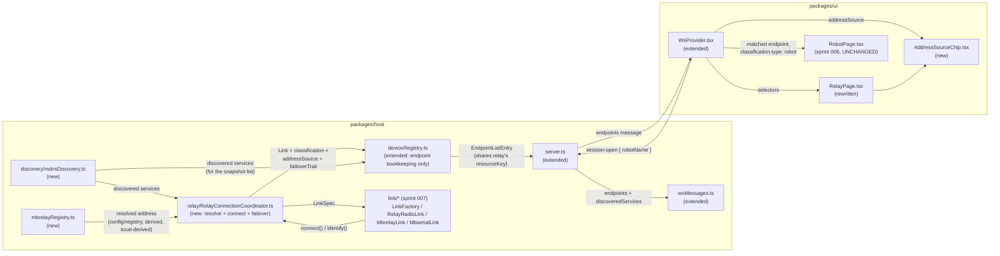

<!-- CLASI: Before changing code or making plans, review the SE process in CLAUDE.md -->

# Sprint 008: Relay discovery, registry, and connection

## Goals

**Inserted at detail-planning time as the second half of a split** of
the original arc-position-7 sprint ("Relay page, radio transport,
network discovery") — see sprint 007's "Split decision" section for
the full rationale. Sprint 007 delivers the three link transports and
their shared command-plane preamble as standalone, testable-against-
fakes modules with no consumer yet. This sprint is that consumer: it
makes a relay a real, usable way to reach a robot from the console.

Concretely, this sprint delivers mDNS discovery of relays and remote
robots, a read-only registry client with three resolution outcomes,
the endpoint-synthesis wiring that turns "student picks a robot name
on the relay page" into a live session against one of sprint 007's
transports, liveness-probe failover across a partially-silent
classroom, and the relay page itself — connected/not-connected states,
the robot dropdown, and the address-source disclosure chip. When
connected, the target robot renders **sprint 006's `RobotPage`
unchanged** — no relay-specific fork of that page exists or is
introduced by this sprint.

Depends on sprint 004 (resource-key model, `Link`/`LinkSpec`
abstraction, endpoint model), sprint 005 (the roster that feeds the
dropdown), sprint 006 (the `RobotPage` this sprint reaches into), and
sprint 007 (the three transports this sprint's connect flow drives).

## Problem

Sprint 007 gives the host three ways to *establish* a line stream to a
robot — locally through a USB relay, remotely through a discovered
mbrelay, or remotely direct through mbserial — but nothing yet decides
*which* robot, *where* it is, or *how* a student picks it from the UI.
Three findings from live-network verification (carried forward
verbatim from the original roadmap plan, since they constrain this
sprint specifically, not sprint 007) drive this sprint's design:

1. **The mbrelay registry lookup is a write, not a read.**
   `httpapi.py:146` returns `registry.resolve(name)`, and `resolve()`
   derives the address locally on a miss, writes it into `_learned`,
   calls `save()`, and returns HTTP 200 with `source: derived`. So "the
   HTTP call succeeded" does not mean "the registry knew" — treating
   success as authority would present a locally-derivable guess as
   fact, exactly the failure UC-004 exists to prevent. And because a
   lookup *enrolls* the name, prefetching for the dropdown would inject
   an entry per student per robot into shared classroom state.
   `registry.py` has a non-mutating `get()` the HTTP route doesn't use;
   this sprint's client stays read-only regardless (no `POST`/`DELETE`
   — the API has no auth).
2. **Registry discovery is itself an mDNS lookup, not a port
   convention.** Verified live: `_mbrelay._tcp` advertises instance
   `torture` at `torture.local.:8760` with TXT
   `txtvers=1 version=0.20260831.1 node=torture registry=8761` — the
   registry port travels in the TXT record. `_mbserial._tcp` advertises
   bare five-letter instance names (`vevov`, `gopiv`) directly — no
   registry involved at all for that service type (see Architecture,
   Design Rationale).
3. **Failover is a heuristic against a silent link, not a clean
   yes/no.** Radio is fire-and-forget with no retransmit, and nothing
   on an idle link is unsolicited — so one unanswered probe does not
   prove a robot is absent. Compounding this, four independent failure
   modes present **identically as silence**: wrong channel/group; the
   robot build having `BOOT_RADIO_LINK = false` (the default — a stock
   build does not answer the radio at all); a misconfigured relay; or
   the robot simply being off. Diagnosability has to be budgeted for
   deliberately or the bench session is unbounded.

## Solution

**Discovery.** `packages/host/src/discovery/mdnsDiscovery.ts` browses
`_mbrelay._tcp` and `_mbserial._tcp`. Registry discovery rides the same
browse: the registry's host and port come out of the `_mbrelay._tcp`
TXT record (`registry=<port>`), not a fixed convention, so "registry
unreachable" includes "no relay advertising on the LAN at all."
Discovered services are surfaced to the UI as their own snapshot list
(mirroring sprint 005's `rememberedRobots` precedent — see
Architecture, Design Rationale) rather than minted as full
`EndpointListEntry` rows before any session exists.

**Registry client** (`packages/host/src/mbrelayRegistry.ts`,
`resolveRobotAddress(name, opts) → ResolvedAddress`, never throws).
**Three outcomes, not two**: `config`/`registry` (authoritative);
`derived` (registry replied but only echoed back our own derivation —
surfaced as prominently as a fallback, because the failure mode it
represents is identical to one); `local-derived` (registry unreachable
entirely). Resolution is **lazy, at connect time, for one name only** —
never prefetched for the dropdown. Read-only against the registry
(`get()`, no `POST`/`DELETE`). Short client-side timeout (~1.5s;
mbrelay's own client uses 3s, too long to block a click) and a short
TTL cache so a re-click doesn't re-trigger a registry write. Consulted
only for `RelayRadioLink`/`MbrelayLink` targets — an `_mbserial._tcp`
service is already addressed by its advertised instance name with no
channel/group to resolve (see Architecture, Design Rationale).

**Connection.** `deviceRegistry.ts` composes sprint 007's transports,
this sprint's discovery/registry modules, and the endpoint model into
a "connect to named robot X through relay Y" flow:
`SessionOpenMessage.robotName` (reserved by sprint 004 for exactly
this) carries the chosen name; the host resolves an address (registry
client, for relay/mbrelay targets only), builds the matching
`LinkSpec`, and connects/identifies exactly as the USB attach flow
already does — synthesizing a new, routable `EndpointListEntry` for
the robot itself (not the relay), sharing the relay's own
`resourceKey` (driving through a relay and flashing it stay mutually
exclusive through the existing `KeyedMutex`, no new mechanism needed).
Switching robots is **close-session → new `LinkSpec` → open-session**,
never an in-place retarget (per the `Link` interface's own deliberate
absence of one).

**Fallback disclosure, tuned against alarm fatigue.** For a local USB
relay there is usually no mbrelay daemon at all, so `local-derived` is
the *normal* classroom path, not an exceptional one — the indicator
will be lit most of the time. A persistent inline chip (e.g. `Address:
ch 37 / grp 3 · derived (no registry)`) is styled **neutrally** when no
registry was ever configured, and as a **warning** only when a registry
was configured and either failed or answered `derived`. The chip must
never be silent (spec §6, UC-004), but silence and alarm fatigue are
both failure modes here — the design has to avoid both.

**Failover.** "Try the first robot, prefer one that answers, try the
next if not" is implemented as a liveness probe using `STATUS` or
`PING` — **never `HELLO`**, per sprint 007's own transports — with
explicit retries and a timeout, because one unanswered probe doesn't
prove absence on a fire-and-forget link. "Gave up on X, trying Y" is
surfaced visibly, not swallowed. Given the four silence-alike failure
modes above, the page keeps the fallback-in-use flag, the current
`(channel, group)`, and the failover trail on screen at all times —
this is a diagnosability requirement, not a nice-to-have.

**Relay page.** Two states only: connected to a robot, or not. A
dropdown of known robot names (sprint 5's roster, plus any name
discovered live over mDNS this session — never a speculative registry
lookup). When connected, it renders sprint 6's `RobotPage` unchanged.
When not connected, there is little to do beyond setting a manual
channel/group.

## Success Criteria

- The registry client's three outcomes (`config`/`registry`, `derived`,
  `local-derived`) are test-provable against an injected fetch
  function, including that a lookup is never issued speculatively for
  the dropdown.
- mDNS-discovered relays/robots are test-provable against an injected
  mDNS-fake browse result, including TXT-record registry-port
  extraction.
- The relay page never silently hides a fallback: the address-source
  chip is visible in both its neutral (no registry) and warning
  (registry configured but not authoritative) states.
- Failover visibly reports "gave up on X, trying Y" and never uses
  `HELLO` as a liveness probe.
- Selecting a robot from the dropdown reaches sprint 006's `RobotPage`
  with **zero changes to that page or its child components** —
  verified by the same `RobotPage.transportBlind.test.ts` source-scan
  technique sprint 006 introduced, now also exercised against a
  relay-transport endpoint fixture.
- **Hardware-deferred, not checked off until exercised on a bench**:
  that a real relay actually bridges radio traffic to a real robot;
  that failover against a live, partially-silent classroom of robots
  behaves as designed; that `TCP_NODELAY` measurably fixes any latency
  problem it's meant to address. `BOOT_RADIO_LINK` must be confirmed
  true on whatever hex is used for bench verification **before** the
  bench session, not discovered during it. These are isolated into
  their own bench ticket (below) rather than mixed into tickets whose
  other criteria are fake-provable.

## Scope

### In Scope

- mDNS browse for `_mbrelay._tcp` and `_mbserial._tcp`
  (`discovery/mdnsDiscovery.ts`), including TXT-record parsing (the
  registry port from `_mbrelay._tcp`'s own record).
- mbrelay registry client (read-only, lazy, three-outcome,
  `mbrelayRegistry.ts`).
- `deviceRegistry.ts`/`wsMessages.ts` extension: relay-target endpoint
  synthesis (`SessionOpenMessage.robotName`), the discovered-services
  snapshot list, close→new-spec→open switching semantics.
- Liveness-probe failover: try-first-answering-robot default,
  explicit retries/timeout, visible "gave up on X, trying Y" trail.
- Relay page: connected/not-connected states, robot dropdown fed by
  sprint 5's roster (plus live mDNS-discovered names), manual
  channel/group entry, address-source disclosure chip.
- Bench verification (hardware-deferred, isolated ticket): real
  relay↔robot bridging, live failover, `TCP_NODELAY` latency check,
  pre-bench `BOOT_RADIO_LINK` confirmation.

### Out of Scope

- The three link transports and the command-plane preamble — sprint
  007 (this sprint only composes them).
- `WifiUdpLink` and `_robotlink._*` discovery — sprint 10.
- Telemetry — sprint 9.
- Calibration wizards — sprint 11.
- Any change to `RobotPage`/`RobotView` itself — reused unchanged from
  sprint 6; verified by the transport-blindness source scan, not just
  asserted.

## Test Strategy

Everything except the bench ticket's own criteria is provable in CI
against fakes: the registry client against an injected fetch function
(all three outcomes, plus the never-prefetched contract); mDNS
discovery against an injected browse-result fake (service parsing, TXT
registry-port extraction, no real multicast socket in tests);
`deviceRegistry.ts`'s relay-target endpoint synthesis and close→new-
spec→open switching against sprint 007's fake-backed transports
(reusing the same fake-link testing technique `deviceRegistry.test.ts`
already established for USB); failover's retry/timeout/reporting logic
against a fake scheduler and a fake link that can be told to go silent;
the relay page's dropdown, states, and disclosure chip against
`WsProvider`'s existing fake-socket testing harness. The one
hardware-dependent claim this sprint makes — a real relay bridging to
a real robot — is isolated entirely into its own bench ticket (see
Scope), never mixed into a ticket whose other acceptance criteria are
fake-provable, so no CI-provable ticket ever waits on hardware to
close. `npm test` and `npm run build` must both pass throughout.

## Architecture

**Substantial** — this sprint introduces two new host modules with a
new external dependency (an mDNS browse library), extends
`deviceRegistry.ts`'s endpoint model with a second, non-USB-watcher-
driven way to mint an `EndpointListEntry` (a genuine cross-module
dependency: endpoint synthesis now depends on discovery + the registry
client + sprint 007's transports), and touches 5+ modules end to end
(`discovery/mdnsDiscovery.ts`, `mbrelayRegistry.ts`, `deviceRegistry.ts`,
`wsMessages.ts`, `server.ts`, `WsProvider.tsx`, `RelayPage.tsx`). No
persisted-data-model change (the registry/discovery results are
never written to disk — only sprint 005's roster, unchanged, persists
anything). The substantial tier is earned by module count and the new
cross-module dependency into endpoint synthesis, matching sprint
004/005/006's own bar.

### Step 1 — Understand the problem

Sprint 007 answers "how do I talk to a robot through a relay, once I
know which one and where." This sprint answers everything upstream of
that: which relays and robots exist on the network (discovery), where
a named robot actually is (the registry, with its write-on-read trap),
and how a student's dropdown click becomes a live session rendering
sprint 006's `RobotPage` — plus what happens when the first-choice
robot doesn't answer (failover) and how "we used a guess, not a fact"
gets shown without becoming background noise (the disclosure chip).
None of `deviceRegistry.ts`'s existing endpoint lifecycle (attach via
`DeviceWatcher`, flash, USB detach) has ever needed to mint an endpoint
from anything other than a physically plugged-in board; this sprint is
the first time an endpoint is synthesized from a *choice* (a dropdown
selection) composed with a *resolved address* (registry or derived)
rather than from hardware presence.

### Step 2 — Responsibilities

1. **Discovering relays and remote robots on the LAN** — mDNS browse
   and TXT-record parsing; changes only when the service types or
   their advertised shape change.
2. **Resolving a robot name to an address via the registry, with the
   write-on-read trap handled** — changes only when the registry's own
   HTTP contract or the resolution policy changes; independent of *how*
   the resolved address is later used.
3. **Choosing which robot to try, resolving its address, and running
   one connect attempt (with failover) to completion** — orchestration:
   given a relay endpoint and a candidate name (or list), resolve an
   address, build the right `LinkSpec` (sprint 007's shapes), attempt
   connect/identify with liveness-probe retries, and fail over to the
   next candidate on exhaustion; changes when *the policy for reaching
   a robot through a relay* changes, never when discovery or registry
   resolution logic changes, and never when `DeviceRegistry`'s own
   endpoint-bookkeeping model changes.
4. **Recording a successful attempt as a live, routable endpoint, and
   tearing it down on switch/close** — bookkeeping: turn responsibility
   3's outcome into an `EndpointState`/`EndpointListEntry` sharing the
   relay's `resourceKey`, and undo that on `session-close` or a switch;
   changes only when the endpoint/session model itself changes (the
   same axis `DeviceRegistry`'s existing USB attach/detach/flash
   bookkeeping already changes on), never when resolution or failover
   policy changes.
5. **Presenting the relay page** — dropdown, connected/not-connected
   states, manual entry, the disclosure chip; changes when *what the
   page shows* changes, never when any of the above changes internally.

These are independent axes, mirroring sprint 004's own separation
discipline: (1) never needs to know what a caller will do with a
discovered service; (2) never needs to know whether the resolved
address will be used for a relay or an mbrelay connection; (3) never
needs to know how `DeviceRegistry` represents an endpoint internally —
it returns a plain result (a `Link`, its classification, the address
source, the failover trail) and nothing about `EndpointState`/
`KeyedMutex`; (4) never re-derives resolution or failover policy, only
consumes responsibility 3's result; (5) never needs to know any of the
above beyond the `WsProvider` state and actions it already consumes,
mirroring `RobotPage`'s own transport-blindness.

**Splitting 3 and 4 into separate modules, not two more responsibilities
folded into `DeviceRegistry` itself, is a deliberate correction made
during this sprint's own architecture self-review** — see Design
Rationale ("Avoiding a tenth seam on `DeviceRegistry`").

### Step 3 — Subsystems and modules

| Module | Purpose (one sentence) | Boundary | Serves |
|---|---|---|---|
| `packages/host/src/discovery/mdnsDiscovery.ts` (new) | Browse `_mbrelay._tcp`/`_mbserial._tcp` and expose parsed, typed service records. | No policy about what a caller does with a discovered service — pure browse + TXT parsing, injectable mDNS backend for tests. | SUC-001 |
| `packages/host/src/mbrelayRegistry.ts` (new) | Resolve one robot name to an address via the registry, distinguishing three outcomes. | Read-only HTTP client only — no discovery of its own (takes a registry host/port as input), no `LinkSpec` construction, no caller-side policy about *when* to call it (that's `RelayConnectionCoordinator`'s job). | SUC-002 |
| `packages/host/src/relay/RelayConnectionCoordinator.ts` (new) | Resolve a candidate robot name to an address, connect through sprint 007's `LinkFactory`, and fail over to the next candidate on exhaustion. | Composes `mdnsDiscovery.ts` + `mbrelayRegistry.ts` + sprint 007's `LinkFactory`; returns a plain result (`Link`, classification, name, address source, failover trail) to its caller — owns **no** `EndpointState`, no `KeyedMutex`, no wire-message shapes, and is fully unit-testable with zero knowledge of `DeviceRegistry`'s internal bookkeeping. | SUC-003, 004, 005 |
| `deviceRegistry.ts` (extended) | Turn a `RelayConnectionCoordinator` result into a routable `EndpointListEntry` sharing the relay's `resourceKey`, and tear it down on switch/close. | Injects `RelayConnectionCoordinator` as one more seam, exactly like `resolveName`/`createLink`/`flash`/`knownRobotsStore` already are — owns the resourceKey-sharing and close→new-spec→open sequencing, delegates every resolution/connection/failover detail to the coordinator. | SUC-003, 004, 005 |
| `wsMessages.ts` (extended) | Wire shapes for discovered services, the failover trail, and the disclosure chip's address-source data. | Types + validation only, per this module's existing "no logic of its own" contract. | SUC-001, 003, 004, 005, 006 |
| `server.ts` (extended) | Route `SessionOpenMessage.robotName` and forward the new discovered-services list into `buildEndpointsMessage`. | Composition only, unchanged discipline. | All SUCs (transport) |
| `WsProvider.tsx` (extended) | Expose discovered-services/failover-trail/address-source state to React consumers. | Selector-based, mirrors sprint 005's `rememberedRobots` slice pattern exactly. | SUC-001, 003, 004, 005, 006 |
| `RelayPage.tsx` (rewritten from sprint 4's shell) + new `AddressSourceChip.tsx` | Render the dropdown, connected/not-connected states, manual entry, and the disclosure chip. | Consumes `WsProvider` selectors/actions only — same transport-blindness discipline `RobotPage` already established and is checked for. | SUC-003, 004, 005, 006 |

Every module addresses at least one SUC; dependency direction is
unchanged (`ui` → `host`'s registry/discovery/coordinator/link →
`protocol`, no outward dependency from `protocol`); no cycle
(discovery and the registry client are leaves `RelayConnectionCoordinator`
depends on; `DeviceRegistry` depends on the coordinator; nothing
depends back on `DeviceRegistry` from within this new module family).

### Step 4 — Diagrams

**Component diagram** (required — new module with new cross-module
dependencies fanning out from it, mirroring sprint 005's precedent):

No entity-relationship diagram: nothing this sprint persists to disk
(discovery results and registry resolutions are live-session-only;
sprint 005's `known-robots.json` schema is untouched). No separate
dependency-direction diagram: the component diagram above is the
data-model change this sprint's substantial tier rests on (endpoint
synthesis gaining a second source), and it already shows every new
edge in context — no cycle (`mdnsDiscovery.ts`/`mbrelayRegistry.ts`
are leaves the coordinator depends on; `DeviceRegistry` depends on the
coordinator; nothing depends back on `DeviceRegistry` from within this
new module family — see Design Rationale for why the coordinator is a
separate module rather than more logic folded into `DeviceRegistry`
itself).

### Step 5 — What changed / Why / Impact / Migration concerns

**What changed:**

- New `discovery/mdnsDiscovery.ts`: browses `_mbrelay._tcp`/
  `_mbserial._tcp` via an injected mDNS backend (see Design Rationale
  for the library choice), parses TXT records (including
  `_mbrelay._tcp`'s `registry=<port>` field), and exposes a live,
  updating list of discovered services — no caching to disk, no
  registry calls of its own.
- New `mbrelayRegistry.ts`: `resolveRobotAddress(name, { host, port })
  → ResolvedAddress`, never throws, three-outcome result
  (`config`/`registry` | `derived` | `local-derived`), ~1.5s
  client-side timeout, short TTL cache keyed by name.
- New `packages/host/src/relay/RelayConnectionCoordinator.ts`:
  triggered by `session-open { endpointId: <relay's endpointId>,
  robotName }` — resolves an address (registry client, for
  `relay-radio`/`mbrelay` targets only; a direct lookup by advertised
  name for `mbserial`), builds the matching `LinkSpec`, connects/
  identifies via sprint 007's `LinkFactory`, and — given an ordered
  candidate list (roster + discovered names) rather than a single
  name — probes each via `checkLiveness()`/`identify()` with retries
  and a timeout, advancing to the next candidate on exhaustion and
  reporting each transition. Returns a plain result to its caller; owns
  no endpoint/session bookkeeping of its own.
- `deviceRegistry.ts`: injects `RelayConnectionCoordinator` as one more
  seam (mirroring `resolveName`/`createLink`/`flash`/`knownRobotsStore`)
  and turns its result into a new `EndpointListEntry` (transport
  `relay-radio`/`mbrelay`/`mbserial`, `resourceKey` equal to the
  relay's own for the two relay-mediated transports) added to `states`.
  Switching robots on the same relay tears down this synthesized
  endpoint's session and repeats the flow for the new name through the
  coordinator — never an in-place retarget.
- `wsMessages.ts`: new `DiscoveredRelayEntry`/`discoveredServices` list
  on `EndpointsMessage` (mirrors `RememberedRobotEntry`'s own shape and
  rationale exactly); `EndpointListEntry` gains an optional
  `addressSource`/`failoverTrail`-shaped field, present only for a
  relay-mediated endpoint; `SessionOpenMessage.robotName` (reserved
  since sprint 004) becomes live.
- `server.ts`: forwards `discoveredServices` into
  `buildEndpointsMessage` (same pattern as `firmwareStatus`/
  `rememberedRobots`); no new message type needed — `session-open`
  already carries `robotName`.
- `WsProvider.tsx`: new selectors for discovered services and a
  per-endpoint `addressSource`/failover-trail read, mirroring existing
  selector patterns.
- `RelayPage.tsx`: rewritten from sprint 4's disabled-dropdown shell to
  the real connected/not-connected UI; new `AddressSourceChip.tsx`.

**Why:** see Step 1 — this is the integration sprint that turns three
independently-correct pieces (sprint 007's transports, sprint 005's
roster, sprint 006's `RobotPage`) into an actually-usable relay page,
per the original roadmap plan's own framing of arc position 7.

**Impact on Existing Components:** additive everywhere except
`RelayPage.tsx`, which is rewritten (its sprint-4 shell was always
documented as a placeholder pending this work). `RobotPage.tsx` and
every component it mounts are **not modified** — this sprint's own
Success Criteria make that a checked property (the transport-blindness
source scan), not just a claim. `deviceRegistry.ts`'s existing USB
attach/detach/flash flows are untouched; relay-target synthesis is a
new, additive path through the same class, following the same
`KeyedMutex`/`isLive` discipline every other operation already uses.

**Migration Concerns:** None. No persisted data (discovery and
registry results are session-only); no deployment-sequencing concern
(host and UI ship together). `EndpointsMessage`'s new
`discoveredServices` field is additive, following sprint 005's own
"absent field defaults to empty list" precedent for a stale client/host
pairing (there is none in practice, but the pattern is the same).

### Step 6 — Design Rationale

| Decision | Context | Alternatives considered | Why this choice | Consequences |
|---|---|---|---|---|
| Discovered services are their own snapshot list, not synthesized `EndpointListEntry` rows | A discovered-but-unconnected mDNS service has no banner yet, so `classifyBanner` would have nothing to classify it with | Mint a placeholder `EndpointListEntry` (`classification.type: "unknown"`) for every discovered service so it shows up in the same list as attached devices | Exactly mirrors sprint 005's `rememberedRobots` reasoning: `EndpointListEntry` is sprint 4's frozen vocabulary for a *routable, session-capable* thing, and a bare discovery has no `resourceKey` to contend for and no session to open yet. Forcing it into that shape would mean inventing placeholder values for fields that don't apply — the anti-pattern sprint 004's own design warns against | The relay page reads two lists (discovered services, live endpoints) exactly as the front page already reads two lists (attached, remembered) — a proven pattern, not a new one |
| The registry is consulted only for `relay-radio`/`mbrelay` targets, never `mbserial` | `_mbserial._tcp` already advertises the target robot's own five-letter name as its mDNS instance name — there is no channel/group to resolve, because there is no shared radio channel involved at all | Route every relay-page connection attempt through the registry client uniformly, for "consistency" | An `mbserial` connection already has everything it needs (host, port, and the name itself) directly from mDNS; calling the registry for it would be resolving an address nothing downstream needs, and would misleadingly present `mbserial`'s always-`config`-equivalent certainty as if it had gone through the same authority/derived/unreachable spectrum a radio channel/group lookup has | `resolveRobotAddress` is only ever called from the relay-radio/mbrelay branch of endpoint synthesis; the disclosure chip is not rendered at all for an `mbserial`-transport endpoint (nothing to disclose) |
| A relay-mediated endpoint's `resourceKey` equals the relay's own endpoint's `resourceKey`, for `relay-radio`/`mbrelay` | Driving through a relay and flashing that same relay must not race — `sprint.md`'s own stated constraint | Give the synthesized robot-via-relay endpoint its own independent `resourceKey` | The physical resource being contended for is the relay's own port/socket, not something the robot-via-relay endpoint owns independently — sharing the key is what makes the existing `KeyedMutex` serialize "drive through the relay" against "flash the relay" with no new synchronization mechanism, exactly as sprint 004's `resourceKey`-distinct-from-`endpointId` design anticipated | A flash request against the relay's own `endpointId` and a `session-open` against the robot-via-relay `endpointId` queue behind each other correctly, because `KeyedMutex.run` keys on `resourceKey`, not `endpointId` |
| Switching robots is close-session → new `LinkSpec` → open-session, driven by re-sending `session-open` with a new `robotName` | The `Link` interface has no `retarget()` by design (sprint 004) — a relay's data plane has no in-band escape once a target is selected | Add a relay-specific `retarget()` extension just for this case, reasoning that "switching the dropdown" feels like a natural single operation | The wire protocol genuinely cannot support an in-place retarget (protocol.md, UC-004 step 5) — adding the method would create an API that lies about what the transport can do. The existing `session-close`/`session-open` messages already express the correct sequence with no new wire surface | The relay page's dropdown `onChange` handler sends `session-close` for the old robot-via-relay endpoint (if any) followed by `session-open` with the new `robotName` — two round trips, not one, but the two round trips are the actual protocol cost, not an implementation shortcut being avoided |
| Failover lives host-side, in `RelayConnectionCoordinator`, not the UI | The four silence-alike failure modes (Problem, finding 3) mean "try the next candidate" needs access to `checkLiveness()`/`identify()` timing that only the host has | Implement failover as a client-side loop that sends repeated `session-open`/`session-close` messages | The UI has no visibility into individual probe timing or retry budgets without the host exposing them as new messages anyway — putting the loop host-side keeps the wire protocol simple (one `session-open` with `robotName`, or none, triggers the whole failover sequence) and keeps the *policy* (retries, timeout, ordering) in one place, testable without a UI at all | The relay page cannot cancel an in-flight failover attempt mid-sequence this sprint (not requested); a future sprint adding cancellation extends the coordinator's failover state, not the UI |
| Avoiding a tenth seam on `DeviceRegistry`: resolution + connect + failover live in a new `RelayConnectionCoordinator`, not folded directly into `deviceRegistry.ts` | This sprint's own architecture self-review flagged the risk directly: sprint 005's Architecture already counted eight injected seams on `DeviceRegistry` before this sprint (`watcher`, `resolveName`, `createLink`, `getFirmwareConfig`, `resolveRelease`, `fetchAndVerifyHex`, `flash`, `knownRobotsStore`), named that as the point past which its fan-out "is carrying real god-component risk," and explicitly said a future sprint "materially growing its responsibilities further... should consider splitting orchestration from composition rather than adding a tenth seam by reflex." An earlier draft of this Architecture section put discovery + registry resolution + failover policy directly into `deviceRegistry.ts` as two more responsibilities (see Step 2's original numbering) — exactly the reflex sprint 005 warned against | Add `discovery`/`registry`/`failover` as three more responsibilities/injected functions directly on `DeviceRegistry` itself, as the first draft of this section did | `DeviceRegistry`'s own documented boundary is "orchestration only — never naming, banner-parsing, classification, framing, or sequencing logic" (its own module doc comment); resolution policy, failover retry/timeout logic, and mDNS/registry composition are exactly that kind of *logic*, not bookkeeping. Extracting them into one coordinator class keeps `DeviceRegistry`'s own job unchanged in kind (turn an already-decided outcome into endpoint bookkeeping) and makes the coordinator's resolution/failover logic unit-testable with zero `EndpointState`/`KeyedMutex` fixture setup | One more file, but `DeviceRegistry` gains exactly one new seam (`RelayConnectionCoordinator`, injected the same way every other composed module already is) instead of three, and the coordinator itself is reusable/testable independent of any endpoint-bookkeeping concern |
| mDNS library: an injectable pure-JS backend (e.g. `bonjour-service`), not a native-binding library | This is the project's first mDNS dependency | A native-binding mDNS library (lower-level, closer to the OS multicast API) | `packages/host` already carries native dependencies (`serialport`, `node-hid`, `dapjs`) that make `npx` installs fragile — `config.ts`'s own precedent (avoiding `dotenv`) and sprint 005's precedent (avoiding SQLite) both favor not adding a *second* class of fragility when a pure-JS option covers the need (service browse + TXT records, nothing more exotic) | `discovery/mdnsDiscovery.ts`'s browse call is behind an injectable seam either way, so this choice is revisable later without touching any caller |

### Step 7 — Open Questions

- Whether the relay page should let a student cancel an in-flight
  failover attempt mid-sequence. Not requested by the original roadmap
  plan; deferred per the failover Design Rationale entry above.
- Exact TTL for the registry client's resolution cache (roadmap plan
  says "short," this sprint's tickets should pick a concrete default,
  e.g. matching the ~1.5s request timeout order of magnitude) — a
  ticket-level parameter choice, not an architectural one.
- Whether a discovered `_mbserial._tcp` service whose advertised name
  is *not* in the sprint 5 roster should still appear in the relay
  page's dropdown, or only roster names should. The Solution section's
  "sprint 5's roster, plus any name discovered live over mDNS this
  session" phrasing takes the permissive reading (both), consistent
  with sprint 9's own roster-gating precedent applying to
  `_robotlink._*` specifically, not to `_mbserial._tcp` here — flagged
  for stakeholder confirmation if a stricter gate is actually wanted.

## Use Cases

Substantial tier, full treatment. Every SUC below states which
acceptance criteria are fake-provable and which are hardware-deferred,
per this sprint's Test Strategy — the bench ticket (SUC-007) carries
every hardware-only claim so no other ticket's criteria depend on real
hardware to close.

### SUC-001: Discover relays and remote robots on the LAN
Parent: UC-008 (Discover a remote relay over mDNS)

- **Actor**: robot-console host (`discovery/mdnsDiscovery.ts`),
  automatic.
- **Preconditions**: The host is running; zero or more `_mbrelay._tcp`/
  `_mbserial._tcp` services are advertised on the LAN.
- **Main Flow**:
  1. The host browses both service types continuously.
  2. Each discovered service is parsed into a typed record (instance
     name, host, port, and — for `_mbrelay._tcp` — the `registry` TXT
     field).
  3. `EndpointsMessage.discoveredServices` reflects the current set on
     every snapshot.
- **Postconditions**: A client sees discovered services without ever
  triggering a registry write — browsing is passive.
- **Acceptance Criteria**:
  - [ ] (fake-provable) An injected mDNS-backend fake producing a
        `_mbrelay._tcp` record with a `registry=8761` TXT field yields
        a parsed service carrying that registry port.
  - [ ] (fake-provable) A service that disappears from a subsequent
        fake browse result is removed from `discoveredServices` on the
        next snapshot.
  - [ ] (hardware-deferred) A real relay's live mDNS advertisement is
        discovered end to end — deferred to SUC-007's bench ticket.

### SUC-002: Resolve a robot's address via the registry, distinguishing three outcomes
Parent: UC-004 (Drive a robot over the radio relay)

- **Actor**: `mbrelayRegistry.ts`, on behalf of `deviceRegistry.ts`.
- **Preconditions**: A registry host/port is known (from SUC-001's
  discovered `_mbrelay._tcp` TXT record).
- **Main Flow**:
  1. `resolveRobotAddress(name, { host, port })` issues one `GET` to
     the registry, never `POST`/`DELETE`.
  2. The reply is classified into exactly one of three outcomes:
     `config`/`registry` (the registry actually knew), `derived` (the
     registry only echoed its own just-made guess), or
     `local-derived` (the registry was unreachable within ~1.5s, or no
     registry was ever configured — the host derives the pair itself
     via `radioAddress.ts`).
  3. A repeat call for the same name within the TTL cache window
     returns the cached result without a second HTTP request.
- **Postconditions**: The caller always receives an address plus which
  of the three outcomes produced it — never a bare address with no
  provenance.
- **Acceptance Criteria**:
  - [ ] (fake-provable) An injected fetch returning `source: "known"`
        (the registry's actual-hit shape) yields outcome `config`/
        `registry`.
  - [ ] (fake-provable) An injected fetch returning `source: "derived"`
        yields outcome `derived`, distinguished from the `config`/
        `registry` case.
  - [ ] (fake-provable) An injected fetch that times out or errors
        yields outcome `local-derived`, computed via the same
        `radioAddress.ts` function the host would otherwise use
        directly.
  - [ ] (fake-provable) Two calls for the same name inside the TTL
        window produce exactly one fetch call (cache hit on the
        second).
  - [ ] (fake-provable) `resolveRobotAddress` is never called except
        from the connect-time synthesis path in SUC-003/005 — no call
        site exists that could fire it speculatively for the dropdown.

### SUC-003: Connect to a named robot through a relay and reach RobotPage unchanged
Parent: UC-004 (Drive a robot over the radio relay), UC-001 (Connect and identify a device — the robot-via-relay endpoint follows the same identify contract)

- **Actor**: Student, via `RelayPage`'s dropdown.
- **Preconditions**: A relay endpoint (local `relay-radio` or
  discovered `mbrelay`/`mbserial`) exists; a robot name is chosen.
- **Main Flow**:
  1. Student picks a name from the dropdown; the UI sends
     `session-open { endpointId: <relay endpoint>, robotName }`.
  2. The host resolves an address (SUC-002, for `relay-radio`/
     `mbrelay`; direct for `mbserial`), builds the matching `LinkSpec`
     (sprint 007), and connects/identifies via sprint 007's
     `LinkFactory`.
  3. On success, a new `EndpointListEntry` appears
     (`classification.type: "robot"`, `transport` one of
     `relay-radio`/`mbrelay`/`mbserial`, `resourceKey` shared with the
     relay for the two relay-mediated transports).
  4. Navigating to `/d/:endpointId` for this new entry renders
     `RobotPage` — the exact same component sprint 006 shipped, with
     no relay-aware branch anywhere in it or its children.
- **Postconditions**: The student drives the relay-connected robot
  exactly as a USB-connected one, per sprint 006's existing SUCs.
- **Acceptance Criteria**:
  - [ ] (fake-provable) Against a fake `LinkFactory`/registry/mDNS
        stack, `session-open` with `robotName` produces a new
        `EndpointListEntry` with the right `transport`/`resourceKey`/
        `classification`.
  - [ ] (fake-provable) `RobotPage.transportBlind.test.ts`'s source
        scan passes when exercised against a relay-transport endpoint
        fixture, not just a USB one.
  - [ ] (fake-provable) A flash request against the relay's own
        `endpointId` while a robot-via-relay session is open on the
        shared `resourceKey` queues behind it (direct `KeyedMutex`
        test).
  - [ ] (hardware-deferred) A real relay-connected robot actually
        drives — deferred to SUC-007.

### SUC-004: Switch a relay's target robot without an in-place retarget
Parent: UC-004 (Drive a robot over the radio relay)

- **Actor**: Student, via `RelayPage`'s dropdown.
- **Preconditions**: A robot-via-relay session (SUC-003) is already
  open; the student picks a *different* name.
- **Main Flow**:
  1. The UI sends `session-close` for the current robot-via-relay
     `endpointId`, then `session-open` with the new `robotName`.
  2. The host tears down the old synthesized endpoint's session
     entirely (never an in-place retarget — no method on `Link`
     supports one) and repeats SUC-003's connect flow for the new
     name.
- **Postconditions**: Exactly one robot-via-relay endpoint exists for
  a given relay at a time; the old one is fully gone (not just
  disconnected) once the new one exists.
- **Acceptance Criteria**:
  - [ ] (fake-provable) Switching names against a fake `LinkFactory`
        results in the old endpoint disappearing from `snapshot()` and
        a new one appearing for the new name — never both present, and
        never the old one silently reused.
  - [ ] (fake-provable) No test or production code path calls a
        `retarget`-shaped method on `Link` — it does not exist on the
        interface, so this is enforced by the type system, not a
        runtime check.

### SUC-005: Fail over to the next robot when the first doesn't answer
Parent: UC-004 (Drive a robot over the radio relay)

- **Actor**: robot-console host, automatic (student observes).
- **Preconditions**: No explicit `robotName` given (default "try the
  first, prefer one that answers" flow), or an explicit choice that
  turns out silent; an ordered candidate list exists (roster order,
  optionally including live-discovered names).
- **Main Flow**:
  1. The host attempts the first candidate: connect, then probe
     liveness via `checkLiveness()` (`PING`/`STATUS`, never `HELLO`)
     with explicit retries and a timeout.
  2. If the candidate never answers within budget, the host reports
     "gave up on X, trying Y" (visible to the client, not swallowed)
     and attempts the next candidate.
  3. Once a candidate answers, failover stops and SUC-003's flow
     completes normally for that name.
- **Postconditions**: The student sees which robot ended up connected
  and the trail of any candidates given up on, even if the very first
  attempt succeeded (an empty trail, not an absent one).
- **Acceptance Criteria**:
  - [ ] (fake-provable) A fake candidate list where the first two links
        never answer `checkLiveness()` and the third does results in
        connecting to the third, with a two-entry "gave up on"
        trail — asserted against a fake scheduler, no real wall-clock
        delay.
  - [ ] (fake-provable) `checkLiveness()` is the only liveness call
        failover ever makes — no code path re-sends `HELLO` as a probe
        (mirrors sprint 007's SUC-006 at the policy level, not just the
        transport level).
  - [ ] (fake-provable) A single-candidate list that never answers
        exhausts its retry budget and reports final failure, rather
        than probing forever.
  - [ ] (hardware-deferred) Failover against a live, partially-silent
        classroom of real robots — deferred to SUC-007.

### SUC-006: View the address-source disclosure chip in its neutral and warning states
Parent: UC-004 (Drive a robot over the radio relay; spec §6, UC-004's own fallback-disclosure requirement)

- **Actor**: Student, viewing `RelayPage`.
- **Preconditions**: A robot-via-relay session (SUC-003) is open for a
  `relay-radio`/`mbrelay`-transport endpoint (no chip is rendered for
  `mbserial` — see Design Rationale).
- **Main Flow (no registry ever configured — the common local-USB-relay case)**:
  1. Address resolution outcome is `local-derived` because no registry
     was ever discovered/configured.
  2. The chip renders neutrally styled: `Address: ch 37 / grp 3 ·
     derived (no registry)`.
- **Main Flow (registry configured but not authoritative)**:
  3. Address resolution outcome is `derived` (registry replied but only
     echoed its own guess) or the registry was configured but
     unreachable.
  4. The chip renders warning-styled, with equivalent text making the
     non-authoritative source explicit.
- **Main Flow (registry authoritative)**:
  5. Address resolution outcome is `config`/`registry` — the chip
     renders neutrally, stating the registry as the source.
- **Postconditions**: The chip is present in every case — never absent,
  never silent about which of the three outcomes produced the address
  in use.
- **Acceptance Criteria**:
  - [ ] (fake-provable) All three resolution outcomes from SUC-002
        render the chip with the correct neutral/warning styling and
        source text, driven by fixture data (no live registry needed).
  - [ ] (fake-provable) The chip is never absent when a robot-via-relay
        session is open for a `relay-radio`/`mbrelay` endpoint (a
        render-presence assertion, not just a snapshot of its text).
  - [ ] (fake-provable) No chip renders for an `mbserial`-transport
        endpoint.

### SUC-007: Bench-verify relay-to-robot bridging (hardware-deferred)
Parent: UC-004 (Drive a robot over the radio relay)

This SUC exists to isolate every hardware-only claim named across
SUC-001–006 into one clearly-labeled ticket, per this sprint's Test
Strategy — no other SUC's fake-provable criteria depend on this one
closing.

- **Actor**: Instructor/engineer at a physical bench.
- **Preconditions**: A relay and a robot are both physically available;
  `BOOT_RADIO_LINK` is confirmed `true` on the robot's hex **before**
  the bench session begins (per the roadmap plan's own instruction —
  discovering this mid-session, rather than confirming it up front, is
  exactly the failure mode that made prior sprints' bench sessions
  unbounded).
- **Main Flow**:
  1. Confirm `BOOT_RADIO_LINK = true` on the bench hex.
  2. Connect to the robot through a local `RelayRadioLink` relay;
     drive it via `RobotPage`, confirming real motion.
  3. Connect through a discovered `MbrelayLink`/`MbserialLink`;
     confirm the same.
  4. With two or more robots present and one powered off or on the
     wrong channel, exercise failover live and confirm the visible
     "gave up on X, trying Y" trail matches reality.
  5. Compare `MbrelayLink` responsiveness with and without
     `TCP_NODELAY` (a temporary local patch to disable it) to confirm
     it measurably helps, if a difference is perceptible at all.
- **Postconditions**: The hardware-deferred criteria named in this
  sprint's Success Criteria and in SUC-001/003/005 above are checked
  off here, explicitly, not assumed from the fake-provable tests
  passing.
- **Acceptance Criteria**:
  - [ ] `BOOT_RADIO_LINK` confirmed `true` before the session starts,
        recorded in this ticket.
  - [ ] Real relay-to-robot bridging confirmed for both `RelayRadioLink`
        and at least one of `MbrelayLink`/`MbserialLink`.
  - [ ] Live failover against a real partially-silent pair of robots
        matches the design (visible trail, no `HELLO` used, no hang).
  - [ ] `TCP_NODELAY`'s effect is recorded (measurably helps, or no
        perceptible difference — either is an acceptable, honestly
        reported outcome; this criterion is about verification having
        happened, not about a specific result).

## GitHub Issues

(GitHub issues linked to this sprint's tickets. Format: `owner/repo#N`.)

## Definition of Ready

Before tickets can be created, all of the following must be true:

- [ ] Sprint planning document is complete (sprint.md, including its
      Architecture and Use Cases sections)
- [ ] Architecture review passed (or skipped, for changes with no
      architectural impact)
- [ ] Stakeholder has approved the sprint plan

## Tickets

| # | Title | Depends On |
|---|-------|------------|
| 001 | mDNS discovery of relays and remote robots (discovery/mdnsDiscovery.ts) | — |
| 002 | Registry client: three-outcome address resolution (mbrelayRegistry.ts) | — |
| 003 | RelayConnectionCoordinator: resolve, connect, and fail over to the next candidate | 001, 002 |
| 004 | DeviceRegistry integration: relay-target endpoint bookkeeping and robot switching | 003 |
| 005 | RelayPage UI: dropdown, connected/not-connected states, manual entry | 004, 006 |
| 006 | Address-source disclosure chip (neutral/warning states) | 004 |
| 007 | Bench verification: real relay-to-robot bridging (hardware-deferred) | 005 |

Tickets execute serially in the order listed. 001 and 002 have no
dependency on each other and could run in parallel, but are sequenced
in listing order. Ticket numbers reflect creation order, not execution
order: 006 (the disclosure chip) executes before 005 (the relay page
that mounts it), since 005 depends on 006 — the "Depends On" column,
not the ticket number, determines actual sequencing.
