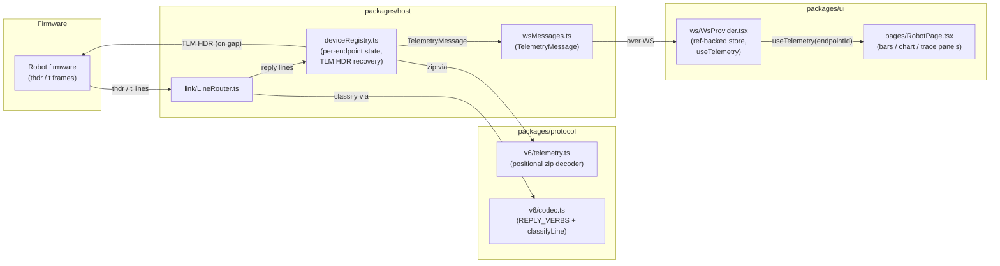
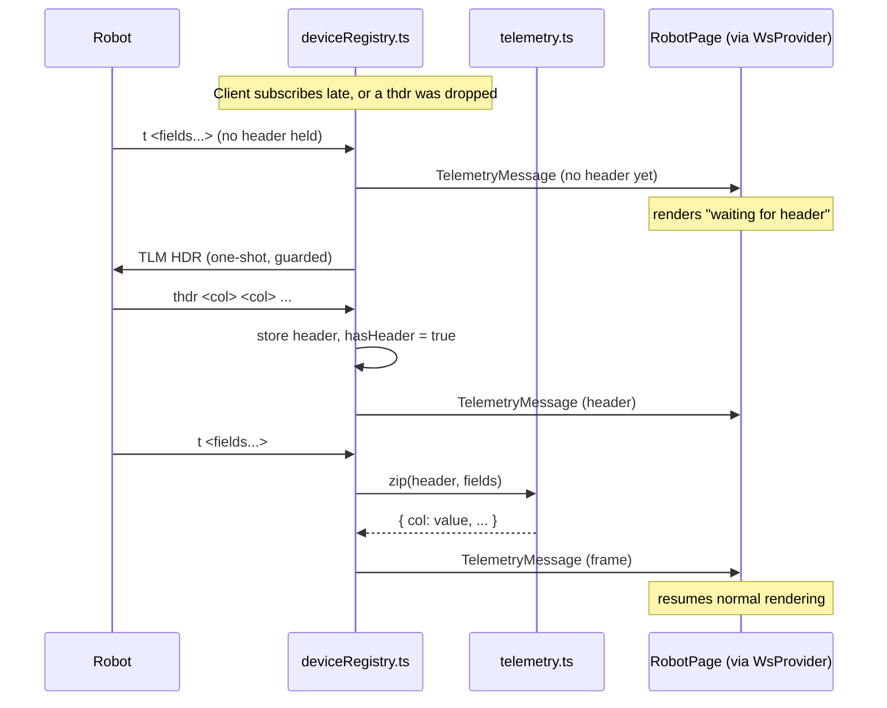

<!-- CLASI: Before changing code or making plans, review the SE process in CLAUDE.md -->

# Sprint 009: Telemetry and trace

## Goals

Build the one `packages/protocol` module §3 specifies that no earlier
sprint built — `v6/telemetry.ts`, the schemaless positional decoder —
and the robot-page surfaces that consume it: wheel-speed bars,
time-series charts, and a path trace with a clear action. This is
arc position 8 of the 10-sprint roadmap recorded in
`robot-console-two-level-ui-and-multi-transport-roadmap.md` (§7 maps
it to the old spec's "S4"). It delivers UC-005 (watch telemetry) and
UC-009 (recover a missed telemetry header).

**Scheduling fact, stated prominently because it is this sprint's main
planning value:** this sprint depends on sprint 4 (device model,
ref-backed WS store) and sprint 6 (robot page, drive/control over USB)
**only — not on sprint 7** (relay/radio/discovery). Telemetry over USB
is sufficient to build and verify everything in this sprint. After
sprint 6 lands, the roadmap forks into two independent tracks (6→7 and
6→8); if sprint 7 stalls on radio hardware — a real risk, since four
distinct failure modes there (wrong channel, `BOOT_RADIO_LINK` disabled
by default, relay misconfigured, robot off) all present identically as
silence — sprint 8 can be detail-planned and executed regardless. Do
not block scheduling this sprint on sprint 7's outcome.

## Problem

`packages/protocol` has no telemetry decoder yet, and the wire's own
reply-verb table does not know `thdr`/`t` exist: `v6/codec.ts`'s
`REPLY_VERBS` set (the authority `classifyLine` consults) currently
lists `ack/nack/err/ret/pong/estop/id/ver/status/help/debug/device/funcs`
only. Concretely, that means `LineRouter.handleLine` — the shared
decode → classify → dispatch path every transport link runs an inbound
line through — treats every `thdr`/`t` line as an unrecognized
("foreign") line today and routes it to `onUnrouted` as raw text
(`LineRouter.ts`'s own doc comment covers why: a relay's own comment
lines, an echo-on board, and unrecognized dialect all end up there
too). The lines already reach the console, unparsed, indistinguishable
from console noise; nothing zips them, no header state is tracked, and
none of the three panels this sprint adds have anything to read.

The robot streams `thdr`/`t` telemetry frames at 20 Hz, but the format
is **schemaless and positional**: the `thdr` frame names the columns
for a session and each `t` frame is a bare row that must be zipped
against whatever header is currently in effect. There is no fixed
shape — the robot emits 12-column POSE and 20-column FULL variants,
and radio-robot-lib fixtures add 7- and 11-column variants with
entirely different column names (`posl/posr/vell/velr/...`, not
`ox/oy/oh/...`) — so a decoder that branches on column count, or that
hardcodes the robot's own column names, is already wrong; it must be a
positional zip against the declared header, with no hardcoded shapes.
A direct consequence: any panel that reads a *specific* named column
(e.g. `ox`/`oy` for a path trace) must tolerate that column being
absent from a given session's header entirely — the decoder does not,
and must not, know those names.

Three unit traps are easy to get silently wrong and specification.md
§3.6 calls them out explicitly because they've bitten implementations
before:
- `ox`/`oy` are **already millimetres** — do not scale them.
- `oh` is **centidegrees** and must **not** be divided.
- `rotation`/`omega` are **milliradians** on the wire.

And there is a recovery case (UC-009): the header auto-refreshes every
20 frames so a late-joining listener recovers passively within one
refresh interval, but a client that needs it sooner (or whose passive
wait fails) must request it by issuing `TLM HDR` — **not `TLM NOW`**.
Until a client holds a header, it must not render `t` frames against a
guessed schema; it must show an explicit "waiting for header" state.
Rendering against a guessed header is the specific failure UC-009
exists to prevent.

Finally, this lands on top of sprint 4's `WsProvider` refactor to a
ref-backed store consumed via `useSyncExternalStore` with per-endpoint
selectors — a prerequisite, not incidental cleanup, because the
pre-refactor context recreated its value object every render and would
re-render every consumer on every message. At 20 Hz that is fatal.
Telemetry frames must ride their own WS message type; they must not be
folded into the full-snapshot `devices` message, which is deliberately
a complete state dump and the wrong vehicle for high-frequency data.

## Solution

**Decode host-side, in the shared `packages/protocol` package, and ship
already-zipped frames to the browser over a dedicated WS message type.**

1. **`packages/protocol/src/v6/telemetry.ts` (new).** A schemaless
   decoder with two responsibilities only: remember the most recent
   `thdr` (an ordered list of column names, from `DecodedLine.fields`)
   and zip it positionally against each `t` line's fields into a
   `{ [columnName]: string }` record. No column-count branching, no
   knowledge of `ox`/`oy`/`oh`/`rotation`/`omega` or any other specific
   name — those are a thin, separate lookup layer (see Design
   Rationale #4) applied only where present, so the same decoder
   handles the robot's 12/20-column headers and radio-robot-lib's
   differently-named 7/11-column fixtures identically.

2. **`packages/protocol/src/v6/codec.ts`.** Add `"thdr"` and `"t"` to
   `REPLY_VERBS`, exactly the way `"funcs"` was added for the same
   reason (module's own comment: "without it these lines classified as
   foreign and never reached a listener"). This is the one-line change
   that makes `classifyLine` and `LineRouter` route these lines to
   `onLine` instead of `onUnrouted` — no other codec change is needed.

3. **`packages/host/src/deviceRegistry.ts`.** Extend the existing
   per-endpoint reply-dispatch branch (the same `if (decoded.verb ===
   ...)` chain that already special-cases `status`/`estop`/`funcs`)
   with `thdr`/`t` handling, mirroring that chain's own state-on-
   `EndpointState` pattern:
   - `thdr` → store the new header, mark `hasHeader = true`, forward a
     header-update over the new WS message.
   - `t` with no header yet → do not decode; forward a "no header"
     signal (or simply nothing — the client's own default state
     already reads as "waiting") and, once per gap (guarded exactly
     like `pollAwaitingStatus`'s single-outstanding-request pattern),
     send `TLM HDR` — never `TLM NOW`.
   - `t` with a header → zip via `telemetry.ts`, forward the resulting
     frame over the new WS message.
   The wire already free-runs a 20-frame header auto-refresh
   (protocol.md §10.2), so this is a one-shot recovery request on an
   observed gap, not a polling timer — there is nothing here like
   `pollStatus`'s `setInterval`.

4. **`packages/host/src/wsMessages.ts`.** One new server → client
   message, `TelemetryMessage` (`type: "telemetry"`), carrying
   `endpointId` plus either a `header: readonly string[]` or a
   `frame: Record<string, string>`. It never rides the existing `"line"`
   message (which is capped and bounded by `MAX_LINES_PER_DEVICE` and
   feeds the console log) and is never folded into `EndpointsMessage`'s
   full snapshot.

5. **`packages/ui/src/ws/WsProvider.tsx`.** Extend the ref-backed store
   (sprint 4's `useSyncExternalStore` design) with one more per-endpoint
   slice: current header, a "waiting for header" flag, and a bounded
   ring buffer of recent frames (its own cap, independent of
   `MAX_LINES_PER_DEVICE` — it bounds a different kind of data at a
   different rate). A new `useTelemetry(endpointId)` selector hook so
   only components that actually read telemetry re-render at 20 Hz —
   the same reasoning sprint 4's selector-per-endpoint design already
   established for `robotStatus`.

6. **`packages/ui/src/pages/RobotPage.tsx`.** Replace the stubbed
   Charts placeholder with two panels fed by `useTelemetry`: wheel-speed
   bars and a time-series chart (per the `dataviz` skill — brand-neutral
   palette, correct in both themes), and a separate path-trace panel
   with a **Clear** action that only empties the client-side trace
   buffer (no wire command — the robot has no notion of "clear"). Both
   panels render an explicit "waiting for header" state until
   `useTelemetry` reports one, and the path-trace panel additionally
   renders "not available on this firmware" when `ox`/`oy` are absent
   from the current header (a real case: radio-robot-lib's own POSE/FULL
   fixtures carry no position columns at all). Everything reads off
   `WsProvider` hooks only, preserving the transport-blindness
   `RobotPage.transportBlind.test.ts` already enforces — no
   transport-specific code is introduced anywhere in this list.

## Success Criteria

- `v6/telemetry.ts` decodes 7-, 11-, 12-, and 20-column `thdr`/`t`
  pairs via a single positional-zip code path with no column-count
  branching.
- All three unit traps (`ox`/`oy` unscaled mm, `oh` centidegrees
  undivided, `rotation`/`omega` milliradians) are preserved exactly and
  covered by tests that would fail if any one were reintroduced
  incorrectly.
- A client with no header shows a clear "waiting for header" state and
  never renders `t` frames against a guessed schema.
- A client recovering a missed header issues `TLM HDR`, not `TLM NOW`,
  as a one-shot request triggered by an observed gap — not a polling
  timer that duplicates the wire's own 20-frame auto-refresh.
- Telemetry frames ride their own WS message type, separate from the
  `devices` snapshot message and from the per-device `"line"` log, and
  do not blow through the existing 500-line per-device buffer cap
  (`MAX_LINES_PER_DEVICE`) or the snapshot mechanism at simulated 20 Hz.
- Wheel-speed bars, time-series charts, and a path trace (with a clear
  action) render on the robot page from decoded frames, correctly in
  both light and dark themes (`dataviz` skill).
- A named column a given firmware does not emit (e.g. no `ox`/`oy` on a
  radio-robot-lib POSE/FULL fixture) degrades that one panel to an
  explicit "not available" state rather than crashing or silently
  misreading another column in its place.

## Scope

### In Scope

- `packages/protocol/src/v6/telemetry.ts` — the schemaless `thdr`/`t`
  positional decoder (§3.6), covering the 7/11/12/20-column variants.
- Wheel-speed bars and time-series charts driven by decoded telemetry.
- Path trace with a clear action.
- `TLM HDR` header-recovery per UC-009, including the "waiting for
  header" state for a client with no header yet.
- Wiring telemetry as its own WS message type consumed off the
  ref-backed store from sprint 4, respecting the 500-line buffer cap
  and snapshot mechanism at 20 Hz.
- These become sections of the robot page built in sprint 6.

### Out of Scope

- Any transport-specific telemetry work. Nothing in this sprint's
  implementation is transport-aware — it is wired into the shared
  `LineRouter`/`deviceRegistry` receive path every link already runs
  through, the same property `RobotPage.transportBlind.test.ts` already
  enforces — so no radio/relay- or WiFi-specific code is written or
  needed. Radio/relay's own transport (sprint 007/008) is not exercised
  by this sprint regardless, since it is still gated on hardware
  findings (`BOOT_RADIO_LINK` default-off, no obtainable robot hex) that
  predate this sprint; USB is sufficient to build and verify the
  decoder and UI. **Refinement of the original roadmap note**: at the
  time the roadmap issue was written, WiFi transport (sprint 010) did
  not exist yet, so it listed WiFi as "deferred" alongside radio/relay.
  Sprint 010 has since shipped and landed a fully working, already
  transport-blind `MbserialLink`-based WiFi path — by the time this
  sprint executes, a WiFi-connected robot lands on the identical
  `RobotPage`/`deviceRegistry` pipeline telemetry is built into, with no
  extra code. That is a byproduct of transport-blindness, not new scope;
  see the bench-verification ticket (006) for why it is the practical
  way to exercise this sprint against live hardware.
- Calibration wizards (sprint 10).
- Persisting telemetry — explicitly out of sprint 5's roster store, and
  still out here.

## Test Strategy

Most of this sprint is test-provable, because the decoder is pure
(`packages/protocol` has no I/O) and the traps are precisely
documented:
- The positional zip across all four column-count variants (7, 11, 12,
  20), proving no code path branches on column count.
- Every unit trap (`ox`/`oy` mm, `oh` centidegrees, `rotation`/`omega`
  milliradians), each with a test that would fail if the trap were
  mishandled.
- Header-recovery choosing `TLM HDR` over `TLM NOW`.
- The waiting-for-header state for a client with no header.
- Backpressure/buffer behavior at simulated 20 Hz against the 500-line
  cap and snapshot mechanism.

Needs hardware (cannot be test-proven): sustained real 20 Hz telemetry
over a live link, and whether the UI keeps up — a rendering performance
question tests cannot answer.

**Known blocker, noted honestly rather than papered over:** as of this
writing, no board announces after a *fresh flash*
(`clasi/issues/flash-succeeds-but-board-never-announces.md`) and no
robot hex is obtainable through the release path, so a newly-flashed
board cannot be used for this sprint's bench verification. The decoder
half (the bulk of the sprint's value) is unaffected by this blocker
since it is pure and unit-testable without hardware. **However**,
already-running, already-provisioned robots are reachable right now on
the dev host over WiFi (`wifi-gopiv`, `wifi-tigez`, port 4795) — sprint
010's WiFi transport does not depend on the flash-announce path this
blocker affects, since these boards are already flashed and running.
The bench-verification ticket (006) targets those, transport-blindly,
in place of a fresh USB flash.

## Architecture

**Substantial** — 3+ modules touched (`packages/protocol`,
`packages/host`, `packages/ui`) and a new cross-module concern: a
dedicated, high-frequency WS message channel that did not exist before
this sprint. Full 7-step methodology, with a component diagram (3+
modules touched) and a sequence diagram for the header-recovery flow
(UC-009 is a nontrivial multi-hop interaction worth showing explicitly).
No ERD — no persisted data model changes anywhere in this sprint.

### Responsibilities introduced or changed

1. **Schemaless positional decoding** (new) — zip a `thdr` against a
   `t` line with no knowledge of column count or names.
2. **Wire-verb classification** (changed) — `thdr`/`t` become known
   reply verbs so `LineRouter` stops treating them as foreign text.
3. **Per-endpoint telemetry state and header-recovery policy** (new) —
   remember the current header, detect a gap, issue `TLM HDR` once per
   gap. Lives alongside the existing `robotStatus`/`funcsBuffer`
   per-endpoint state sprint 6 established.
4. **A dedicated telemetry wire message** (new) — separate from the
   log-buffered `"line"` message and the full-snapshot `"devices"`
   message.
5. **Client-side telemetry store and rendering** (new) — a bounded,
   per-endpoint ring buffer behind a `useSyncExternalStore` selector,
   and three consuming panels (wheel-speed bars, time-series chart,
   path trace with clear).

Responsibilities 1-2 change independently of 3-5 (decoding and
classification are pure/wire-level; state and rendering are
application-level) and are grouped into separate modules below for
that reason.

### Modules

- **`packages/protocol/src/v6/telemetry.ts`** (new). Purpose: zip a
  `thdr` positionally against `t` lines into named-field records.
  Boundary: takes/returns plain data (`readonly string[]` in,
  `Record<string,string>` out) — no I/O, no knowledge of specific
  column names, no reference to `EndpointState` or any WS type. Serves
  SUC-001, SUC-002, SUC-003.
- **`packages/protocol/src/v6/codec.ts`** (changed). Purpose: wire
  grammar and reply-verb classification. Boundary: gains `"thdr"`/`"t"`
  in `REPLY_VERBS`; no new exports, no new responsibility beyond what
  it already owns for every other reply verb. Serves SUC-001, SUC-003.
- **`packages/host/src/deviceRegistry.ts`** (changed). Purpose: own
  per-endpoint session state and dispatch decoded reply lines to it —
  unchanged purpose, extended with one more reply kind, following the
  exact pattern `status`/`funcs` already established. Boundary: reads
  decoded lines via `LineRouter`, writes `EndpointState`, writes WS
  messages via `server.ts`'s existing broadcast path — never reaches
  into `packages/ui`. Serves SUC-001, SUC-003.
- **`packages/host/src/wsMessages.ts`** (changed). Purpose: the one
  wire contract between host and browser (per its own doc comment).
  Boundary: type/shape definitions only, no logic — gains one
  discriminated message type. Serves SUC-001, SUC-002, SUC-003.
- **`packages/ui/src/ws/WsProvider.tsx`** (changed). Purpose: the
  ref-backed client-side store and its `useSyncExternalStore`
  selectors. Boundary: owns client-side state derived from the socket;
  never talks to a transport or link type directly (that would break
  transport-blindness). Serves SUC-001, SUC-002, SUC-003.
- **`packages/ui/src/pages/RobotPage.tsx`** + new chart/trace
  components (changed/new). Purpose: render telemetry for a human.
  Boundary: reads only `WsProvider` hooks, same as every other panel
  already on this page. Serves SUC-001, SUC-002.

### Component diagram

No cycles: firmware → host → wire contract → UI store → UI rendering,
one direction throughout. Dependency direction is unchanged from the
existing model (`[Presentation] → [Domain/host] → [Infrastructure/
transport]`) — this sprint adds one new message type to an existing
channel, not a new dependency edge between existing modules.

### Sequence diagram — header recovery (UC-009)

### Design Rationale

1. **Decode host-side, not in the browser.** Alternative considered:
   ship raw `thdr`/`t` text to the UI over the existing `"line"`
   message and decode client-side. Rejected: `LineRouter`'s reply
   classification and `deviceRegistry.ts`'s per-endpoint session state
   already live host-side, and the header-recovery decision (detecting
   a gap, deciding to send `TLM HDR`) is inherently a host-side
   decision — the host is what owns the write path back to the robot.
   Decoding a second time client-side would require duplicating verb
   classification in the browser for no benefit.
2. **A dedicated `"telemetry"` WS message, not the existing `"line"` or
   `"devices"` messages.** Alternative considered: tag telemetry lines
   within the existing `"line"` message. Rejected: that message's
   semantics (bounded by `MAX_LINES_PER_DEVICE`, rendered into the
   console log) do not fit a 20 Hz structured-data stream, and
   `"devices"` is deliberately a full, infrequent snapshot (per
   `wsMessages.ts`'s own doc comment) — folding 20 Hz data into it would
   mean broadcasting the entire endpoint list 20 times a second.
3. **`TLM HDR` as a one-shot, gap-triggered request — not a client poll.**
   Alternative considered: have the host periodically re-request the
   header on a timer, the same shape as `pollStatus`'s `STATUS` poll.
   Rejected: the wire already free-runs a 20-frame auto-refresh
   (protocol.md §10.2), so a timer would duplicate that; instead the
   guard mirrors `pollAwaitingStatus`'s existing single-outstanding-
   request pattern, firing only when a gap is actually observed.
4. **Named-column unit semantics live outside the decoder, applied only
   when present.** Alternative considered: bake `ox`/`oy`/`oh`/
   `rotation`/`omega` handling into `telemetry.ts` itself. Rejected:
   that would violate the sprint's own core constraint (specification.md
   §3.6: "one decoder... no branching") and would make radio-robot-lib's
   differently-named 7/11-column fixtures a special case instead of the
   same code path. The unit-aware lookups are a thin layer the
   consuming panels apply to whichever named fields happen to be
   present in a given decoded frame.

### Migration Concerns

None. No persisted data changes (sprint 5's roster store is untouched),
no wire-format break (`thdr`/`t` already exist on the wire; this sprint
only starts recognizing them), and the new WS message type is additive
— an older UI build talking to a newer host simply ignores a message
type it doesn't recognize, the same forward-compatibility posture
`wsMessages.ts`'s own doc comment already establishes for
`classification.type`.

## Use Cases

### SUC-001: Watch live telemetry as bars and charts
Parent: UC-005

- **Actor**: Student
- **Preconditions**: A robot session is open (any transport — USB,
  relay, or WiFi; the pipeline is transport-blind) and the robot is
  emitting `thdr`/`t` frames.
- **Main Flow**:
  1. The robot streams `thdr`/`t` at 20 Hz; the host classifies both as
     reply verbs and dispatches them into `deviceRegistry.ts`'s
     per-endpoint state.
  2. On `thdr`, the host records the new header and forwards a header
     update over the `"telemetry"` WS message; the Charts panel shows
     "waiting for header" until this happens at least once.
  3. On each `t`, the host zips it against the current header via
     `telemetry.ts` and forwards the resulting frame.
  4. The UI applies unit conversions correctly where the relevant named
     columns are present: `ox`/`oy` unscaled mm, `oh` centidegrees
     undivided, `rotation`/`omega` milliradians.
  5. Wheel-speed bars and a time-series chart render and update live
     from the decoded frames, in both light and dark themes.
- **Postconditions**: The student sees live, correctly-scaled
  telemetry; a column a given firmware does not emit renders that one
  reading as unavailable rather than a wrong value.
- **Acceptance Criteria**:
  - [ ] Wheel-speed bars update from decoded `t` frames at the
        simulated 20 Hz rate without dropping the UI thread.
  - [ ] A time-series chart renders the same decoded frames over a
        rolling window.
  - [ ] `ox`/`oy`/`oh`/`rotation`/`omega`, where present, are scaled
        exactly per the three documented unit traps — each covered by
        a test that fails if the trap is reintroduced.
  - [ ] Charts render legibly in both light and dark themes.
  - [ ] No transport-specific branch is introduced anywhere in the
        rendering path (`RobotPage.transportBlind.test.ts` continues to
        pass unmodified).

### SUC-002: Watch and clear the path trace
Parent: UC-005

- **Actor**: Student
- **Preconditions**: Same as SUC-001, and the current header includes
  `ox`/`oy`.
- **Main Flow**:
  1. As frames decode, the path-trace panel appends each frame's
     `ox`/`oy` (already mm, unscaled) to a client-side trace buffer.
  2. The panel plots the accumulated trace.
  3. The student presses **Clear**; the client-side trace buffer empties
     and the plot resets. No command is sent to the robot — the robot
     has no notion of "clear."
- **Postconditions**: The plotted path reflects only points accumulated
  since the last clear (or session start).
- **Acceptance Criteria**:
  - [ ] The path trace accumulates `ox`/`oy` points from decoded frames
        without scaling them (they are already mm).
  - [ ] Clear empties the client-side buffer only; no wire command is
        sent.
  - [ ] When the current header does not include `ox`/`oy` (e.g. a
        radio-robot-lib POSE/FULL fixture), the panel shows "not
        available on this firmware" rather than plotting garbage or
        crashing.

### SUC-003: Recover a missed telemetry header
Parent: UC-009

- **Actor**: robot-console host (automatic, on behalf of the student)
- **Preconditions**: A telemetry subscription is active and a `t` frame
  has arrived with no header held for that endpoint (e.g. the student's
  browser reconnected mid-stream).
- **Main Flow**:
  1. `deviceRegistry.ts` observes a `t` frame with no header on record
     for the endpoint.
  2. It issues `TLM HDR` once (guarded against re-issuing every frame
     while still waiting), never `TLM NOW`.
  3. The robot replies with `thdr`; independently, the wire's own
     20-frame auto-refresh means recovery also happens passively within
     at most one refresh interval even if the explicit request is lost.
  4. Once a header is held, subsequent `t` frames decode and render
     normally.
- **Postconditions**: Telemetry display resumes correct decoding
  without the student manually resubscribing.
- **Acceptance Criteria**:
  - [ ] A `t` frame with no header on record triggers exactly one `TLM
        HDR` per gap — not a resend per frame while still waiting.
  - [ ] `TLM NOW` is never sent for header recovery (a test pins this).
  - [ ] Until a header is held, the UI shows an explicit "waiting for
        header" state and never renders `t` frames against a guessed
        schema.

## GitHub Issues

(GitHub issues linked to this sprint's tickets. Format: `owner/repo#N`.)

## Definition of Ready

Before tickets can be created, all of the following must be true:

- [ ] Sprint planning document is complete (sprint.md, including its
      Architecture and Use Cases sections)
- [ ] Architecture review passed (or skipped, for changes with no
      architectural impact)
- [ ] Stakeholder has approved the sprint plan

## Tickets

| # | Title | Depends On |
|---|-------|------------|
| 001 | telemetry.ts: schemaless thdr/t positional decoder | — |
| 002 | Reply-verb classification + host telemetry wiring and TLM HDR recovery | 001 |
| 003 | UI telemetry store: ref-backed ring buffer and useTelemetry selector | 002 |
| 004 | RobotPage Charts panel: wheel-speed bars and time-series chart | 003 |
| 005 | Path trace panel with Clear action | 003 |
| 006 | Bench verification: live telemetry against wifi-gopiv / wifi-tigez | 002, 004, 005 |

Tickets execute serially in the order listed.
