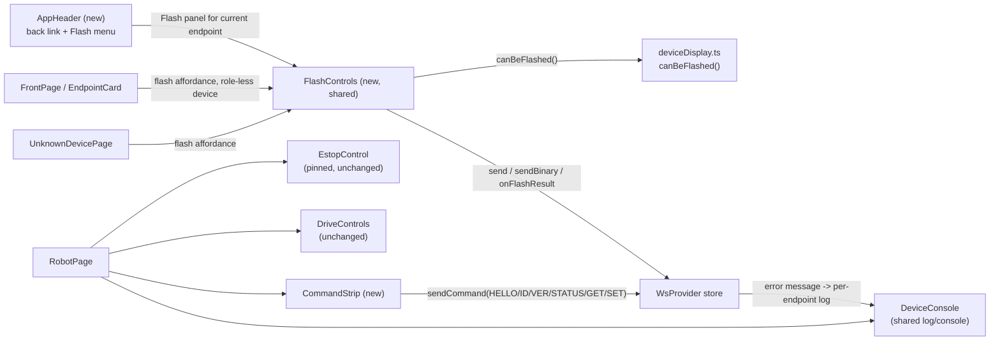

<!-- CLASI: Before changing code or making plans, review the SE process in CLAUDE.md -->

# Sprint 012: Device page usability: flash controls, navigation, and robot page layout

**Sequencing note:** this sprint is numbered 012 because sprints 8–11
were already ticketed or in-flight when the stakeholder asked for this
work, and CLASI does not renumber past a sprint already in `ticketing`
phase. Despite the number, **sprint 012 executes next, immediately
after sprint 007, ahead of sprints 008–011.** The number is an artifact
of creation order, not execution order — do not treat it as "later."

## Goals

Fix three stakeholder-reported, hands-on-bench usability problems with
the device pages, two of which are real logic bugs and not just layout
complaints:

1. **The most common bench state — a completely unflashed micro:bit —
   currently gets no flash controls anywhere.** `isFailedIdentify`'s
   gate (`role === null && sessionError !== undefined`) is never true
   for a silent board, because a silent board's session opens fine and
   `sessionError` stays `undefined`. This blocks the primary bench
   workflow (flash a blank board) and is fixed first, ahead of
   everything else in this sprint.
2. Flash controls, once fixed, need to be reachable from three places
   the stakeholder actually uses: the front-page card (a regression —
   they used to be there), any device's own page, and a persistent
   top-menu entry (new — there is currently no way to reflash an
   already-identified device at all).
3. Every device-page state needs a way back to the device list — today
   only one of four states (`hasSnapshot && !endpoint`) has one.
4. `RobotPage` needs a full relayout: one console instead of three
   response areas reading the same log (one of which, `GetSetPanel`,
   has a real bug — its `-1` watermark makes it echo the endpoint's
   *entire* rx history before anything is even sent), a command strip
   below the console, and a two-column, full-width layout with the
   console on the right.

All three issues are UI-only, genuinely separable, and this sprint
keeps them as one sprint (not three) per the dispatch's presumption
against splitting — the ticket count below (six) stays well within a
single focused sprint, and issues 1 and 3's own "Related" sections
independently ask for their app-header asks (Flash entry, back button)
to be planned together, which this sprint does in ticket 004.

## Problem

Three independent defects, verified against the current tree (sprint
007 touched only `packages/host/` and `packages/protocol/`, not the UI,
so every file:line citation in the three linked issues still holds as
read):

- **`UnknownDevicePage.tsx:230`** gates every flash affordance on
  `isFailedIdentify(endpoint)`, and **`deviceDisplay.ts:60-62`** defines
  that as `role === null && sessionError !== undefined`. A silent,
  unflashed board never sets `sessionError` (confirmed in
  `deviceRegistry.ts`'s `connectAndIdentify`: the session opens,
  `identify()` resolves `null` without throwing, and `sessionError`
  stays `undefined` the whole time), so this predicate is false for
  exactly the board state the stakeholder described.
- Flash controls were deliberately removed from the front-page card in
  sprint 004 (`FrontPage.tsx`'s own doc comment records the move to
  `UnknownDevicePage`) and never added to a top menu, so there is
  currently no flash affordance anywhere except one per-device page,
  and only for a subset of failure states.
- `DevicePage.tsx:57-68` renders "Back to devices" only in the
  not-connected dead-end branch. The loading (`!hasSnapshot`) branch and
  all three successful per-type pages (`RelayPage`, `RobotPage`,
  `UnknownDevicePage`) have no way back — confirmed by grep, none of
  the three import `Link`.
- `RobotPage.tsx` stacks `EstopControl`, `SequencingIndicator`, `Drive`,
  `Status`, `Get / Set`, and `DeviceConsole` in one `max-width: 46rem`
  column. `GetSetPanel.tsx:52-55` initializes `watermarkId` to `-1` and
  filters `log` on `entry.id > watermarkId`, so before any GET/SET is
  sent the "reply" area is actually showing the endpoint's entire rx
  log — confirmed by reading the component directly, matching the
  issue's citation exactly. Neither `GetSetPanel.css` (`min-height:
  2rem`, no `max-height`/`overflow`) nor the deleted-in-this-sprint
  `StatusPanel`'s reply area can scroll or cap their height, which is
  the "they get bigger" symptom.
- **A discovery made while verifying this sprint's premises, not
  present in either issue as written**: the command strip's planned
  `HELLO` button cannot simply call `sendCommand(endpointId, "HELLO")`
  as issue 3's own structural notes assume. `deviceRegistry.ts:945-951`
  explicitly rejects `"HELLO"` sent as a live command *before* it
  reaches `Session` at all (a deliberate sprint 006 safety decision —
  `HELLO` resets the robot's sequence state and must never be issued
  mid-session). That rejection is reported via `DeviceRegistry.onError`
  → a `type: "error"` wire message — which `WsProvider.tsx:598-606`
  currently drops as a documented no-op ("no component ever subscribed
  ... a future ticket adding error handling has an obvious place to put
  it"). Left unaddressed, pressing the strip's Hello button on an
  already-open session would silently do nothing, which is worse than
  the layout bug this sprint is fixing. See Architecture, Design
  Rationale, for the fix (ticket 003).

## Solution

Six tickets, ordered by dependency, flash-controls-bug first:

1. Fix the gating predicate so a silent, unflashed board shows flash
   controls (`role === null`, independent of `sessionError`), via a
   new, correctly-named predicate rather than redefining
   `isFailedIdentify` in place (see Design Rationale — its blast radius
   is checked and is a single call site).
2. Extract the release-flash and local-hex flows out of
   `UnknownDevicePage` into a shared `FlashControls` component, and use
   it to restore a flash affordance on the front-page card for
   role-less devices (the sprint-004 regression), restructuring the
   card so its buttons sit beside the card's `Link`, not nested inside
   it.
3. Wire `type: "error"` server messages into the firing endpoint's
   console log, closing the dropped-message gap discovered above —
   needed before the command strip's `HELLO` button can report
   anything when it's refused.
4. Add a route-aware `AppHeader`: a back-to-devices link shown on any
   route other than `/` (covering all four device-page states in one
   place, including the loading state DevicePage.tsx never had to
   change), and a Flash menu entry usable from any device page,
   reflashing the current device through the same shared
   `FlashControls`, with a confirmation step when the device is already
   identified (relay/robot) — a reflash of a working device is more
   destructive than recovering a dead one.
5. Relay out `RobotPage` into two columns — left: `EstopControl`
   (pinned, outside both columns), `DriveControls`, and a stubbed
   charts area for a future sprint; right: one `DeviceConsole`,
   full-height, with a `CommandStrip` beneath it offering
   HELLO/ID/VER/STATUS and GET/SET, all replies landing in that one
   console. `StatusPanel`/`GetSetPanel` and their separate reply areas
   are retired.
6. Layer Get/Set field-name auto-discovery onto the command strip: fire
   a bare `GET` when the page mounts, harvest field names from the
   `get ...` reply lines, and populate an editable combo box — the "no
   invented vocabulary" mechanism the issue itself works out, kept as
   its own ticket so the base command strip (ticket 005) ships and is
   testable on its own first.

Chart placement follows the issue's own stated lower-risk recommendation
this sprint: motion controls and a stubbed chart area share the left
column, the console owns the right column alone, no tabs. Charts
themselves and any tabbed layout are out of scope (see Scope).

## Success Criteria

All test-provable — this is UI-only work with no hardware dependency.

- A pinned regression fixture (`role: null, sessionError: undefined`)
  renders flash controls on both the device's own page and its
  front-page card.
- Every device page (relay, robot, unknown) and the app header both
  offer a way to flash/reflash the current device; reflashing an
  already-identified device requires an explicit confirmation step.
- From every device-page state (loading, not-connected, relay, robot,
  unknown), a labeled, keyboard-reachable control returns to `/`; no
  state renders two back controls.
- `RobotPage` renders exactly one console/log region. `GetSetPanel`'s
  and `StatusPanel`'s separate reply areas are gone. A command strip
  below the console offers HELLO, ID, VER, STATUS, and GET/SET; every
  reply — including a host-side rejection such as `HELLO`'s — appears
  in that one console.
- `RobotPage` uses a two-column layout with `max-width: 46rem` removed;
  `EstopControl` sits outside both columns' scroll containers and stays
  visible regardless of scroll position in either.
- `RobotPage.transportBlind.test.ts` passes against the sprint's changed
  component set (new `CommandStrip`, `StatusPanel`/`GetSetPanel`
  removed).
- `npm test` (783 passing at sprint start) and `npm run build` continue
  to pass throughout.

## Scope

### In Scope

1. `deviceDisplay.ts` — new `canBeFlashed` predicate; updated doc
   comments.
2. Shared `FlashControls` component (release + local-hex flows,
   progress rendering, `onFlashResult` subscription), consumed by
   `UnknownDevicePage`, the front-page card, and the app header's Flash
   panel.
3. Front-page card restructuring so an action row sits beside the
   card's `Link`, not nested inside it.
4. `WsProvider.tsx` — route `type: "error"` messages into the firing
   endpoint's console log.
5. Route-aware `AppHeader`: back-to-devices link; Flash menu entry with
   a confirmation step for an already-identified device. Reconciling
   `DevicePage.tsx`'s existing not-connected-branch back link so there
   is exactly one back control per state.
6. `RobotPage` two-column relayout: `EstopControl` pinned above both
   columns; left column `DriveControls` + a stubbed charts area; right
   column one `DeviceConsole` (full-height, scrolling) + a new
   `CommandStrip` (HELLO/ID/VER/STATUS/GET/SET). Retiring
   `StatusPanel.tsx`/`GetSetPanel.tsx` and their separate reply areas.
   Updating `RobotPage.transportBlind.test.ts`'s scanned file list.
7. Get/Set field-name auto-discovery (bare `GET` on mount, harvest
   `get ...` replies, editable combo box).
8. Stabilizing the known intermittent `UnknownDevicePage.test.tsx`
   flake under full-suite parallelism, as part of ticket 002's rewrite
   of that test file (see Design Rationale).

### Out of Scope

- Telemetry charts/graphs themselves — the left column ships with a
  stubbed placeholder only; no chart component exists in this codebase
  yet and building one is a separate, larger piece of work per issue
  3's own scoping note.
- A tabbed right column (Console / Charts tabs) — deferred alongside
  charts; this sprint's layout can absorb tabs later without redoing
  the split (issue 3's own note).
- `RelayPage`'s robot dropdown — still blocked on sprint 5's roster,
  unrelated to this sprint.
- Any change to *when or why* the host refuses a live `HELLO` — that
  sprint 006 safety decision is unchanged; this sprint only makes the
  resulting rejection message visible instead of silently dropped.
- Any new transport, calibration wizards, or persistence work.
- A hardcoded GET/SET field-name table — discovery stays live,
  device-sourced, and editable; never an invented vocabulary.

## Test Strategy

Fully test-provable against `vitest` and fake sockets/links — no
hardware dependency for any criterion this sprint (unlike sprints 4 and
6, nothing here needs a real board).

- `deviceDisplay.test.ts`: `canBeFlashed` truth table across all four
  `(role, sessionError)` combinations, pinning the silent-board case
  specifically.
- `FlashControls.test.tsx` (new, migrating the release/local-hex/
  progress assertions currently in `UnknownDevicePage.test.tsx`): the
  full local-hex handshake, oversize rejection, and post-flash
  navigation/`reidentify: "timeout"` behavior, now exercised against
  the shared component directly. Also covers the previously-flaky
  suite; the ticket must identify the specific source of the
  intermittency (most likely async `crypto.subtle.digest`/timer
  interleaving under Vitest's per-file worker isolation) and either fix
  it or add the isolation/awaiting needed to make it deterministic —
  not just relocate the flake into a new file name.
- `FrontPage.test.tsx`: role-less device card shows flash controls;
  card's `Link` still navigates correctly (click, keyboard) with the
  action row present as a sibling, not nested inside the anchor
  (assert DOM structure directly — an interactive element inside an
  `<a>` is invalid markup this test should catch, not just avoid by
  convention).
- `AppHeader.test.tsx` (new) + updates to `DevicePage.test.tsx`,
  `RelayPage.test.tsx`, `RobotPage.test.tsx`,
  `UnknownDevicePage.test.tsx`/`FlashControls.test.tsx`: back link
  present and correctly labeled in all five page states; Flash menu
  entry present on every device page; confirmation step required and
  respected for an identified device, not required for an unknown one.
- `WsProvider.test.tsx`: a `type: "error"` message carrying an
  `endpointId` is appended to that endpoint's log (visible via
  `useEndpointLog`); the no-`endpointId` case is exercised and its
  chosen behavior (global banner vs. dropped, ticket 003's call) is
  pinned by a test, not left implicit.
- `RobotPage.test.tsx`: exactly one log/console region renders; a
  populated rx log with nothing sent produces no second echoed region
  (the regression test for `GetSetPanel`'s old bug, now asserted
  against the page as a whole per the issue's own acceptance sketch);
  command strip buttons dispatch the right verb via the right path
  (`HELLO`/`ID`/`VER`/`STATUS` unsequenced except `HELLO`'s special
  host-side rejection, `GET`/`SET` sequenced); `HELLO`'s rejection
  message appears in the console; `EstopControl` is asserted to be a
  sibling of, not nested inside, either column's scrollable container.
- `RobotPage.transportBlind.test.ts`: file list updated to drop
  `StatusPanel.tsx`/`GetSetPanel.tsx` and add `CommandStrip.tsx`;
  re-run to confirm the new file is transport-blind, not merely that
  the old scan still passes.
- `CommandStrip.test.tsx` (new): field-name auto-discovery fires a bare
  `GET` on mount against a fake link, harvests names from `get ...`
  reply lines into an editable `<datalist>`/combo box, and an unlisted
  typed name is still sendable.

Commands: `npm test` (783 passing at sprint start), `npm run build`.

## Architecture

**Substantial** — this sprint touches well over three modules across
one package (`deviceDisplay.ts`, `FlashControls.tsx` (new),
`FrontPage.tsx`, `WsProvider.tsx`, `AppHeader.tsx` (new),
`DevicePage.tsx`, `RobotPage.tsx`, `CommandStrip.tsx` (new),
`RobotPage.css`, `RobotPage.transportBlind.test.ts`, and retires
`StatusPanel.tsx`/`GetSetPanel.tsx`), introduces new cross-module
dependencies (the front page and the app header both now depend on a
shared `FlashControls` component that didn't exist before; `WsProvider`
gains a new data path from an existing-but-unused wire message into the
per-endpoint log), and changes `RobotPage`'s dependency shape
substantially even though it changes no persisted data model — no ERD
is needed (nothing here is persisted; `wsMessages.ts`'s `error` message
already existed on the wire, unchanged, this sprint only starts
consuming it).

### Architecture Overview

**Responsibilities this sprint introduces or changes:**

1. **Deciding whether a device can be flashed** (`deviceDisplay.ts`) —
   pure, no I/O; changes only when the flash-eligibility rule changes.
2. **Owning the flash UI/logic (both release and local-hex flows)**
   (`FlashControls.tsx`, new) — currently trapped inside
   `UnknownDevicePage`; extracted so it has exactly one owner reused by
   three call sites, instead of three divergent copies.
3. **Routing a host-side error to where a student can see it**
   (`WsProvider.tsx`) — an existing wire message (`type: "error"`)
   gains a first consumer.
4. **Presenting route-aware chrome** (`AppHeader.tsx`, new) — a back
   link and a Flash menu entry, both derived from the current route,
   rendered once, above every page.
5. **Presenting the robot control surface** (`RobotPage.tsx`,
   `CommandStrip.tsx` (new), `RobotPage.css`) — two-column layout, one
   console, one command strip; `StatusPanel`/`GetSetPanel` retired.

**Modules, purpose, and boundary:**

| Module | Purpose (one sentence, no "and") | Boundary | Serves |
|---|---|---|---|
| `deviceDisplay.ts` (`canBeFlashed`, new) | Decide whether a device's current state should offer flash controls | Pure function on `EndpointListEntry`; no rendering, no knowledge of *where* flash controls are shown | SUC-001 |
| `components/FlashControls.tsx` (new) | Render and drive the release/local-hex flash flow for one endpoint | Owns its own progress/error/upload state and the `onFlashResult`/`onFlashLocalReady` subscriptions; takes an endpoint and renders controls — no knowledge of which page/card/panel hosts it | SUC-001, 002, 003 |
| `pages/FrontPage.tsx` (`EndpointCard`, restructured) | Render one endpoint as a navigable card with a sibling flash action row | The card's `Link` covers only the informational region; `FlashControls` is a sibling, not a nested interactive element inside the anchor | SUC-002 |
| `ws/WsProvider.tsx` (extended) | Own the one client socket + snapshot/log store, including now-consumed host error messages | No rendering; append-to-log is the only new behavior, using the same per-endpoint log store `DeviceConsole` already reads | SUC-005 |
| `components/AppHeader.tsx` (new) | Render route-derived chrome: back link, Flash menu | Reads the current route via `useMatch`/`useLocation` (it sits outside the routed subtree — see Design Rationale); no per-page business logic | SUC-003, 004 |
| `pages/DevicePage.tsx` (trimmed) | Dispatch to the correct per-type page by classification | Its own not-connected-branch back link is removed — `AppHeader` is now the single source of the back control | SUC-004 |
| `pages/RobotPage.tsx` (relayout) | Compose the robot control surface into a two-column layout | No verb classification, no transport awareness (transport-blindness unchanged and now re-certified against a new file set) | SUC-006 |
| `components/CommandStrip.tsx` (new) | Send HELLO/ID/VER/STATUS/GET/SET through `sendCommand`, with all replies landing in the shared console log | No local reply rendering of its own — every reply is read by `DeviceConsole` from the same per-endpoint log; owns only the Get/Set field-discovery state | SUC-006, 007 |

Every module addresses at least one SUC (table above); no module has
more than one reason to change; dependency direction is unchanged from
sprint 004/006 — Presentation (`ui`) → `WsProvider` (transport) → host
types, with `FlashControls` and `CommandStrip` as new presentation-layer
leaves with no outward dependency beyond `WsProvider`'s existing action
surface.

**Component diagram** (required — well over 3 modules touched, new
cross-module dependencies: `FrontPage`/`AppHeader` → `FlashControls`;
`CommandStrip`/`WsProvider` → `DeviceConsole`'s shared log):

Dependency direction is unchanged from sprint 004/006: presentation
depends on `WsProvider`, never the reverse; `Session`/`Link`/host code
is untouched by this sprint except for the one-line error-routing
change inside `WsProvider`'s message switch, which is itself UI-side
(the host already emits `type: "error"`; nothing changes host-side).
No cycle is introduced — `FlashControls` and `CommandStrip` are new
leaves with exactly the same outward dependency shape as every existing
presentation component (`WsProvider`'s action surface only).

**What Changed:**
- `deviceDisplay.ts`: new `canBeFlashed(device): boolean` returning
  `device.role === null` (ignoring `sessionError`); `isFailedIdentify`
  removed (its one caller is replaced, see Design Rationale) along with
  its doc comment's now-incorrect "never an unprobed device" claim.
- New `components/FlashControls.tsx`, lifting
  `UnknownDevicePage.tsx:136-328`'s body (release buttons, local-hex
  handshake, progress rendering, `onFlashResult` subscription) out
  verbatim, parameterized on an endpoint.
- `pages/FrontPage.tsx`: `EndpointCard` restructured — the `Link` wraps
  only the informational region; an action row (mounting
  `FlashControls` when `canBeFlashed`) sits beside it, inside the `<li>`
  but outside the `<a>`.
- `ws/WsProvider.tsx`: the `case "error":` branch in the message switch
  now appends a synthetic log entry to the firing endpoint's log when
  `endpointId` is present (see Design Rationale for the no-`endpointId`
  case).
- New `components/AppHeader.tsx`, mounted in `App.tsx` in place of the
  static `<h1>`-only header; uses `useLocation`/`useMatch` to decide
  back-link visibility and to resolve the current endpoint for its
  Flash menu.
- `pages/DevicePage.tsx`: not-connected branch's `<Link>` removed
  (superseded by `AppHeader`).
- `pages/RobotPage.tsx` + `RobotPage.css`: two-column layout;
  `StatusPanel`/`GetSetPanel` usages removed; new `CommandStrip`
  mounted below `DeviceConsole` in the right column;
  `StatusPanel.tsx`/`StatusPanel.css`/`StatusPanel.test.tsx`,
  `GetSetPanel.tsx`/`GetSetPanel.css`/`GetSetPanel.test.tsx` deleted.
- `pages/RobotPage.transportBlind.test.ts`: `FILES_UNDER_TEST` updated
  to drop the two deleted files and add `CommandStrip.tsx`.

**Why:** see Problem — the flash-gating bug blocks the primary bench
workflow; the navigation gap strands a student on four of five
device-page states; the robot page's three-response-area layout is both
a UX complaint and a real bug (`GetSetPanel`'s `-1` watermark).

**Impact on Existing Components:** `UnknownDevicePage.tsx` shrinks to a
thin wrapper composing `FlashControls` + `DeviceConsole`, its own flash
logic fully delegated. `DeviceConsole.tsx` is unchanged in its own
right but gains new callers of its underlying log store (`CommandStrip`
writes commands, `WsProvider`'s error routing writes rejections) — its
public contract (`device` prop, `useEndpointLog`) does not change.
`RelayPage.tsx` is untouched except for inheriting the app header (no
file changes there beyond what `AppHeader`'s mount in `App.tsx`
already covers).

### Design Rationale

**Decision: a new `canBeFlashed` predicate, not `isFailedIdentify`
redefined in place.**
- *Context:* `isFailedIdentify` currently gates flash controls and is
  wrong for a silent board; it needs to become `role === null`,
  ignoring `sessionError`.
- *Blast radius, checked:* `grep -rn "isFailedIdentify" packages/ui/src`
  finds exactly one call site (`UnknownDevicePage.tsx:230`) plus its own
  definition and doc comment. No other module depends on its current
  semantics.
- *Alternatives considered:* (a) redefine `isFailedIdentify` itself to
  `role === null`; (b) add a new, differently-named predicate and stop
  using `isFailedIdentify` where flash-gating is decided.
- *Why (b):* even with a single caller, (a) would leave a function named
  "is-failed-identify" returning `true` for the common, unalarming
  "hasn't announced yet" case its own doc comment currently calls out as
  excluded on purpose (`deviceDisplay.ts:53-59`'s "never an unprobed
  device"). Broadening the behavior without renaming would make the
  name actively misleading to the next reader. `roleDisplay` (a
  different function, unaffected by this decision) already computes its
  own "Unresponsive" label straight from `sessionError` — nothing else
  needs `isFailedIdentify`'s narrower "actually failed" meaning, so
  removing it costs nothing.
- *Consequences:* `isFailedIdentify` is deleted, not deprecated —
  clean, since blast radius is exactly one file.

**Decision: extract a shared `FlashControls` component rather than
duplicate flash markup at each of three call sites.**
- *Context:* flash controls now need to render on the front-page card,
  the unknown-device page, and the app header's Flash panel.
- *Alternatives considered:* (a) one shared component, parameterized on
  an endpoint; (b) copy a slimmed-down version of the release-flash
  buttons to each new call site, leaving the full local-hex flow only
  on `UnknownDevicePage`.
- *Why (a):* the progress/error/`onFlashResult`/local-hex-handshake
  state is intricate (see `UnknownDevicePage.tsx`'s own doc comment) and
  three independent copies would drift. Issue 1's own suggested
  direction calls for exactly this extraction.
- *Consequences:* `UnknownDevicePage.tsx` shrinks to a thin wrapper;
  its existing test file's assertions move to a new
  `FlashControls.test.tsx` (ticket 002), which is also where the known
  intermittent flake is addressed (see Test Strategy) rather than
  carried forward silently into a renamed file.

**Decision: `AppHeader` (route-aware header), not a shared per-page
chrome wrapper.**
- *Context:* issue 2 proposes two options: a route-aware app header, or
  a chrome component wrapping `DevicePage`'s type-dispatch switch.
- *Why the header:* it covers the `!hasSnapshot` loading state and the
  not-connected state for free, without `DevicePage.tsx` needing any
  branch-specific change beyond removing its now-redundant link; a
  chrome wrapper around the switch would still need `DevicePage.tsx` to
  special-case the two states that render before the switch is ever
  reached. The header also keeps the back control and the Flash menu in
  one stable screen position as the student moves between device types,
  which the issue calls out as the better fit.
- *Consequences:* `AppHeader` lives outside `DevicePage`'s route tree,
  so it cannot use `useParams` to read `:endpointId` directly. It uses
  `react-router`'s own `useMatch("/d/:endpointId")` (available in the
  installed `react-router@8.3.1`) rather than hand-rolling a regex
  against `location.pathname` — this reuses the same path-matching
  engine `router.tsx`'s route table is built on instead of a second,
  parallel implementation of "what does this URL shape mean," and
  yields typed `match.params.endpointId` access. This is a deliberate,
  narrow exception to "components read route params via the route
  they're rendered inside," scoped to this one component, and is why
  `AppHeader` is its own module rather than folded into `router.tsx` or
  `App.tsx` directly.

**Decision: reflashing an already-identified device requires an
explicit confirmation step; recovering an unknown device does not.**
- *Context:* issue 1 flags this as worth a stakeholder decision rather
  than an assumption, since a reflash of a *working* relay/robot is
  more destructive than recovering a dead one.
- *Why deciding now rather than leaving it open:* shipping the Flash
  menu entry without *some* guard on an identified device would be a
  worse default than shipping with one — a confirm step is the safer
  default and is cheap to relax later if the stakeholder wants it
  removed for a specific classification.
- *Consequences:* ticket 004's acceptance criteria require the
  confirmation step for `relay`/`robot` classifications and not for
  `unknown`; the exact confirmation UX (native `confirm()` vs. an
  in-page dialog) is left to the ticket, not pinned here. Flagged again
  under Open Questions for explicit stakeholder sign-off at review.

**Decision: route `type: "error"` messages into the per-endpoint
console log, not a new error-toast surface.**
- *Context:* `deviceRegistry.ts`'s deliberate `HELLO`-as-live-command
  refusal (sprint 006, unchanged) is reported via `onError` → a
  `type: "error"` wire message, which `WsProvider.tsx` currently drops
  entirely — a documented no-op with nothing subscribed. Without a fix,
  the command strip's Hello button would appear to do nothing when
  pressed against an already-open session.
- *Alternatives considered:* (a) append the message to the firing
  endpoint's log, so it renders exactly like any other reply; (b) add a
  new, separate error-toast/banner component.
- *Why (a):* matches this sprint's own stated goal for `RobotPage` — "no
  separate response areas, all replies land in the one console log" —
  at zero new UI surface, and lands at the exact spot `WsProvider`'s own
  doc comment already earmarked for this ("a future ticket adding error
  handling has an obvious place to put it").
- *Consequences:* an `error` message that does carry an `endpointId`
  (both current `emitError` call sites in `deviceRegistry.ts` do)
  appends cleanly. A hypothetical `error` message with no `endpointId`
  has nowhere per-device to go; ticket 003 picks and documents a
  fallback (global banner or drop) even though no current caller
  exercises that path — see Open Questions.

**Decision: `EstopControl` stays a sibling of the two-column grid, not
a child of either column, so its existing `position: sticky` keeps
working unmodified.**
- *Context:* `EstopControl.css`'s own doc comment states its
  `position: sticky; top: 0` pinning relies on "RobotPage renders the
  whole page in normal document flow, so the nearest scrolling ancestor
  is the document itself" — an assumption a two-column layout with an
  independently-scrolling right column (per issue 3's own note: "the
  console log should scroll to fill it rather than keeping the fixed
  `max-height`") would break if `EstopControl` ended up nested inside
  that scrolling column.
- *Why:* mounting `EstopControl` above the two-column grid (as this
  sprint's Solution already calls for — "pinned, outside both columns")
  keeps its nearest scrolling ancestor the document, exactly as its CSS
  comment assumes, so `EstopControl.css` needs no change at all. This
  was confirmed against the actual file during architecture review, not
  assumed from the issue's prose alone.
- *Consequences:* ticket 005's acceptance criteria assert this
  structurally (`EstopControl` is not a descendant of either column's
  scroll container) rather than only visually, since a regression here
  would silently reintroduce the exact hazard sprint 006 built
  `EstopControl` to avoid.

**Decision: chart placement follows the issue's own recommended
option (a) — motion controls and a stubbed chart area share the left
column; the console owns the right column alone; no tabs this sprint.**
- *Context:* issue 3 states the layout two ways (motion+charts left /
  console right, vs. motion left / tabbed console+charts right) and
  flags it as unresolved.
- *Why (a):* charts don't exist yet regardless of which side they land
  on: (a) is the lower-risk first pass per the issue's own reasoning
  (a student can watch a chart and the console at once, and the tabbed
  option can be added on the right later without redoing the split).
- *Consequences:* the left column ships with a stubbed, empty charts
  area (a labeled placeholder, no chart library, no telemetry
  subscription) this sprint; building the actual chart component and
  deciding on tabs is future work.

**Decision: Get/Set field auto-discovery is its own ticket (006),
layered on top of the base command strip (005), not bundled into it.**
- *Context:* the discovery mechanism (fire a bare `GET`, harvest field
  names from replies) is well-specified in issue 3's structural notes
  but is materially more work than wiring four unsequenced buttons plus
  a free-text GET/SET pair.
- *Why separate:* the base command strip is independently useful and
  independently testable without the discovery mechanism — a plain
  free-text name field already satisfies the acceptance sketch's "a
  Get/Set field selector" literally. Splitting keeps ticket 005 shippable
  on its own and isolates discovery's own risk (harvesting parse logic
  against `get ...` reply lines) into a ticket that can be reviewed and
  tested independently.
- *Consequences:* one more ticket than the strict minimum; judged worth
  it for the same reason sprint 006 split e-stop into its own ticket —
  isolating a distinct piece of logic's acceptance criteria.

### Migration Concerns

None — no persisted data (nothing this sprint touches is stored beyond
the browser tab's lifetime), and host and UI ship together (no deployed-
boundary compatibility concern, same as every prior sprint's Migration
Concerns section). The one sequencing constraint that matters is ticket
order: `FlashControls` (002) must exist before the front-page and
app-header tickets that consume it (004 depends on 002); `WsProvider`'s
error-routing (003) must land before the `RobotPage` relayout (005)
ships a `HELLO` button whose only user-visible feedback, on refusal, is
that routed message. `StatusPanel.tsx`/`GetSetPanel.tsx` are deleted
outright in ticket 005 rather than deprecated — both are fully
superseded by `CommandStrip`/the unified console, and neither is
imported anywhere outside `RobotPage.tsx` and its own now-retired test
file (confirmed by their sole `RobotPage.tsx` import sites read during
planning).

**Open Questions:**
1. The stubbed charts-area placement (left column, option (a)) is a
   planning-time decision per the issue's own recommendation, not yet a
   stakeholder sign-off — confirm before the actual chart feature is
   ticketed in a future sprint.
2. The exact confirmation UX for reflashing an identified device
   (native `confirm()` vs. an in-page dialog) is left to ticket 004;
   flag for stakeholder review once built, since issue 1 explicitly
   called this a stakeholder decision rather than an implementation
   detail.
3. Whether an `error` message with no `endpointId` should render as a
   global banner or be dropped is undecided at planning time — no
   current caller produces one, so ticket 003 documents whichever
   default it picks rather than this sprint pinning a behavior nothing
   exercises yet.

## Use Cases

Substantial tier — full use cases. SUC-001/002/003 extend
**UC-002 — Install firmware on a blank micro:bit**; SUC-004 extends
**UC-001 — Connect and identify a device over USB** (the device-list
browsing context UC-001's postcondition already describes); SUC-005/
006/007 extend **UC-003 — Drive a robot over USB**, the same parent
sprint 006 used for `RobotPage`'s original control surface, since this
sprint revises that surface rather than introducing a new one.

### SUC-001: Recover a silent, unflashed board via flash controls
Parent: UC-002

- **Actor**: Student
- **Preconditions**: A micro:bit is attached, its session is open, and
  it has never announced a role (`role: null`, `sessionError:
  undefined` — the common, silent-board case).
- **Main Flow**:
  1. Student opens the device's own page.
  2. `canBeFlashed(endpoint)` evaluates `true` (role is `null`,
     regardless of `sessionError`), so release-firmware buttons and the
     local-hex file picker render.
  3. Student flashes as in UC-002's existing main flow.
- **Postconditions**: The board can be recovered from this state without
  the student needing to first provoke a `sessionError` (e.g. by
  unplugging and replugging) to make flash controls appear.
- **Acceptance Criteria**:
  - [ ] A fixture `EndpointListEntry` with `role: null, sessionError:
        undefined` renders flash controls on its device page (pinned
        regression test).
  - [ ] `isFailedIdentify` no longer gates flash-control visibility
        anywhere in the codebase.

### SUC-002: Flash a role-less device from its front-page card
Parent: UC-002

- **Actor**: Student
- **Preconditions**: A device is listed on the front page and
  `canBeFlashed` is `true` for it.
- **Main Flow**:
  1. Student sees a flash affordance directly on the device's
     front-page card, without clicking through to its own page.
  2. Student flashes as in UC-002's existing main flow, using
     `FlashControls` mounted on the card.
- **Postconditions**: The card's navigation (click, middle-click,
  keyboard) still works — the flash action row is a sibling of the
  card's `Link`, not nested inside it.
- **Acceptance Criteria**:
  - [ ] A role-less device's card renders `FlashControls`.
  - [ ] The card's `<a>` contains no interactive element (`<button>`,
        `<input>`) inside it — asserted on DOM structure, not just
        visual placement.
  - [ ] Clicking the card away from the flash controls still navigates
        to `/d/:endpointId`.

### SUC-003: Reflash any device from the top menu
Parent: UC-002

- **Actor**: Student
- **Preconditions**: Student is on any device page (`relay`, `robot`,
  or `unknown`).
- **Main Flow**:
  1. Student opens the Flash entry in the app header.
  2. For an `unknown` device, `FlashControls` opens directly.
  3. For an identified (`relay`/`robot`) device, an explicit
     confirmation step is required before `FlashControls` opens.
  4. Student flashes as in UC-002's existing main flow.
- **Postconditions**: A student can reflash any device without first
  navigating to a specific per-type page that happens to expose flash
  controls (previously, none did for `relay`/`robot`).
- **Acceptance Criteria**:
  - [ ] The Flash menu entry is present and enabled on every device-page
        state that has a resolvable endpoint.
  - [ ] Selecting it for a `relay`/`robot` device requires confirmation
        before `FlashControls` opens; selecting it for `unknown` does
        not.

### SUC-004: Return to the device list from any device-page state
Parent: UC-001

- **Actor**: Student
- **Preconditions**: Student is on `/d/:endpointId` in any of its five
  states (loading, not-connected, relay, robot, unknown).
- **Main Flow**:
  1. Student activates the back control in the app header.
  2. The browser navigates to `/`.
- **Postconditions**: Every device-page state has exactly one back
  control, reachable by keyboard, with an accessible name.
- **Acceptance Criteria**:
  - [ ] Each of the five states renders exactly one control that
        navigates to `/`.
  - [ ] The control has an accessible name (not an icon-only button with
        none).
  - [ ] The previously-existing not-connected-branch link is removed
        from `DevicePage.tsx`, superseded by the header's.

### SUC-005: See a host-side command rejection in the console
Parent: UC-003

- **Actor**: Student
- **Preconditions**: `RobotPage` is open for a `robot`-classified
  endpoint with an open session.
- **Main Flow**:
  1. Student presses the command strip's Hello button.
  2. The UI sends `sendCommand(endpointId, "HELLO")`.
  3. The host rejects it (per sprint 006's unchanged safety rule) and
     reports the rejection via a `type: "error"` message carrying this
     endpoint's id.
  4. `WsProvider` appends the rejection text to this endpoint's log; the
     console renders it like any other line.
- **Postconditions**: The student sees *why* nothing happened, instead
  of a silently no-op button.
- **Acceptance Criteria**:
  - [ ] An `error` message with an `endpointId` appears in that
        endpoint's `useEndpointLog` output.
  - [ ] Pressing Hello on an already-open session shows the host's
        refusal text in the console.

### SUC-006: Drive and monitor a robot on a two-column page with one console
Parent: UC-003

- **Actor**: Student
- **Preconditions**: `RobotPage` open for a `robot`-classified endpoint.
- **Main Flow**:
  1. Page renders two columns: left — `EstopControl` (pinned above
     both), `DriveControls`, a stubbed charts area; right — one
     `DeviceConsole`, full-height, with `CommandStrip` beneath it.
  2. Student sends ID/VER/STATUS/GET/SET from the strip; every reply
     appears in the one console log.
  3. Student scrolls the console; `EstopControl` remains visible and
     clickable regardless of scroll position in either column.
- **Postconditions**: Exactly one log region exists on the page; no
  region grows without bound (both `DeviceConsole` and, where
  applicable, the page itself stay within a bounded, scrollable
  container).
- **Acceptance Criteria**:
  - [ ] A populated rx log with nothing sent produces no second echoed
        region (the `GetSetPanel`-bug regression test, now against the
        page).
  - [ ] `max-width: 46rem` is gone from `RobotPage.css`.
  - [ ] `EstopControl` is not a descendant of either column's scroll
        container.
  - [ ] `RobotPage.transportBlind.test.ts` passes against the updated
        file set (`CommandStrip.tsx` added, `StatusPanel.tsx`/
        `GetSetPanel.tsx` removed).

### SUC-007: Discover legal GET/SET field names from the device itself
Parent: UC-003

- **Actor**: Student
- **Preconditions**: `RobotPage` open for a `robot`-classified endpoint
  with an open session.
- **Main Flow**:
  1. On mount, `CommandStrip` fires a bare `GET`.
  2. The device replies with one `get <name> <value>` line per known
     field; `CommandStrip` harvests the names into an editable combo
     box.
  3. Student picks a discovered name, or types one that wasn't
     discovered — both are sendable.
- **Postconditions**: The field picker reflects only names the device
  itself has reported, with no hardcoded vocabulary, while still
  accepting an arbitrary typed name.
- **Acceptance Criteria**:
  - [ ] A fake link's `get ...` reply lines populate the combo box's
        options.
  - [ ] A name not among the discovered options can still be typed and
        sent.

## GitHub Issues

(GitHub issues linked to this sprint's tickets. Format: `owner/repo#N`.)

## Definition of Ready

Before tickets can be created, all of the following must be true:

- [ ] Sprint planning document is complete (sprint.md, including its
      Architecture and Use Cases sections)
- [ ] Architecture review passed (or skipped, for changes with no
      architectural impact)
- [ ] Stakeholder has approved the sprint plan

## Tickets

| # | Title | Depends On |
|---|-------|------------|
| 001 | Fix flash-controls gating for a silent, unflashed board | — |
| 002 | Extract shared FlashControls component and restore front-page flash affordance | 001 |
| 003 | Route host error messages into the per-endpoint console log | — |
| 004 | App header: route-aware back-to-devices link and Flash menu | 002 |
| 005 | RobotPage two-column layout, unified console, and command strip | 003 |
| 006 | Command strip Get/Set field auto-discovery | 005 |

Tickets execute serially in the order listed. Ticket 001 is listed
first per the dispatch's own priority instruction — it unblocks the
primary bench workflow (flashing a blank board) and does not depend on
or wait behind any layout work. Ticket 003 has no code dependency on
001/002 and could run earlier, but is sequenced after them so the
flash-controls issue's fixes land together before the robot-page work
begins.
