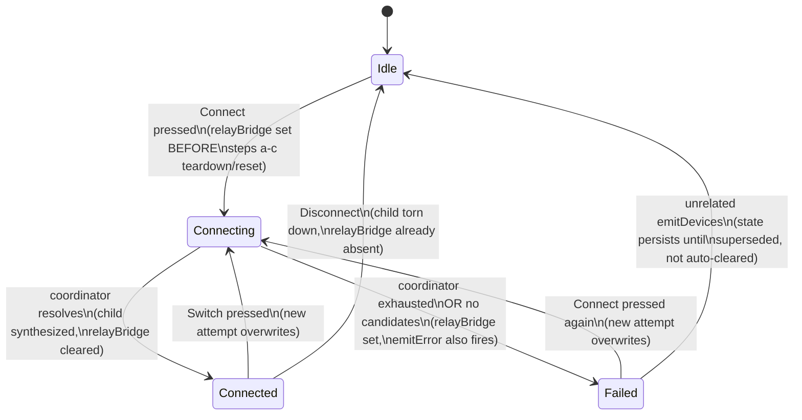

<!-- CLASI: Before changing code or making plans, review the SE process in CLAUDE.md -->

# Sprint 013: Relay bridging state on the front page and relay page

## Goals

Make the relay card (front page) and the relay's own page show an explicit,
host-driven radio-bridging state — idle / connecting to `<name>` / connected
to `<name>` / failed with a reason — instead of overloading "Linked" (which
must keep meaning only "the host has an open transport session to the relay
itself") to imply anything about the radio bridge. A robot reached through
the relay must reliably show up as its own device-list card, and the
failure path must be visible on the card rather than silently disappearing
into the relay's console log.

## Problem

Today, pressing Connect on a relay card's robot pull-down kicks off a
multi-second reset/boot-delay/handshake sequence with no visible feedback:
the card just keeps showing "Linked", which reads as if it might mean
"connected to the robot" even though it only ever meant "the relay's own
USB/WiFi session is open." On success, the synthesized `-via-<name>` child
endpoint is supposed to appear as its own card, but the stakeholder saw
`GoPiv` never show up in the device list despite the robot being on and
reachable. On failure, the coordinator's exhaustion message goes only to
`emitError` on the relay's console log — the front page never surfaces it —
so a failed Connect looks identical to an idle relay that simply happens to
say "Linked". There is no reliable way for the stakeholder to tell, from
either the front page or the relay page, whether a Connect attempt is in
flight, succeeded, or failed.

## Solution

Carry relay-bridging state as host-side state on the relay's own
`EndpointListEntry` (`packages/host/src/wsMessages.ts`) — a
present-only-when-relevant `relayBridge: { state: "connecting" | "failed",
robotName, error? }` block — set and cleared by `openRobotViaRelay` in
`packages/host/src/deviceRegistry.ts` as it resets the relay, waits out the
boot delay, and runs the handshake, instead of routing failures through
`emitError` alone. "Connected" state stays derivable from whether the
synthesized `-via-<name>` child endpoint exists and has an open session, so
no separate "connected" flag is needed on the relay entry itself.
`FrontPage.tsx` (`RobotCard`, `RelayQuickConnect`) and `RelayPage.tsx` read
this host state directly to render "Connecting to `<name>`…" / "Connected to
`<name>`" / a failure reason, replacing `RelayPage.tsx`'s current
console-log-scanning `autoConnecting` approach. "Linked" itself is
untouched — it continues to reflect only the relay's own transport session.

## Success Criteria

- On the front page, pressing Connect on a relay card shows "Connecting to
  `<name>`…" immediately, without waiting for the reset/boot-delay/handshake
  to finish.
- On success, the card updates to "Connected to `<name>`" (with
  channel/group) and the robot appears as its own device-list card (e.g.
  named `GoPiv`, listing "Radio via relay V2t").
- On failure, the card shows the failure reason (e.g. "GoPiv did not answer
  through V2t") instead of reverting to a bare "Linked".
- "Linked" / "Not linked" on the relay's own row never changes meaning —
  it reflects only the relay's own USB/WiFi transport session.
- The relay page (`RelayPage.tsx`) shows the same three states, driven by
  the host's `relayBridge` state rather than by watching the console log.
- `deviceRegistry.test.ts`, `FrontPage.test.tsx`, and `RelayPage.test.tsx`
  cover connecting, connected, and failed states.

## Scope

### In Scope

- `packages/host/src/wsMessages.ts`: add a `relayBridge` field to
  `EndpointListEntry` (or equivalent) carrying `state: "connecting" |
  "failed"`, `robotName`, and an optional `error` message.
- `packages/host/src/deviceRegistry.ts`: `openRobotViaRelay` sets/clears
  `relayBridge` state across the reset/boot-delay/handshake sequence and on
  exhaustion, in addition to (not instead of) existing `emitError`
  reporting; `toEntry` serializes the new field.
- `packages/ui/src/pages/FrontPage.tsx`: `RobotCard` / `connectionState` /
  `RelayQuickConnect` render the three bridging states from host state.
- `packages/ui/src/pages/RelayPage.tsx`: replace console-log-scanning
  `autoConnecting` with the same host-driven state; render all three states.
- Tests in `deviceRegistry.test.ts`, `FrontPage.test.tsx`,
  `RelayPage.test.tsx` covering connecting/connected/failed snapshots and
  the child endpoint's appearance on success.

### Out of Scope

- Changes to what "Linked" means or how the relay's own USB/WiFi transport
  session is established.
- New relay hardware/protocol behavior (reset sequence, boot delay,
  handshake timing) — this sprint surfaces existing host-side timing and
  outcomes, it does not change them.
- Retry/backoff policy changes for relay connect attempts.
- Any robot types or transports other than radio-via-relay.

## Test Strategy

Unit/integration tests on the host (`deviceRegistry.test.ts`) verify that
`openRobotViaRelay` transitions the relay's `EndpointListEntry.relayBridge`
through connecting → (connected-implied-by-child-endpoint | failed) across
the reset/boot-delay/handshake sequence, and that the synthesized
`-via-<name>` child endpoint reliably appears on success. UI component tests
(`FrontPage.test.tsx`, `RelayPage.test.tsx`) verify that each of the three
states renders the expected text on the relay card / relay page, and that
"Linked"/"Not linked" remains unaffected by bridging state. No new
end-to-end/system-level test harness is introduced; this is covered by
existing vitest suites in `packages/host` and `packages/ui`.

## Architecture

**Substantial** — this sprint touches four modules across two packages
(`packages/host/src/wsMessages.ts`, `packages/host/src/deviceRegistry.ts`,
`packages/ui/src/pages/FrontPage.tsx`, `packages/ui/src/pages/RelayPage.tsx`)
and changes the wire data model (`EndpointListEntry` gains a new
present-only-when-relevant field). No new cross-module *dependency* is
introduced — every dependency edge below already existed (UI already
reads `EndpointListEntry` fields via `WsProvider`; `deviceRegistry.ts`
already mutates `EndpointState` and projects it through `toEntry`) — but
the module count and the data-model change alone are enough to put this
in the substantial tier per the sizing rule, and a diagram genuinely
clarifies the state flow (this is one coherent feature threading through
four modules, not independent bugfixes like sprint 020), so one is
included below.

### Architecture Overview

**Responsibilities this sprint introduces or changes:**

1. **Carrying relay-bridging attempt state on the wire**
   (`wsMessages.ts`) — a new field on the relay's own
   `EndpointListEntry`; pure data shape, no logic (this module's own
   contract).
2. **Setting and clearing that state as the host attempts a bridge**
   (`deviceRegistry.ts`'s `openRobotViaRelay`) — the reset/boot-delay/
   handshake sequence already has defined start/success/failure points;
   this sprint adds state transitions at each, on top of the existing
   `emitError`/`emitDevices` calls rather than replacing them.
3. **Presenting the state on the front-page relay card**
   (`FrontPage.tsx`'s `RobotCard`/`connectionState`/`RelayQuickConnect`).
4. **Presenting the same state on the relay's own page, replacing
   console-log inference** (`RelayPage.tsx`), retiring the
   `autoConnecting`/log-scanning workaround.

**Modules, purpose, and boundary:**

| Module | Purpose (one sentence, no "and") | Boundary | Serves |
|---|---|---|---|
| `host/src/wsMessages.ts` (extended) | Define the wire shape of a relay's in-flight bridging attempt | Types only, present-only-when-relevant, no logic (module's existing contract) | SUC-001, SUC-002, SUC-003 |
| `host/src/deviceRegistry.ts` (`openRobotViaRelay`, `toEntry`, extended) | Set, clear, and project relay-bridging attempt state across the existing reset/boot-delay/handshake sequence | Mutates `EndpointState` in place like every other transient field already there (`sessionError`, `nameError`); no new public method, no new wire message type | SUC-001, SUC-002, SUC-003 |
| `ui/src/pages/FrontPage.tsx` (`RobotCard`, `connectionState`, `RelayQuickConnect`, extended) | Render the relay-bridging state on the relay's front-page card | Reads `EndpointListEntry.relayBridge` and the existing child-endpoint lookup only; no new host calls, no new wire messages sent | SUC-001, SUC-002, SUC-003 |
| `ui/src/pages/RelayPage.tsx` (extended, `autoConnecting` mechanism removed) | Render the same relay-bridging state on the relay's own page | Same read-only dependency on `EndpointListEntry.relayBridge`; drops its own `useEndpointLog`-based inference for this purpose (`useEndpointLog` may still be used elsewhere on the page for the actual console log) | SUC-001, SUC-002, SUC-003 |

Every module addresses all three SUCs below (each module contributes a
different stage of the same flow: contract → set/clear → render ×2); no
module has more than one reason to change; dependency direction is
unchanged from sprint 008 — Presentation (`ui`) → `WsProvider` (transport,
unchanged this sprint) → host types (`wsMessages.ts`) ← `deviceRegistry.ts`
(host logic, unchanged direction). No dependency graph is included since
no edge changes, only the data flowing over an existing edge.

No ERD is included: nothing here is persisted (`relayBridge` is
transient, in-memory `EndpointState`, gone on process restart like
`sessionError`/`nameError`; sprint 5's `KnownRobotsStore` write gate is
explicitly untouched — see Scope).

**State flow** (required — four modules, one coherent state machine
threading through all of them; the component-boundary table above
already shows *who* touches `relayBridge`, this shows *when*):

`Idle`/`Connected` are never represented by `relayBridge` itself —
`Idle` is `relayBridge` absent with no child; `Connected` is
`relayBridge` absent with the child endpoint present and
`sessionOpen: true`. Only the two states with no other representation
(`Connecting`, `Failed`) actually populate the field, matching
`sessionError`'s existing present-only-when-relevant discipline.

### Design Rationale

**Decision: model relay-bridging state as a field on the relay's own
`EndpointListEntry`, not a new wire message type and not a field on the
synthesized child.**
- Context: `connecting`/`failed` both occur before any child endpoint
  exists, so they need a home that isn't the child.
- Alternatives considered: (a) a new push message type
  (e.g. `relay-bridge-status`) — rejected, it would add a second
  synchronization channel outside the snapshot model `WsProvider`'s
  `applySnapshot`/deepEqual already handles uniformly for every other
  endpoint field; (b) a field on the synthesized child — rejected, the
  child doesn't exist yet during the two states that most need
  representing; (c) keep inferring failure from `sessionError`/the
  console log, as today — rejected, that is the bug this sprint fixes
  (exhaustion reaches only `emitError`, never the front page).
- Why this choice: exactly one snapshot-carried source of truth per
  endpoint; "connected" stays implied by the child's existence (no
  second flag to go stale relative to it); reuses `toEntry`'s
  established present-only-when-relevant pattern instead of inventing a
  new one.
- Consequences: `relayBridge` is transient attempt state that must be
  explicitly set/cleared at every transition in `openRobotViaRelay` or
  it goes stale (e.g. a "connecting" that never clears if a later step
  is refactored to skip a code path). This is a new invariant that
  ticket 002 must document on `openRobotViaRelay`'s own doc comment and
  cover with tests asserting the field's presence/absence at each step,
  the same discipline `sessionError` already gets.

**Decision: set `relayBridge: {state: "connecting", ...}` and call
`emitDevices()` at the very top of `openRobotViaRelay`, before its
existing (a)-(c) teardown/reset/boot-delay steps, not after them.**
- Context: the acceptance criteria require "Connecting to `<name>`…" to
  appear *immediately* on pressing Connect, not after the multi-second
  reset/boot-delay/handshake sequence that today produces no visible
  feedback at all.
- Alternatives considered: piggyback on step (b)'s existing
  `emitDevices()` call (after the relay's own session is torn down) —
  rejected, that is still after real work has already started, and
  there's no cost to setting the flag before any of it.
- Why this choice: cheapest way to satisfy "immediately" without adding
  an emit cycle beyond what the method already performs at each step.
- Consequences: the method's early validation failures (no such device,
  not classified as a relay, no physical device, no serial port) must
  keep returning via `emitError` alone, without ever setting
  `relayBridge` first — those are rejections of the attempt, not a
  "connecting" state that then needs to be un-set.

**Decision: `RelayPage.tsx` drops `autoConnecting`/
`autoConnectLogBaseline` (the console-log-scanning mechanism) entirely
rather than keeping it alongside the new field.**
- Context: that mechanism's own doc comment already names itself a
  workaround ("because `sessionError` isn't set on exhaustion") and only
  ever covered the no-pick default-failover path, never a named pick.
- Alternatives considered: leave both mechanisms in place side by side —
  rejected, two sources of truth for the same on-screen state is the
  exact class of drift this sprint exists to remove, and the module doc
  comment already flags the log-scanning approach as provisional.
- Why this choice: `relayBridge` covers both the named-pick and no-pick
  paths uniformly, where the old mechanism only handled one of them; it
  also removes a `useRef` + log-diffing hack.
- Consequences: `RelayPage.test.tsx`'s existing tests built around
  `autoConnecting`/the log baseline must be rewritten against
  `relayBridge`; the module's own doc comment ("In-flight failover
  visibility" section) needs rewriting since it currently describes the
  log-scanning approach as current behavior, not a retired one.

### Open Questions

- Should `relayBridge.triedNames` populate incrementally as the
  coordinator tries each candidate, or only once, at the end, on
  failure? `openRobotViaRelay`'s own doc comment states the coordinator
  has "no hook back to this module until a candidate actually
  succeeds" — populating it live would need a new coordinator callback,
  which is more than this sprint's scope. Default assumption for
  ticket 002: `triedNames` is populated only on `state: "failed"`
  (built the same way the existing `emitError` message already builds
  its tried-names list); the no-pick `"connecting"` state shows a
  generic in-progress message with no name, matching `RelayPage`'s
  existing "Trying remembered robots…" copy. Ticket 002 should confirm
  the coordinator's actual API before assuming this, not after.
- Should the failure text shown on the card be character-for-character
  the same string already built for `emitError`, or a shorter,
  UI-specific version? Recommend reusing the identical string verbatim
  (ticket 002 builds it once, uses it for both `emitError` and
  `relayBridge.error`) so there is exactly one message to maintain per
  failure, not two copies that can drift apart.

### Migration Concerns

None. `relayBridge` is a new optional field on an existing wire message
— an older UI build simply never reads it (identical to how any other
present-only-when-relevant field was introduced in prior sprints), and
an older host simply never sends it. Nothing persisted changes; no
migration of `KnownRobotsStore` or any on-disk state is needed.

## Use Cases

### SUC-001: See a relay-bridging attempt in progress
Parent: UC-004 (Drive a robot over the radio relay)

- **Actor**: Student/stakeholder using the front page or the relay's own
  page
- **Preconditions**: A relay endpoint has an open USB session ("Linked").
  The actor either picks a robot name or leaves the picker unset (default
  failover).
- **Main Flow**:
  1. Actor presses Connect (front-page `RelayQuickConnect` row, or the
     relay page's connect bar).
  2. Before any of the existing reset/teardown work begins, the host
     sets `relayBridge: {state: "connecting", robotName?}` on the
     relay's `EndpointListEntry` and pushes a snapshot.
  3. The front-page relay card and the relay page both render
     "Connecting to `<name>`…" when a name was picked, or a generic
     in-progress message (e.g. "Trying remembered robots…") when it
     wasn't, without waiting for the reset/boot-delay/handshake sequence
     to finish.
- **Postconditions**: The attempt is visibly in progress on both
  surfaces; "Linked"/"Not linked" on the relay's own row is unaffected.
- **Acceptance Criteria**:
  - [ ] The connecting state renders before the reset/boot-delay/
        handshake sequence resolves (asserted with a fake link/delay
        that resolves on a later tick than the initial snapshot).
  - [ ] "Linked"/"Not linked" text next to the relay's own session does
        not change while `relayBridge.state === "connecting"`.

### SUC-002: See a relay-bridging attempt succeed
Parent: UC-004 (Drive a robot over the radio relay)

- **Actor**: Student/stakeholder
- **Preconditions**: SUC-001's connecting state is showing; the
  connection coordinator resolves with a winning candidate.
- **Main Flow**:
  1. `relayConnectionCoordinator.connect` returns a successful outcome.
  2. The host synthesizes the `<relayEndpointId>-via-<name>` child
     endpoint (existing behavior, unchanged), clears `relayBridge` on
     the relay's own entry, and pushes a snapshot.
  3. The front page shows "Connected to `<name>`" (with channel/group)
     on the relay card, and the robot appears as its own device-list
     card named `<name>`, listing "Radio via relay `<relay name>`". The
     relay page shows the equivalent connected status and mounts
     `RobotPage` for the child, exactly as today.
- **Postconditions**: The child endpoint is the sole source of truth for
  "connected" — `relayBridge` is absent on the relay's own entry
  whenever the child exists with an open session.
- **Acceptance Criteria**:
  - [ ] On success, the child endpoint's card reliably appears in the
        front-page device list (regression coverage for "the robot was
        on but never showed up").
  - [ ] `relayBridge` is absent on the relay's entry in the same
        snapshot that introduces the child endpoint.

### SUC-003: See why a relay-bridging attempt failed
Parent: UC-004 (Drive a robot over the radio relay)

- **Actor**: Student/stakeholder
- **Preconditions**: SUC-001's connecting state is showing; the
  coordinator exhausts every candidate, or no candidates were available
  to try at all.
- **Main Flow**:
  1. The host receives an "exhausted" outcome from the coordinator (or
     finds zero candidates before calling it).
  2. The host sets `relayBridge: {state: "failed", robotName?,
     triedNames?, error}` on the relay's entry — in addition to, not
     instead of, the existing `emitError` console-log report — then
     reopens the relay's own USB session as it does today.
  3. The front page and the relay page render the failure reason
     directly on the card/page, instead of only the console log; the
     relay's own row goes back to "Linked" (its own session did reopen)
     without implying anything about the robot.
- **Postconditions**: The failure reason is visible on both surfaces,
  clearly distinguishable from an idle relay that happens to say
  "Linked"; `relayBridge.state === "failed"` persists until superseded
  by the next connect attempt, exactly as `sessionError` already
  persists until the next open attempt.
- **Acceptance Criteria**:
  - [ ] A failed connect (candidates exhausted, or none available) shows
        a visible reason on the front-page relay card and on the relay
        page, not only in the console log.
  - [ ] The relay's own "Linked"/"Not linked" text is unchanged by the
        failure.
  - [ ] `deviceRegistry.test.ts` pins the `relayBridge` transition
        connecting → failed against a fake coordinator that reports
        exhaustion.

## GitHub Issues

(GitHub issues linked to this sprint's tickets. Format: `owner/repo#N`.)

## Definition of Ready

Before tickets can be created, all of the following must be true:

- [ ] Sprint planning document is complete (sprint.md, including its
      Architecture and Use Cases sections)
- [ ] Architecture review passed (or skipped, for changes with no
      architectural impact)
- [ ] Stakeholder has approved the sprint plan

## Tickets

| # | Title | Depends On |
|---|-------|------------|
| 001 | Wire contract: add relayBridge to EndpointListEntry | — |
| 002 | Host: set/clear relayBridge across openRobotViaRelay's connect/reset/handshake sequence | 001 |
| 003 | Front page: render relayBridge connecting/connected/failed states on the relay card | 002 |
| 004 | Relay page: replace console-log-scanning autoConnecting with host-driven relayBridge state | 002 |

Tickets execute serially in the order listed.
