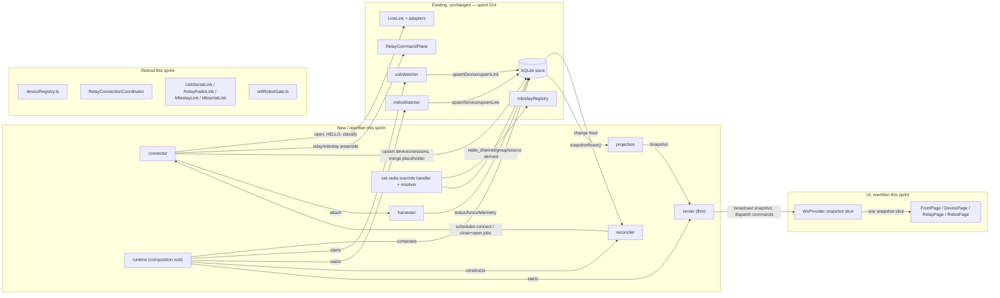
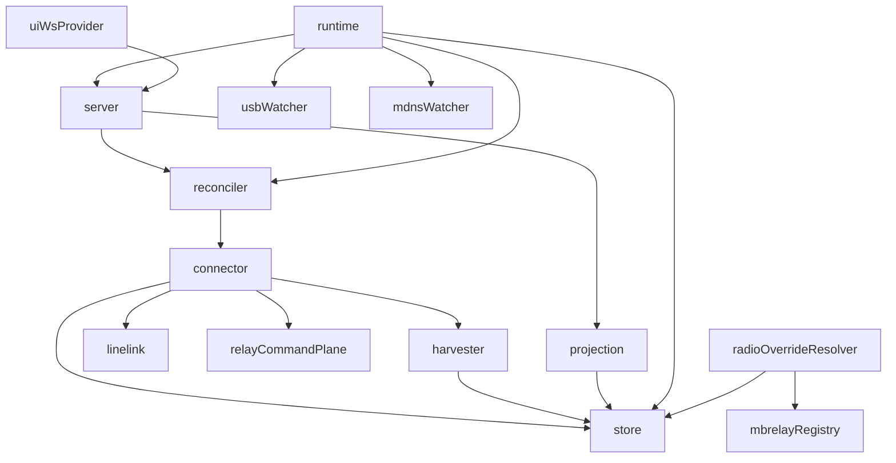

<!-- CLASI: Before changing code or making plans, review the SE process in CLAUDE.md -->

# Sprint 015: Host core A2: one connector, snapshot contract, radio overrides in DB, UI renders the snapshot

## Goals

Cut the host over to the new core built in sprint 014: one connector,
reconciler, and harvester replacing `deviceRegistry.ts`; a new
`snapshot` wire contract with a thin server; radio address overrides
moved into the host DB; and the UI updated to render the snapshot with
every existing feature preserved. This is Sprint A2 of the
`docs/design/rearchitecture-plan.md` arc's Sprint A split, and it does
not start until sprint 014's watcher rows are confirmed visible in a
debug dump.

## Problem

Sprint 014 gave the host a store, a link core, and two watchers, but
the old in-memory `deviceRegistry.ts` (3,873 lines, seventeen
responsibilities, six separate places that decide connection policy)
is still the thing actually running the UI. Until it is retired, none
of the new rows matter to a student, radio overrides still live in
browser `localStorage` (per-profile, invisible to background tasks),
and the wire contract's `EndpointListEntry` still can't express half
the states the new link-state machine needs. This sprint is the
parity gate: the point where the rewrite must match everything the
old UI does today, not just architecturally supersede it.

## Solution

Land the four issues in dependency order:

1. **rearch-05** — the connector (`connectAndIdentify`, cancellable,
   works for every transport), the reconciler (pure `plan(rows, now)`
   decision function plus a thin executor: link preference
   `usb > wifi > mbserial > radio > mbrelay`, WiFi/mbserial ownership
   gate, backoff, user-close precedence), and the harvester (per-session
   status/funcs/telemetry). Retires `deviceRegistry.ts`,
   `knownRobots.ts`, and `wifiRobotGate.ts`.
2. **rearch-06** — the `Snapshot`/`Notice` wire contract from
   `architecture.md` §9, a `buildSnapshot()` projection over the store,
   and a thin `server.ts` that only broadcasts and dispatches commands
   (no longer the composition root). Adds SIGINT/SIGTERM handling and
   per-socket error/backpressure guards missing today.
3. **rearch-08** — radio channel/group overrides move from
   `localStorage` to `devices.radio_channel/radio_group/radio_source`
   in the host DB, with a single resolution order (override → registry
   → derived) that background tasks (the sweeper, in sprint 016) can
   also read.
4. **rearch-07** — the UI becomes a pure renderer of the snapshot:
   `WsProvider` gains one `snapshot` slice, every client-side connect
   decision (WiFi auto-open, client-sequenced relay switch, endpoint
   grouping/scoring, on-open probes) is deleted, and the
   disconnected-from-host banner is added.

rearch-06 depends on rearch-05's rows; rearch-08 rides on rearch-06's
snapshot shape; rearch-07 is the parity gate and depends on both.

## Success Criteria

- Feature parity with today's UI, checked against the full inventory
  in `docs/reviews/2026-09-11/04-ui.md` §1 — every row either has a
  passing test or is confirmed present in a manual hardware pass; any
  dropped row is called out explicitly.
- `deviceRegistry.ts`, `knownRobots.ts`, and `wifiRobotGate.ts` are
  deleted, not ported.
- The disconnected-from-host banner is present and disables
  send-capable controls while the socket is down.
- A bench pass on real hardware succeeds: a relay and a robot on both
  USB and WiFi, exercised on both macOS and Linux.

## Scope

### In Scope

- Connector, reconciler, harvester; retiring `deviceRegistry.ts` and
  its two satellite modules (rearch-05).
- `Snapshot`/`Notice` wire contract, DB projection, thin server,
  process signal handling (rearch-06).
- Radio overrides stored per-device in the host DB with one resolution
  order (rearch-08).
- UI rendering the snapshot, disconnected banner, deletion of every
  client-side connection policy (rearch-07).

- Carried from sprint 014 ticket 006: after the four old link classes are
  deleted, measure `packages/host/src/link/` (incl. tests) against the
  rearch-04 target of ~900 lines and trim `LineLink.ts` (591 lines vs a
  ~250-line estimate) if it does not fit.

- Carried from sprint 014 ticket 010: `importKnownRobots` seeds `devices`
  rows keyed by a synthetic name-derived id because `known-robots.json`
  never stored the chip id. After real USB identification the same robot
  exists twice (placeholder row + real chip-id row, e.g. vevov/vitut in
  the 2026-09-11 bench dump). The rearch-05 reconciler must merge the
  placeholder into the real row by name on first identification and
  carry `owned = 1` across.

### Out of Scope

- Relay leases, the idle state, and the sweeper — sprint 016
  (rearch-09, rearch-10); the sweeper is a consumer of this sprint's
  radio-override resolution order but is not built here.
- Real mbrelay/mbserial network transports — sprint 016 (rearch-11).
- Firmware availability watcher, flash/SWD hardening, UI component
  dedupe, specification corrections — sprint 017.
- Any change to robot or relay firmware.

## Test Strategy

Golden-snapshot tests for `buildSnapshot()` against seeded store rows;
table-driven reconciler `plan()` tests; connector tests against the
shared fake `ByteStream` harness from sprint 014; FakeSocket UI tests
regenerated to the new snapshot shape. Beyond automated tests, this
sprint requires a bench pass on real hardware (a real relay, a real
robot on USB and WiFi) on both macOS and Linux before it can be
considered done — the Linux failover bug and the macOS boot-window bug
were both invisible to the existing automated tests.

## Dependencies and Rationale

This is Sprint A2 of `docs/design/rearchitecture-plan.md`'s Sprint A
split: "A2 = 05, 06, 08, 07 (cut over)." It depends entirely on sprint
014 (A1) — the store, link core, and watchers rearch-05 consumes. Per
the plan's stated risk, sprint 014's watcher rows must be visible in a
debug dump before this sprint starts. The plan's dependency graph also
lists this sprint's hardware-verification risk: "Sprints A and B each
need a bench pass with a real relay, a real robot on USB and WiFi, on
both macOS and Linux."

## Architecture

**Sizing: Substantial** — this sprint deletes a subsystem
(`deviceRegistry.ts`, 3,873 lines, and its two satellites), introduces a
new `connect/` subsystem (connector, reconciler, harvester) with new
cross-module dependencies that do not exist today (reconciler→connector,
connector→harvester, server→projection, projection→store,
UI→snapshot-only), and makes a UI-wide, clean-break change to the wire
contract. That is 3+ modules touched and multiple new/changed
cross-module dependencies — substantial by the sizing rubric's own
signals, independent of word count. No ERD: the `devices`/`links` schema,
including the `radio_channel`/`radio_group`/`radio_source` columns
rearch-08 uses, was already created by sprint 014's rearch-01 — this
sprint changes what reads and writes those tables, not their shape.

### Architecture Overview

#### Step 1 — Problem

Sprint 014 gave the host a store, a line-transport core, and two
watchers, but none of it is load-bearing yet: `server.ts` still builds a
`new DeviceRegistry(...)` inline (`server.ts:235`) as its only
composition root, and the store/watchers are exercised in production
only through the throwaway `--dump-store`/`--watch-store` debug flags
(`cli.ts`). `deviceRegistry.ts` mixes seventeen responsibilities, holds
four copies of the connect→attach→identify sequence, and decides
connection policy in six separate places; its wire shape,
`EndpointListEntry`, cannot express the new link-state machine
(`connecting`, `unresponsive`, `closed_by_user`, `stale` have no
representation today). Radio overrides live in browser `localStorage`,
invisible to any host-side background task. This sprint is the parity
gate named in `docs/design/rearchitecture-plan.md`: cut the UI over to
the new core while preserving every feature in `04-ui.md` §1, and delete
the old path rather than let it keep running alongside the new one.

#### Step 2 — Responsibilities

1. Open and identify a session on any one link, the same way regardless
   of transport (connector).
2. Continuously decide what should be connected, and enforce every
   connection-policy rule in one place (reconciler).
3. Keep one open session's status/functions/telemetry current without
   per-endpoint UI polling (harvester).
4. Merge a placeholder `devices` row (seeded by sprint 014's
   `importKnownRobots` with a synthetic id) into the real chip-id row on
   first USB identification, carrying `owned` across.
5. Retire `deviceRegistry.ts`, `store/knownRobots.ts` (the old in-memory
   module — not the importer, which stays), `wifi/wifiRobotGate.ts`, and
   `relay/RelayConnectionCoordinator.ts`, plus the four link classes
   (`UsbSerialLink`, `RelayRadioLink`, `MbrelayLink`, `MbserialLink`)
   `deviceRegistry.ts` drives through `link/Link.ts`'s `LinkFactory`.
6. Project store rows into the one `Snapshot` the wire contract sends.
7. Make `server.ts` a thin broadcast-and-dispatch layer: no more
   composing watchers/registry itself, per-socket error handling,
   `bufferedAmount` backpressure, `maxPayload`, and `SIGINT`/`SIGTERM`
   handling that does not exist anywhere in `packages/host` today.
8. Compose the store, both watchers, the reconciler, and the thin server
   into the host's actual startup path (today only `--watch-store`
   exercises the store/watchers; production startup does not).
9. Store radio channel/group overrides per device and give every
   consumer — the bridge today, the sweeper from sprint 016 — one
   resolution order: `override → registry (non-mutating, cached) →
   nameToRadioAddress`.
10. Render devices/links/relays as a pure function of the snapshot, with
    zero client-side connection decisions left in the UI, and add the
    disconnected-from-host banner.
11. Re-measure `packages/host/src/link/` against the ~900-line target
    rearch-04 set once the four old classes (and the now-unreferenced
    `link/Link.ts` interface file) are gone, and trim `LineLink.ts`
    (591 lines vs. a ~250-line estimate) if it still doesn't fit.

(1)–(5) form one subsystem (`connect/`) that changes together — the
reconciler calls the connector, which attaches the harvester — but each
half is independently testable (connector: fake-`ByteStream` harness;
reconciler: table-driven `plan()`; harvester: per-session fakes) and (4)
is specifically the connector's upsert path, not a separate module.
(6)–(8) form the wire/server subsystem: projection is a pure read,
`server.ts` is thin dispatch, and a new `runtime.ts` is the only thing
that constructs both. (9) is small and cross-cutting — store, wire, and
UI all touch it, but it adds no new module of its own. (10) is the UI
subsystem, gated entirely on (6)'s contract landing first. (11) is a
housekeeping pass over an existing module, not new functionality, and
runs last since it needs the four old classes actually gone to measure
against.

#### Step 3 — Modules

| Module | Purpose (one sentence) | Boundary | Serves |
|---|---|---|---|
| **connector** (`packages/host/src/connect/connector.ts`) | Open and identify a session on one link, the same way for every transport. | Inside: board-owner/relay-lease acquisition, `LineLink` construction and bounded connect, the relay preamble, HELLO retry across the boot window, banner classification, `devices`/`sessions` upsert (including the placeholder merge), harvester attach, cancellation at every await. Outside: deciding *when* to connect (reconciler), wire decode/classify rules (protocol package), UI. | SUC-001, SUC-003 |
| **reconciler** (`packages/host/src/connect/reconciler.ts`) | Own every connection-policy rule as one decision function. | Inside: a pure `plan(rows, now): Job[]` function (link preference, WiFi/mbserial ownership gate, backoff, user-close precedence, one job for a relay child switch) plus a thin executor that turns jobs into connector calls; also the target of a server-dispatched explicit user command (`session-open`/`session-close`) that needs the same ownership/precedence rules applied to a user-requested job. Outside: opening a transport (connector), session bookkeeping (harvester). | SUC-002, SUC-009 |
| **harvester** (`packages/host/src/connect/harvester.ts`) | Keep one open session's status current. | Inside: per-session `status`/`funcs`/`id`/`thdr`+`t` handling, `STATUS` polling and its own unresponsive detection, one notice per state change. Outside: deciding to (re)connect (reconciler), wire decode (protocol). | SUC-004 |
| **projection** (`packages/host/src/projection.ts`) | Turn store rows into the one snapshot the wire contract sends. | Inside: `buildSnapshot(store)`, the owned-gate hiding rule, `unassigned` grouping, per-link `capabilities`, `relays[].lease`/`bridging`. Outside: persistence (store), transport (server). | SUC-005 |
| **server** (`packages/host/src/server.ts`, rewritten thin) | Move the snapshot and client commands between the store and the socket, deciding nothing itself. | Inside: WebSocket lifecycle, per-socket `error` handling, `bufferedAmount`/`maxPayload` guards, a `Map<type, handler>` command dispatch that forwards each connection-affecting command (`session-open`/`-close`, `set-radio-override`) verbatim to the reconciler's/radio-override handler's public API and forwards the result as a `notice`, `close()` unsubscribing everything. Outside: *constructing* watchers/reconciler/store (that is `runtime`'s job — server only holds references it's handed), deciding policy itself, building the JSON shape (projection). | SUC-005, SUC-006, SUC-010 |
| **runtime** (`packages/host/src/runtime.ts`, new) | Compose the store, both watchers, the reconciler, and the server into one running host. | Inside: `openStoreWithImports`, `startUsbWatcher`/`startMdnsWatcher`, constructing the reconciler, `startServer({store, runtime})`, orderly `stop()`. Outside: any component's own logic — this module only wires. | SUC-006 (replaces `server.ts`'s inline `new DeviceRegistry(...)` and the `--watch-store` throwaway path) |
| **radio-override resolution** (cross-cutting: `devices.radio_channel/group/source` write path already in the schema; `set-radio-override`/`clear` command handler; the shared resolver read by connector, projection, and — from sprint 016 — the sweeper) | Give every consumer of a robot's radio address one authoritative order to resolve it in. | Inside: the command handler, the resolver function (`override → registry (mbrelayRegistry, non-mutating) → nameToRadioAddress`), validation (`0–83`, `0–255`, integers). Outside: bridging or sweeping themselves (sprint 016), `mbrelayRegistry.ts`'s own fetch logic (unchanged, reused). | SUC-007 |
| **UI: WsProvider snapshot slice** (`packages/ui/src/ws/WsProvider.tsx`) | Hold the one snapshot the host sends and infer nothing itself. | Inside: the `snapshot` slice replacing five side slices, `seq` tracking and staleness-on-reconnect, selectors (`useDevices`, `useDevice`, `useLink`, `useRelays`, `useFirmware`, `useWifiSetting`, `useTasks`), the log ring and telemetry ring (kept as-is). Outside: any connection decision, any page's rendering. | SUC-005, SUC-008, SUC-010 |
| **UI: pages and dialogs** (`FrontPage.tsx`, `DevicePage.tsx`, `RelayPage.tsx`, `RobotPage.tsx` panels, `ConfigurationPage.tsx`/`RadioAddressDialog.tsx`, `AppHeader`/`App`) | Render devices/links/relays from the snapshot and send only messages an explicit user action produced. | Inside: card/row rendering from `devices[]`/`unassigned[]`/`relays[]`, the one-time `set-radio-override` send on user submit, the disconnected banner and control-disabling from connection status. Outside: any auto-open, auto-switch, name-based grouping/scoring, or on-open probe (all deleted). | SUC-007 (UI half), SUC-008, SUC-009, SUC-010 |

**Retired, not modules of this sprint** (existing components deleted
outright, per `architecture.md` §2's clean-break decision):
`deviceRegistry.ts` + its test; `store/knownRobots.ts` + test (the
importer of the same name in `store/importers/` is unaffected and
stays); `wifi/wifiRobotGate.ts` + test; `relay/RelayConnectionCoordinator.ts`
+ test; `link/UsbSerialLink.ts`, `link/RelayRadioLink.ts`,
`link/MbrelayLink.ts`, `link/MbserialLink.ts` and their four tests;
`link/Link.ts` (the `Link`/`LinkSpec`/`LinkFactory` interface these four
classes and `deviceRegistry.ts` alone depended on — confirmed
unreferenced by any new module; only `usbWatcher.test.ts`'s stubbed-connector
fake still touches it, and that stub is exactly what the connector
replaces). `wsMessages.ts`'s `EndpointsMessage`/`EndpointListEntry` types
and the side-channel messages they carried are replaced, not kept
alongside the new `Snapshot`/`Notice` types.

Cohesion check: each new module above passes the one-sentence, no-"and"
test. Coupling: `connect/*` depends on `store` and `link/LineLink` (and,
for radio links, `link/RelayCommandPlane` and `mbrelayRegistry`), never
the reverse; `projection` depends only on `store`; `server` depends on
`projection` and `connect/reconciler`'s command surface, never
constructs either. No cycle.

#### Step 4 — Diagrams

**Component diagram** (new/rewritten modules solid; existing components
this sprint deletes shown struck through in the "retired" subgraph for
context; the four transports and the store/watchers from sprint 014 are
unchanged inputs):

Included because this sprint introduces multiple new cross-module
dependencies that did not exist before (reconciler→connector,
connector→harvester, server→projection→store, runtime as a new
composition root replacing `server.ts`'s inline construction) and
retires four existing components and a fifth wire-shape dependency
(`EndpointListEntry`).

**Dependency graph** (new/changed dependencies only; confirms no cycle
and that direction stays consistent with §3's coupling note):

`store`, `linelink`, and `mbrelayRegistry` have no outward dependency on
anything new this sprint — they remain the stable base, consistent with
the dependency-direction principle.

#### Step 5 — What Changed / Why / Impact / Migration

**What Changed**: see the module table (Step 3) — one entry per new or
rewritten module, plus the explicit retirement list.

**Why**: see Problem (Step 1) and Responsibilities (Step 2) — sprint 014
built the foundation without touching what actually runs; this sprint is
the cutover the rearchitecture plan calls the "parity gate," and it must
happen in the dependency order the four issues already encode
(rearch-05 → rearch-06 → rearch-08 → rearch-07).

**Impact on Existing Components**: `usbWatcher`/`mdnsWatcher` lose their
sprint-014 stubbed-connector call sites (the `TODO(rearch-05)` comments
in both files and in `discovery/mdnsDiscovery.ts` and `store/bootstrap.ts`)
in favor of the reconciler scheduling real connects; the watchers'
enumeration/observation logic is otherwise unchanged. `cli.ts`'s
`--dump-store` stays (still useful, still throwaway per sprint 014's own
rationale); `--watch-store` is superseded by the real `runtime.ts` path
and should be removed once the server's own startup exercises the same
code it stood in for. `mbrelayRegistry.ts` is unchanged and gains a new
caller (the radio-override resolver) alongside its existing one.
Students see no mid-sprint change in behavior beyond what `04-ui.md` §1
tracks as preserved — the exit criterion is that nothing regresses.

**Migration Concerns**:
- Clean break on the wire contract (per `architecture.md` §2): there is
  no dual-format transition period. The UI ticket and the server ticket
  land against the same contract version; a partially-deployed
  old-UI/new-server or new-UI/old-server pairing is not supported and is
  not a goal (`npx robot-console` always ships both together).
- The placeholder-merge rule (SUC-003) is itself the migration path for
  sprint 014's `importKnownRobots` seed data — no separate migration
  script; the merge happens naturally the first time each seeded robot
  is actually plugged in.
- Radio overrides: existing `localStorage` values are not automatically
  read by the host (the UI has no way to push arbitrary browser storage
  to a server-side migration step); the "migration nicety" in rearch-08
  (UI offers to push found `localStorage` overrides to the host once,
  then clears them) is included as ticket scope so instructors do not
  silently lose overrides they already set.
- **Follow-up not absorbed into this sprint**: rearch-17 (sprint 014)
  flagged that `config.ts`'s `.env`-relative firmware-config resolution
  should become a `settings` importer input once rearch-01 landed.
  Sprint 014 shipped only the `known-robots.json`→`devices` and
  `wifi-credentials.json`→`settings` importers — no `.env`/firmware-config
  importer exists yet. Neither rearch-06 nor rearch-08 (this sprint's
  issues) scope that work, and pulling it in here would silently expand
  scope beyond the four linked issues. **Recommendation to team-lead**:
  file a follow-up issue (e.g. a `settings` importer for the firmware
  hex-source config currently read from `.env`) for a later sprint —
  candidate: Sprint C alongside `rearch-13`/`rearch-18`, or wherever
  `config.ts` next comes up.

#### Step 6 — Design Rationale

**Decision: the connector is one function per transport, not a
per-transport class hierarchy.**
- Context: the four existing link classes each reimplement
  connect→attach→identify with small, inconsistent divergences (no
  `onClose` in some, no connect timeout in others), and
  `deviceRegistry.ts` dispatches on transport in `defaultLinkFactory`.
- Alternatives: (a) keep the four classes, add a dispatcher in front of
  them; (b) one `connectAndIdentify(link, signal): Promise<Session>`
  function built on `LineLink` (already transport-agnostic per sprint
  014's rearch-04), parameterized by the row's `transport`/`address`.
- Why (b): the four classes are the source of the divergence bugs the
  device-model review catalogues (§2, §3); a dispatcher in front of them
  preserves the divergence instead of removing it. `LineLink` was built
  in sprint 014 specifically to be this single core.
- Consequences: `packages/host/src/link/` loses four files and four
  tests; `connect/connector.ts` becomes the one place identify logic
  lives, testable against one shared fake `ByteStream` harness instead of
  four.

**Decision: the reconciler is a pure `plan(rows, now)` function plus a
thin executor, not an event-driven imperative loop.**
- Context: `deviceRegistry.ts` decides connection policy in six separate
  methods (`syncWifiEndpoints`, `retryWifiAutoConnects`,
  `autoConnectWifiRobot`, `autoSwitchRadioToWifi`, `requestOpen`'s no-op
  rules, `pollStatus`'s watchdog), each triggered differently, which is
  why the roster→WiFi gate bug (never re-running on roster change) went
  unnoticed.
- Alternatives: (a) port the six methods as-is into a new class, fixing
  bugs in place; (b) one pure decision function over the full row set,
  called on every change and on a tick, with a thin executor.
- Why (b): a pure function is table-testable (the acceptance criteria
  list exact row-state → job-list cases) in a way six imperative methods
  triggered by different events are not; it also makes "never reopen
  `closed_by_user`" and "one notice per state change, not per attempt" a
  property of the function's output rather than something each call site
  has to remember.
- Consequences: the reconciler has exactly one code path to review for
  policy; adding a new rule (e.g., sprint 016's sweep-aware preference)
  means adding a test case and a branch in `plan()`, not a new method.

**Decision: radio overrides move to the DB in this sprint, ahead of the
sweeper that will read them (sprint 016).**
- Context: rearch-08 could wait until sprint 016 actually needs
  background reads of the override.
- Alternatives: (a) defer to sprint 016, alongside the sweeper; (b) land
  it now, before rearch-07 removes `localStorage` from the UI.
- Why (b): rearch-07's UI ticket is the one that deletes
  `RadioAddressDialog`'s `localStorage` write path and
  `ConfigurationPage`'s reads of it; deferring the DB-backed replacement
  to sprint 016 would leave a window where the override has no home at
  all, or force rearch-07 to keep a `localStorage` fallback it would then
  have to remove again next sprint. Landing it now means rearch-07 only
  ever ships the new behavior.
- Consequences: `mbrelayRegistry.ts` gains one new caller a sprint early
  relative to when it is exercised by an automated sweep, but the
  resolution order itself needs no further change when the sweeper
  arrives — it just becomes a second reader.

**Decision: clean break on the wire contract, no versioned/dual
contract.**
- Context: this is a stakeholder decision already recorded in
  `architecture.md` §2, restated here because it drives this sprint's
  Migration Concerns.
- Alternatives: (a) version the contract, run old and new shapes side by
  side for a deprecation window; (b) clean break, UI and server ship
  together.
- Why (b): `npx robot-console` always deploys host and UI as one build
  (`packages/ui`'s bundle is served by `packages/host`); there is no
  independently-versioned client to support, so a dual contract would add
  real complexity (eight "present only when" rules become sixteen) for a
  compatibility window nobody needs.
- Consequences: rearch-06 and rearch-07 must land in the same sprint (they
  do), and the ticket sequencing must keep the server and UI tickets from
  being independently shippable mid-sprint.

#### Step 7 — Open Questions

1. **`.env`→`settings` importer** (see Migration Concerns): not in this
   sprint's scope; recommend a follow-up issue as described above.
2. **Per-connect one-time radio override inputs on `RelayPage`**:
   rearch-08 says these are removed by default in favor of the
   device-level override, "only kept if the stakeholder wants that kept."
   This plan assumes removal (consistent with "no client-side connection
   policy" and one fewer place validation must be duplicated); flag for
   stakeholder confirmation before the UI ticket removes the inputs, not
   after.
3. **`--watch-store` retirement timing**: this sprint's `runtime.ts`
   makes `--watch-store` redundant (production startup now exercises the
   same watchers). Whether to delete the flag in this sprint's server
   ticket or leave it one more sprint as a manual debugging aid is a
   ticket-level call, not an architectural one — recorded here so it
   isn't lost.
4. **Relay child switch semantics under a sweep lease**: SUC-009's
   "session-open is one job" assumes no sweep is currently running
   against that relay (the sweeper doesn't exist until sprint 016). The
   reconciler's relay-child-switch job should not assume a `relay_leases`
   row exists yet; confirm the ticket's table-driven tests cover a relay
   with no lease row at all (today's only case) as well as the
   lease-aware case sprint 016 adds.

### Design Rationale

See Step 6 above.

### Migration Concerns

See Step 5's Migration Concerns above.

## Use Cases

Substantial sprint; SUCs below cover the parity-gate cutover (connector/
reconciler/harvester, snapshot contract, radio overrides, UI rendering).
Parent UCs are `docs/design/usecases.md`'s presence/awareness set
(UC-011 through UC-020) plus UC-001/UC-004/UC-005 where this sprint
changes who satisfies them.

### SUC-001: One connector identifies any link the same way
Parent: UC-001, UC-011, UC-012

- **Actor**: robot-console host (automatic)
- **Preconditions**: A `links` row exists in `discovered` or
  `connectable` state, on any transport (`usb`, `wifi`, `radio`,
  `mbrelay`, `mbserial`).
- **Main Flow**:
  1. The reconciler schedules a connect for the link (SUC-002).
  2. The connector acquires the board owner (USB) or relay lease
     (radio), builds a `LineLink` from the row's `address`, and opens it
     with a bounded timeout.
  3. If the link rides a relay or mbrelay, the connector runs the
     command-plane preamble (`RelayCommandPlane`) before entering the
     data plane.
  4. The connector sends `HELLO` with the boot-window retry schedule,
     reads the banner, and classifies role/program/version.
  5. The connector upserts `devices` (setting `owned = 1` when the
     device was reached over USB) and `sessions`, attaches the
     harvester, and marks the link `connected`.
- **Postconditions**: Exactly one connect→attach→identify path exists
  for every transport; a cancelled or failed attempt releases the
  owner/lease and leaves the link `failed` with backoff fields, never
  partially open.
- **Acceptance Criteria**:
  - [ ] Table-driven fake-`ByteStream` tests cover: success path writes
        `devices`/`sessions`/`links.state=connected`; failure writes
        `failed` with backoff and releases the owner; cancellation
        mid-HELLO releases the owner and leaves no listeners; a closed
        stream during identify yields `failed`, never an unhandled
        rejection.
  - [ ] `grep -r "class UsbSerialLink\|class RelayRadioLink\|class MbrelayLink\|class MbserialLink" packages/host/src` returns nothing.

### SUC-002: The reconciler is the only thing that decides what connects
Parent: UC-012, UC-014, UC-017, UC-018

- **Actor**: robot-console host (automatic)
- **Preconditions**: The store has `devices`/`links` rows of varying
  state and transport.
- **Main Flow**:
  1. On every change-feed event and a slow tick, the reconciler's pure
     `plan(rows, now): Job[]` evaluates all rows.
  2. For each device, it prefers `usb > wifi > mbserial > radio >
     mbrelay`; if the preferred link is `connectable` and nothing for
     that device is `connected`, it schedules a connect job.
  3. It never schedules a `wifi`/`mbserial` link whose device is not
     `owned`, never reopens `closed_by_user`, and retries `failed` links
     only at `next_retry_at` with exponential backoff capped at 60 s.
  4. A thin executor turns each job into a connector call (or a relay
     child close+open, one job) and issues at most one notice per state
     change.
- **Postconditions**: Connection policy exists in exactly one place; the
  six policy sites in the old `deviceRegistry.ts` are gone.
- **Acceptance Criteria**:
  - [ ] Table-driven `plan()` tests cover every rule above, including
        relay-child-switch as one job with close+open.
  - [ ] `grep -rn "autoConnectWifiRobot\|autoSwitchRadioToWifi\|syncWifiEndpoints\|retryWifiAutoConnects" packages/host/src` returns nothing.

### SUC-003: A known-robots placeholder merges into the real chip-id row
Parent: UC-011, UC-013

- **Actor**: robot-console host (automatic)
- **Preconditions**: `importKnownRobots` (sprint 014) already created a
  `devices` row for a robot keyed by a synthetic name-derived id (no
  chip id was ever recorded in `known-robots.json`). The same physical
  robot is later plugged into USB.
- **Main Flow**:
  1. The connector identifies the robot over USB and computes its real
     chip-id-keyed `devices.id`.
  2. On first identification, if a placeholder row exists with the same
     `name` and a synthetic id, the connector merges the placeholder's
     fields (`owned`, `first_seen`, any `radio_channel`/`radio_group`/
     `radio_source` already set) into the real chip-id row and removes
     the placeholder.
  3. Any `links`/`sightings` rows that referenced the placeholder's id
     are re-pointed at the real id.
- **Postconditions**: Exactly one `devices` row per physical robot
  survives; `owned = 1` carries across the merge.
- **Acceptance Criteria**:
  - [ ] A seeded placeholder (`vevov`, synthetic id) followed by a
        simulated real USB identify (`vevav`, chip id `536019796`, per
        the 2026-09-11 bench dump) collapses to one row with
        `owned = 1`.
  - [ ] No orphaned `links`/`sightings` rows point at a deleted
        placeholder id.

### SUC-004: The harvester keeps session state current without UI polling
Parent: UC-005, UC-014, UC-017

- **Actor**: robot-console host (automatic)
- **Preconditions**: A session is open on some link.
- **Main Flow**:
  1. The harvester receives every inbound line on that link, updates
     `sessions.robot_status`/`functions`/`seq`/`pending` as
     `status`/`funcs`/`id` replies arrive, and forwards `thdr`/`t` to the
     telemetry stream.
  2. It polls `STATUS` on its own schedule; three missed polls or the
     link's `onClose` mark the link `unresponsive` once and stop
     polling.
  3. It never sends `STATUS`/`GET`/`FUNCS` because the UI opened — that
     is this module's job now, not four separate UI components'.
- **Postconditions**: `StatusPanel`, `CommandStrip`, and both
  calibration wizards no longer probe on open; the same information
  arrives from the snapshot/session instead.
- **Acceptance Criteria**:
  - [ ] Harvester tests: `status`/`funcs`/`id`/`thdr`+`t` update the
        session row; stream close → `unresponsive` once; three missed
        polls → `unresponsive` once on a USB link.
  - [ ] The pinned "sends X on closed→open" UI tests for `StatusPanel`,
        `CommandStrip`, and both wizards are deleted, not adapted.

### SUC-005: One snapshot replaces endpoints/rememberedRobots/discoveredServices
Parent: UC-013, UC-018

- **Actor**: robot-console host (automatic), rendered for Student/Instructor
- **Preconditions**: The store has any mix of owned/un-owned devices,
  unnamed USB boards, and relays.
- **Main Flow**:
  1. `buildSnapshot(store)` reads `snapshotRows()` and produces one
     `devices[]` list (hiding un-owned `wifi`/`mbserial` links), one
     `unassigned[]` list of unnamed USB boards, one `relays[]` list,
     `firmware`, `wifi`, and `tasks`.
  2. The server broadcasts a fresh `snapshot` on every coalesced
     change-feed batch, with an incrementing `seq`.
- **Postconditions**: The UI never joins three lists or parses a link id
  to find a relay's child.
- **Acceptance Criteria**:
  - [ ] Golden test: seeded rows → `buildSnapshot()` equals a
        checked-in fixture covering an owned robot with USB+WiFi+radio
        links, an un-owned WiFi robot (absent), an unnamed USB board
        (`unassigned`), and a relay under a sweep lease.
  - [ ] A burst of ten store writes in one tick produces one `snapshot`
        broadcast.
  - [ ] `grep -rn "EndpointListEntry\|rememberedRobots\|discoveredServices" packages/` returns nothing.

### SUC-006: The server survives a bad socket and a clean shutdown
Parent: UC-020 (host-side half); `03-host-server-flash-releases.md` §1, §4

- **Actor**: robot-console host (automatic)
- **Preconditions**: The host is running with one or more WebSocket
  clients connected, one possibly mid-flash.
- **Main Flow**:
  1. `runtime.ts` composes `openStoreWithImports`, both watchers, the
     reconciler, and `startServer({store, runtime})` — replacing the
     current production path where `server.ts` builds a `DeviceRegistry`
     inline and the store/watchers are exercised only via the
     `--dump-store`/`--watch-store` debug flags.
  2. A client socket that emits `error` is caught per-socket and does
     not take down the process; a client whose `bufferedAmount` exceeds
     a threshold stops receiving `line`/`telemetry` but still gets the
     next `snapshot`.
  3. `SIGINT`/`SIGTERM` calls `server.close()` (which unsubscribes
     everything) then stops the runtime; an in-flight flash finishes or
     aborts cleanly and the serial port closes before exit.
- **Postconditions**: No `unsubscribeTelemetry()` omission, no missing
  `ws.on("error")`, no signal-handler gap.
- **Acceptance Criteria**:
  - [ ] A socket that emits `error` does not terminate the host.
  - [ ] `kill -INT` during a fake flash lets the flash finish or abort
        cleanly and closes the serial port before exit.
  - [ ] Production startup (not just `--watch-store`) now calls
        `openStoreWithImports` and starts both watchers.

### SUC-007: Radio address overrides live in the host DB, resolved one way everywhere
Parent: UC-019

- **Actor**: Instructor
- **Preconditions**: A robot's derived channel/group is wrong for this
  classroom's layout.
- **Main Flow**:
  1. Instructor sets a channel/group on the Configuration tab (or Radio
     dialog); the UI sends `set-radio-override {deviceId, channel,
     group}`.
  2. The host validates (`0–83`, `0–255`, integers) and writes
     `devices.radio_channel`/`radio_group`/`radio_source='override'`.
  3. Every consumer (bridge, projection, and — from sprint 016 — the
     sweeper) resolves an address the same way: `override → registry
     (non-mutating, cached) → nameToRadioAddress`.
  4. The snapshot's `devices[].radio` shows the resolved pair and its
     source; clearing returns `source` to derived.
- **Postconditions**: The override survives a host restart and is
  per-robot, not per-browser.
- **Acceptance Criteria**:
  - [ ] `set-radio-override` persists across a host restart and appears
        in the snapshot.
  - [ ] Clearing returns `source` to `derived` and shows the derived
        pair.
  - [ ] `grep -rn "localStorage" packages/ui/src` shows no keys holding a
        channel or group.

### SUC-008: The UI renders devices/links/relays and sends only explicit actions
Parent: UC-018, UC-012, UC-016

- **Actor**: Student
- **Preconditions**: A snapshot has arrived.
- **Main Flow**:
  1. `WsProvider` holds one `snapshot` slice; `FrontPage` renders one
     card per `devices[]` row (host order) plus `unassigned[]` cards,
     with link rows showing `state`/`reason`/`lastSeen`/`nextRetryAt`.
  2. `DevicePage` routes on `linkId` with no auto-open effect;
     `RelayPage` reads `relays[].bridging`/`lease` and sends one
     `session-open {relayLinkId, name}` message to switch robots, never
     a client-sequenced close-then-open.
  3. Every send-capable control stays disabled unless the corresponding
     link's state allows the action; there is no name-based grouping,
     link scoring, or on-open probing left in the UI.
- **Postconditions**: Every row of `04-ui.md` §1 is preserved, either as
  a passing test or a confirmed manual-hardware behavior.
- **Acceptance Criteria**:
  - [ ] `grep -rn "session-open" packages/ui/src` shows sends only from
        explicit user actions.
  - [ ] A snapshot with an un-owned WiFi device absent and an unassigned
        USB board present renders the unassigned board's card.
  - [ ] The PR lists any `04-ui.md` §1 row it could not preserve and why.

### SUC-009: Switching a relay's child robot is one host-side operation
Parent: UC-016, UC-018

- **Actor**: Student
- **Preconditions**: A relay is bridged to robot A.
- **Main Flow**:
  1. Student picks robot B on `RelayPage` and presses Connect/Switch.
  2. The UI sends a single `session-open {relayLinkId, name: "B"}`.
  3. The reconciler treats this as one job: close A's child link, then
     connect B's, resetting the relay between candidates per the
     existing failover fix.
- **Postconditions**: No two-message client sequencing remains; the
  relay never sits in the data plane for a robot the reconciler
  abandoned.
- **Acceptance Criteria**: covered by SUC-002's relay-child-switch test
  and SUC-008's `session-open` grep.

### SUC-010: A student who loses the host sees it and can't act blind
Parent: UC-020

- **Actor**: Student
- **Preconditions**: The host restarts or the socket drops.
- **Main Flow**:
  1. The tab shows a persistent "Disconnected from the console host —
     reconnecting" banner; every send-capable control disables.
  2. On reconnect, the held snapshot is marked stale by `seq` until a
     fresh one arrives; controls re-enable only for links the fresh
     snapshot says are `connected`.
- **Postconditions**: `no-disconnected-from-host-banner-in-the-ui.md` is
  resolved as part of this sprint's UI ticket.
- **Acceptance Criteria**:
  - [ ] FakeSocket close → banner shown, controls disabled, a send
        produces a console line instead of dropping silently.
  - [ ] FakeSocket open + snapshot → banner gone.

## GitHub Issues

(GitHub issues linked to this sprint's tickets. Format: `owner/repo#N`.)

## Definition of Ready

Before tickets can be created, all of the following must be true:

- [ ] Sprint planning document is complete (sprint.md, including its
      Architecture and Use Cases sections)
- [ ] Architecture review passed (or skipped, for changes with no
      architectural impact)
- [ ] Stakeholder has approved the sprint plan

## Tickets

| # | Title | Depends On | Issue |
|---|-------|------------|-------|
| 001 | Connector: connectAndIdentify for every transport | — | rearch-05 |
| 002 | Reconciler: pure plan(rows, now) decision function plus executor | 001 | rearch-05 |
| 003 | Harvester, placeholder-device merge, and retirement of deviceRegistry and its satellites | 001, 002 | rearch-05 (completes) |
| 004 | Snapshot/Notice wire contract and buildSnapshot projection | 003 | rearch-06 |
| 005 | Thin server, runtime composition root, and process signal handling | 004 | rearch-06 (completes) |
| 006 | Radio address overrides in the host DB, host and UI | 005 | rearch-08 (completes) |
| 007 | UI: WsProvider snapshot slice and FrontPage rewrite | 006 | rearch-07 |
| 008 | UI: DevicePage and RelayPage on the snapshot, one-message relay switch | 007 | rearch-07 |
| 009 | UI: RobotPage panels stop probing on open, disconnected-from-host banner, fixture regen | 008 | rearch-07 (completes) |
| 010 | link/ directory size trim: retire the old interface file, measure and trim LineLink.ts | 003 | — (carried from sprint 014 ticket 006) |
| 011 | Bench and cross-platform verification: feature parity on Vevov/Vittut/torture/gopiv/tigez, npm test green on macOS and Linux | 009, 010 | — (sprint exit gate) |

Tickets execute serially in the order listed.
