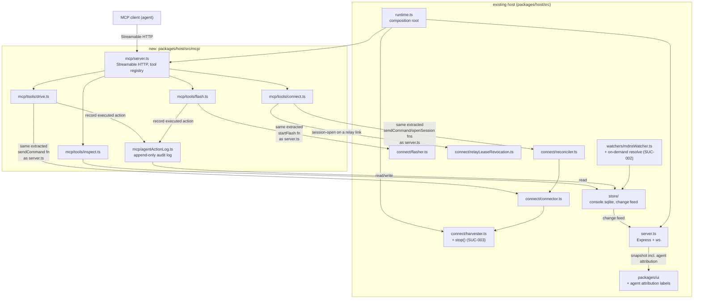
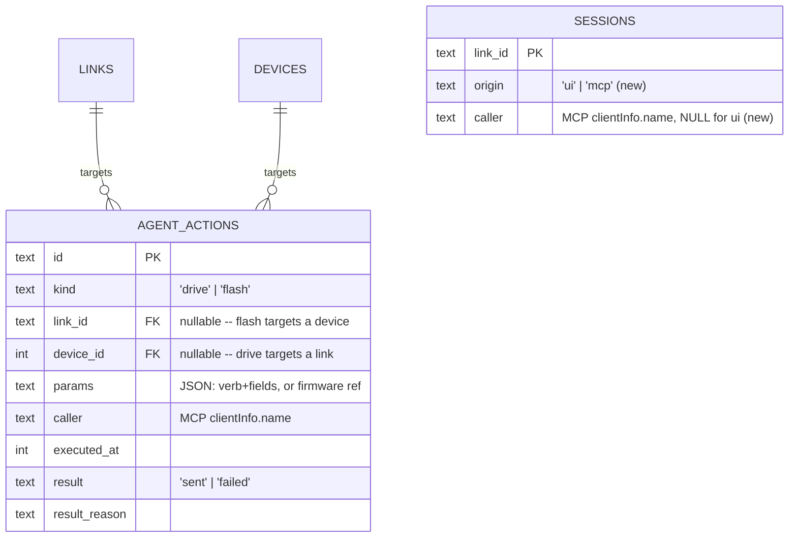

<!-- CLASI: Before changing code or making plans, review the SE process in CLAUDE.md -->

# Sprint 019: MCP Server for Robot Connections and Carry-Over Bench Defects

## Goals

The stakeholder chose one sprint covering two bodies of work — the headline
MCP feature and everything sprint 018 handed forward — and explicitly
declined splitting the carry-over defects into their own sprint first.
This sprint does both:

1. **Ship an MCP server for robot connections** — a second front end
   inside the existing console host process, built on the host's own
   connect/watcher/store code and sharing `console.sqlite`, so a
   connection an agent opens is one more session the console already
   knows how to show, own, and reconcile. Tool surface covers all four
   categories the stakeholder chose: inspect (devices/links/status),
   connect and send commands, drive verbs, and firmware flashing.
   Drive and flash were treated as a first-class design concern, not an
   afterthought, since those two put an agent in a position to move a
   robot or brick a board unattended — but at the stakeholder approval
   gate Eric explicitly chose to let both execute immediately and
   unconditionally, with no human-approval step (see `sprint.md`'s
   Architecture Revision). What this sprint builds instead is
   visibility: every agent-initiated drive/flash action is attributed
   to its caller live on the console and durably recorded for after-the-
   fact inspection.
2. **Burn down three defects sprint 018 handed forward**: the relay
   sweeper-vs-session port race (never implemented — 018 ticket 012 was
   retired with no code landed), WiFi discovery blocking on the mDNS
   announcement interval instead of resolving on demand (the same
   retired ticket), and `HarvesterAttach`'s missing teardown seam (found
   at 018's close gate, latent but not yet closed).

## Problem

**MCP surface.** Agents currently drive robots either by scripting the
console's WebSocket protocol directly or by talking to bridges
out-of-band, both of which bypass the host's own contention handling
(board ownership, relay leases, single-TCP-slot WiFi robots) and leave
the console showing a world it does not actually control. There is no
first-class, host-mediated way for an agent to inspect, connect to, or
drive a robot as a peer of a human student sitting at the console.

**Carry-over defects.** Two defects were scoped as sprint 018 ticket 012
but never implemented — the ticket-creation commit landed with no
implementation, and the team-lead closed 018 on what was actually done
rather than let unimplemented work block the close. Both were
reproduced on a genuinely exclusive bench on 2026-09-17 (no other process
contending for ports), which is the cleanest evidence either has had:
(a) a direct console session opening a relay's own USB link races the
relay sweeper's periodic raw port open and can fail "Cannot lock port"
even though nothing else holds the port; (b) an owned WiFi robot can
have no `wifi` link for tens of seconds after host start because
discovery is purely reactive to the mDNS announcement interval rather
than resolving `<name>.local` on demand. A third defect was found at
018's close gate rather than carried from a retired ticket:
`HarvesterAttach` has no `stop()`/teardown, so its STATUS-poll interval
can outlive the store and (in a shutdown ordering an ordinary refactor
could easily introduce) write to a closing database.

## Solution

Detail Mode will design the MCP server's process model (now settled by
the stakeholder as in-process with the host — a second listener sharing
one owner of ports/leases/board-ownership), its tool surface per the
four approved categories, and how drive/flash actions are made visible
and attributable to their caller (this sprint's Architecture Revision
records the stakeholder's decision that drive/flash execute immediately,
with no confirmation mechanism — visibility replaces gating). It will
also design the two carry-over
relay/WiFi fixes along the direction the retired 018 ticket 012 already
settled on (extend the existing `relayLeaseRevocation` takeover seam to
cover a direct relay session-open; add a bounded, off-hot-path
`dns.lookup` + TCP 7654 `HELLO` fallback for WiFi link creation), and the
harvester teardown seam following the `relaySweeper.stop()` precedent.
None of that design work happens in this roadmap-mode pass — this
sprint.md will be detail-promoted before architecture or tickets are
written.

## Success Criteria

- An MCP server is reachable while the console host is running, backed
  by the same host library and `console.sqlite` the console UI uses; a
  connection, session, or command an agent issues through it is visible
  in the console UI the same way a human-opened one is.
- Inspect, connect/command, drive, and flash tool categories all exist.
  Drive and flash execute immediately and unconditionally on a valid
  call, per the stakeholder's explicit decision to decline a
  confirmation gate; every such action is attributed to its caller live
  on the console and durably recorded in an audit log for after-the-fact
  inspection.
- A direct console session on a relay's own USB link no longer fails
  "Cannot lock port" against our own sweeper; contention from another
  *process* is reported in plain language instead.
- An owned WiFi robot gets a `wifi` link within a bounded time after
  host start, not only after the next unsolicited mDNS announcement,
  for every owned robot with a WiFi path (not only the originally
  reported robot).
- `HarvesterAttach` has a teardown seam wired into `runtime.ts`'s
  `stop()` before `store.close()`, with a regression test that fails if
  the `stop()` call is removed; siblings with the same timer-outliving-
  the-store shape have been audited, not just the one that surfaced.

## Scope

### In Scope

- New MCP server front end inside the console host process (package
  placement, transport, and identity/user model to be decided in Detail
  Mode — the process-model question itself is already settled:
  in-process, not a separate process or proxy).
- MCP tool surface: inspect (devices/links/status), connect/send
  command, drive verbs, flash firmware.
- Visibility/attribution for drive and flash tools — an audit log and
  live console attribution so an agent-initiated action is
  distinguishable from a human-initiated one, live and after the fact
  (the stakeholder explicitly declined a confirmation-gating mechanism;
  see `sprint.md`'s Architecture Revision).
- Relay sweeper-vs-session port contention fix (`bench-relay-port-
  contention-sweeper-vs-session.md`), re-verified against a physically
  attached USB relay before implementation, since the 2026-09-17 bench
  run had none attached.
- WiFi on-demand discovery fix (`bench-wifi-robot-discovery-waits-for-
  announcement.md`), covering every owned robot with a WiFi path
  (`tigez` as the regression fixture — it demonstrably both passes and
  fails under current code), with the current fleet roster and
  addresses reconfirmed before implementation (`gopiv`/`vevov` did not
  answer ICMP on 2026-09-17).
- `HarvesterAttach` teardown seam (`harvester-has-no-teardown-seam.md`),
  wired into `runtime.ts`, plus an audit of sibling timers/async loops
  that touch the store with no teardown.
- Carrying forward sprint 018's one explicitly unverified item, UC-016's
  radio-via-host-attached-relay failover path, as a verification item if
  a USB relay is attached by the time this sprint executes.

### Out of Scope

- Any change to robot or relay firmware beyond what the two carry-over
  fixes already imply (none is expected).
- WiFi credential runtime provisioning (specification.md §9, open
  question 2) — unrelated, still blocked on firmware.
- Verification against hardware not currently on the bench: no USB
  serial devices are attached to this Mac as of 2026-09-17 (both Mac USB
  relays, `vitut` and `vevav`, are off the bus), and `gopiv`/`vevov` do
  not answer ICMP. Detail Mode must make any hardware precondition for a
  ticket's verification explicit rather than assuming hardware that may
  not be present at execution time.
- Multi-host MCP coordination, remote (non-localhost) MCP access, or any
  authentication model beyond localhost-only access — there is no
  confirmation-gating design for drive/flash to scope authentication
  against (the stakeholder declined one; see Architecture Revision).

## Test Strategy

(Detail Mode will size this per ticket. Expect: host-level tests for the
MCP tool surface against a fake/in-memory store the way existing host
tests fake watchers and connectors; a regression test for the harvester
teardown that fails without the `stop()` wiring; bench-harness
re-verification of the two carry-over defects on a genuinely exclusive
bench with the specific hardware preconditions — a physically attached
USB relay for the sweeper race, the current WiFi robot roster for
discovery — called out explicitly rather than assumed.)

## Architecture

**Sizing: substantial.** This sprint introduces a genuinely new subsystem
(an MCP front end living inside the host process — a new cross-module
dependency from an MCP tool layer onto the store's typed operations and
the connector/reconciler/harvester/flasher machinery that nothing today
composes together), a data-model change (an `agent_actions` audit table
plus new `sessions` columns for caller identity), and touches 3+ existing
modules for the carry-over fixes (`connect/relayLeaseRevocation.ts`,
`watchers/mdnsWatcher.ts`, `connect/harvester.ts`, `runtime.ts`,
`server.ts`). That is well past the compact tier's "one module, no new
cross-module dependency, no data-model change" bar on every count, so
this sprint gets the full 7-step methodology, diagrams included.

### Step 1-2: Problem and responsibilities

Two unrelated problem shapes share one sprint (Eric declined splitting
them): (a) two host code paths that already do the right thing in one
place need to also do it in a second place that has no such guarantee
today — the sweeper-vs-direct-session race and the mDNS-only WiFi
discovery gap; a third — the harvester's missing teardown — is the same
shape (`relaySweeper.stop()` exists, `HarvesterAttach.stop()` does not);
and (b) a wholly new responsibility, giving an MCP-speaking agent a
host-mediated way to inspect, connect to, command, drive, and flash a
robot as a peer of a human at the console. Drive and flash execute
immediately and unconditionally (Design Rationale, "drive and flash
execute immediately") — the design concern for that half of the
responsibility is visibility/attribution, not a confirmation step.

Distinct responsibilities introduced or changed:

1. **Relay lease fairness for a direct session** — a `session-open
   {linkId: <relay usb link>}` must take over an in-flight sweep through
   the same seam a bridge already uses, instead of racing it.
2. **On-demand WiFi link creation** — an owned robot with no `wifi` link
   gets one within a bounded time via active resolution, not only via a
   passive mDNS announcement.
3. **Long-lived task teardown** — every component that holds a timer/loop
   touching the store must be stoppable before `store.close()`.
4. **MCP transport and tool dispatch** — accept MCP client connections
   in-process and route tool calls to host operations.
5. **Read-only inspection** — devices/links/status, no side effects.
6. **Connect and command** — open/close a session, send a non-motion
   command, as a peer of a browser session.
7. **Agent action execution and audit** — execute a drive or flash
   action immediately and unconditionally through the same extracted
   functions the browser path uses, and durably record it so it is
   attributable to its caller after the fact.
8. **MCP caller identity** — a name for "who did this" that flows into
   the same rows/UI a human session already produces.

(1)-(3) are independent bugfixes in existing modules, each cohesive on
its own (one sentence each, no "and"). (4)-(8) are the new subsystem;
(7) is deliberately separated from (6) because it changes independently
— audit/visibility bookkeeping is a concern with a different reason to
change than the tool-call shapes themselves, and building it once ahead
of both consumers (drive, flash) avoids two divergent ad hoc logging
implementations (see Revision and Design Rationale below).

### Step 3: Subsystems and modules

**Existing modules changed (carry-over fixes):**

- `connect/relayLeaseRevocation.ts` — *purpose*: let any in-process
  caller take over an idle relay's sweep lease within one probe.
  *Boundary*: already holds the `Map<relayLinkId, AbortController>`
  seam (016-004); this sprint's change is a new caller
  (direct-session-open), not a new seam. *Serves*: SUC-001.
- Whichever function performs a direct relay `session-open` today (in
  `connect/connector.ts` or `server.ts`'s handler — ticket 001 locates
  it precisely) — *purpose*: open a link the way `session-open` promises.
  *Boundary*: gains one call into the existing revocation seam before
  opening the raw port; no new seam of its own. *Serves*: SUC-001.
- `watchers/mdnsWatcher.ts` (or a small sibling it calls) — *purpose*:
  keep `links(wifi|mbrelay|mbserial)` rows current with what mDNS/DNS
  says exists. *Boundary*: gains a bounded, off-hot-path
  `dns.lookup(<name>.local, {family: 4})` + TCP 7654 `HELLO` fallback
  for an owned robot with no `wifi` link; does not change how the
  connector dials an existing link (that is 018-007's territory,
  unchanged). *Serves*: SUC-002.
- `connect/harvester.ts` / `connect/connector.ts`'s `HarvesterAttach`
  seam — *purpose*: turn wire replies into `sessions`/telemetry writes
  for one open session. *Boundary*: gains a `stop()` that clears
  `pollStatus`'s interval and makes `fail()` inert afterwards, following
  `watchers/relaySweeper.ts`'s `stop()` precedent (016-008) exactly.
  *Serves*: SUC-003.
- `runtime.ts` — *purpose*: compose every long-lived collaborator and
  tear them all down in dependency order before `store.close()`.
  *Boundary*: `stop()` gains one more call
  (`harvester.stop()`/equivalent), placed with the other watcher
  `stop()` calls, before `store.close()`. *Serves*: SUC-003.

**New modules (MCP subsystem), all under `packages/host/src/mcp/`:**

- `mcp/server.ts` — *purpose*: accept MCP client connections and expose
  the tool registry. *Boundary*: inside — MCP transport wiring (mounted
  as a Streamable HTTP route on the existing Express app from
  `server.ts`), tool registration, request/response shape; outside — any
  actual device/store logic, which every tool delegates to. *Serves*:
  all of UC-M01-UC-M04 below (this sprint's new use cases).
- `mcp/tools/inspect.ts` — *purpose*: answer read-only questions about
  devices, links, and status. *Boundary*: calls the store's existing
  typed read operations and the same projection shape `server.ts`'s
  snapshot uses; writes nothing. *Serves*: UC-M01.
- `mcp/tools/connect.ts` — *purpose*: open/close a session and send a
  non-motion command on behalf of an MCP caller. *Boundary*: calls the
  same reconciler/connector entry points a browser's `session-open`/
  `send-command` already calls (extracted into ws-independent functions
  — see Impact below); never opens a raw transport itself. *Serves*:
  UC-M02.
- `mcp/agentActionLog.ts` — *purpose*: durably record every MCP-executed
  drive or flash action so it is attributable to its caller live and
  after the fact. *Boundary*: inside — `agent_actions` append-only CRUD
  (one write per executed action, one read for "most recent row per
  link/device") and the projection helper the console reads to show it;
  outside — executing the action itself, which `mcp/tools/drive.ts` and
  `mcp/tools/flash.ts` each do directly and unconditionally, calling the
  *same* extracted, WS-independent functions `mcp/tools/connect.ts` and
  `server.ts`'s own handlers call (`sendCommand` for `request_drive`,
  `startFlash` for `request_flash` — see Impact below); this module never calls
  `connect/connector.ts`/`connect/flasher.ts` itself, and it observes —
  it never gates (see Revision and Design Rationale, "no approval step").
  Separated from `mcp/tools/connect.ts` because audit/visibility
  bookkeeping changes for a different reason than the tool-call shapes
  do, and building it once ahead of both consumers avoids two divergent
  ad hoc logging implementations. *Serves*: SUC-006, SUC-007.
- `mcp/tools/drive.ts` — *purpose*: validate a motion-verb request
  against the allowlist and execute it immediately. *Boundary*: the
  curated motion-verb allowlist (`WHEELS_X`, `WHEELS_V`, `MOVE_X`,
  `MOVE_V`, `GO_TO_R`, `GO_TO_W`, `RUN` — the firmware's own six motion
  verbs plus `RUN`, per `vendor/pxt-nezha-diffdrive/src/comms/
  wire_handler.cpp`'s `kCommandTable`) lives here, not in
  `connect/tools.ts`; on valid input it calls the extracted `sendCommand`
  function directly — no queuing, no intermediate row — then calls
  `agentActionLog.record()`. *Serves*: SUC-006.
- `mcp/tools/flash.ts` — *purpose*: validate a flash target and execute
  the flash immediately. *Boundary*: on valid input, calls the extracted
  `startFlash` function directly — no queuing, no intermediate row —
  awaits its terminal outcome (`startFlash`'s underlying task promise
  already resolves there), calls `agentActionLog.record()` with that
  outcome, and returns it to the caller; never calls
  `connect/flasher.ts` a second, divergent way. *Serves*: SUC-007.

**Existing modules gaining a small, additive change for the MCP
subsystem:**

- `server.ts` — the core logic behind its `session-open`/`session-close`/
  `send-command`/`flash-start` handlers is extracted into small,
  WS-independent functions (`openSession`, `closeSession`, `sendCommand`,
  `startFlash`) `mcp/tools/connect.ts`, `mcp/tools/drive.ts`, and
  `mcp/tools/flash.ts` call directly, so there is exactly one
  implementation of each operation, not two that can drift. No new WS
  commands are added by this subsystem (the `approve-action`/
  `deny-action` commands from the prior design are gone — see Revision).
- `store/` — gains `agent_actions`'s typed operations (append-only: one
  insert per executed action, one "most recent for this link/device"
  read) and the two `sessions` columns (`origin`, `caller`) ticket 005
  already adds, following the store's own rule ("nothing outside
  `store/` issues SQL" — architecture.md §3).
- `ui` — the flash-progress overlay (`Snapshot`'s `flash: {source, phase}`
  field) gains `origin`/`caller`, shown alongside the existing progress
  text, so an MCP-triggered flash is visibly attributed for its whole
  duration even though flashing always closes the session first (the
  session-origin label ticket 005 adds does not survive that close). The
  device/robot page also gains a small, read-only "Recent agent
  activity" list (the last few `agent_actions` rows for that device),
  giving Eric an in-console answer to "what touched this and when"
  without a database query. Neither addition blocks, delays, or queues
  anything — both are purely observational.

### Step 4: Diagrams

No `status`/lifecycle column: unlike the superseded `pending_actions`
design (see Revision), every row this table gets already happened (or
was attempted and failed) — there is nothing to be pending.

No dependency-graph diagram beyond the component diagram above: the new
subsystem's dependency direction is a straightforward addition
(`mcp/*` → existing `store`/`connect/*`, never the reverse — see Design
Rationale's "no `@robot-console/mcp` sibling package" decision for why
this stays a one-directional addition rather than a new package edge),
and the three carry-over fixes each touch one existing module with no
new edges between modules.

### Step 5: What Changed / Why / Impact / Migration

**What changed**: see Step 3's module list above — three existing
modules gain a stop/fallback/takeover call each; one new subsystem
(`mcp/`) is added; three existing modules (`server.ts`, `store/`, `ui`)
gain small, additive surface for it.

**Why**: stated in Step 1 — closing two known races and one latent
crash, and giving agents a host-mediated (not out-of-band) way to work
with robots, with the two highest-risk verb classes (drive, flash)
executing immediately per the stakeholder's own decision, and made
attributable to their caller instead of gated (Design Rationale, "drive
and flash execute immediately").

**Impact on existing components**:

- `server.ts`'s `session-open`/`session-close`/`send-command`/
  `flash-start` handler bodies must be extracted into standalone,
  WS-independent functions (e.g. `openSession`, `closeSession`,
  `sendCommand`, `startFlash`) before `mcp/tools/connect.ts`,
  `mcp/tools/drive.ts`, and `mcp/tools/flash.ts` can call them — today
  they are closures over `(_ws, message)`. This is a refactor of
  existing code, not new behavior; the WS handlers become thin wrappers
  calling the extracted functions, exactly the shape
  `connect/flasher.ts`'s own doc comment already describes for flash
  ("a small orchestrator... testable... with no store fixture at all").
  This is also what keeps `mcp/tools/drive.ts`/`mcp/tools/flash.ts` from
  becoming a second, independently-drifting implementation of "send a
  command"/"start a flash" — a `request_drive` call is, mechanically,
  exactly a `sendCommand` call on an already-open link; a `request_flash`
  call is exactly a `startFlash` call, executed the instant a valid
  request arrives.
  Neither path calls `connect/connector.ts`/`connect/flasher.ts` a
  second way of its own.
- `runtime.ts`'s `stop()` gains one more line
  (`harvester.stop()`-equivalent) in the same block as the other four
  `stop()` calls it already makes, in the same relative position (before
  `store.close()`).
- No existing wire-contract message changes shape; `Snapshot`'s existing
  `flash` field gains two optional attribution sub-fields (`origin`,
  `caller`); no new WS command types are added by this subsystem (the
  prior design's two were removed — see Revision).

**Migration concerns**: see below.

### Design Rationale

**Decision: MCP transport is Streamable HTTP on the existing Express
app, not stdio.**
*Context*: this repo's own `.mcp.json` (consuming CLASI's MCP server)
uses stdio — `{"command": "clasi", "args": ["mcp"]}` — which spawns a
*new child process per client*. The stakeholder's in-process decision
requires the opposite: every MCP client talking to the *one already-
running* console host process, which already owns the ports/leases/
board ownership.
*Alternatives considered*: (a) stdio, spawned per agent session; (b) a
separate long-lived process sharing `console.sqlite` (already declined
by the stakeholder in the roadmap-phase framing); (c) Streamable HTTP
served by the existing Express app.
*Why this choice*: (a) is precisely the shape that produces this
sprint's two carry-over defects — two processes contending for one
port/lease — applied to the entire host, not just a relay port; the
`.mcp.json` precedent's stdio pattern is right for a *stateless* tool
server and wrong for one whose whole value is sharing live serial/radio
ownership. (c) needs no new process, no new port (mounted as a route on
the server Express already runs), and every MCP call runs on the same
event loop/store connection as every WS call already does.
*Consequences*: the MCP SDK's Streamable HTTP server must be mountable
as an Express route (confirmed supported by `@modelcontextprotocol/sdk`
as of this writing); ticket 004 pins the exact SDK version. A future
remote (non-localhost) MCP client is explicitly out of scope (Scope
section) — Streamable HTTP makes that theoretically reachable later,
which is a consequence to flag, not a feature to build now.

**Decision: MCP server ships as a new module inside `packages/host`
(`src/mcp/`), not a new sibling workspace package.**
*Context*: `cli.ts` (inside `packages/host`) is the one composition root
that must start every front door sharing one `Runtime`. `packages/ui`
is the precedent for a sibling package, but it only needs `@robot-
console/host` as a *build-time* dependency (types), never at runtime.
*Alternatives considered*: a new `@robot-console/mcp` package that
depends on `@robot-console/host` at runtime, with composition moved to
a new top-level entry point above both packages.
*Why this choice*: if `cli.ts` (inside `host`) is to start the MCP
server too, `host` would need to depend on the new package, which
already depends on `host` — a package cycle. Avoiding it means either
moving composition out of `cli.ts` into a new top-level script (real
structural change, disproportionate to this sprint) or keeping the new
code inside `host`, sitting next to `server.ts` exactly the way
`specification.md` §4.7 already describes `server.ts` itself: "transport
to the UI." MCP is simply a second transport, to a different kind of
caller.
*Consequences*: `packages/host`'s dependency list grows with the MCP
SDK. This is revisitable later if the MCP surface grows enough to
justify its own package and a top-level composition script; flagged as
an open question below rather than pre-built now.

**Decision: drive and flash execute immediately and unconditionally from
a valid MCP call — there is no human-approval step.**
*Context*: this section originally proposed a `pending_actions` table
requiring a human to click Approve at the console before any drive or
flash effect occurred (see the superseded rationale in Revision, below).
That design, and its stated consequence — "a fully unattended agent
session cannot drive or flash without a human present" — was put to Eric
directly at the approval gate, alongside three alternatives: keep the
human-only gate; add an operator-configured auto-approve policy; gate
flash only, leave drive ungated.
*Alternatives considered*: (a) the original human-only approval gate;
(b) an operator-configured auto-approve policy; (c) gate flash only; (d)
[chosen] no gate at all — `request_drive` and `request_flash` execute
exactly like every other tool in this sprint's MCP surface, the instant
a valid call arrives.
*Why this choice*: this is a deliberate, informed stakeholder decision.
Eric was shown the unattended-harm framing twice — once when the tool
surface itself was chosen, once specifically at this gate — and declined
a gate both times. His own words: "Let the agents do whatever they want.
We can always reflash a board that needs to be reflashed. It's not
hard." His reasoning is that a robot behaving oddly from bad motion is
simply stopped and restarted, and a bricked board is cheap and fast to
reflash — the cost of a mistake is low and recoverable, so the cost of a
gate (an unattended agent can never finish a task without a human
present) is not worth paying.
*Consequences*: any MCP client that can reach this host can start any
allowlisted motion verb or overwrite any device's firmware at any time,
with nothing to intercept it. This design must not reintroduce a gate
under another name (a default-deny policy file, a "dry run unless
confirmed" flag, confirmation for flash only) — that would silently
override a decision Eric made twice, deliberately. What this sprint does
keep, because it was never part of the rejected gate and is Eric's own
original requirement (an MCP connection "shows up in the robot
console"): every agent-initiated drive/flash action is visible live on
the console, attributed to its caller, and durably recorded so a human
can tell after the fact what touched a board and when (`mcp/
agentActionLog.ts`, above). This is visibility, not permission — it
never blocks, delays, or queues anything.

**Decision: `STOP` and `ESTOP` remain ordinary `send_command` verbs,
never routed through `mcp/tools/drive.ts`.**
*Context*: the firmware's `kCommandTable`
(`wire_handler.cpp`) treats `ESTOP` as an always-executes, unsequenced
safety verb and `STOP` as an ordinary sequenced verb that halts motion;
the six motion-*starting* verbs are `WHEELS_X`, `WHEELS_V`, `MOVE_X`,
`MOVE_V`, `GO_TO_R`, `GO_TO_W`, plus `RUN` (runs a stored program, also
motion). This decision predates and survives the removal of the
approval gate (Revision, below) — it now stands entirely on its own
merits rather than on "must not wait for approval."
*Alternatives considered*: route every motion-adjacent verb, `STOP`/
`ESTOP` included, through `mcp/tools/drive.ts` for a uniform rule.
*Why this choice*: `drive.ts` exists to validate motion-*starting* verbs
against per-verb field shapes; `STOP`/`ESTOP` have no such fields worth
validating, and a safety-relevant stop verb should never depend on
`drive.ts`'s allowlist/validation logic being correct to be reachable. A
bug in `drive.ts` must never be able to affect a caller's ability to
stop a robot.
*Consequences*: `mcp/tools/connect.ts`'s `send_command` tool rejects the
seven gated (motion-starting) verbs by name, directing the caller to
`request_drive` instead — a caller must not be able to bypass
`drive.ts`'s validation by calling the generic command tool with a
gated verb. This is a scope/allowlist boundary, not a permission
boundary: both tools now execute immediately once a call validates.

**Decision: `agent_actions` is one append-only audit table for both
`drive` and `flash` kinds, not two, and carries no lifecycle/status
column.**
*Context*: with no approval gate, every row this table gets is already
executed (or was attempted and failed) — there is nothing left pending,
so the superseded `pending_actions` design's lifecycle machinery
(`status`, `decided_at`, `decided_reason`, a TTL expiry sweep, a
change-feed-driven executor) has no reason to exist.
*Alternatives considered*: (a) no table at all, relying only on the
transient session-origin label and flash overlay for visibility; (b)
separate `drive`/`flash` log tables; (c) [chosen] one append-only
`agent_actions` table, no status column.
*Why this choice*: (a) fails the "after the fact" half of the
requirement — a session can close and a flash overlay clears at the end
of the operation, so neither survives long enough to answer "what
touched this yesterday." (b) buys nothing a `kind` discriminator plus a
free-form `params` JSON column doesn't already buy (the same pattern
`links.address` already establishes, architecture.md §4) — one table,
one UI list, one write path is simpler than two of each for no benefit.
*Consequences*: `agent_actions` never needs an expiry sweep, an approval
WS command, or a change-feed-driven executor — none of the superseded
`pending_actions` design's lifecycle machinery survives into this
design. It exists purely to be written once, by the tool that executes
the action, and read by the console (live: newest row; after the fact:
all rows). `params`'s shape is validated by the tool that writes it
(`drive.ts`/`flash.ts`), not by the table itself — consistent with how
`links.address` is already handled.

**Decision: `request_flash` awaits `startFlash`'s own promise through to
its terminal outcome and returns it directly, instead of returning an
immediate acknowledgement and requiring the agent to poll.**
*Context*: the browser's `flash-start` WS handler is fire-and-forget —
it kicks off `handleFlashStart` and returns immediately, relying on a
continuously-connected client to receive `flash-progress`/`flash-result`
broadcasts. The underlying task functions (`runFlashTask`/
`runNetworkFlashTask`, `server.ts`) already return a promise that
resolves to the terminal `{status: "ok"} | {status: "error", ...}` once
`finishFlash`/`failFlash` would fire — that promise is simply never
awaited by the existing WS handler. An MCP agent has no equivalent of a
held-open WS subscription, and the `flash` snapshot overlay this
Revision uses for live attribution is deleted the instant the operation
settles (`finishFlash`/`failFlash` both call
`flashStateByLink.delete(linkId)`) — so an agent that only ever polled
`get_device_status` could poll a moment after completion and see no
`flash` field at all, unable to tell "just finished" from "never
started."
*Alternatives considered*: (a) return an immediate `{status: "started"}`
ack and require the agent to poll `get_device_status` for the outcome
(this Revision's first draft); (b) reintroduce a status-polling tool
(`get_action_status`) keyed on an `actionId`; (c) [chosen] await
`startFlash`'s own promise and return its terminal outcome directly in
`request_flash`'s MCP response.
*Why this choice*: (a) has exactly the observability gap above — the one
thing a poll-based design cannot reliably answer is "did it finish
between my last two polls, and how." (b) reintroduces a `status`/
lifecycle column and a second tool purely to work around (a), when the
underlying async result is already sitting in a promise the WS handler
simply never awaits — using it is less machinery, not more. (c) costs
nothing new: it is an ordinary long-running-RPC wait for a result from
an operation that is already unconditionally under way (this is not a
queue or a wait for permission — nothing stands between the call
arriving and `startFlash` being invoked; only the response is deferred
until the work it describes is actually done).
*Consequences*: an MCP client's `request_flash` call may stay open for
the length of an entire flash cycle (fetch/verify/erase/write/reset/
reidentify — potentially over a minute); a client with a shorter
call-level timeout should poll `get_device_status`'s `flash` overlay for
interim progress instead of (or in addition to) awaiting the call
directly — ticket 008's implementation notes should record whatever
timeout behavior the MCP SDK imposes. `agent_actions`'s flash row is
written once, after the outcome is known (mirroring drive's single
synchronous write), not written-then-updated — no lifecycle/status
machinery is added to `agent_actions` by this decision.

### Migration Concerns

- **New table, new columns, no backfill required**: `agent_actions` is
  new (starts empty, append-only, no status/lifecycle column);
  `sessions.origin`/`sessions.caller` default to `'ui'`/`NULL` for every
  existing row and every row written by the unchanged browser path — no
  migration script beyond the `CREATE TABLE`/`ALTER TABLE` the store's
  existing migration mechanism already runs on open.
- **No wire-contract break**: `Snapshot`'s `flash` field gains two
  optional sub-fields (`origin`, `caller`); no new WS command types are
  added. Existing UI/tests that predate this subsystem continue to work
  unchanged.
- **Deployment sequencing**: the MCP route must not accept connections
  until `runtime.ts` has finished composing the store/connector/
  reconciler — mount it in the same place `startServer` is already
  called from `cli.ts`'s `main()`, after `startRuntime` resolves, so
  there is no window where an MCP tool call could race store
  construction.
- **Relay lease / WiFi discovery fixes carry no schema change** — both
  reuse existing tables (`relay_leases`, `links`) and existing seams.
- **Security**: the MCP route is mounted on the same Express app
  `server.ts` already binds to `127.0.0.1` by default (`DEFAULT_HOST`,
  `server.ts:138`) — this sprint does not change that binding or add
  network exposure beyond what the existing WS server already has.
  There is no new authentication: reaching the MCP route already
  requires reaching localhost on this host, same as the browser UI
  today. Remote (non-localhost) MCP access is explicitly out of scope
  (Scope section) and would need its own authentication design before
  ever being considered.
- **Unattended-action risk, accepted deliberately**: any MCP client that
  can reach localhost on this host can start any allowlisted motion verb
  or overwrite any device's firmware with no human confirmation of any
  kind, at any time the console host is running (see Revision and
  Design Rationale, "drive and flash execute immediately"). This is a
  stakeholder-accepted risk, not an oversight: Eric was shown the
  unattended-harm framing twice and chose no gate both times, reasoning
  that a robot behaving oddly can simply be stopped/restarted and a
  bricked board is cheap and fast to reflash. What remains is
  visibility, not permission — every such action is attributed to its
  caller live and after the fact (`mcp/agentActionLog.ts`, the flash
  overlay's `origin`/`caller`, and the device page's "Recent agent
  activity" list, all above). None of this blocks, delays, or queues
  anything.

### Open Questions

- Whether the MCP subsystem eventually deserves its own workspace
  package (once/if the tool surface grows past what a few files under
  `packages/host/src/mcp/` can hold cleanly) — deferred, not blocking
  this sprint.
- Whether Eric wants a richer "agent action history" view than the
  minimal per-device "Recent agent activity" list this sprint adds —
  deferred; the minimal version is what serves the visibility
  requirement he actually asked for, not a guess at what more he might
  want.
- Exact MCP SDK version/package (`@modelcontextprotocol/sdk`) to pin —
  left to ticket 004's implementation plan rather than decided here.
- Sprint 018's UC-016 (radio-via-host-attached-relay failover) remains
  conditionally unverified — carried into ticket 009 as a
  hardware-permitting verification item, per Scope.

### Revision

**What changed and why**: this sprint's plan was approved for execution
by Eric on 2026-09-17 with one architectural override. The original
design (this section, as first written) gated `drive`/`flash` behind a
`pending_actions` table and a human-only Approve/Deny step at the
console — presented at the approval gate along with its stated
consequence, "a fully unattended agent session cannot drive or flash
without a human present," and three mitigation options (keep the gate;
add an auto-approve policy; gate flash only). Eric declined all three:
"Let the agents do whatever they want. We can always reflash a board
that needs to be reflashed. It's not hard." This is recorded in the
sprint's `stakeholder_approval` gate notes.

This revision removes the `pending_actions` table, the `approve-action`/
`deny-action` WS commands, and the UI approval banner entirely, and
replaces them with:
- `mcp/tools/drive.ts` and `mcp/tools/flash.ts` executing immediately
  and unconditionally on a valid call (Design Rationale, "drive and
  flash execute immediately").
- `mcp/agentActionLog.ts`, a new append-only `agent_actions` audit table
  (Step 3, Step 4's ERD, Design Rationale) that keeps the one piece of
  the original design that was never part of the rejected gate: Eric's
  own original requirement that an MCP connection "shows up in the robot
  console." An agent-initiated drive/flash is now visible live
  (session-origin label for drive, an `origin`/`caller`-bearing flash
  overlay for flash) and durably attributable after the fact (the audit
  log and the device page's "Recent agent activity" list) — visibility,
  not permission.
- Ticket 006 is repurposed from "authorization/confirmation subsystem"
  to this audit/visibility subsystem, ahead of tickets 007/008 exactly
  as before, because both tools need it and it changes for a different
  reason than either tool's own shape (see Step 2). Tickets 007/008 are
  rewritten as directly-executing tools rather than gated producers of
  pending rows. SUC-006/SUC-007 are rewritten to match (see Use Cases).
- Nothing else in this Architecture section changes: the transport,
  package-placement, and process-model decisions; the three carry-over
  bugfixes; the motion-verb allowlist; and STOP/ESTOP remaining ordinary
  `send_command` verbs are all unaffected (the STOP/ESTOP rationale is
  reworded only to drop its now-false "must not wait for approval"
  framing — the conclusion is unchanged).

**Sizing re-check**: still substantial. A new subsystem with a new
cross-module dependency and a data-model change (the `agent_actions`
table) remain true even at the audit-only scope; nothing here downgrades
the tier.

**Follow-up refinement (same revision pass)**: dropping `get_action_status`
on the grounds that `get_device_status` gives enough visibility was
re-examined and found insufficient as first stated: the `flash` overlay
this Revision uses for live attribution is deleted the instant a flash
settles, so a purely poll-based agent could poll just after completion
and be unable to tell "just finished" from "never started." Fixed by
having `request_flash` await `startFlash`'s own already-existing promise
and return the terminal outcome directly (see Design Rationale,
"`request_flash` awaits its own completion") — `get_device_status`
remains available as a fallback for interim progress or for a client
whose own call times out, but is no longer the *only* way to learn a
flash's outcome. `request_drive` was already synchronous (`sendCommand`
resolves immediately) and needed no equivalent change.

## Use Cases

### SUC-001: A direct relay session takes over the sweep lease instead of racing it
Parent: UC-016

- **Actor**: Student or robot-console developer, opening a relay's own
  console session (not a bridge).
- **Preconditions**: a USB relay is physically attached to this host
  (**required** — the 2026-09-17 exclusive-bench run had none attached,
  so this precondition is unverified-until-hardware-present, not
  assumed); the relay sweeper is running and may hold the relay's raw
  port mid-probe.
- **Main Flow**:
  1. A caller issues `session-open {linkId: <relay usb link>}`.
  2. The open goes through the same `relayLeaseRevocation` takeover seam
     `session-open {relayLinkId, name}` (bridging) already uses, instead
     of opening the raw port independently.
  3. If the sweeper holds the lease, it is revoked; the sweeper finishes
     its current probe (≤ 1 s) and releases.
  4. If another *process* holds the port, the open fails with a plain-
     language reason ("another app has this relay open"), never "Cannot
     lock port."
- **Postconditions**: a direct relay session opens within one probe's
  worth of delay when only our own sweeper contends for the port; a
  genuine external holder is reported in words a student understands.
- **Acceptance Criteria**:
  - [ ] With a USB relay attached and the sweeper active, `session-open
        {linkId: <relay usb link>}` succeeds and never reports "Cannot
        lock port" for our own sweeper.
  - [ ] With the port held by a second OS process (simulated by holding
        the port open externally), the open fails with a reason naming
        "another app," not "Cannot lock port."
  - [ ] The bench harness's Layer 2 relay-open path is re-run once a USB
        relay is attached and passes; if no relay is attached at
        execution time, the ticket says so explicitly rather than
        marking this criterion done.

### SUC-002: An owned WiFi robot gets a link without waiting for an announcement
Parent: UC-012

- **Actor**: robot-console host (automatic).
- **Preconditions**: a robot is `owned` and has a WiFi path but currently
  has no `wifi` link row (fresh host start, or the link aged out).
  `tigez` is the regression fixture — it demonstrably both passes and
  fails this today, 15 minutes apart, with no discovery code changed
  between runs.
- **Main Flow**:
  1. The host notices an owned robot with a WiFi path and no current
     `wifi` link.
  2. Off the hot path, it resolves `<name>.local` IPv4 with a bounded
     timeout (`dns.lookup(..., {family: 4})`).
  3. It dials TCP port 7654 and confirms a `HELLO` reply.
  4. On success, it creates/refreshes the `wifi` link; on failure or
     timeout, it does nothing (the passive mDNS path remains as a
     fallback, and this active check retries on its own bounded
     schedule).
- **Postconditions**: every owned robot with a WiFi path gets a `wifi`
  link within a bounded time of being owned/host-started, not only after
  the next unsolicited mDNS announcement; no other host work is blocked
  waiting on this resolution.
- **Acceptance Criteria**:
  - [ ] Ten consecutive bench-harness runs against `tigez` all pass
        Layer 3's WiFi check (today it passes intermittently, per the
        2026-09-17 evidence of two runs 15 minutes apart disagreeing).
  - [ ] The resolution runs off the hot path — a host under this fix
        starts serving other watcher/reconciler work with no measurable
        added startup delay.
  - [ ] `gopiv`/`vevov`'s current reachability is reconfirmed before
        relying on them as fixtures (2026-09-17: neither answered ICMP);
        if unreachable at execution time, the ticket records that and
        relies on `tigez` alone.

### SUC-003: A stopped runtime never lets a stale timer touch a closed store
Parent: UC-011, UC-012, UC-016, UC-018 (cross-cutting: every use case
that opens a session touches this teardown path indirectly).

- **Actor**: robot-console host (automatic, on shutdown).
- **Preconditions**: at least one session is open (or was opened and is
  now failing) when `runtime.stop()` is called.
- **Main Flow**:
  1. `HarvesterAttach` gains a `stop()` that clears every session's
     `pollStatus` interval and makes `fail()` inert afterward, following
     `watchers/relaySweeper.ts`'s `stop()` precedent (016-008).
  2. `runtime.ts`'s `stop()` calls it, in the same block as the other
     four `stop()` calls it already makes, before `store.close()`.
  3. Every other long-lived component with a timer/loop touching the
     store (`connect/reconciler.ts`, `watchers/relaySweeper.ts`,
     `watchers/usbWatcher.ts`, `watchers/mdnsWatcher.ts`,
     `watchers/firmwareWatcher.ts`) is confirmed — not merely assumed —
     to already have its own `stop()` wired into this same block
     (verified true today for all five as of this sprint's own reading
     of `runtime.ts:354-364`; the audit's job is to keep that true, and
     to check `devices.ts`/`connect/flasher.ts`/`link/*`'s own timers
     are bounded per-operation timeouts rather than long-lived store-
     touching loops).
- **Postconditions**: `store.close()` in `runtime.ts`'s `stop()` is never
  raced by a timer callback from any component this sprint's audit
  covers.
- **Acceptance Criteria**:
  - [ ] A regression test attaches a harvester to a store, calls
        `runtime.stop()` (or the harvester's own `stop()` directly), and
        asserts no timer fires afterward; the test fails if the
        `stop()`/wiring is removed.
  - [ ] The sibling audit is written down in the ticket (which
        components were checked, which already complied, which did not)
        — not just "audited," per this sprint's evidence discipline.

### SUC-004: An agent inspects the fleet through MCP with no side effects
Parent: UC-001, UC-008, UC-011, UC-013, UC-014

- **Actor**: MCP client (agent).
- **Preconditions**: the console host process is running with the MCP
  route mounted.
- **Main Flow**:
  1. The agent's MCP client connects over Streamable HTTP.
  2. It calls `list_devices` and/or `get_device_status {name|id}`.
  3. The host answers from the same store rows the browser's `Snapshot`
     is projected from — no session is opened, no lease is taken, no
     write occurs.
- **Postconditions**: the agent has an accurate, current view of devices/
  links/state without contending with any human or other agent for a
  port, lease, or board.
- **Acceptance Criteria**:
  - [ ] `list_devices`/`get_device_status` return data consistent with
        the browser's own `Snapshot` for the same store state (a golden-
        row comparison test, mirroring `projection.ts`'s own golden-
        snapshot tests).
  - [ ] Calling either tool makes no write to `links`, `sessions`,
        `board_owner`, or `relay_leases` (asserted against a fake/in-
        memory store the way existing host tests fake watchers).

### SUC-005: An agent connects to a robot and sends a non-motion command as a peer session
Parent: UC-001, UC-004, UC-016, UC-018

- **Actor**: MCP client (agent).
- **Preconditions**: a device/link the agent wants is `connectable` or
  already `connected`.
- **Main Flow**:
  1. The agent calls `open_session {linkId}` (or `{relayLinkId, name}`
     for a relay bridge).
  2. The host opens it through the same reconciler/connector path a
     browser's `session-open` uses; the resulting `sessions` row records
     `origin: 'mcp'` and `caller: <clientInfo.name>`.
  3. The console UI shows this session exactly as it would show a
     browser-opened one, with its origin/caller visible in the same
     "who holds this board" accounting.
  4. The agent calls `send_command {linkId, verb, fields?}` for any verb
     **except** the seven gated motion verbs (`WHEELS_X`, `WHEELS_V`,
     `MOVE_X`, `MOVE_V`, `GO_TO_R`, `GO_TO_W`, `RUN`), which are rejected
     with a message pointing at `request_drive`. `STOP`/`ESTOP` are
     always allowed here (Design Rationale).
  5. The agent calls `close_session {linkId}` when done.
- **Postconditions**: an agent's connection and commands are one more
  session the console already knows how to show, own, and reconcile —
  never a parallel, invisible world.
- **Acceptance Criteria**:
  - [ ] An MCP-opened session appears on the console's device card with
        a visible "agent" origin and the caller's declared name.
  - [ ] `send_command` with a gated motion verb is rejected with a
        message naming `request_drive`, and performs no write.
  - [ ] `send_command STATUS`/`ID`/etc. behaves identically whether
        opened from a browser or from MCP (same reply, same `sessions`
        row shape apart from `origin`/`caller`).
  - [ ] A human closing an MCP-opened session from the browser (existing
        close affordance) and an agent closing it via `close_session`
        both work and are visible to the other side via the change feed.

### SUC-006: A drive request executes immediately and is visibly attributed to its caller
Parent: UC-003, UC-004

- **Actor**: MCP client (agent) requesting motion.
- **Preconditions**: an open session exists for the target link (a
  correctness precondition — `sendCommand` needs a link to send on — not
  a permission gate); the requested verb is one of the seven allowlisted
  motion verbs.
- **Main Flow**:
  1. The agent calls `request_drive {linkId, verb, fields}`.
  2. The host validates `verb` against the allowlist and `fields`
     against that verb's own field shape (per `wire_handler.cpp`'s
     per-verb decode functions); a malformed or non-allowlisted request
     is rejected before any wire write, with no row of any kind created.
  3. On valid input, the host calls the same extracted `sendCommand`
     function `send_command` and `server.ts`'s own WS handler both call
     — immediately, unconditionally, with no intermediate approval step
     of any kind (Design Rationale, "drive and flash execute
     immediately").
  4. The host records the action in `mcp/agentActionLog.ts`'s
     `agent_actions` table (`kind: 'drive'`, the verb/fields, `caller`,
     `executed_at`, and whether the send succeeded).
  5. The session's existing "Agent: `<caller>`" label (ticket 005)
     remains visible on the device card for as long as the session
     stays open, so a human at the bench can see, live, that this
     session — and therefore this command — came from an agent.
  6. The agent receives the same reply `send_command` would return for
     that verb.
- **Postconditions**: motion starts the instant a valid request is
  made; there is no gate, human or otherwise, between request and
  execution. The action remains attributable to `<caller>` in the audit
  log even after the session that sent it later closes.
- **Acceptance Criteria**:
  - [ ] `request_drive {linkId, verb, fields}` with a valid allowlisted
        verb calls the extracted `sendCommand` function immediately — no
        intermediate row, no wait, no approval step of any kind.
  - [ ] A malformed-fields request, or a non-allowlisted verb (including
        `STOP`/`ESTOP`, which remain reachable only via `send_command`),
        is rejected before any wire write and creates no audit row.
  - [ ] Calling `request_drive` with no open session on the link fails
        with a message directing the caller to `open_session` first — a
        correctness error, not a permission error.
  - [ ] Every successful `request_drive` call writes exactly one row to
        `agent_actions` (`kind`, `caller`, verb+fields, `executed_at`,
        result); the row is queryable after the originating session
        later closes.
  - [ ] No mechanism anywhere in the tool surface can delay, queue, or
        require approval for a `request_drive` call — asserted by there
        being no code path between validation passing and the
        `sendCommand` call.

### SUC-007: A flash request executes immediately and is visibly and durably attributed to its caller
Parent: UC-002

- **Actor**: MCP client (agent) requesting a firmware flash.
- **Preconditions**: a target device is identified and available to
  flash (not mid-session in a way `connect/flasher.ts` would refuse) —
  the same precondition `flash-start`'s existing handler already checks.
- **Main Flow**:
  1. The agent calls `request_flash {deviceId, firmwareRef}`.
  2. The host validates the target is flashable now; an invalid or
     mid-session target is rejected before anything happens, with the
     same reason `flash-start`'s existing handler would give.
  3. On valid input, the host calls the same extracted `startFlash`
     function `server.ts`'s `flash-start` WS handler calls — session
     close-first, `board_owner = 'flash'` acquire, `flash()`, release in
     `finally`, all unchanged — immediately, with no approval step of
     any kind. Unlike the browser's fire-and-forget WS handler,
     `request_flash` **awaits** `startFlash`'s own promise through to its
     terminal outcome (`ok` or `error`) — this is an ordinary long-
     running-RPC wait for a result that is already unconditionally
     under way, not a queue or a wait for permission; nothing stands
     between the call arriving and `startFlash` being invoked.
  4. The `flash?: {source, phase}` snapshot overlay gains `origin: 'mcp'`
     and `caller: <name>` for the operation's duration, so the console
     shows live that an agent (named) is flashing this device — the one
     case where the session-origin label alone would not suffice, since
     flashing always closes the session first. A client that would
     rather not hold one long MCP call open for the whole flash cycle can
     instead poll `get_device_status` (ticket 004) and read this overlay
     for interim phase progress.
  5. Once `startFlash`'s promise settles, the host records the action in
     `agent_actions` (`kind: 'flash'`, device, firmware reference,
     `caller`, `executed_at`, and the now-known `result`/
     `result_reason`) — one write, after the outcome is known, the same
     shape as every other `agent_actions` row (see Design Rationale,
     "request_flash awaits its own completion").
  6. `request_flash` returns that terminal outcome directly in its MCP
     response — an agent that made the call already knows, definitively,
     whether its flash succeeded or failed, with no polling required.
     `get_device_status`/the `agent_actions` audit trail remain available
     as a fallback for a client whose own call to `request_flash` timed
     out or dropped before the response arrived.
- **Postconditions**: a board can be reflashed by an agent with no human
  in the loop; the calling agent learns the definitive outcome from its
  own `request_flash` call; that it happened, when, by which caller, and
  with what result is visible live on the console during the operation
  and durably recoverable from the audit log afterward, once the overlay
  itself has cleared.
- **Acceptance Criteria**:
  - [ ] `request_flash {deviceId, firmwareRef}` on a valid target calls
        the extracted `startFlash` function immediately — no
        intermediate row, no wait for permission, no approval step of
        any kind. The only delay is `startFlash`'s own intrinsic
        duration, which `request_flash` awaits.
  - [ ] An invalid or mid-session target is rejected with the same
        reason `flash-start`'s existing handler already gives, and
        starts no flash.
  - [ ] The `flash` snapshot overlay shows `origin: 'mcp'`/`caller:
        <name>` for the duration of an MCP-triggered flash; a
        browser-triggered flash continues to show `origin: 'ui'` with no
        caller.
  - [ ] `request_flash`'s MCP response reports the same terminal outcome
        (`ok`/`error`, with the error's message on failure) that the
        existing `flash-result` broadcast reports to browser clients for
        the same operation.
  - [ ] Every `request_flash` call that proceeds to actually flash writes
        exactly one row to `agent_actions`, written once the outcome is
        known, carrying the correct `result`/`result_reason`; the row is
        queryable after the flash completes and the overlay has cleared.
  - [ ] Progress/result flow through the existing `flash-progress`/
        `flash-result` messages unchanged; no MCP-specific duplicate of
        either — `request_flash`'s own response is a second way to learn
        the same terminal outcome, not a replacement for those messages.

## GitHub Issues

(GitHub issues linked to this sprint's tickets. Format: `owner/repo#N`.)

## Definition of Ready

Before tickets can be created, all of the following must be true:

- [x] Sprint planning document is complete (sprint.md, including its
      Architecture and Use Cases sections)
- [x] Architecture review passed (or skipped, for changes with no
      architectural impact)
- [x] Stakeholder has approved the sprint plan

## Tickets

| # | Title | Depends On |
|---|-------|------------|
| 001 | Relay lease takeover for a direct session-open (sweeper-vs-session race) | - |
| 002 | WiFi on-demand link discovery (bounded dns.lookup + TCP 7654 HELLO fallback) | - |
| 003 | HarvesterAttach teardown seam and sibling timer/teardown audit | - |
| 004 | MCP server scaffolding and inspect tools (Streamable HTTP, list_devices, get_device_status) | 001, 002, 003 |
| 005 | MCP connect/command tools (open_session, close_session, send_command) and caller identity | 004 |
| 006 | Agent action audit/visibility: agent_actions log, flash-overlay attribution, "Recent agent activity" | 005 |
| 007 | MCP drive tool (request_drive), executing immediately through the motion-verb allowlist | 006 |
| 008 | MCP flash tool (request_flash), executing immediately via startFlash | 006 |
| 009 | Full-sprint verification gate: bench harness re-run and end-to-end MCP tool surface smoke test | 001, 002, 003, 004, 005, 006, 007, 008 |

Tickets execute serially in the order listed. 001-003 (the carry-over
fixes) have no code dependency on each other but are sequenced first
per Eric's own direction — they are smaller, and the MCP connect/
command tools (005) sit on top of the relay-lease and WiFi-discovery
paths they fix. 004 (inspect) lands and is independently useful before
005 (connect/command), before 006 (the confirmation subsystem), before
007/008 (drive/flash) — the sprint can stop after any of these and still
have shipped a coherent, usable slice.
