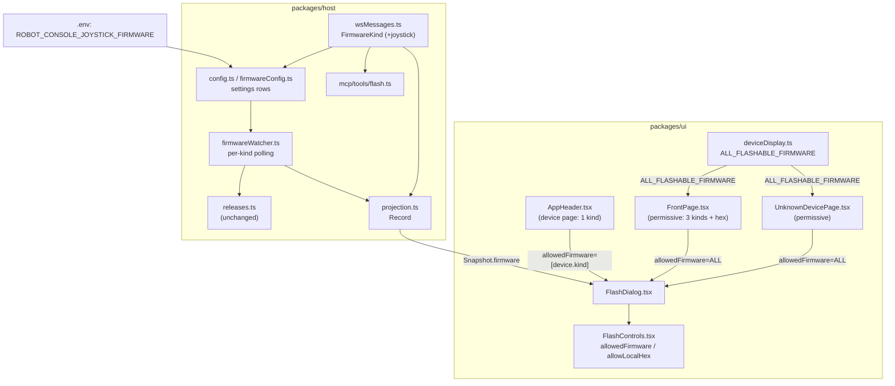

<!-- CLASI: Before changing code or making plans, review the SE process in CLAUDE.md -->

# Sprint 023: Joystick firmware and per-context flash choices

## Goals

Give the console a third flashable firmware kind, `"joystick"` (the
Remote-Joystick-Student release), and make what a flash dialog offers
depend on *where* it was opened from: a robot's own device page offers
only the robot's calibration firmware, while every other flash surface
(the front page's device/unassigned cards, and an unidentified board's
own device page) offers all three release kinds plus a local-hex
upload.

## Problem

`FlashControls.tsx` currently renders the exact same two hardcoded
buttons ("Flash relay firmware", "Flash robot firmware") at every call
site, with no way for a caller to say "fewer options here." Stakeholder
request (2026-09-21, verbatim): the front page's flash affordance should
gain a third option, flashing a joystick release, while the flash
control on a robot's own device page should be narrowed to *one*
option — the robot's own calibration firmware — so a student on a
robot's page can never accidentally overwrite it with relay or joystick
firmware. Today neither the widening nor the narrowing is possible: the
option set isn't parameterized at all.

Two follow-ups the stakeholder already answered: the front-page list is
four entries (robot, relay, joystick, plus the existing "upload your own
.hex"), and a flash control stays hidden wherever flashing genuinely
isn't possible (current `capabilities.flash` gating is unchanged).

A real blocker exists independent of any code in this repo: the
joystick release published today
(`League-Microbit/Remote-Joystick-Student` v0.20260921.3) does not carry
the two asset names `releases.ts` requires (`MICROBIT.hex`,
`MICROBIT.hex.txt`) — verified directly against the GitHub API as part
of this sprint's planning. See Design Rationale for how this sprint
handles that without blocking on it.

## Solution

Add `"joystick"` to the `FirmwareKind` union and thread it through every
place that currently enumerates `"relay" | "robot"` (wire contract, host
config/settings, availability polling, projection, MCP flash tool).
Replace `FlashControls`' two hardcoded per-kind buttons with a loop over
an explicit, **required** `allowedFirmware: readonly FirmwareKind[]`
prop (plus a required `allowLocalHex: boolean`), so every call site must
say what it offers — there is no default to silently fall back to.
Front-page call sites (identified-device cards, the unassigned-board
card) and the not-yet-identified device page pass the full
`["robot", "relay", "joystick"]` list with local-hex enabled;
`AppHeader`'s device-page flash button passes exactly `["robot"]` (no
local hex) when the routed device is a robot, exactly `["relay"]` (no
local hex) when it's a relay, and the full permissive list when there is
no identified device yet (an unassigned board reached via `/d/:linkId`).

## Success Criteria

- A bare micro:bit's flash dialog (front page or its own device page)
  offers Flash relay firmware, Flash robot firmware, Flash joystick
  firmware, and Flash a hex file from disk.
- A robot's own device page (`AppHeader`'s Flash button while routed to
  `/d/:linkId` for an identified `kind: "robot"` device) offers exactly
  one button: Flash robot firmware. No relay button, no joystick button,
  no local-hex uploader.
- A relay's own device page offers exactly one button: Flash relay
  firmware.
- `Record<FirmwareKind, FirmwareAvailability>` carries a `joystick` key
  everywhere it is built or consumed; no test silently ignores it.
- The full test suite (148 files / 2816+ tests today) still passes at
  sprint close; `npx tsc --noEmit` is clean for both `packages/host` and
  `packages/ui`.

## Scope

### In Scope

- `FirmwareKind` gains `"joystick"`; wire contract, host settings
  (`ROBOT_CONSOLE_JOYSTICK_FIRMWARE`), availability polling, and MCP
  flash tool all widen to match.
- `FlashControls`/`FlashDialog` take explicit `allowedFirmware`/
  `allowLocalHex` props; every existing call site is updated to pass
  them explicitly.
- Front-page (identified + unassigned) and not-yet-identified-device-page
  call sites get the full four-option list.
- `AppHeader`'s device-page call site restricts to the routed device's
  own single firmware kind (robot or relay), with no local-hex option,
  when a device is identified; the full list otherwise.
- `ROBOT_CONSOLE_JOYSTICK_FIRMWARE` is added to `.env`, pointed at the
  real joystick repo, with a ticket that documents and tests today's
  asset-name mismatch rather than working around it in code.

### Out of Scope

- Changing `releases.ts`'s required asset names, or adding a
  per-firmware asset-name override — see Design Rationale for why.
- Any change to `capabilities.flash` (whether a *link* can be flashed at
  all) — untouched, out of scope, already correct per today's HEAD.
- Restarting or otherwise touching the stakeholder's own `npm run dev`
  process, or any port-4795/5173 process — any ticket that seems to need
  a restart must say "ask the stakeholder" instead.
- A board-family check on an uploaded/fetched hex (pre-existing known
  gap, not this sprint's job).

## Test Strategy

Unit tests at every touched layer: `wsMessages.test.ts`'s
`isFirmwareKind`/`isFirmwareSourceRef` guards, `config.test.ts`/
`firmwareConfig.test.ts` for the new settings key and env var,
`projection.test.ts`'s golden-snapshot fixture (and any other
`Record<FirmwareKind, …>` literal fixture found by grep across
`packages/host` and `packages/ui` test files — updated, never loosened),
`firmwareWatcher.test.ts` for the widened per-kind scheduling, and new
component tests for `FlashControls`/`FlashDialog`/`AppHeader`/
`FrontPage`/`UnknownDevicePage` asserting the exact button set each
context renders (in particular: the robot-page test must assert the
*absence* of relay/joystick/local-hex controls, not just the presence of
the robot one). One ticket (007) adds a `releases.test.ts` fixture that
reproduces today's real joystick release asset names verbatim, asserting
`resolveRelease` returns the honest `no-asset` failure — a live
regression test for the blocker, not a workaround. Every test run uses
explicit file paths with `npx vitest run <path> --no-coverage`, in the
foreground; the full suite runs exactly once, inside `close_sprint`.

## Architecture

**Sizing: Substantial.** Not because this introduces a new subsystem —
it doesn't — but by the sprint-planner's own module-count/dependency
signals: the change touches 8+ modules across both packages
(`wsMessages.ts`, `config.ts`, `store/index.ts`, `store/importers/
firmwareConfig.ts`, `projection.ts`, `watchers/firmwareWatcher.ts`,
`mcp/tools/flash.ts` on the host side; `deviceDisplay.ts`,
`FlashControls.tsx`, `FlashDialog.tsx`, `AppHeader.tsx`, `FrontPage.tsx`,
`UnknownDevicePage.tsx` on the UI side), and it changes the shape of the
`Record<FirmwareKind, FirmwareAvailability>` value threaded through all
of them — a data-model widening, even though no SQL schema changes.
Full methodology below, one component diagram (the per-context flash
flow genuinely benefits from being drawn — this is not the "many
independent bugfixes, nothing new composed" case sprint 020 documents).

### Step 1: The problem

Two independent asks, both real:

1. **A third flashable release kind.** `FirmwareKind` is currently
   `"relay" | "robot"` — closed everywhere it's read. Adding
   `"joystick"` means widening every one of those places, not adding a
   new module.
2. **Per-call-site option filtering.** `FlashControls.tsx` has never had
   a notion of "which options to show" — it always renders both
   hardcoded buttons. The robot-page/front-page split the stakeholder
   asked for cannot be expressed today at all, regardless of how many
   firmware kinds exist.

These are separable ((1) alone would just add a third always-shown
button everywhere) but shipped together because (2) is what makes (1)
safe to ship: without per-context filtering, adding "joystick" would
also add a "Flash joystick firmware" button to a robot's own device
page, which is the opposite of what was asked.

### Step 2: Responsibilities

- **Wire contract** (`wsMessages.ts`): `FirmwareKind` is the type-level
  source of truth. Everything else derives from it.
- **Firmware source configuration** (`config.ts`, `store/importers/
  firmwareConfig.ts`, `.env`): resolving `ROBOT_CONSOLE_*_FIRMWARE` env
  vars into typed sources, one settings row per kind.
- **Availability** (`releases.ts` — unchanged logic, reused verbatim;
  `watchers/firmwareWatcher.ts` — per-kind polling schedule;
  `projection.ts` — building the wire-visible
  `Record<FirmwareKind, FirmwareAvailability>`).
- **Agent-triggered flashing** (`mcp/tools/flash.ts`): a parallel,
  independent enumeration of the same kinds for the MCP tool surface.
- **Flash UI mechanism** (`FlashControls.tsx`, `FlashDialog.tsx`): the
  progress/error/local-hex state machine, now parameterized by which
  options to offer rather than hardcoding two.
- **Flash UI call sites** (`AppHeader.tsx`, `FrontPage.tsx`,
  `UnknownDevicePage.tsx`): each one now *decides* its own option set
  and passes it down explicitly.

These divide cleanly along the existing module boundaries — no new
module is introduced; every one of the above already owns exactly this
kind of responsibility today (see each file's own module doc comment
consulted during planning), so this sprint widens and parameterizes
in place rather than restructuring.

### Step 3: Modules touched (name / purpose / boundary)

- `wsMessages.ts` — purpose: define the wire contract. Boundary: adds
  `"joystick"` to `FirmwareKind` and its `isFirmwareKind` guard; no
  other wire shape changes (`FirmwareSourceRef`/`FirmwareAvailability`
  are already generic over `FirmwareKind`). Serves SUC-001/002/003.
- `config.ts` / `store/importers/firmwareConfig.ts` — purpose: resolve
  one `ROBOT_CONSOLE_<KIND>_FIRMWARE` env var per kind into a `settings`
  row. Boundary: add `joystick` to `SETTINGS_KEY_BY_FIRMWARE` and
  `ENV_VAR_BY_FIRMWARE`/`FIRMWARE_KINDS`; no change to the resolution
  algorithm itself. Serves SUC-001.
- `store/index.ts` — purpose: typed persistence reads/writes. Boundary:
  four call sites hardcode the literal union `"relay" | "robot"`
  (`SetFirmwareInput.kind`, `ProjectionFirmwareRow.kind`,
  `getFirmwareEtag`'s parameter, the raw `firmwareRows` cast) instead of
  importing `FirmwareKind` — each widens to match. The `firmware` table
  itself needs no migration: `kind` is a `TEXT PRIMARY KEY` with no
  `CHECK` constraint (`migrations/0001-initial.ts`); only its
  descriptive comment (`-- 'relay' | 'robot'`) needs updating to stay
  truthful. Serves SUC-001.
- `projection.ts` — purpose: pure `rows -> Snapshot` read. Boundary:
  `FIRMWARE_KINDS` gains `"joystick"`; `buildFirmwareAvailability` is
  already generic and needs no change. Serves SUC-001.
- `watchers/firmwareWatcher.ts` — purpose: per-kind polling schedule
  with ETag/backoff. Boundary: `FIRMWARE_KINDS` gains `"joystick"`; a
  third independent self-rescheduling timer starts alongside the
  existing two — no change to the polling algorithm. Serves SUC-001.
- `mcp/tools/flash.ts` — purpose: expose flashing to an MCP-connected
  agent. Boundary: its own locally-declared `FIRMWARE_KINDS` constant
  (deliberately separate from `wsMessages.ts`'s, per that file's own
  narrow-surface convention) gains `"joystick"`, so an agent can flash a
  joystick exactly as it can already flash a relay or robot — no
  context-based restriction applies to the MCP surface (an agent caller
  is not "on a robot's device page"; this mirrors today's behavior where
  the MCP tool is already unrestricted relative to `AppHeader`'s
  narrower device-page UI). Serves SUC-001.
- `deviceDisplay.ts` — purpose: presentational helpers, shared by every
  UI call site. Boundary: `FIRMWARE_LABEL` gains a `joystick` entry; a
  new exported constant, `ALL_FLASHABLE_FIRMWARE: readonly
  FirmwareKind[] = ["robot", "relay", "joystick"]`, is the one place the
  permissive front-page/unidentified-device option set is spelled out,
  so the four call sites that use it can never drift out of sync with
  each other. Serves SUC-001/002/003.
- `FlashControls.tsx` — purpose: the release-flash + local-hex flash
  state machine and its rendering. Boundary: the two hardcoded
  `
` blocks become one
  `allowedFirmware.map(...)` loop over a shared render function; the
  entire "Flash a hex file from disk" section is wrapped in `{
  allowLocalHex && ( ... ) }`. Two new **required** props,
  `allowedFirmware: readonly FirmwareKind[]` and `allowLocalHex:
  boolean` — no default values (see Design Rationale). No change to the
  progress/error/reidentify state machine itself. Serves SUC-001/002/003.
- `FlashDialog.tsx` — purpose: the popup-modal chrome + trigger-button
  gating shared by every call site. Boundary: forwards the same two new
  required props straight through to `FlashControls`; the trigger's own
  `canBeFlashed`/`forceShow` gating (whether a trigger renders at all)
  is unrelated and unchanged. Serves SUC-001/002/003.
- `AppHeader.tsx` — purpose: route-aware chrome mounted above every
  page, including the one Flash button reachable from a specific
  device's own page. Boundary: computes `allowedFirmware`/
  `allowLocalHex` from the resolved `device` (see Step 6, Decision 2)
  and passes them to its one `FlashDialog` instance. Serves
  SUC-002/003 (and the permissive fallback case, SUC-001, when no
  device has resolved yet).
- `FrontPage.tsx` — purpose: the device list. Boundary: both `FlashDialog`
  call sites (`DeviceCard`'s identified-device card, the unassigned-board
  card) pass `ALL_FLASHABLE_FIRMWARE`/`allowLocalHex={true}`. Serves
  SUC-001.
- `UnknownDevicePage.tsx` — purpose: the not-yet-identified board's own
  device page. Boundary: its one `FlashDialog` call site passes the same
  permissive pair as `FrontPage.tsx`. Serves SUC-001.

### Step 4: Diagram

Component/data-flow diagram — required here (3+ modules, and the
per-context filtering is a genuinely new composition between the flash
UI mechanism and its call sites that didn't exist before this sprint):

### Step 5: What Changed / Why / Impact / Migration

**What Changed**: see Step 3's per-module list above.

**Why**: stakeholder request, 2026-09-21 (verbatim in Problem above).

**Impact on Existing Components**: every relay/robot flash flow in
existence today is byte-for-byte unaffected in behavior — this sprint
adds a third enumerated value and a filtering layer around already-shown
options; it does not change what happens once a button is clicked.
Every existing `FlashControls`/`FlashDialog` test that asserts on the
current two-button set will need its call updated to pass explicit
`allowedFirmware`/`allowLocalHex` props (a compile error otherwise,
which is the intended safety net — see Design Rationale).

### Design Rationale

**Decision 1 — explicit required props, not an optional prop with a
default, not an enum `context` prop.**
*Context*: `FlashControls` needs to know, per call site, which firmware
buttons and whether the local-hex uploader to render.
*Alternatives considered*:
  (a) An optional `allowedFirmware` prop defaulting to all kinds. Rejected:
      a call site that forgets to pass it gets the *permissive* set —
      exactly the failure mode the stakeholder's own robot-page request
      exists to prevent. A default can only fail in the dangerous
      direction here.
  (b) A `context: "front" | "device"` enum, mapped internally to an
      option list. Rejected: the mapping still needs a default/fallback
      arm for an unrecognized context (same silent-widening risk one
      level removed), and it hides the actual option set behind a name a
      future third context has to remember to extend correctly, whereas
      an explicit array is legible at the call site with no indirection.
*Why this choice*: `allowedFirmware: readonly FirmwareKind[]` and
`allowLocalHex: boolean` are both required, with no default value in the
function signature. Omitting either is a TypeScript compile error, not a
runtime fallback — the only real guarantee that "forgot to pass the
list" cannot silently widen anything.
*Consequences*: every existing call site's tests must be updated to pass
both props explicitly (tracked in tickets 004-006); this is the point,
not overhead to minimize.

**Decision 2 — restrict to the routed device's own single kind on
*any* identified device's own page (robot AND relay), not just robot.**
*Context*: the stakeholder's own words named only the robot page
explicitly ("Inside the robot page... should only allow flashing the
robot calibration software"). `AppHeader`'s Flash button is the same
component instance regardless of whether the routed device is a robot
or a relay, and regardless of whether a device has resolved at all (an
unidentified board's own page).
*Alternatives considered*:
  (a) Restrict only the robot case; leave a relay's own device page
      permissive (all three kinds + local hex), matching the front page.
      Rejected: flashing joystick or robot firmware onto a live,
      in-service relay bridge is the same class of accidental-overwrite
      risk the stakeholder is protecting against for robots — there is
      no principled reason a relay's own page should be less protected
      than a robot's.
  (b) Restrict the not-yet-identified device page (`UnknownDevicePage`,
      and a `/d/:linkId` route for a link with no device) to something
      narrower than permissive. Rejected: there is no "own kind" to
      restrict to for a board that hasn't identified yet — narrowing it
      would defeat the page's actual purpose, which is *deciding* what
      to make the board.
*Why this choice*: "an identified device's own page shows only that
device's own kind; everywhere else is permissive" is a single, uniform
rule with no per-kind special-casing, and it strictly narrows relative
to today's behavior (both AppHeader-reached pages currently show both
relay and robot buttons) — the safe direction to guess when extending
past what was explicitly asked.
*Consequences*: this is a planning-time judgment call beyond the
stakeholder's literal words (flagged back to the team-lead/stakeholder
in this sprint's own return — see the report's "confirm" list); if the
stakeholder wants the relay page to stay permissive instead, that is a
one-line change to ticket 006's acceptance criteria, not a redesign.

**Decision 3 — the joystick asset-name blocker is fixed in the joystick
repo's release workflow, not in `releases.ts`.**
*Context*: today's live joystick release
(`League-Microbit/Remote-Joystick-Student` v0.20260921.3, verified via
`gh api` during planning) publishes `remote-joystick-student.hex` and a
versioned copy, but neither `MICROBIT.hex` nor `MICROBIT.hex.txt` —
`releases.ts`'s required, case-insensitive asset names. Its two sibling
repos (`nezha-robot-template`, `microbit-radio-relay`) both publish the
required names correctly today.
*Alternatives considered*:
  (a) The joystick repo's release workflow starts publishing
      `MICROBIT.hex`/`MICROBIT.hex.txt` alongside whatever else it
      already publishes, matching its two siblings.
  (b) `releases.ts` learns a per-`FirmwareKind` asset-name map.
      Rejected: this is more code for a one-off, and the joystick
      release's `.hex.txt` sha256 manifest is *also* missing — accepting
      (b) without an answer for verification either invents an
      unverified second flash path (a real downgrade for exactly the one
      kind newest to this codebase) or requires yet more code to derive
      a checksum some other way. Neither is proportionate to fixing a
      one-repo publishing convention.
*Why this choice*: (a) keeps the "every release, one convention" property
every other part of this architecture already relies on (`releases.ts`'s
own module doc comment: "Every GitHub HTTP call... lives in this module
and this module alone"), asks for no new code, and is a change entirely
within the stakeholder's own control (he owns
`League-Microbit/Remote-Joystick-Student` and cut this release minutes
before requesting this sprint — plausibly just not yet updated to match
its siblings' workflow).
*Consequences*: this sprint is **not blocked** on that repo change.
Every ticket except the last is built and tested entirely against
fixtures. Ticket 007 (last, deliberately) points
`ROBOT_CONSOLE_JOYSTICK_FIRMWARE` at the real repo and adds a regression
test that pins today's actual failure (`resolveRelease` returning
`{reason: "no-asset", ...}` naming exactly the asset names actually
found) — so the joystick button will correctly, honestly show as
unavailable in a live classroom until the stakeholder's own repo is
updated, and this sprint's automated tests prove that is the *correct*
behavior today, not a defect. Once the repo publishes the two files, no
further code change is needed for the button to start working — the
same "no code change, no restart" property `releases.ts`'s own module
doc comment already guarantees for the relay/robot precedent.

### Step 7: Open Questions

1. **Relay-page and unidentified-device-page restriction** (Design
   Rationale, Decision 2) is a planning-time judgment call, not something
   the stakeholder stated explicitly. Worth a quick confirm before or
   during ticket 006's execution, though the chosen default only narrows
   (never widens) what today's build already offers.
2. **MCP flash tool exposing "joystick"** (Step 3) is likewise an
   inference (consistency with the existing unrestricted MCP surface),
   not a stated requirement. Low risk — an agent could already flash
   relay/robot firmware onto any device with no context restriction.
3. **Whether/when `League-Microbit/Remote-Joystick-Student` will publish
   `MICROBIT.hex`/`MICROBIT.hex.txt`** is entirely outside this
   codebase's control. Ticket 007 documents and tests today's failure
   mode; it cannot resolve the blocker itself.

### Migration Concerns

No database migration (the `firmware.kind` column is unconstrained
`TEXT`; only its descriptive comment changes). The wire contract's
`Snapshot.firmware` gains a third required key — a breaking change for
any UI client mid-session against an older host build, but this is a
single-developer/classroom tool with no independent client versions to
coordinate, the same situation the original relay/robot split already
lived with. Deploying requires **restarting the host process** (new
`.env` var, new store-settings/watcher code) — per this sprint's own
standing safety constraint, no ticket restarts `npm run dev` itself; any
ticket whose manual verification needs a restart says "ask the
stakeholder" instead. The UI side needs no restart (Vite HMR).

## Use Cases

Substantial sprint (see Architecture below) — full use cases below.

### SUC-001: Flash a joystick onto a bare micro:bit from the front page
Parent: UC (flashing) — extends the existing release-flash use case with
a third kind.

- **Actor**: Student with a bare, unidentified micro:bit plugged into
  USB.
- **Preconditions**: `ROBOT_CONSOLE_JOYSTICK_FIRMWARE` is configured and
  resolves to a release carrying `MICROBIT.hex`/`MICROBIT.hex.txt`; the
  board's link has `capabilities.flash: true` (USB, unchanged gate).
- **Main Flow**:
  1. Student opens the front page; the board appears as an unassigned
     card with a lightning-icon Flash trigger.
  2. Student clicks Flash. The dialog opens showing four options: Flash
     relay firmware, Flash robot firmware, Flash joystick firmware,
     Flash a hex file from disk.
  3. Student clicks "Flash joystick firmware".
  4. The host resolves the configured release, downloads and
     sha256-verifies the hex, and writes it to the board, reporting
     progress the same way an existing relay/robot flash already does.
- **Postconditions**: The board is running the joystick firmware and
  re-identifies (or, if it never announces a banner the console
  recognizes, the dialog reports the existing "waiting for the board to
  come back" state — no new re-identify behavior is introduced by this
  sprint).
- **Acceptance Criteria**:
  - [ ] The front-page unassigned-board flash dialog renders all four
        options, in this order: relay, robot, joystick, local hex.
  - [ ] The front-page identified-device card's flash dialog renders the
        same four options (unchanged from the unassigned case).
  - [ ] Clicking "Flash joystick firmware" sends `flash-start` with
        `source: { kind: "release", firmware: "joystick" }`, exactly
        mirroring the existing relay/robot `flash-start` shape.
  - [ ] When `ROBOT_CONSOLE_JOYSTICK_FIRMWARE` is unset, the joystick
        button is disabled with the same "Not set up for this classroom
        yet — ask your instructor" text the relay button already shows
        when unconfigured (existing `firmwareDisabledReason` precedent,
        no new reason string).

### SUC-002: A robot's own device page offers only its calibration firmware
Parent: UC (flashing) — narrows the existing device-page flash use case.

- **Actor**: Student viewing an identified robot's own device page
  (`/d/:linkId` for a `kind: "robot"` device).
- **Preconditions**: The routed link is USB-attached (or otherwise
  flashable per the existing `capabilities.flash` rule) so `AppHeader`'s
  Flash trigger renders at all.
- **Main Flow**:
  1. Student opens the robot's device page.
  2. Student clicks the header's Flash button.
  3. The dialog opens showing exactly one option: "Flash robot
     firmware" (the robot's own calibration release,
     `nezha-robot-template` — already the correct target; confirmed
     against the running Calibration tab before this sprint started).
     No relay button, no joystick button, no local-hex uploader appear.
- **Postconditions**: Clicking the one available button behaves exactly
  as the existing robot-firmware flash already does today (no new
  behavior — only the option set around it changes).
- **Acceptance Criteria**:
  - [ ] `AppHeader`'s Flash dialog, routed to an identified `kind:
        "robot"` device, renders "Flash robot firmware" and nothing
        else — no "Flash relay firmware", no "Flash joystick firmware",
        no "Flash a hex file from disk" section.
  - [ ] This holds regardless of what firmware is or isn't configured
        for relay/joystick — the other options are absent from the DOM,
        not merely disabled.

### SUC-003: A relay's own device page offers only relay firmware
Parent: UC (flashing) — same narrowing rule applied to the other
identified-device kind, for consistency (see Design Rationale — the
stakeholder's own request named the robot page explicitly; this SUC
generalizes the same protection to a relay's own page, since flashing
foreign firmware onto a live, in-service relay bridge is the same class
of accidental-overwrite risk).

- **Actor**: Student or instructor viewing an identified relay's own
  device page.
- **Preconditions**: Same as SUC-002, for a `kind: "relay"` device.
- **Main Flow**:
  1. Open the relay's device page; click the header's Flash button.
  2. The dialog shows exactly one option: "Flash relay firmware".
- **Postconditions**: Unchanged behavior for the one available button.
- **Acceptance Criteria**:
  - [ ] `AppHeader`'s Flash dialog, routed to an identified `kind:
        "relay"` device, renders "Flash relay firmware" and nothing
        else.

## GitHub Issues

(GitHub issues linked to this sprint's tickets. Format: `owner/repo#N`.)

## Definition of Ready

Before tickets can be created, all of the following must be true:

- [ ] Sprint planning document is complete (sprint.md, including its
      Architecture and Use Cases sections)
- [ ] Architecture review passed (or skipped, for changes with no
      architectural impact)
- [ ] Stakeholder has approved the sprint plan

## Tickets

| # | Title | Depends On |
|---|-------|------------|
| 001 | Wire contract: add joystick as a third FirmwareKind | — |
| 002 | Host settings and config plumbing for the joystick firmware source | 001 |
| 003 | Availability plumbing and fixtures for a third firmware kind | 002 |
| 004 | Generalize FlashControls and FlashDialog to an explicit per-context option list | 001 |
| 005 | Front page and unidentified device page offer all three firmwares plus local hex | 004 |
| 006 | Robot page and relay page restrict flashing to their own firmware kind | 004 |
| 007 | Configure and verify the joystick firmware source against the live release | 002, 003, 005, 006 |

Tickets execute serially in the order listed.
